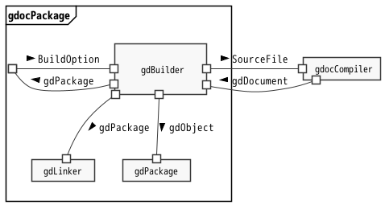

*
<small>
[@^ doctype="gdoc 0.3", category="sysml 2"]
</small>
*

# [@ swad] Gdoc Architectural Design

*@Summary:*  \
This document describes the software architectural design of gdoc.

 

## \[@#\] TABLE OF CONTENTS<!-- omit in toc -->

- [1. REFERENCES](#1-references)
- [2. THE TARGET SOFTWARE](#2-the-target-software)
- [3. [@ SA] SOFTWARE ARCHITECTURE](#3--sa-software-architecture)
  - [3.1. Internal Blocks](#31-internal-blocks)
  - [3.2. Structure](#32-structure)
    - [3.2.1. \[@Block& GDOC\] gdoc [Definitions of internal blocks]](#321-block-gdoc-gdoc-definitions-of-internal-blocks)
    - [3.2.2. \[@Block& GDOC.gcl\] Gdoc Core Library [Definitions of internal blocks]](#322-block-gdocgcl-gdoc-core-library-definitions-of-internal-blocks)
  - [3.3. Behavior](#33-behavior)
    - [3.3.1. Execution Lifecycle](#331-execution-lifecycle)
    - [3.3.2. Creating An Object](#332-creating-an-object)
  - [3.4. \[@ ra\] Requirements Allocation](#34--ra-requirements-allocation)
    - [3.4.1. [@ core] SWRS.Core](#341--core-swrscore)
    - [3.4.2. [@ apps] SWRS.Apps](#342--apps-swrsapps)
    - [3.4.3. [@ constraint] SWRS.Constraint](#343--constraint-swrsconstraint)
- [4. [@ SE] SOFTWARE ELEMENTS](#4--se-software-elements)
  - [4.1. \[@Block& GDOC.gcl.gdp\] gdocPackage [ Done ]](#41-block-gdocgclgdp-gdocpackage--done-)
    - [4.1.1. Requirements](#411-requirements)
      - [4.1.1.1. Usecases](#4111-usecases)
    - [4.1.2. Internal Blocks](#412-internal-blocks)
    - [4.1.3. Structure](#413-structure)
      - [4.1.3.1. Blocks](#4131-blocks)
      - [4.1.3.2. Interfaces](#4132-interfaces)
    - [4.1.4. Behavior](#414-behavior)
      - [4.1.4.1. Build](#4141-build)
      - [4.1.4.2. Lint](#4142-lint)
    - [4.1.5. [@ ra] Requirements allocation](#415--ra-requirements-allocation)
  - [4.2. \[@Block& GDOC.gcl.gdc\] gdocCompiler [ Done ]](#42-block-gdocgclgdc-gdoccompiler--done-)
    - [4.2.1. Requirements](#421-requirements)
    - [4.2.2. Internal Blocks](#422-internal-blocks)
    - [4.2.3. Structure](#423-structure)
      - [4.2.3.1. Blocks](#4231-blocks)
      - [4.2.3.2. Interfaces](#4232-interfaces)
    - [4.2.4. Behavior](#424-behavior)
      - [4.2.4.1. Compile](#4241-compile)
    - [4.2.5. [@ ra] Requirements allocation](#425--ra-requirements-allocation)
      - [4.2.5.1. Core Requirements](#4251-core-requirements)
      - [4.2.5.2. Constraints](#4252-constraints)
      - [4.2.5.3. Design Specification](#4253-design-specification)
  - [4.3. \[@Block& GDOC.gcl.pao\] pandocAstObject [ Done ]](#43-block-gdocgclpao-pandocastobject--done-)
    - [4.3.1. Requirements](#431-requirements)
    - [4.3.2. Structure](#432-structure)
      - [4.3.2.1. Blocks](#4321-blocks)
    - [4.3.3. [@ ra] Requirements allocation](#433--ra-requirements-allocation)
  - [4.4. \[@Block& GDOC.gcl.pim\] PluginManager [ Done ]](#44-block-gdocgclpim-pluginmanager--done-)
    - [4.4.1. Requirements](#441-requirements)
    - [4.4.2. Architectural Strategy](#442-architectural-strategy)
      - [4.4.2.1. Adding Plugins](#4421-adding-plugins)
      - [4.4.2.2. Plugin Search Path](#4422-plugin-search-path)
    - [4.4.3. Structure](#443-structure)
      - [4.4.3.1. Blocks](#4431-blocks)
      - [4.4.3.2. Interfaces](#4432-interfaces)
    - [4.4.4. Requirement Allocation](#444-requirement-allocation)
  - [4.5. \[@Block& GDOC.pis\] Plugins [ Done ]](#45-block-gdocpis-plugins--done-)
    - [4.5.1. Requirements](#451-requirements)
      - [4.5.1.1. [@ dr] Design requirement](#4511--dr-design-requirement)
      - [4.5.1.2. Adding properties](#4512-adding-properties)
      - [4.5.1.3. Adding children](#4513-adding-children)
    - [4.5.2. Structure](#452-structure)
      - [4.5.2.1. Blocks](#4521-blocks)
      - [4.5.2.2. Interfaces](#4522-interfaces)
    - [4.5.3. Behavior](#453-behavior)
      - [4.5.3.1. Add Properties](#4531-add-properties)
      - [4.5.3.2. Add Child](#4532-add-child)
    - [4.5.4. [@ ra] Requirements allocation](#454--ra-requirements-allocation)
  - [4.6. \[@Block& GDOC.asc\] ApplicationSubcommand [ Done ]](#46-block-gdocasc-applicationsubcommand--done-)
    - [4.6.1. Requirements](#461-requirements)
    - [4.6.2. Structure](#462-structure)
      - [4.6.2.1. Blocks](#4621-blocks)
      - [4.6.2.2. Interfaces](#4622-interfaces)
  - [4.7. \[@Block& GDOC.cli\] gdocCli [ T.B.D. ]](#47-block-gdoccli-gdoccli--tbd-)
    - [4.7.1. Requirements](#471-requirements)
    - [4.7.2. Structure](#472-structure)
    - [4.7.3. [@ ra] Requirements allocation](#473--ra-requirements-allocation)

 

## 1. REFERENCES

This document refers to the following documents.

1. Software Requirements Specification  \
   [@import SWRS from="[../Requirements/SoftwareRequirementsSpecification](../Requirements/SoftwareRequirementsSpecification.md#3--swrs-software-requirements-specification)"]

   Top level requirements specification for gdoc.

2. Gdoc Markup Language  \
   [@import GDML from="[../GdocMarkupLanguage/GdocMarkupLanguage](../GdocMarkupLanguage/GdocMarkupLanguage.md#-gdml-gdoc-markup-language)"]

   Grammar definition of Gdoc markup language.

 

## 2. THE TARGET SOFTWARE

- [@Block GDOC] gdoc  \
  Block representing the target software in this software architectural design.

  GDOC shall satisfy each of the following requirements.  \
  @Trace(Satisfy): SWRS.name SWRS.core SWRS.apps SWRS.constraint

 

## 3. [@ SA] SOFTWARE ARCHITECTURE

### 3.1. Internal Blocks

The figure below shows the internal blocks of GDOC.

  \
  \
[@fig 3.1\] gdoc Internal Block Diagram [rough sketch]

 

1. [@Strategy s1] Pluggable Application subcommand \
   Keep subcommands separate from others to make it easier for users to add their own subcommands.

2. [@Strategy s2] Pluggable Classes \
   PluginManager provides a mechanism to retrieve user-added class constructors for the compiler to generate objects according to the type of information in the document and for one class to inherit from another.

 

### 3.2. Structure

  \
  \
[@fig 3.2\] gdoc Internal Blocks

The blocks in the figure are defined as follows.

#### 3.2.1. \[@Block& GDOC\] gdoc [Definitions of internal blocks]

- [@Table 3.1] Gdoc internal block definitions

  | @Blk | Name | Description |
  | :--: | ---- | ----------- |
  |      | Trace | @refine: _fig[gdoc Internal Blocks]
  | cli  | gdocCli |
  | asc  | ApplicationSubcommand |
  | pis  | Plugins | includes gdObject constructors of specific types and applicational subcommands of gdoc using gdObjects generated by the constructors.
  | gcl  | gdocCoreLibrary |

- [@Table 3.2] Related blocks

  | @Blk | Name | Description |
  | :--: | ---- | ----------- |
  |      | Trace | @refine: _fig[gdoc Internal Blocks]
  | GDML | GhostDocumentMarkupLanguage | Markup language specification

 

#### 3.2.2. \[@Block& GDOC.gcl\] Gdoc Core Library [Definitions of internal blocks]

- [@Table 3.3] Gdoc Core Library Internal Block definitions

  | @Blk | Name | Description |
  | :--: | ---- | ----------- |
  |      | Trace | @refine: _fig[gdoc Internal Blocks]
  | gdp  | gdocPackage | takes source files and a configuration object and creates a gdPackage containing one or more objects or packages linked to each other.
  | gdc  | gdocCompiler | takes a source file one by one and parses it to convert to a gdObject.
  | pao  | pandocAstObject | takes a source file and returns a PandocAst object. Currently, the PandocAST file will be generated by external pandoc command.
  | pim  | PluginManager | Handles plugin settings, resolves plugin and type names, calls out plugins.

 

### 3.3. Behavior

#### 3.3.1. Execution Lifecycle

The following sequence shows the typical behavior of the GDOC command from start to finish.

  \
  \
[@fig 3.3\] gdoc execution lifecycle

#### 3.3.2. Creating An Object

gdocCompiler parses a source document and generates objects according to tags.
When it finds a tag in the document, gdocComiler generates an object with class constructor as follows.

  \
  \
[@fig 3.4\] Creating an object

 

 

### 3.4. \[@ ra\] Requirements Allocation

#### 3.4.1. [@ core] SWRS.Core

Requirements from SWRS.Core are broken down to "@Spec"s and allocated to each blocks as follows.

| @Reqt | Name | Text | Trace |
| :---: | ---- | ---- | :---: |
| 1     | Retrieving information from documents | 文書をパースし、含まれる情報をオブジェクトとして収集する。 | @copy: SWRS.Core.1
| @Spec | 1.1  | １つのファイルをパースし、gdObjectを生成する。 | @Allocate: GDOC.gcl.gdc
| @Spec | 1.2  | 生成された1つ以上の gdObject を相互リンクする。 | @Allocate: GDOC.gcl.gdp
| 1a    |      | オブジェクトは型を持ち、固有の情報を保持することができる。 | @copy: SWRS.Core.1.1
| @Spec | 1a.1 | Gdoc Markup Languag のタグによる、生成オブジェクトの型指定を行える。 | @Allocate: GDML
| @Spec | 1a.2 | gdObjectは、タグ指定により型と固有のプロパティを持つことができる。 | @Allocate: GDOC.gcl.gdc
| 1b    |      | 型は追加可能である。 | @copy: SWRS.Core.1.2
| @Spec | 1b.1 | 型固有の情報操作をPluginとしてパッケージ化し、外部化した設計とする。 | @Allocate: GDOC.pis
| @Spec | 1b.2 | 外部化したPluginを、追加登録・検索・利用可能にする。 | @Allocate: GDOC.gcl.pim
| 2     | Pluggable application | アプリは対象となる型をもつ情報を参照し、型固有のニーズに基づいた機能を提供する。 | @copy: SWRS.Core.2
|       | Trace | @Allocate: GDOC.asc
| 2a    |      | アプリは追加可能である。
| @Spec | 2a.1 | アプリケーションサブコマンドをモジュール化し、ユーザー指定のモジュールをサブコマンドとして実行可能にする。 | @Allocate: GDOC.cli
| 3     | Gdoc markup language | 簡易で、可視で、汎用性のあるタグ付与形式の文法を提供する。 | @copy: SWRS.Core.3
|       | Trace | @Allocate: GDOC.GDML
| 4     | Source file format | 読み込み文書は gfm を対象とする。 | @copy: SWRQ.Core.4
|       | Trace | @Allocate: GDOC.gcl.gdc
| 4a    |      | pandocが対応する他の文書や専用Readerを要する他フォーマット文書への対応可能な拡張性を持つ。 | @copy: SWRQ.Core.4.1
|       | Trace | @Allocate: GDOC.gcl.gdc
| 5     | Exporting data objects | オブジェクト情報をエクスポートし、インポートすることができる。 | @copy: SWRQ.Core.5
| @Spec | 5.1  | ソースファイルをオブジェクト化した情報をjson形式でエクスポートできる。 | @Allocate: GDOC.gcl.gdc
| @Spec | 5.2  | リンク後のオブジェクト情報をjson形式でエクスポートできる。 | @Allocate: GDOC.gcl.gdp
| @Spec | 5.3  | エクスポートファイルを入力として扱うことができる。 | @Allocate: GDOC.gcl.gdp

 

#### 3.4.2. [@ apps] SWRS.Apps

All of the requirements SWRQ[Application Subcommand] are satisfied by Application subcommands.

- [@Block& GDOC.asc] \
  @Trace(Satisfy): SWRS.Apps \
  @Trace(Derive): SA.s1

 

#### 3.4.3. [@ constraint] SWRS.Constraint

| @Reqt | Name | Text | Trace |
| :---: | ---- | ---- | :---: |
| 1     |       | Python 3.x で動作する。 | @copy: SWRQ.Constraint.1
| @Spec | 1.1   | Python 対象バージョンを 3.x の後半から特定する。 | @Allocate: GDOC
| @Spec | 1.2   | 対象として複数のバージョンの全てでテストを実施する。 | @Allocate: GDOC
| 2     |       | 標準外の外部ライブラリを使用しない。 | @copy: SWRQ.Constraint.2
| @Spec | 2.1   | ユーザーによるコマンド実行時に、標準外のライブラリが不要であること。 | @Allocate: GDOC
| 3     |       | PandocASTを入力ファイル形式とし、pandoc外部コマンドを使用する。 | @copy: SWRQ.Constraint.3
| @Spec | 3.1   | 指定されたソースファイルを、PandocAst Objectに変換する。 | @AllocatTo: GDOC.gcl.pao
| @Spec | 3.2   | 変換されたPandocAst Objectを入力として、パース処理を行う。 | @AllocatTo: GDOC.gcl.gdc
| @Spec | 3.3   | pandoc外部コマンドを使用して、ソースファイルをPandocAST Jsonファイルへ変換する。 | @AllocatTo: GDOC.gcl.pao
| 4     |       | Ubuntu上で動作する。 | @copy: SWRQ.Constraint.4
| @Spec | 4.1   | テスト環境をUbuntuとする。 | @Allocate: GDOC
| 5     |       | Command Line Interfaceを持つ。 | @copy: SWRQ.Constraint.5
| 　　　 | Trace | @AllocatTo: GDOC.cli

 

## 4. [@ SE] SOFTWARE ELEMENTS

### 4.1. \[@Block& GDOC.gcl.gdp\] gdocPackage [ Done ]

[@Ref from=_table.id, name="gdocPackage"]

> | @Blk | Name | Description |
> | :--: | ---- | ----------- |
> | gdp  | gdocPackage | takes source files and a configuration object and creates a gdPackage containing one or more objects or packages linked to each other.

[@access GDOC.gcl.gdp as=THIS]

#### 4.1.1. Requirements

The requirements given to THIS are as follows.

[@Ref from=_table.id, trace="@Allocate: GDOC.gcl.gdp"]

> | @Reqt | Name | Text | Trace |
> | :---: | ---- | ---- | :---: |
> | @Spec | 1.2  | 生成された1つ以上の gdObject を相互リンクする。 | @Allocate: GDOC.gcl.gdp
> | @Spec | 5.2  | リンク後のオブジェクト情報をjson形式でエクスポートできる。 | @Allocate: GDOC.gcl.gdp
> | @Spec | 5.3  | エクスポートファイルを入力として扱うことができる。 | @Allocate: GDOC.gcl.gdp

##### 4.1.1.1. Usecases

The followings are some of the usecases by application subcommands.

1. [@Case uc1] Building a package

   Create gdPackage object from source files or package files.

2. [@Case uc2] Lint check

   Lists errors or warnings without creating gdPackage objects.

3. [@Case uc3] Export/Import
   - Exporting a gdPackage object as packagename.gdp.json.
   - Build targets can contain exported gdp.json files.

 

#### 4.1.2. Internal Blocks

  \
  \
[@fig 4.1.1\] gdocPackage Internal Blocks

#### 4.1.3. Structure

##### 4.1.3.1. Blocks

[@Table 4.x] gdocPackage Internal Block definitions

| @Blk | Name | Description |
| :--: | ---- | ----------- |
|      | Trace | @refine: _fig[gdocPackage Internal Blocks]
|      | Association | @partof: THIS
| gdb  | gdBuilder   | Overall control of gdocPackage.
|      | Association | @realize: THIS.bld, THIS.imp, THIS.exp, THIS.lnt
| gdp  | gdPackage   | gdObject/gdPackage Container class derived from gdObject class.
| gdl  | gdLinker    | Linker

##### 4.1.3.2. Interfaces

gdocPackage has the following external interfaces.

| @Opr | Name | Description |
| :--: | ---- | ----------- |
| bld  | Build      | Building gdPackage from source files.
|      | Parameters | in TargetPath : String
|      |            | in TargetType : enum { File, Package }
|      |            | in SearchPath : [ String ]
|      |            | in CompileOpt : Dict # Includes plugin search paths.
|      |            | out gdPackage
|      | trace      | @derive: THIS.uc1
| imp  | Import     | Import gdPackage from json file.
|      | Parameters | in TargetFile : fd or PathString (T.B.D.)
|      |            | out gdPackage
|      | trace      | @derive: THIS.uc3
| exp  | Exmport    | Export gdPackage to json string.
|      | Parameters | in : gdPackage
|      |            | out json String
|      | trace      | @derive: THIS.uc3
| lnt  | LintCheck  |
|      | Parameters | in TargetPath : String
|      |            | in TargetType : enum { File, Package }
|      |            | in SearchPath : [ String ]
|      |            | in LintCheckOpt : Dict
|      |            | out Results :
|      | trace      | @derive: THIS.uc2

#### 4.1.4. Behavior

##### 4.1.4.1. Build

The build sequence is shown in the figure below.

  \
  \
[@fig 4.1.2\] gdocPackage Build sequence

##### 4.1.4.2. Lint

The Link sequence is shown in the figure below.

  \
  \
[@fig 4.1.2\] gdocPackage Build sequence

 

#### 4.1.5. [@ ra] Requirements allocation

- [ ] gdocPackage: Lint要件、Ex/Im port要件を紐づけする。現状シーケンス図も紐付いていない。

| @Reqt | Name | Text | Trace |
| :---: | ---- | ---- | :---: |
| 1b    |      | 生成された1つ以上の gdObject を相互リンクする。 | @copy: SA.ra.Core.1.2
| @Spec | 1b.1 | 指定されたターゲットを検索・コンパイル・パッケージ化する制御を行う。 | @Allocate: gdb
| @Spec | 1b.2 | gdPackageを生成し、指定されたgdDocumentを登録する。 | @Allocate: gdp
| @Spec | 1b.3 | Compileされた１つ以上のgdObjectのimport/accessリンクを確立する。 | @Allocate: gdl
| @Spec | 1b.4 | 指定された単一のDocumentをコンパイルし、gdDocumentを生成・gdPackageに登録する。 | @Allocate: gdb
| 5b    |      | リンク後のオブジェクト情報をjson形式でエクスポートできる。 | @copy: SA.ra.Core.5.2
| @Spec | 5b.1 | Provide export() interface to client. | @Allocate: gdb
| @Spec | 5b.2 | Convert gdPackage object to json format string with stringify() method. | @Allocate: gdp
| 5c    |      | エクスポートファイルを入力として扱うことができる。 | @copy: SA.ra.Core.5.3
| @Spec | 5c.1 | Provide import() interface to client. | @Allocate: gdb
| @Spec | 5c.2 | Convert json format string to gdPackage object with parse() method. | @Allocate: gdp
| uc1   | Building a package | Create gdPackage object from source files or package files. | @derive: THIS.uc1
| uc2   | Lint check | Lists errors or warnings without creating gdPackage objects. | @derive: THIS.uc2
| @Spec | uc2.1 | 指定されたターゲットを検索・Lintチェックする制御を行う。 | @Allocate: gdb
| uc3a  | Export | Eporting a gdPackage object as packagename.gdp.json. | @derive: THIS.uc3
| uc3b  | Import | Build targets can contain exported gdp.json files. | @derive: THIS.uc3

 

### 4.2. \[@Block& GDOC.gcl.gdc\] gdocCompiler [ Done ]

> | @Blk | Name | Description |
> | :--: | ---- | ----------- |
> | gdc  | gdocCompiler | takes a source file one by one and parses it to convert to a gdObject.

[@access GDOC.gcl.gdc as=THIS]

#### 4.2.1. Requirements

The requirements given to THIS are as follows.

> [@ from=SA.ra.core]
> | @Reqt | Name | Text | Trace |
> | :---: | ---- | ---- | :---: |
> | @Spec | 1.1  | １つのファイルをパースし、gdObjectを生成する。 | @Allocate: GDOC.gcl.gdc
> | @Spec | 1a.2 | gdObjectは、タグ指定により型と固有のプロパティを持つことができる。 | @Allocate: GDOC.gcl.gdc
> | 4     | Source file format | 読み込み文書は gfm を対象とする。 | @copy: SWRQ.Core.4
> |       | Trace | @Allocate: GDOC.gcl.gdc
> | 4a    |      | pandocが対応する他の文書や専用Readerを要する他フォーマット文書への対応可能な拡張性を持つ。 | @copy: SWRQ.Core.4.1
> |       | Trace | @Allocate: GDOC.gcl.gdc
> | @Spec | 5.1  | ソースファイルをオブジェクト化した情報をjson形式でエクスポートできる。 | @Allocate: GDOC.gcl.gdc
>
> [@ from=SA.ra.constraint]
> | @Reqt | Name | Text | Trace |
> | :---: | ---- | ---- | :---: |
> | @Spec | 3.2   | 変換されたPandocAst Objectを入力として、パース処理を行う。 | @AllocatTo: GDOC.gcl.gdc

#### 4.2.2. Internal Blocks

  \
  \
[@fig 4.2.1\] gdocCompiler Internal Blocks

1. [@Strategy s1] gdParser \
   The parser functionality should be easy to test, as the specification is complex and is expected to change frequently.
   For that, it must be isolated from the rest of the system, and at the same time, it must be able to inject the interfaces of the relevant parts of the system.

2. [@Strategy s2] gdObject \
   It provides gdObject class.
   gdObject class has methods to create an empty object and add child objects.
   gdCompiler gives empty gdObject to gdParser, and gdParser calls back those methods.
   It also has methods to export gdObject to json text data and import gdObject from exported json text data.

3. [@Strategy s3] gdCompiler \
   It's responsible for the external interface and sequence control.

#### 4.2.3. Structure

##### 4.2.3.1. Blocks

[@Table 4.2] gdocCompiler Internal Block definitions

| @Blk | Name | Description |
| :--: | ---- | ----------- |
|      | Trace | @refine: _fig[gdocCompiler Internal Blocks]
|      | Association | @partof: THIS
| gdc  | gdCompiler |
|      | Association | @realize: THIS.cpl, THIS.lnt
| gdo  | gdObject |
| gdp  | gdParser |

##### 4.2.3.2. Interfaces

| @Opr | Name | Description |
| :--: | ---- | ----------- |
| cpl  | Compile    | Create gdDocument instance from a source file.
|      | Parameters | in TargetPath : String
|      |            | in TargetType : enum { md, past,... }
|      |            | in CompileOpt : Dict # Includes plugin search paths.
|      |            | out gdDocument
|      | trace      | @derive:
| lnt  | LintCheck  |
|      | Parameters | in TargetPath : String
|      |            | in TargetType : enum { md, past,... }
|      |            | in CompileOpt : Dict # Includes plugin search paths.
|      |            | in LintCheckOpt : Dict
|      |            | out Results :
|      | trace      | @derive:

#### 4.2.4. Behavior

##### 4.2.4.1. Compile

  \
  \
[@fig 4.2.2\] gdocCompiler Sequence Diagram

 

#### 4.2.5. [@ ra] Requirements allocation

##### 4.2.5.1. Core Requirements

| @Reqt | Name | Text | Trace |
| :---: | ---- | ---- | :---: |
| 1a    |       | １つのファイルをパースし、gdObjectを生成する。 | @copy: SA.ra.Core.1.1
| @spec | 1a.1  | gdObject生成の全体制御を行う | @allocate: gdc
| @spec | 1a.2  | Parse a file | @allocate: gdp
| @spec | 1a.3  | gdObjectを生成する | @allocate: gdo
| 1a2   |       | gdObjectは、タグ指定により型と固有のプロパティを持つことができる。 | @copy: SA.ra.Core.1a.2
| @spec | 1a2.1 | Interpret tags specifying type and properties | @allocate: gdp
| @spec | 1a2.2 | 指定された型のオブジェクト・プロパティを生成する | @allocate: gdo
| 4     | Source file format | 読み込み文書は gfm を対象とする。 | @copy: SA.ra.Constraint.4
| @spec | 4.1   | 拡張子が'md'のファイルは、デフォルトでgfm形式として扱う。 | @allocate: gdc
| 4a    |       | pandocが対応する他の文書や専用Readerを要する他フォーマット文書への対応可能な拡張性を持つ。 | @copy: SA.ra.Constraint.4a
| @spec | 4a.1  | gfm以外の拡張子'md'のファイル、及びその他のpandocが対応するファイルを受け付けることができる。 | @allocate: gdc
| 5a    |       | ソースファイルをオブジェクト化した情報をjson形式でエクスポートできる。 | @copy: SA.ra.Core.5.1
| @spec | 5a.1  | ソースファイルをオブジェクト化した情報から、json形式文字列を生成する | @allocate: gdo

##### 4.2.5.2. Constraints

| @Reqt | Name | Text | Trace |
| :---: | ---- | ---- | :---: |
| 3b    |      | 変換されたPandocAst Objectを入力として、パース処理を行う。 | @copy: SA.ra.Constraint.3.2
| @spec | 3b.1 | 入力として与えられたファイルをPandocAstObjectを利用してPandocAst Objectへ変換する | @allocate: gdc
| @spec | 3b.2 | Parse a PandocAst Object | @allocate: gdp

##### 4.2.5.3. Design Specification

| @Reqt | Name | Text |
| :---: | ---- | ---- |
| gdp   | gdParser    |
|       | Trace       | @refine: s1, @allocate: gdp
| @     | 1    | pandocAstObjectと、インターフェースオブジェクトを引数に起動する。
| @     | 2    | pandocAstObjectをパースし、インターフェースオブジェクトの関数をコールバックして情報を提供する。
| gdo   | gdObject    |
|       | Trace       | @refine: s2, @allocate: gdo
| @     | 1    | gdObject classは、ファイルのようにOpen/Closeを伴うインターフェースメソッドを提供する。
| @     | 2    | インターフェースメソッドにより生成されるオブジェクト/プロパティが登録される場所を示す、WritePoint情報を持つ。
| @     | 3    | インターフェースメソッドによる指示内容の実オブジェクトデータへの変換は、クラスのコンストラクタが行う。
| @     | 4    | クラス（プラグイン含む）情報はgdObjectのOpen時に外部から供給される。
| @     | 5    | 生成されたクラスインスタンスは、クラスの名前とバージョンをセットで保持する。
|       | Rationale | エクスポートされたデータがどのクラスのどのバージョンから生成されたものであるか追跡可能にするため。
| @     | 6    | json形式テキストデータへのエクスポート及びインポート機能を提供する
| gdc   | gdCompiler  |
|       | Trace       | @refine: s3, @allocate: gdc
| @     | 1    | CompileOptionに従って、gdObject、gdParserを操作し結果を取得してgdObjectを返す。
|       | Note | CompileOptionはクライアントから与えられる、Config情報やコマンドラインの情報からコンパイルへの指示を抽出した情報
| @     | 2    | gdocCompiler内部で発生する例外を管理する。

 

### 4.3. \[@Block& GDOC.gcl.pao\] pandocAstObject [ Done ]

> | @Blk | Name | Description |
> | :--: | ---- | ----------- |
> | pao  | pandocAstObject | takes a source file and returns a PandocAst object. Currently, the PandocAST file will be generated by external pandoc command.

[@access GDOC.gcl.pao as=THIS]

#### 4.3.1. Requirements

> | @Reqt | Name | Text | Trace |
> | :---: | ---- | ---- | :---: |
> | @Spec | 3.1   | 指定されたソースファイルを、PandocAst Objectに変換する。 | @AllocatTo: GDOC.gcl.pao
> | @Spec | 3.3   | pandoc外部コマンドを使用して、ソースファイルをPandocAST Jsonファイルへ変換する。 | @AllocatTo: GDOC.gcl.pao

#### 4.3.2. Structure

  \
  \
[@fig 4.1\] pandocAstObject Internal Blocks

 

##### 4.3.2.1. Blocks

[@Table 4.3] pandocAstObject Internal Block definitions

| @Blk | Name | Description |
| :--: | ---- | ----------- |
|      | Trace | @refine: _fig[pandocAstObject Internal Blocks]
|      | Association | @partof: THIS
| pan  | pandoc | Execute external pandoc command as a subprocess to parse a source md file to generate PandocAST json object.
| ast  | PandocAst | Convert a raw PandocAST json object to a PandocAst gdoc object.
| pst  | PandocStr | A class storing text strings with PandocAST's 'Str' inline elements to keep source mapping data.

#### 4.3.3. [@ ra] Requirements allocation

| @Reqt | Name | Text | Trace |
| :---: | ---- | ---- | :---: |
| 3a    |       | 指定されたソースファイルを、PandocAst Objectに変換する。 | @copy: SA.ra.Constraint.3.1
| @Spec | 3a.1  | panを使用して、指定されたソースファイルをPandocAST Jsonファイルへ変換する。 | @Allocate: THIS.ast
| @Spec | 3a.2  | 変換したPandocAST Jsonファイルを使用してPandocAst Objectを生成する。 | @Allocate: THIS.ast
| @Spec | 3a.3  | PandocAst Objectの文字列操作手段を提供する。 | @Allocate: THIS.pst
|       | Rationale | PandocASTのテキスト情報は、装飾・リンクなどの情報が付加されたInline要素のツリーとして構成されており検索・分割・ソース行取得が容易でない。それら取扱のための手段をクラスとして提供する。
| 3c    |       | pandoc外部コマンドを使用して、ソースファイルをPandocAST Jsonファイルへ変換する。 | @copy: SA.ra.Constraint.3.3
| @Spec | 3c.1  | pandoc外部コマンドをサブコマンドとして実行する。 | @Allocate: THIS.pan
| @Spec | 3c.2  | 指定されたソースファイルを、PandocAST Jsonファイルへ変換する。 | @Allocate: THIS.pan

### 4.4. \[@Block& GDOC.gcl.pim\] PluginManager [ Done ]

This section defines the design of the plugin manager and the interfaces that the plugins should realize.

> | @Blk | Name | Description |
> | :--: | ---- | ----------- |
> | pim  | PluginManager | Handles plugin settings, resolves plugin and type names, calls out plugins.

[@access GDOC.gcl.pim as=THIS]

#### 4.4.1. Requirements

> [@ from=SA.ra.core]
>
> | @Reqt | Name | Text | Trace |
> | :---: | ---- | ---- | :---: |
> | @Spec | 1b.2 | 外部化したPluginを、追加登録・検索・利用可能にする。 | @Allocate: GDOC.gcl.pim

#### 4.4.2. Architectural Strategy

##### 4.4.2.1. Adding Plugins

- [@Strategy s1] Registering plugins \
  Registering a plugin is achieved by placing the plugin module in an arbitrary path and adding it to the search path.

- [@Strategy s2] Retrieving plugins  \
  Retrieving-plugin operation searches the search path in order and returns the first module found.

- [@Strategy s3] Retrieving classes  \
  Retrieving-class operation asks the plugin to return the class specified by name or id.

##### 4.4.2.2. Plugin Search Path

- [@Strategy s4] Plugin search path \
  Plug-ins are searched in the following order.

  1. Folder paths given in the command line option
  2. Folder paths given in the project/.gdocconfig
  3. Folder paths given in the ~/.gdocconfig
  4. ./gdoc/plugin
  5. default ``(no name) plugin

  - @note(1): 上記の１〜３はcliもしくはサブコマンドで収集され、PluginManagerへは単一の配列として渡される。
  - @note(2): 無名プラグインは登録できないため、明示指定された無名プラグインは、これを上書きすることはできない。
  - @note(3): 上記のパスに存在するカテゴリプラグインをサーチし、一度アクセスしたカテゴリは保有タイプ情報をキャッシュする。
  検索されたクラスが他のクラスを継承している場合、その親クラスの情報も取得しキャッシュする。

#### 4.4.3. Structure

##### 4.4.3.1. Blocks

The plugin manager is not decomposed here.
And plugin manager realizes two interfaces.

- [@Block& GDOC.gcl.pim] PluginManager \
  @Association(realize): THIS.gpi, THIS.gcl

##### 4.4.3.2. Interfaces

| @Opr | Name | Description |
| :--: | ---- | ----------- |
| gpi  | get_plugin | Getting the plugin module specified by name or id.
|      | Parameters | in PluginName : String
|      |            | in PluginId   : String
|      |            | in SearchPath : [ String ]
|      |            | out PluginModule
|      | trace      | @derive:
| gcl  | get_class  | Getting the class specified by FQCN or id.
|      | Parameters | in PluginName : String
|      |            | in PluginId   : String
|      |            | in SearchPath : [ String ]
|      |            | out PluginClass
|      | trace      | @derive:

#### 4.4.4. Requirement Allocation

| @Reqt | Name | Text | Trace |
| :---: | ---- | ---- | :---: |
| 1b2   |       | 外部化したPluginを、追加登録・検索・利用可能にする。 | @copy: SA.ra.Core.1b.2
| @Spec | 1b2.1 | 名前で指定されたモジュールを、与えられたサーチパスから検索・取得して返す。 | @Allocate: THIS.gpi
| @Spec | 1b2.2 | idで指定されたモジュールを、与えられたサーチパスから検索・取得して返す。 | @Allocate: THIS.gpi
| @Spec | 1b2.3 | FQCN(Fully Qualified Class Name)で指定されたクラスを、与えられたサーチパスから検索・取得して返す。 | @Allocate: THIS.gcl
| @Spec | 1b2.4 | idで指定されたクラスを、与えられたサーチパスから検索・取得して返す。 | @Allocate: THIS.
| @Spec | 1b2.5 |  | @Allocate: THIS.gcl

 

### 4.5. \[@Block& GDOC.pis\] Plugins [ Done ]

[@access GDOC.pis as=THIS]

> | @Blk | Name | Description |
> | :--: | ---- | ----------- |
> | pis  | Plugins | includes gdObject constructors of specific types and applicational subcommands of gdoc using gdObjects generated by the constructors.

#### 4.5.1. Requirements

The requirements given to THIS are as follows.

> [@ from=SA.ra.core]
>
> | @Reqt | Name | Text | Trace |
> | :---: | ---- | ---- | :---: |
> | @Spec | 1b.1 | 型固有の情報操作をPluginとしてパッケージ化し、外部化した設計とする。 | @Allocate: GDOC.pis

##### 4.5.1.1. [@ dr] Design requirement

- [@reqt 1] クラスの継承
  - 再利用のため、クラスを継承して新シクラスを構成することができる。\
    http://ichitcltk.hustle.ne.jp/gudon2/index.php?pageType=file&id=python_class_meta1.md
  - 親と子は、実行時にならないと特定できないフォルダに存在し、相対パスでの参照はできない場合もある。

- [@reqt 2] 検索パスの順序に依存せず、一意にプラグインを特定する手段を提供する。
  - javaパッケージのように、"com.gmail.kodama.tsuyoshi.gdoc.category.type" のような開発者が一意に専有可能な名前空間を使用する。 \
    module階層をこれにあわせる必要まではないので、単にこの文字列をidとする。

##### 4.5.1.2. Adding properties

1. 有効なプロパティのみセットされる
   - クラスごとに、有効なプロパティが決まっている。

2. セットする前に型チェックできる
   - 主にidのフォーマットチェックを想定している
   - 将来的には数値などのチェックも行うかもしれないが、当面は仕組みだけ実装しておく  \
     → プラグインの仕様を明確にするため。

##### 4.5.1.3. Adding children

1. あるクラスインスタンスに子インスタンスを追加するとき、お互いのクラス関係に基づいて関連を定義することができる。

2. 同様に、特定クラスによる親子関係に基づく自動処理をクラスプラグインに実装することができる。

#### 4.5.2. Structure

  \
  \
[@fig 4.1\] pandocAstObject Internal Blocks

- 参考： gdoc Classes
  - [ ] PluginClassの設計書へ移動する

  

    \
    \
  [@fig 4.1\] pandocAstObject Internal Blocks

  

 

##### 4.5.2.1. Blocks

| @Blk | Name | Description |
| :--: | ---- | ----------- |
|      | Trace        | @refine: _fig[]
| pmod | PluginModule | Modules with interfaces as plugin.
|      | Association  | @partof: THIS
|      |              | @realize: THIS.gcl
| pcls | PluginClass  | Class of the object that holds the typed information specified by the tag.
|      | Association  | @partof: pmod

##### 4.5.2.2. Interfaces

###### PluginModule<!-- omit in toc -->

| @Opr | Name | Description |
| :--: | ---- | ----------- |
| gcl  | get_class  | Getting the class specified by FQCN or id.
|      | Parameters | in ClassName : String
|      |            | out PluginClass
|      | trace      | @derive:

###### PluginClass<!-- omit in toc -->

| @Opr | Name | Description |
| :--: | ---- | ----------- |
| spr  | set_property | Getting the class specified by FQCN or id.
|      | Parameters   | in ClassName : String
|      |              | out PluginClass
|      | trace        | @derive:
| ach  | add_child    | Getting the class specified by FQCN or id.
|      | Parameters   | in ClassName : String
|      |              | out PluginClass
|      | trace        | @derive:

#### 4.5.3. Behavior

##### 4.5.3.1. Add Properties

  \
  \
[@fig 4.1\] pandocAstObject Internal Blocks

このシーケンスではgdObject.set_prop()とgdObject._set_prop()の関係を表しているが、固定ではない。
プラグインには以下の設計自由度がある。

- 図中ではClassPluginがsuper().set_prop()を呼び出しているが、PluginClassが親クラスのプロパティを許可するかあるいはマスクするかはClassPluginの設計による。
- また、自身・親ともに未知のプロパティを許可することもできる。

 

##### 4.5.3.2. Add Child

  \
  \
[@fig 4.1\] pandocAstObject Internal Blocks

 

- あるクラスが、親クラスの add_child()を呼び出す（親クラスの独自処理を実施する）か、_add_child()を呼び出す（親クラスの独自処理を実施しない）かは、クラスの設計に任せる。

#### 4.5.4. [@ ra] Requirements allocation

| @Reqt | Name | Text | Trace |
| :---: | ---- | ---- | :---: |
| 1b1   |       | 型固有の情報操作をPluginとしてパッケージ化し、外部化した設計とする。 | @copy: SA.ra.Core.1b.1
| @Spec | 1b1.1 | プラグインをmodule（動的import対象となる単位）として実現する。 | @Allocate: THIS.pmod
| @Spec | 1b1.2 | カテゴリごとにプラグインを実装することで、カテゴリ名とプラグイン名を一致させる。 | @Allocate: THIS.pmod
| @Spec | 1b1.3 | プラグインは、情報タイプに応じたプラグインクラスを提供する。 | @Allocate: THIS.gcl
| @Spec | 1b1.4 | プラグインクラスは、プロパティをセットする手段を持つ。 | @Allocate: THIS.spr
| @Spec | 1b1.5 | プラグインクラスは、子オブジェクトを追加する手段を持つ。 | @Allocate: THIS.ach

 

### 4.6. \[@Block& GDOC.asc\] ApplicationSubcommand [ Done ]

[@access GDOC.asc as=THIS]

> | @Blk | Name | Description |
> | :--: | ---- | ----------- |
> | asc  | ApplicationSubcommand |

#### 4.6.1. Requirements

- > 1. [@Strategy s1] Pluggable Application subcommand \
  >    Keep subcommands separate from others to make it easier for users to add their own subcommands.

- > - [@Block& GDOC.asc] \
  >   @Trace(Satisfy): SWRS.Apps \
  >   @Trace(Derive): SA.s1

- > | @Reqt | Name | Text | Trace |
  > | :---: | ---- | ---- | :---: |
  > | 2     | Pluggable application | アプリは対象となる型をもつ情報を参照し、型固有のニーズに基づいた機能を提供する。 | @copy: SWRS.Core.2
  > |       | Trace | @Allocate: GDOC.asc

#### 4.6.2. Structure

  \
  \
[@fig 4.1\] ApplicationSubcommand_Block_Definition

##### 4.6.2.1. Blocks

| @Blk | Name | Description |
| :--: | ---- | ----------- |
|      | Trace        | @refine: _fig[]
| amod | ApplicationModule | Modules with interfaces as ApplicationSubcommand.
|      | Association  | @partof: THIS
|      |              | @realize: THIS.sup THIS.run

##### 4.6.2.2. Interfaces

ApplicationSubcommand has the following two interfaces.

| @Opr | Name | Description |
| :--: | ---- | ----------- |
| sup  | setup      | Set up the app and return it's information.
|      | trace      | @derive: SWRS.ra.Core.2
| run  | run        | Run application subcommand.
|      | Parameters | in  CommandLineOpts
|      |            | out ExitCode : Integer
|      | trace      | @Satisfy: SWRS.ra.Core.2

 

### 4.7. \[@Block& GDOC.cli\] gdocCli [ T.B.D. ]

- [ ] .gdocconfig の取り扱いを実装を進めつつ検討し、それをここへ記載する。

[@access GDOC.cli as=THIS]

> | @Blk | Name | Description |
> | :--: | ---- | ----------- |
> | cli  | gdocCli |

#### 4.7.1. Requirements

The requirements given to THIS are as follows.

> [@ from=SA.ra.constraint]
>
> | @Reqt | Name | Text | Trace |
> | :---: | ---- | ---- | :---: |
> | 5     |       | Command Line Interfaceを持つ。 | @copy: SWRQ.Constraint.5
> | 　　　 | Trace | @AllocatTo: GDOC.cli

#### 4.7.2. Structure

#### 4.7.3. [@ ra] Requirements allocation

 
