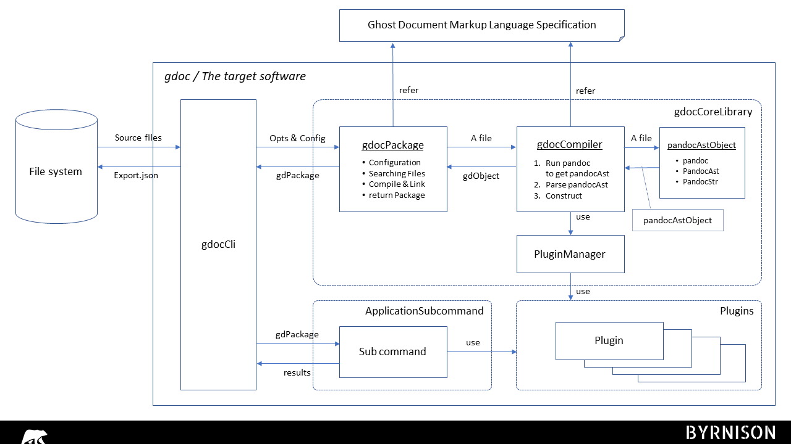

*
<small>
[@^ doctype="gdoc 0.3" class="systemdesign:"]
</small>
*

# [@ swad] Gdoc Software Architectural Design

*@Summary:*  \
This document describes the software architecture design of gdoc.

 

## \[@#\] CONTENTS<!-- omit in toc -->

- [1. REFERENCES](#1-references)
- [2. THE TARGET SOFTWARE](#2-the-target-software)
- [3. SOFTWARE ARCHITECTURE](#3-software-architecture)
  - [3.1. Architecture](#31-architecture)
  - [3.2. Block definitions](#32-block-definitions)
  - [3.3. Requirements allocation](#33-requirements-allocation)
- [4. SOFTWARE ELEMENTS](#4-software-elements)
  - [4.1. \[@ln go\] `gdObjectModel`](#41-ln-go-gdobjectmodel)
  - [4.2. \[@ln gc\] `gdCompiler`](#42-ln-gc-gdcompiler)
    - [4.2.1. \[@ln pa\] `PandocAstObject`](#421-ln-pa-pandocastobject)
    - [4.2.2. Architecture](#422-architecture)
    - [4.2.3. Requirements allocation](#423-requirements-allocation)
  - [4.3. \[@ln pi\] `Plugins`](#43-ln-pi-plugins)

 

## 1. REFERENCES

This document refers to the following documents.

1. Software Requirements Specification  \
   [@access SWRS from="[../Requirements/SoftwareRequirementsSpecification](../Requirements/SoftwareRequirementsSpecification.md#3--swrs-software-requirements-specification)"]

   Top level requirements specification for gdoc.

2. Gdoc Markup Language  \
   [@access GDML from="[../GdocMarkupLanguage/GdocMarkupLanguage](../GdocMarkupLanguage/GdocMarkupLanguage.md)"]

   Grammar definition of Gdoc markup language.

 

## 2. THE TARGET SOFTWARE

- [@Block GDOC] gdoc  \
  Block representing the target software in software architectural design.

  @trace(satisfy): SWRS.name SWRS.core SWRS.apps SWRS.constraint

 

## 3. SOFTWARE ARCHITECTURE

### 3.1. Architecture

The figure below shows the internal blocks of gdoc.

  \
  \
[@fig 1.1\] gdoc Internal Blocks [rough sketch]

 

  \
  \
[@fig 1.2\] gdoc Internal Blocks Definition [rough sketch]

 

### 3.2. Block definitions

The blocks in the figure are defined as follows.

- [@Table 1.1] Gdoc Internal Block definitions

  | @Blk | Name | Description |
  | :--: | ---- | ----------- |
  |      | association | @partof: gdoc
  |      | trace | @derived: fig[gdoc Internal Blocks]
  | cli  | CommandLineIF |
  | go   | gdObjectModel | takes source files and a configuration object and creates a gdObjectModel containing one or more packages linked to each other.
  | gc   | gdCompiler | takes a source file one by one and parses it to convert a gdObject.
  | pa   | PandocAst | takes a source file and returns a PandocAst object. Currently, the PandocAST file will be generated by external pandoc command.
  | pi   | Plugins | includes gdObject constructors of specific types and applicational subcommands of gdoc using gdObjects generated by the constructors.

 

### 3.3. Requirements allocation

1. [@Reqt 1]

2. [@Reqt 1] Generating gdObjectModel  \
   Takes command-line options and configuration file, and generates gdObjectModel to provide to application subcommands.

3. [@Reqt 2] Providing Source Mapping Info  \
   When outputting results or information with the application, supplement the source mapping information.

| @Reqt | Name | Text | Trace |
| :---: | ---- | ---- | :---: |
| 1 | Generating gdObjectModel | Takes commandline options and configuration file, and generate gdObjectModel to provide to appication subcommands. | @copy: gd.er.fr1
| @spec | 1.1 |  | @allocate: cli
| @spec | 1.2 |  | @allocate: pa
| @spec | 1.3 |  | @allocate: pa
| 2 | Providing Source Mapping Info | When outputting results or information with application, supplement the source mapping information. | @copy: gd.er.fr1
| @spec | 2.1 |  | @allocate: cli
| @spec | 2.2 | PandocAst object provide source mapping information with text strings. | @allocate: pa
| @spec | 2.3 |  | @allocate: pa

 

## 4. SOFTWARE ELEMENTS

### 4.1. \[@ln go\] `gdObjectModel`

### 4.2. \[@ln gc\] `gdCompiler`

#### 4.2.1. \[@ln pa\] `PandocAstObject`

#### 4.2.2. Architecture

  \
  \
[@fig 5.1\] PandocAstObject Internal Blocks Definition [rough sketch]

 

- [@Table 2.2] PandocAstObject Internal Blocks definition

  | @Blk | Name | Description |
  | :--: | ---- | ----------- |
  |      | trace | @derived: fig[PandocAstObject Internal Blocks Definition]
  |      | association | @partof: pa
  | pan  | pandoc | Execute pandoc as a subprocess to parse a source md file to generate PandocAST json object.
  | ast  | PandocAst | Convert a raw PandocAST json object to a PandocAst gdoc object.
  | pst  | PandocStr | A class storing text strings with PandocAST's 'Str' inline elements to keep source mapping data.

#### 4.2.3. Requirements allocation

| @Reqt | Name | Text | Trace |
| :---: | ---- | ---- | :---: |
| 1 | - | PandocAst object provide source mapping information with text strings. | @copy: gd.1.2
| @spec | 1.1 |  | @allocate: cli
| @spec | 1.2 |  | @allocate: pa
| @spec | 1.3 |  | @allocate: pa

### 4.3. \[@ln pi\] `Plugins`
