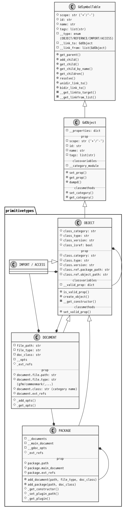
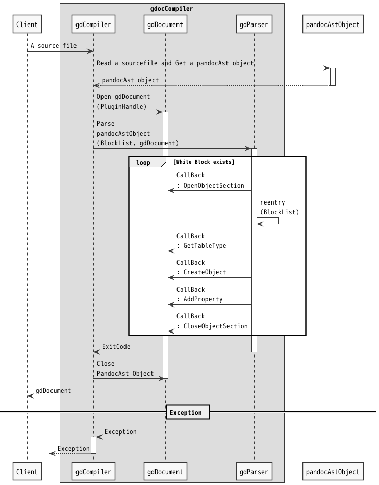
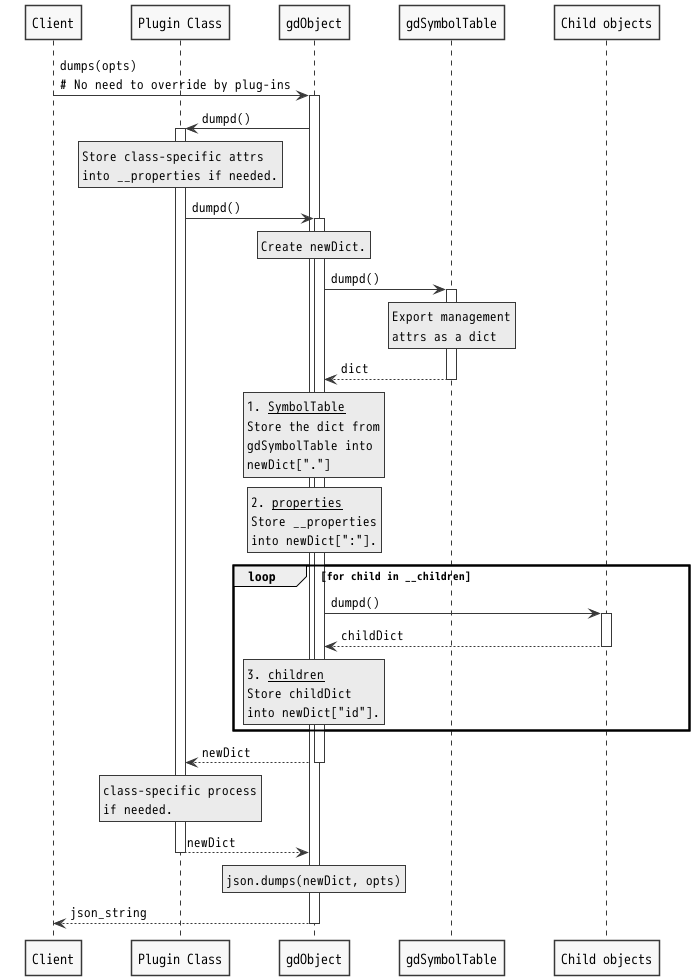
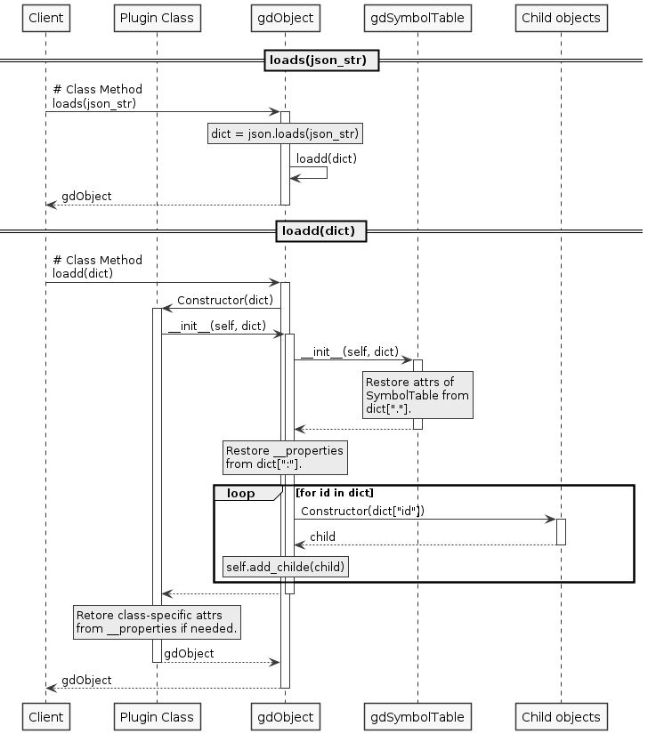

*<div align=right><small>
[@^ doctype="gdoc 0.3" class="systemdesign:"]
</small></div>*

# [@ swdd] gdObject Detailed Design


## \[@#\] TABLE OF CONTENTS<!-- omit in toc -->

- [1. REFERENCES](#1-references)
- [2. THE TARGET SOFTWARE ELEMENT](#2-the-target-software-element)
- [3. [@ rq] REQUIREMENTS](#3--rq-requirements)
- [4. [@ sg] STRATEGY](#4--sg-strategy)
- [5. [@ sc] STRUCTURE](#5--sc-structure)
  - [5.1. Class definitions](#51-class-definitions)
    - [5.1.1. Internal classes](#511-internal-classes)
    - [5.1.2. Gdoc Primitive types](#512-gdoc-primitive-types)
  - [5.2. [@class& t4] Package](#52-class-t4-package)
  - [5.3. [@class& C4] GdDocument](#53-class-c4-gddocument)
- [6. [@ bh] BEHAVIOR](#6--bh-behavior)
  - [6.1. Compile](#61-compile)
  - [6.2. Json dumps/loads](#62-json-dumpsloads)
    - [6.2.1. dumps](#621-dumps)
    - [6.2.2. loads](#622-loads)
- [7. [@ ra] Requirements allocation](#7--ra-requirements-allocation)
- [8. [@ su] SOFTWARE UNITS](#8--su-software-units)
  - [8.1. GdSymbol](#81-gdsymbol)
  - [8.2. GdSymbolTable](#82-gdsymboltable)
  - [8.3. GdObject](#83-gdobject)
    - [8.3.1. Behavior](#831-behavior)
      - [8.3.1.1. `_get_class()`](#8311-_get_class)
      - [8.3.1.2. `create_object()`](#8312-create_object)
  - [8.4. BaseObject](#84-baseobject)
  - [8.5. Import](#85-import)
  - [8.6. Access](#86-access)
  - [8.7. Document](#87-document)
    - [8.7.1. Behavior](#871-behavior)
      - [8.7.1.1. `_get_class()`](#8711-_get_class)
    - [8.7.2. Link process steps](#872-link-process-steps)
    - [8.7.3. What gdDocument should satisfy](#873-what-gddocument-should-satisfy)
    - [8.7.4. What gdPackage should satisfy](#874-what-gdpackage-should-satisfy)
  - [8.8. Package](#88-package)
  - [8.8. Plugin](#88-plugin)

<br>

## 1. REFERENCES

This document refers to the following documents.

1. Gdoc Architectural Design  \
   [@import SWAD from="[../ArchitecturalDesign](../ArchitecturalDesign.md)"]

   Upper Layer Architectural Design of this document.

2. Gdoc Markup Language  \
   [@import GDML from="[../../GdocMarkupLanguage/GdocMarkupLanguage](../../GdocMarkupLanguage/GdocMarkupLanguage.md#-gdml-gdoc-markup-language)"]

   Grammar definition of Gdoc markup language.

3. Gdoc Object Format  \
   [@import GDML from="[../../GdocMarkupLanguage/GdocObjectFormat](../../GdocMarkupLanguage/GdocObjectFormat.md)"]

   GdocObject format definition.

<br>

## 2. THE TARGET SOFTWARE ELEMENT

- [@access SWAD.GDOC[gdocCoreLibrary][gdocCompiler][gdObject] as=THIS]

  The block representing the target software in this document.

<br>

## 3. [@ rq] REQUIREMENTS

- [@access SWAD.SE.GDC.RA]

  Requirements_Allocated to this Software_Element, GdocObject from SoftWare_Architectural_Design.

| @Reqt | Name | Text | Trace |
| :---: | ---- | ---- | :---: |
| FR    | Functional Requirement |
| @     | FR.1 | gdObjectを生成する | @copy: RA.1a.3
| @     | FR.2 | 指定された型のオブジェクト・プロパティを生成する | @copy: RA.1a2.2
| @     | FR.3 | ソースファイルをオブジェクト化した情報から、json形式文字列を生成する | @copy: RA.5a.1
| DS    | Design Specification    |
| @     | DS.1 | gdObject classは、ファイルのようにOpen/Closeを伴うインターフェースメソッドを提供する。 | @copy: RA.gdo.1
| @     | DS.2 | インターフェースメソッドにより生成されるオブジェクト/プロパティが登録される場所を示す、WritePoint情報を持つ。 | @copy: RA.gdo.2
| @     | DS.3 | インターフェースメソッドによる指示内容の実オブジェクトデータへの変換は、クラスのコンストラクタが行う。 | @copy: RA.gdo.3
| @     | DS.4 | クラス（プラグイン含む）情報はgdObjectのOpen時に外部から供給される。 | @copy: RA.gdo.4
| @     | DS.5 | 生成されたクラスインスタンスは、クラスの名前とバージョンをセットで保持する。 | @copy: RA.gdo.5
|       | Rationale | エクスポートされたデータがどのクラスのどのバージョンから生成されたものであるか追跡可能にするため。
| @     | DS.6 | json形式テキストデータへのエクスポート及びインポート機能を提供する | @copy: RA.gdo.6

<br>

## 4. [@ sg] STRATEGY

1. [@Strategy sg1] THIS provides property access methods like dict. \
   ex.

   ```py
   gdobj.set_prop(["note", "2"], "NOTE2-PROPERTY")
   gdobj.get_prop(["note", "2"])
   >>> 'NOTE2-PROPERTY'
   gdobj["note"]["2"]
   >>> 'NOTE2-PROPERTY'
   ```

2. [@Strategy sg2] THIS provides create_object() method that creates new object and return it. \
   @trace(derive): rq.DS.1

   ```py
   obj = gdobj.creatte_object(class_name: str, id: str, *args, **kwargs)
   ```

   @note: Instead of open()/close(), each object provide this method.

3. [@Strategy sg3] THIS provides object controll methods for compiler, linker and application subcommands.

   ex. resolve() rsolve long object id and return the object.

    ```py
    obj = gdobj.resolve("SWAD.FR[Component1][Part2].c1")
    ```

4. [@Strategy sg4] THIS provides primitive data types for GdocObject and its plugin interface class.
   1. OBJECT: the base type of all extended types of plugins.
   2. IMPORT
   3. ACCESS
   4. DOCUMENT
   5. PACKAGE

<br>

## 5. [@ sc] STRUCTURE

### 5.1. Class definitions

<div align=center>

[](./gdObject.puml)  \
  \
[@fig 4.1.1\] GdObject class hierarchy

</div>

<br>

#### 5.1.1. Internal classes

These are internal classes that provide the basic mechanisms.

| @class | Name | Description |
| :----: | ---- | ----------- |
|        | Association   | @partof: THIS
| c1     | GdSymbol      | GdSymbol class
| c2     | GdSymbolTable | GdSymbol table
| c3     | GdObject      | gdoc Object base class

#### 5.1.2. Gdoc Primitive types

| @class | Name | Description |
| :----: | ---- | ----------- |
|        | Association   | @partof: THIS
| t1    | BaseObject    | The base class for all gdoc objects except Import and Access.
| t2    | Import        | Unidirectional reference to other object.
| t3    | Access        | Same as Import but has private visibility.
| t4    | Document      | An object that represents the source document file.
| t5    | Package       | An object that represents the source document file.
| t6    | Plugin        | Interface class of gdoc data type plugin module.

### 5.2. [@class& t4] Package

- @responsibility(1): \
  Manage multiple source files or directories as packages.

- @responsibility(2): \
  Provide access methods to the package and object contained inside it.

- @fr(1): \
  Convert package name to actual file path.

### 5.3. [@class& C4] GdDocument

- @responsibility(1): \
  Manage a source file infromation.

- @responsibility(2): \
  Manage outside link(import/access) info.

<br>

## 6. [@ bh] BEHAVIOR

### 6.1. Compile

Ref to ../ArchitecturalDesign/gdocCompilerSequenceDiagram

<div align=center>

[](./gdObject.puml)  \
  \
[@fig 4.2.2\] gdocCompiler Sequence Diagram

</div>
<br>

### 6.2. Json dumps/loads

#### 6.2.1. dumps

<br>

<div align=center>

[](./gdObject.puml) \
\
[@fig 1.1] dumps() Sequence

</div>

<br>

#### 6.2.2. loads

<br>

<div align=center>

[](./gdObject.puml) \
\
[@fig 1.2] loads() Sequence

</div>

<br>

## 7. [@ ra] Requirements allocation

| @Reqt& | Name | Text | Trace |
| :----: | ---- | ---- | :---: |
| rq.FR.1 |   | gdObjectを生成する | @allocate: sc[BaseObject]
| rq.FR.2 |   | 指定された型のオブジェクト・プロパティを生成する | @allocate: sc[GdObject]
| rq.FR.3 |   | ソースファイルをオブジェクト化した情報から、json形式文字列を生成する | @allocate: sc[GdObject]
| rq.DS.1 |   | gdObject classは、ファイルのようにOpen/Closeを伴うインターフェースメソッドを提供する。 |
| @Spec   | 1 |  | @allocate:
| rq.DS.2 |   | インターフェースメソッドにより生成されるオブジェクト/プロパティが登録される場所を示す、WritePoint情報を持つ。 |
| @Spec   | 1 |  | @allocate:
| rq.DS.3 |   | インターフェースメソッドによる指示内容の実オブジェクトデータへの変換は、クラスのコンストラクタが行う。 | @allocate: sc[GdObject]
| rq.DS.4 |   | クラス（プラグイン含む）情報はgdObjectのOpen時に外部から供給される。 |
| @Spec   | 1 |  | @allocate:
| rq.DS.5 |   | 生成されたクラスインスタンスは、クラスの名前とバージョンをセットで保持する。 | @allocate: sc[BaseObject]
| rq.DS.6 |   | json形式テキストデータへのエクスポート及びインポート機能を提供する | @allocate: sc[GdObject]

<br>

| @Reqt& | Name | Text | Trace |
| :----: | ---- | ---- | :---: |
| sg.sg1 | | THIS provides property access methods like dict. | @allocate: sc[GdObject]
| sg.sg2 | | THIS provides create_object() method that creates new object and return it. | sc[BaseObject]

- sg3 and sg4 are reflected in the structural design.

<br>

## 8. [@ su] SOFTWARE UNITS

### 8.1. GdSymbol

| @class& | Name | Description |
| :-----: | ---- | ----------- |
| c1      | GdSymbol      | GdSymbol class
| # | Class methods |
| @Method | is_symbol     | returns if the symbol string is valid.
|         | @param        | in symbol : str \| PandocStr
|         | @param        | out : bool
| # | Instance methods |
| @Method | is_id         | returns if the leaf symbol string is id.
|         | @param        | out : bool
| @Method | get_symbols   | Returns the list of splited symbol strings.
|         | @param        | out : list(str \| PandocStr)
| @Method | get_long_symbol | Returns the entire unsplited symbol string, excluding tags.
|         | @param        | out : str \| PandocStr
| @Method | get_tags      | Returns the list of tag strings.
|         | @param        | out : list(str \| PandocStr)

### 8.2. GdSymbolTable

| @class&  | Name | Description |
| :------: | ---- | ----------- |
| c2       | GdSymbolTable    | Symbol string
| @Method  | get_parent     |
| @Method  | add_child      | `def add_child(self, child)`
|          | @param         | in child : GdSymbolTable
| @Method  | __add_reference | `def __add_reference(self, child)`
|          | @param         | in child : GdSymbolTable
| @Method  | __get_children | get children named without starting '&'
| @Method  | __get_references | get children named with starting '&'
| @Method  | unidir_link_to | can link to OBJECT, REFERENCE, IMPORT/ACCESS<br>from IMPORT/ACCESS<br>**TODO**: should detects circular references and sends an exception.
|          | @param         | in target : GdSymbolTable
| @Method  | bidir_link_to  | can link only to OBJECT or REFERENCE from REFERENCE<br>**TODO**: should detects circular references and sends an exception.
|          | @param         | in target : GdSymbolTable
| @Method  | __get_linkto_target | gets target OBJECT referenced by multilevels indirectly link_to references.<br>**TODO**: should detects circular references and sends an exception.
| @Method  | __get_linkfrom_list | gets list of OBJECTs that reference `self` by multilevels indirectly link_from reference tree.<br>**TODO**: should detects circular references and sends an exception.
| @Method  | get_children   |
| @Method  | get_child      |
| @Method  | get_child_by_name |
| @Method  | resolve        | `def resolve(self, symbol)`
| @Method  | [**todo**] find           | `def find_items(self, symbol)`
| @Method  | [**todo**] dumpd          |

1. GdSymbol handle 3 types of entities.
   1. Object
   2. Reference
   3. Import/Access
2. Import/Access cannot have any children.

### 8.3. GdObject

1. Reference objects can have additional children but not additional properties.
   - Properties in references are copy of original.

| @class&  | Name | Description |
| :------: | ---- | ----------- |
| c3       | GdObject         | Inherit from GdSymboltable
| @Method  | set_prop         | sets the property specified by key and value.<br>@See: [../../GdocMarkupLanguage/Properties](../../GdocMarkupLanguage/Properties.md)
| @Method  | get_prop         |
| @Method  | get_keys         | returns list of property sub-keys. It's similar to keys, but does not include value-key("") in the list.
| @Method  | dumpd            |
| #        | **abc.Mapping**  | Simply call the method of the same name in __properties.
| @Method  | \_\_getitem\_\_  |
| @Method  | \_\_iter\_\_     |
| @Method  | \_\_len\_\_      |
| @Method  | \_\_contains\_\_ |
| @Method  | \_\_eq\_\_       |
| @Method  | \_\_ne\_\_       |
| @Method  | keys             |
| @Method  | items            |
| @Method  | values           |
| @Method  | get              |

#### 8.3.1. Behavior

##### 8.3.1.1. `_get_class()`

- obj = self
- type = None
- while(obj):
  - if obj has class.category:
    - if specified_cat is None or specified_cat == class.category:
      - type = category.get_type()
      - if type:
        - break
  - obj = obj.get_parent

- if type is None:
  - type = gdoccompiler.get_type()

- return type

##### 8.3.1.2. `create_object()`

- class = self._get_class()
- if class is None:
  - raise CLASS NOT FOUND
- opts = self._get_opts()
- child = class(opts)
- self.add_child(child)

### 8.4. BaseObject

| @class& | Name | Description |
| :-----: | ---- | ----------- |
| t1      | BaseObject    | The base class for all gdoc objects except Import and Access.

### 8.5. Import

| @class& | Name | Description |
| :-----: | ---- | ----------- |
| t2      | Import        | Unidirectional reference to other object.

### 8.6. Access

| @class& | Name | Description |
| :-----: | ---- | ----------- |
| t3      | Access        | Same as Import but has private visibility.

### 8.7. Document

| @class& | Name | Description |
| :-----: | ---- | ----------- |
| t4      | Document      | An object that represents the source document file.
| @prperty | __file_path      | package relative path
| @prperty | __file_type      | [json(pandocast) \| gfm \| ...]
| @prperty | __metadata       | pandoc ast document metadata(dict gdoc).
| @prperty | __gdml_ver       | gdml version
| @prperty | __gdoc_type      | [plain \| gdoc]
| @prperty | __external_link  | list of file or package paths.
| @Method  | set_ext_link     |
| @Method  | link     |
| @Method  | dumps            |
| #        | **objects**      | Override
| @Method  | _get_class       | get object class by name

#### 8.7.1. Behavior

##### 8.7.1.1. `_get_class()`

- type = super()._get_class()

- if type is None and self.__plugin_handler:
  - type = self.__plugin_handler._get_class()

- return type

#### 8.7.2. Link process steps

1. GdDocument: link document-internal object-references.
   - Walk through all GdObjects
   - check type if ref/imp/acc
   - if refs.document is not None and it's not '.'(self).
     - append to self.__external_link list
   - else:
     - resolve reference and get object
     - set GdObject.__link_to attr as unidir or bidir.
     - if cannot reach target, add it to pending_list and loop.

2. GdPackage: link document-external references.

   1. link document-external document-links.
      - Walk through all GdDocuments
      - check if the doc has __external_link:
        - resolve reference and get object(doc or main doc in package).
        - if target is outside current package
          - GdPackage.__dipendencies.append(it) # to set package info up.

   2. link all object references
      - Walk through all GdObject in all packages.
      - same as GdDocument-internal object-references.

#### 8.7.3. What gdDocument should satisfy

- walk through()
- link1
  - list reference objects up
  - resolve and external list

- link2
  - resolve and check remaining list

#### 8.7.4. What gdPackage should satisfy

1. collect documents and packages

2. Compile all documents and packages

3. link
   - walk through all documents and packages
   - link all document's internal links(it results create external link list)
   - resolve inter document links
   - while(remaining list):
     - link again(link2)

### 8.8. Package

| @class&  | Name | Description |
| :------: | ---- | ----------- |
| t5       | gdPackage        |
| @prperty | __package_path   | cwd relative path
| @prperty | __main_file      | the main document. None if it's implicit package.
| @prperty | __file_list      | package-wd relative path excluding main file.
| @prperty | __gdml_ver       | gdml version
| @prperty | __external_link  | list of file or package paths.
| @prperty | __package_config |

### 8.8. Plugin

| @class&  | Name | Description |
| :------: | ---- | ----------- |
| t6       | Plugin        | Interface class of gdoc data type plugin module.

