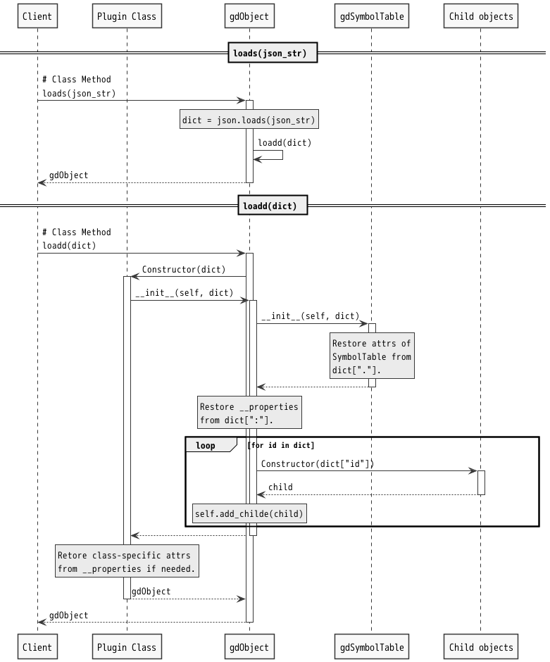

*<div align=right><small>
[@^ doctype="gdoc 0.3" class="systemdesign:"]
</small></div>*

# [@ swdd] gdObject Detailed Design


## \[@#\] CONTENTS<!-- omit in toc -->

- [1. REFERENCES](#1-references)
- [2. THE TARGET SOFTWARE ELEMENT](#2-the-target-software-element)
- [3. [@ rq] REQUIREMENTS](#3--rq-requirements)
- [4. [@ sg] STRATEGY](#4--sg-strategy)
- [5. [@ sc] STRUCTURE](#5--sc-structure)
- [6. [@ bh] BEHAVIOR](#6--bh-behavior)
  - [6.1. gdObject](#61-gdobject)
- [7. [@ ra] Requirements allocation](#7--ra-requirements-allocation)
- [8. [@ su] SOFTWARE UNITS](#8--su-software-units)
  - [8.1. GdSymbol](#81-gdsymbol)
  - [8.2. GdSymboltable](#82-gdsymboltable)
  - [8.3. gdObject](#83-gdobject)

<br>

## 1. REFERENCES

This document refers to the following documents.

1. Gdoc Architectural Design  \
   [@access SWAD from="[../ArchitecturalDesign](../ArchitecturalDesign.md)"]

   Upper Layer Architectural Design of this document.

2. Gdoc Markup Language  \
   [@import GDML from="[../GdocMarkupLanguage/GdocMarkupLanguage](../GdocMarkupLanguage/GdocMarkupLanguage.md#-gdml-gdoc-markup-language)"]

   Grammar definition of Gdoc markup language.

<br>

## 2. THE TARGET SOFTWARE ELEMENT

- [@Block& -THIS=SWAD.GDOC[gdocCoreLibrary][gdocCompiler][gdObject]]

  The block representing the target software in this document.

<br>

## 3. [@ rq] REQUIREMENTS

- [@access SWAD.SE.GDC.RA]

  Requirements_Allocated to this Software_Element, PandocAstObject from SoftWare_Architectural_Design.

| @Reqt | Name | Text | Trace |
| :---: | ---- | ---- | :---: |
| FR    | Functional Requirement |
| @     | FR.1 | gdObjectを生成する | @copy: RA.1a.3
| @     | FR.2 | 指定された型のオブジェクト・プロパティを生成する | @copy: RA.1a2.2
| @     | FR.3 | ソースファイルをオブジェクト化した情報から、json形式文字列を生成する | @copy: RA.5a.1

> | @Reqt | Name | Text |
> | :---: | ---- | ---- |
> | gdo   | gdObject    |
> |       | Trace       | @refine: s2, @allocate: gdo
> | @     | 1    | gdObject classは、ファイルのようにOpen/Closeを伴うインターフェースメソッドを提供する。
> | @     | 2    | インターフェースメソッドにより生成されるオブジェクト/プロパティが登録される場所を示す、WritePoint情報を持つ。
> | @     | 3    | インターフェースメソッドによる指示内容の実オブジェクトデータへの変換は、クラスのコンストラクタが行う。
> | @     | 4    | クラス（プラグイン含む）情報はgdObjectのOpen時に外部から供給される。
> | @     | 5    | 生成されたクラスインスタンスは、クラスの名前とバージョンをセットで保持する。
> |       | Rationale | エクスポートされたデータがどのクラスのどのバージョンから生成されたものであるか追跡可能にするため。
> | @     | 6    | json形式テキストデータへのエクスポート及びインポート機能を提供する

<br>

## 4. [@ sg] STRATEGY

1. [@Strategy sg1] THIS provides property access methods like dict. \
   ex.

   ```py
   dgobj["note"]["2"]
   # >>> note text in __properties.
   ```

2. [@Strategy sg2] THIS provides object controll methods for linker and application subcommands. \
   ex.

   ```py
   gdobj.resolve("...lib.abc")
   gdobj.add_child(Class, *args, **kwargs)  # _add_child(Class, args, args, key=kwargs,...)
   handle = gdObject._open()
   ```

<br>

## 5. [@ sc] STRUCTURE

| @class | Name | Description |
| :----: | ---- | ----------- |
|        | Association   | @partof: THIS
| c1     | GdObject      | gdoc Object class
| c2     | GdSymbolTable | GdSymbol teble
| c3     | GdSymbol      | GdSymbol string

<br>

## 6. [@ bh] BEHAVIOR

### 6.1. gdObject

The behavior of the properties follows GdocMarkupLanguage/Properties.md.

<br>

<div align=center>

[](./gdObject.puml) \
\
[@fig 1.1] dumps() Sequence

</div>

<br>

<div align=center>

[](./gdObject.puml) \
\
[@fig 1.2] loads() Sequence

</div>

<br>

## 7. [@ ra] Requirements allocation

| @Reqt | Name | Text | Trace |
| :---: | ---- | ---- | :---: |
| 1b    |      |  | @copy:
| @Spec | 1b.1 |  | @Allocate:
| @Spec | 1b.2 |  | @Allocate:

- Symbol tables can register objects and references.

## 8. [@ su] SOFTWARE UNITS

### 8.1. GdSymbol

| @class& | Name | Description |
| :-----: | ---- | ----------- |
| c3      | GdSymbol        | provides util methods for GdSymbol strings.
| # Class methods ||
| @Method | issymbol      | returns if the symbol string is valid.
|         | @param        | in symbol : str \| PandocStr
|         | @param        | out : bool
| @Method | isidentifier  | returns if the symbol string is valid ids including no names.
|         | @param        | in symbol : str \| PandocStr
|         | @param        | out : bool
| # Instance methods ||
| @Method | get_symbol    | Returns the entire unsplited symbol string, excluding tags.
|         | @param        | out : str \| PandocStr
| @Method | split         | Reutrns the list of splited symbols, excluding tags.
|         | @param        | out : list(str \| PandocStr)
| @Method | get_tags      | Returns the list of tag strings.
|         | @param        | out : list(str \| PandocStr)
| @Method | stringify     | Returns the entire symbol string including tags.
|         | @param        | out : str \| PandocStr

### 8.2. GdSymboltable

| @class&  | Name | Description |
| :------: | ---- | ----------- |
| c2       | GdSymboltable    | Symbol string
| # properties ||
| @prperty | __parent       |
| @prperty | __children     |
| @prperty | __namelist     |
| @prperty | __cache        | Cache "SymbolString": { Symbol(), resolve() }
| @prperty | __link_to      |
| @prperty | __link_from    |
| @prperty | scope          | Enum [ public, private ] or [ '+', '-' ]
| @prperty | id             |
| @prperty | name           | str \| pandocStr
| @prperty | tags           |
| # methods ||
| @Method  | \_\_init\_\_   |
|          | @param         | in id : str \| PandocStr \| dict
|          | @param         | in scope : str \| PandocStr
|          | @param         | in name : str \| PandocStr
|          | @param         | in tags : list(str \| PandocStr)
| @Method  | get_parent     |
| @Method  | add_child      | `def add_child(self, child)`
| @Method  | add_ref_child  | `def add_ref_child(self, child)`
| @Method  | get_children   |
| @Method  | get_child      |
| @Method  | get_child_by_name |
| @Method  | resolve        | `def resolve(self, symbol)`
| @Method  | find           | `def find_items(self, symbol)`
| @Method  | dumpd          |

- Is it better that referenced objects can have additional children but not additional properties?
- Symbol tables can register objects and references.
- When linking, if references exist in the same namespace as the original, they are merged.

### 8.3. gdObject

- gdObject would like to be able to access properties the same way as dict.

| @class&  | Name | Description |
| :------: | ---- | ----------- |
| c1       | gdObject       | Inherit from GdSymboltable
| @prperty | class          | { category, type, version }
| @prperty | __properties   |
| @Method  | add_prop       |
| @Method  | get_prop       |
| @Method  | dumps          |
| @Method  | dumpd          |
| @Method  | loads          |
| @Method  | loadd          |
| #        | abc.Mapping      | Simply call the method of the same name in __properties.
| @Method  | \_\_getitem\_\_  |
| @Method  | \_\_iter\_\_     |
| @Method  | \_\_len\_\_      |
| @Method  | \_\_contains\_\_ |
| @Method  | \_\_eq\_\_       |
| @Method  | \_\_ne\_\_       |
| @Method  | keys             |
| @Method  | items            |
| @Method  | values           |
| @Method  | get              |
