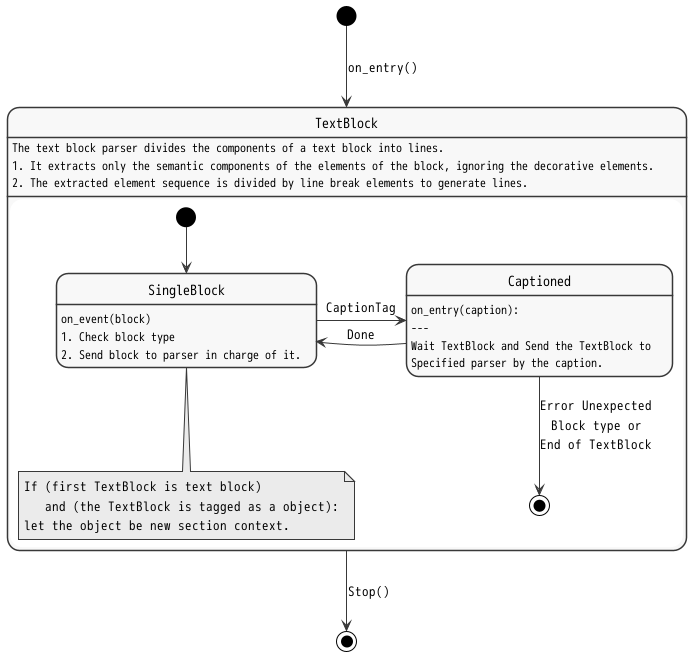

*<div align=right><small>
[@ doctype="gdml 0.3" class="gdoc 0.3"]
</small></div>*

# [@ swdd] gdParser Detailed Design


## \[@#\] CONTENTS<!-- omit in toc -->

- [1. REFERENCES](#1-references)
- [2. THE TARGET SOFTWARE ELEMENT](#2-the-target-software-element)
- [3. [@ rq] REQUIREMENTS](#3--rq-requirements)
- [4. [@ sg] STRATEGY](#4--sg-strategy)
- [5. [@ sc] STRUCTURE](#5--sc-structure)
  - [5.1. Parser Base Class](#51-parser-base-class)
  - [5.2. Parsers](#52-parsers)
    - [5.2.1. Types](#521-types)
      - [5.2.1.1. Document structure](#5211-document-structure)
      - [5.2.1.2. Blocks](#5212-blocks)
      - [5.2.1.3. Tags](#5213-tags)
    - [5.2.2. Section Parser](#522-section-parser)
    - [5.2.3. Block Parser](#523-block-parser)
      - [5.2.3.1. TextBlock Parser](#5231-textblock-parser)
    - [5.2.4. Line Parser](#524-line-parser)
    - [5.2.5. TextString Parser](#525-textstring-parser)
- [6. [@ bh] BEHAVIOR](#6--bh-behavior)
  - [6.1. BlockList Parser](#61-blocklist-parser)
  - [6.2. TextBlock](#62-textblock)
- [7. [@ su] SOFTWARE UNITS](#7--su-software-units)
  - [7.1. Finite State Machine](#71-finite-state-machine)

<br>

## 1. REFERENCES

This document refers to the following documents.

1. Gdoc Architectural Design  \
   [@access SWAD from="[../ArchitecturalDesign](../ArchitecturalDesign.md)"]

   - the upper layer architectural deesign of this document.

2. Gdoc Markup Language  \
   [@import GDML from="[../../GdocMarkupLanguage/GdocMarkupLanguage](../../GdocMarkupLanguage/GdocMarkupLanguage.md#-gdml-gdoc-markup-language)"]

   - describes the grammar definition of Gdoc markup language.

<br>

## 2. THE TARGET SOFTWARE ELEMENT

- [@Block& -THIS=SWAD.GDOC[gdocCoreLibrary][gdocCompiler][gdParser]]

  - `THIS` representing the target software block in this document.

<br>

## 3. [@ rq] REQUIREMENTS

- [@access SWAD.SE.GDC.RA]

  Requirements_Allocated to this Software_Element, gdocCompiler from SoftWare_Architectural_Design.

| @Reqt | Name | Text | Trace |
| :---: | ---- | ---- | :---: |
| FR    | Functional Requirement |
| @     | FR.1 | Parse a file | @copy: RA.1a.2
| @     | FR.2 | Interpret tags specifying type and properties | @copy: RA.1a2.1
| @     | FR.3 | Parse a PandocAst Object | @copy: RA.3b.2

> | @Reqt | Name | Text |
> | :---: | ---- | ---- |
> | gdp   | gdParser    |
> |       | Trace       | @refine: s1, @allocate: gdp
> | @     | 1    | pandocAstObjectと、インターフェースオブジェクトを引数に起動する。
> | @     | 2    | pandocAstObjectをパースし、インターフェースオブジェクトの関数をコールバックして情報を提供する。

<br>

## 4. [@ sg] STRATEGY

1. [@Strategy sg1] Use FSM to simplify parser implementation.
2. [@Strategy sg2] When errors are found, raise Exception with detailed error info for lint checker.

<br>

## 5. [@ sc] STRUCTURE

### 5.1. Parser Base Class

| @class | Name | Description |
| :----: | ---- | ----------- |
|        | Association  | @partof: THIS
| c1     | fsm          | Finite State Machine
| c2     | ErrorHandler | Parser error Handler
| c3     | Tokenizer    | TextString Tokenizer

<br>

### 5.2. Parsers

#### 5.2.1. Types

##### 5.2.1.1. Document structure

| @class | Name | Description |
| :----: | ---- | ----------- |
|        | Association | @partof: THIS
|        | Document
|        | Section

##### 5.2.1.2. Blocks

###### 5.2.1.2.1. TextBlock

| @class | Name | Description |
| :----: | ---- | ----------- |
|        | Association | @partof: THIS
|        | TextBlock
| t1     | Line        |
| t2     | TextString  | Container for Inline elements.<br>type := String \| Code \| Math \| Image \| Quoted

##### 5.2.1.3. Tags

| @class | Name | Description |
| :----: | ---- | ----------- |
|        | Association | @partof: THIS
| t2     | Tag         |
| t3     | BlockTag    |
| t4     | InlineTag   |


#### 5.2.2. Section Parser

1. Document

   - Accept gdoc.Documet
   - Get and store doc info from gdoc.Document
     - [ ] Meta data(Yaml header) includes doctype or some compile opts?

2. Section

   - Accept gdoc.Section

   - [ ] In the future, blocks may be prefetched so that correlations between blocks can be interpreted.

#### 5.2.3. Block Parser

1. TextBlock
2. ListBlock
3. Table

- CodeBlock
- BlockQuote
- RawBlock

##### 5.2.3.1. TextBlock Parser

- Accept gdoc.TextBlock
  - TextBlock is list of lines splited by LineBreak.

- TextBlock can contain only one BlockTag.

#### 5.2.4. Line Parser

Line is elements contained in TextBlock or the first line in CodeBlock.

- Accept gdoc.Line or str
  - Line is a class that inherits TextString.
  - TextString contains gdoc InlineElements or str of CodeBlock.

- [ ] handle Unexpected EOL error

#### 5.2.5. TextString Parser

- Accept TextString
  - NOT need to be tokenized
  - [ ] Should accept hierarchical TextString?
- TextString contains:
  - String
  - Code
  - Math
  - Image
  - Quoted

- Parsing flow

  ```txt
  Input TextString ::= [ String | Code | Math | Image ]*
  Output TextString ::= [ String | Code | Math | Image | BlockTag | InlineTag ]*

  parse_TextString()  # input TextString is raw TextString.

  - tokenize_textstring()
    # Input TextString ::= [ String | Code | Math | Image ]*
    # String -> " ", "=", ",", '"', "[", "]", "(", ")" or word(= concatenated String).

    --> [ ] Add '{' and '}' for inline tag.

  - parse_BlockTag()

    - detect_BlockTag()
      # Input TextString is tokenized TextString.
      # Tag TextString -> [ Quoted(::= TextString srrounded by ") | String | Code | ... ]*

    - create_BlockTag()
      - parse_ClassInfo()
      - parse_Arguments()
        - detect_parentheses()  # TextString srrounded by '(' and ')'
          # Tag TextString -> [
          #     Bracketed(::= TextString srrounded by "(" and ")") |
          #     Quoted(::= TextString srrounded by ") |
          #     String(::= " " | = | , | " | [ | ] | ( | ) | word(= concatenated String)) |
          #     Code | Math | Image
          # ]*

        - ArgumentParser()
          # should concatenate "[", "]" and other words.

      - BlockTag()

  - parse_InlineTag
  ```

## 6. [@ bh] BEHAVIOR

- Design the parser as a hierarchical state transition machine.

### 6.1. BlockList Parser

<br>
| [](./gdParser.puml) |
| :-----: |
| [@fig 1.1] Parsing rule of Bloc kList |

<br>

- Blocklist Parser divides block list to section and keeps context object.

### 6.2. TextBlock

The text block parser divides the components of a text block into lines.

1. It extracts only the semantic components of the elements of the block, ignoring the decorative elements.
2. The extracted element sequence is divided by line break elements to generate lines.

<br>
| [](./gdParser.puml) |
| :-----: |
| [@fig 1.1] Parsing rule of Bloc |

<br>

<br>

## 7. [@ su] SOFTWARE UNITS

### 7.1. Finite State Machine

| @Class& | Name | Description |
| ------- | ---- | ----------- |
| sc.c1        | State          | A State of State Machine.
| @Constructor | `__init__`     |
| @Method      | on_entry       |
| @Method      | on_event       |
| @Method      | on_exit        |
| sc.c2        | StateMachine   | Finite State Machine.
| @Constructor | `__init__`     |
| @Method      | start          |
| @Method      | on_entry       |
| @Method      | on_event       |
| @Method      | on_exit        |
| @Method      | stop           |

