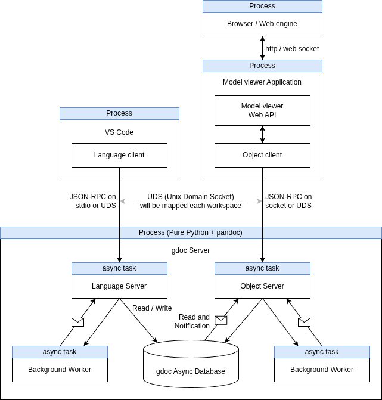

# gdoc Language Server Architecture

## Upstream Requirements

### gdoc Server Overview

### gdoc Language Server

It has three main components:

1. gdoc Language Server
   - Provides Language Server Protocol (LSP) APIs to support various language features for gdoc documents.

2. Background Worker
   - A background worker that performs various tasks related to gdoc documents, such as parsing, analyzing, and generating gdoc Objects.

3. gdoc Async Database
   - A database-like class to manage gdoc Objects and their relationships.

## Usage Patterns

### File editing

1. Language Server receives file editing events from the client
2. Language Server requests the Background Worker to parse the edited file
3. Background Worker parses the file and generates gdoc Objects
4. Background Worker updates gdoc Objects in the gdoc Async Database
5. Language Server receives notifications from the gdoc Async Database about changes in gdoc Objects
6. Language Server sends semantic tokens, diagnostics, and error messeges

### Parsing all documents in the workspace

1. Language Server receives a request from the client to open a workspace
2. Language Server requests the Background Worker to open the workspace
3. Background Worker opens the workspace and reads configurations (e.g., which documents to load, etc.)
4. Background Worker parses all documents in the workspace
5. Background Worker generates gdoc Objects and add them to the gdoc Async Database
6. Language Server receives notifications from the gdoc Async Database about changes in gdoc Objects
7. If there are any errors during parsing, Language Server sends diagnostics and error messeges to the client

### Edit workspace configuration file

1. Language Server receives file editing events for the workspace configuration file from the client
2. Language Server requests the Background Worker to update the workspace configuration
3. Background Worker updates the workspace configuration and re-parses the documents if necessary

