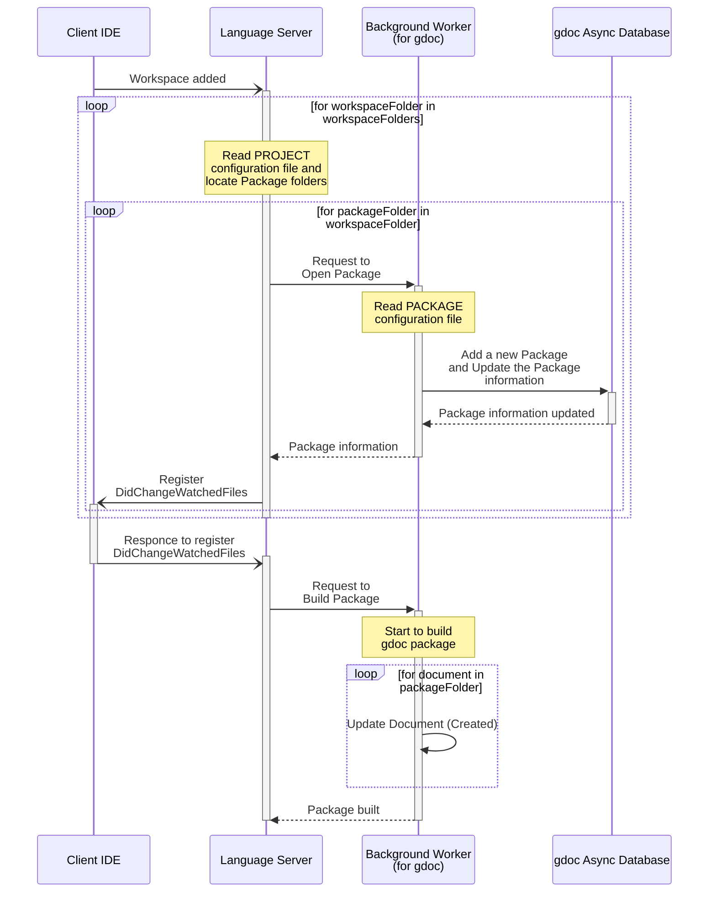
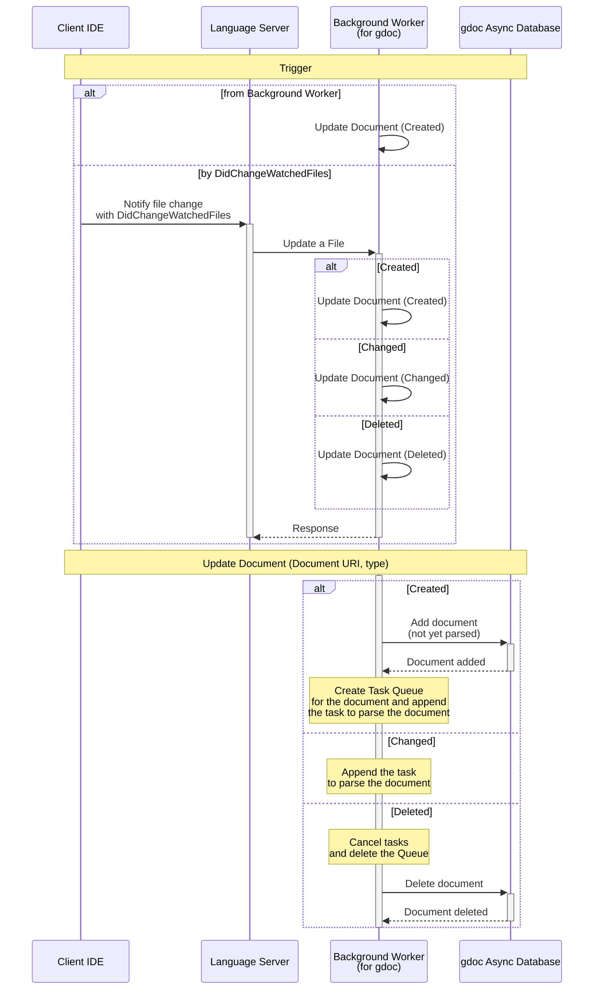
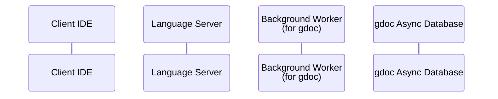
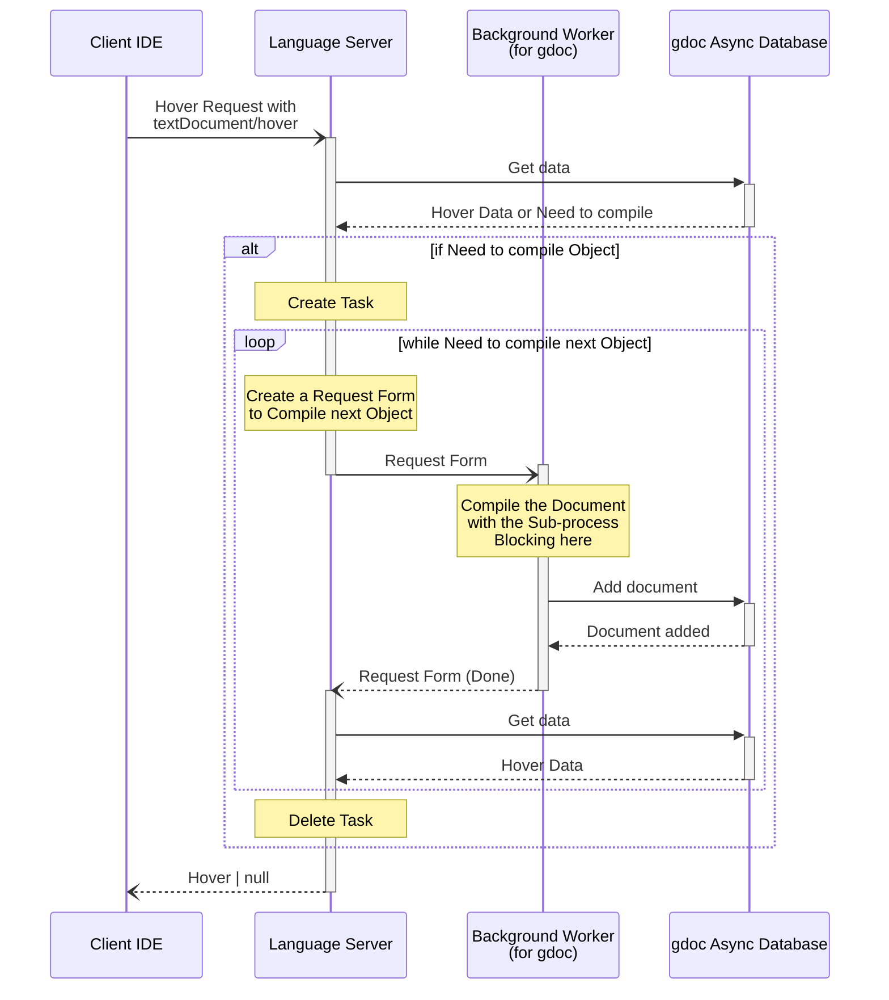

# gdoc Language Server Architecture

## Upstream Requirements

### gdoc Server Overview

### gdoc Language Server

It has three main components:

1. gdoc Language Server
   - Provides Language Server Protocol (LSP) APIs to support various language features for gdoc documents.

2. Background Worker
   - A background worker that performs various tasks related to gdoc documents, such as parsing, analyzing, and generating gdoc Objects.

3. gdoc Async Database
   - A database-like class to manage gdoc Objects and their relationships.

## Use Cases

### File editing

1. Language Server receives file editing events from the client
2. Language Server requests the Background Worker to parse the edited file
3. Background Worker parses the file and generates gdoc Objects
4. Background Worker updates gdoc Objects in the gdoc Async Database
5. Language Server receives notifications from the gdoc Async Database about changes in gdoc Objects
6. Language Server sends semantic tokens, diagnostics, and error messages to the client

### Parsing all documents in the workspace

1. Language Server receives a request from the client to open a workspace
2. Language Server requests the Background Worker to open the workspace
3. Background Worker opens the workspace and reads configurations (e.g., which documents to load, etc.)
4. Background Worker parses all documents in the workspace
5. Background Worker generates gdoc Objects and adds them to the gdoc Async Database
6. Language Server receives notifications from the gdoc Async Database about changes in gdoc Objects
7. If there are any errors during parsing, Language Server sends diagnostics and error messages to the client

### Edit workspace configuration file

1. Language Server receives file editing events for the workspace configuration file from the client
2. Language Server requests the Background Worker to update the workspace configuration
3. Background Worker updates the workspace configuration and re-parses the documents if necessary

## Role and Responsibilities

### Language Server

- Role:
  - Provides LSP APIs
  - Maintains workspace information
  - Submits requirements to the Background Worker
  - Gets information about gdoc Objects from the gdoc Async Database and sends appropriate responses to the client
  - Receives notifications from the gdoc Async Database and sends appropriate responses to the client

- Characteristics:
  - Receives notification of file changes, workspace configuration changes.
    - It means that files list containd in the workspace will be maintained by the Language Server.

- Responsibilities:
  - Manage the workspace information, such as file list, workspace configuration, etc.
  - Organize the requirements, notifications, and responses between the client, Background Worker, and gdoc Async Database.
    - It's like a event and data dispatcher.

### Background Worker

- Role:
  - Performs tasks such as compiling and linking gdoc objects.
  - Manages the server requirements in a queue and processes them one by one.
  - Overrides previous requirements if there are multiple requirements of the same type.
    - e.g., if there are multiple file editing events for the same file, only the latest one should be processed.

- Characteristics:
  - Performs various tasks related to gdoc documents.
  - Requirements from the Language Server are sent asynchronously depending on user actions.

- Responsibilities:
  - Manage the server requirements queue and async tasks corresponding to the requirements.
  - Mutual exclusion / synchronization of the tasks so that they don't violate database consistency.
    - Locking mechanism for the database is the responsibility of the Async Database, but task scheduling and synchronization is the responsibility of the Background Worker.

### gdoc Async Database

- Role:
  - Concurrency control for accessing gdoc Objects to prevent race conditions.
  - Provide APIs to manage gdoc Objects and their relationships.
  - Provide APIs to subscribe to and notify about changes in gdoc Objects.

- Characteristics:
  - Concurrency control is for asyncio tasks in other components, not for multi-threading.
  - Realized as a thin wrapper around in-memory data structures.

- Responsibilities:
  - Manage gdoc Objects and their relationships.
  - Provide APIs to notify about changes using callback functions or event emitters.

## Detailed Sequences

1. Open workspace
2. Update Document
3. Open Text
4. Edit Text
5. Hover Request
6. Go to definition
7. Find references
8. Edit workspace configuration file

### 1. Open workspace

#### Triggering events

1. [`interface InitializeParams`](https://microsoft.github.io/language-server-protocol/specifications/lsp/3.17/specification/#initializeParams), the parameter of [`initialize`](https://microsoft.github.io/language-server-protocol/specifications/lsp/3.17/specification/#initialize) request:
   - Includes `workspaceFolders` and `rootUri` to notify the Language Server `rootUri` and `workspaceFolders` when the workspace is opened.
   - `workspaceFolders` is a list of workspace folders (List of `WorkspaceFolder`), where each `WorkspaceFolder` has a `uri` and a `name`.
   - and `rootUri` is the URI of the root workspace folder without the folder name.

2. [`workspace/didChangeWorkspaceFolders`](https://microsoft.github.io/language-server-protocol/specifications/lsp/3.17/specification/#workspace_didChangeWorkspaceFolders) notification:
   - Sent when the workspace folders are changed (e.g., added, removed, or changed).

#### Sequence

#### Notes

- Registering `DidChangeWatchedFiles` is necessary to receive notifications about file changes in the workspace, which is essential for keeping the gdoc Objects up-to-date. And it should be send before requesting to build the Package, because file changes can happen during the setup process.
  - However, as of LSP 3.17, there is no way for the client to notify the server that it has finished configuring `DidChangeWatchedFiles`. Therefore, the Worker starts building the package only after receiving a response to the registration request.

### 2. Update Document

<!-- markdownlint-disable-next-line MD024 -->
#### Triggering events

1. `Update Document` request from Background Worker itself:
   - This case, it's an internal request from the Background Worker descrived above.
2. [`workspace/didChangeWatchedFiles`](https://microsoft.github.io/language-server-protocol/specifications/lsp/3.17/specification/#workspace_didChangeWatchedFiles) notification:
   - Sent when a file in the workspace is changed, created, or deleted.
   - The notification includes a list of [`FileEvent`](https://microsoft.github.io/language-server-protocol/specifications/lsp/3.17/specification/#fileEvent), where each [`FileEvent`](https://microsoft.github.io/language-server-protocol/specifications/lsp/3.17/specification/#fileEvent) has a [`uri`](https://microsoft.github.io/language-server-protocol/specifications/lsp/3.17/specification/#documentUri) and a [`type`](https://microsoft.github.io/language-server-protocol/specifications/lsp/3.17/specification/#fileChangeType) (Created, Changed, or Deleted).

<!-- markdownlint-disable-next-line MD024 -->
#### Sequence

<!-- markdownlint-disable-next-line MD024 -->
#### Notes

- `Task Queue`
  - It's a queue of tasks for each document. It is used to manage the tasks for each document and to ensure that the tasks are executed in order. For example, if there are multiple file editing events for the same file, only the latest one should be processed. Therefore, when a new task is added to the queue, the previous tasks in the queue should be canceled.

### 3. Open Text

<!-- markdownlint-disable-next-line MD024 -->
#### Triggering events

<!-- markdownlint-disable-next-line MD024 -->
#### Sequence

### 4. Edit Text

<!-- markdownlint-disable-next-line MD024 -->
#### Triggering events

<!-- markdownlint-disable-next-line MD024 -->
#### Sequence

### 5. Hover Request

<!-- markdownlint-disable-next-line MD024 -->
#### Triggering events

> The [`Hover Request`](https://microsoft.github.io/language-server-protocol/specifications/lsp/3.17/specification/#textDocument_hover) is sent from the client to the server to request hover information at a given text document position.

<!-- markdownlint-disable-next-line MD024 -->
#### Sequence

## Task Prioritization

### Priority

1. LSP messages from the client IDE
   - Messages from the client must be handled with the highest priority
   - However, avoid implementing complex processing to keep execution time to a minimum
2. Tasks to resolve LSP requests from the client IDE
   - If responding to an LSP request requires more complex processing, these tasks should be executed after the initial handling of the LSP messages to ensure that the server remains responsive to the client.
3. Tasks to update gdoc Objects in the Object Database
   - These tasks can be executed with lower priority as they are not directly related to responding to the client IDE's requests.
   - However, they should still be executed in a timely manner to ensure that the gdoc Objects are up-to-date for any subsequent LSP requests that may require information from the Object Database.
   - The priority is as follows:
     1. Compile and link documents referenced by open text files
     2. Compile and link documents referenced by the unopened referenced documents mentioned above
     3. Following the above, compile and link the referenced documents in the order of their reference levels from the open text
     4. Documents that are neither open nor referenced are compiled and linked last.

### Task Scheduling

#### Overview

- Tasks managed by the Background Worker are those of priority 2 and later in the list above.
- The priority changes every time an LSP message is received (i.e., every time the user interacts with the client IDE). Priority adjustment is performed while processing item 1 above.
- For example, a definition lookup task requested for hover display decreases in priority when the user performs actions such as editing a different file.

#### Scheduling Method

##### Dependency States

1. Active client requests (not cancelled)
   - Documents required by the requests increase in priority, regardless of whether they are open or not.

2. Open text documents
   - If a text document is closed, requests that assume the text document is open are cancelled (e.g., hover information for a closed file is no longer used).
   - Documents referenced by an open text document increase in priority, regardless of whether they are open or not.

3. Part of a package
   - Documents included in a package have higher priority than those that are in the workspace but not part of any package.
   - Changes to the package settings in the workspace (project) root configuration file can alter this state.
     - Changes to configuration files are not affected by changes to open text documents and are only reflected upon saving.

##### State-based Scheduling

- Every document in the workspace has state variables corresponding to the conditions above.
  - When a request is received from the client, the involved document enters state 1.
  - When state 1 is cleared, the task is rescheduled based on the priority determined by state 2 or 3.

- Note(1):
  - If multiple requests require a single document, the document remains in state 1 until all requests are cancelled.

- Memo:
  - A single request may require multiple referenced documents:
    - In many cases, it is not possible to determine if there are subsequent referenced documents without compiling and linking the first referenced document.
    - In other words, the referenced documents required by the request become sequentially apparent during request processing.
  - As an exception, when all references to a certain object are requested, it is necessary to complete all compilations and links of 2.
  - Task scheduling is managed per client.
    - There is one LSP client, but there may be multiple object database clients.

## Task and Subtask

- A single request always corresponds to a single task. Processing tasks such as compilation and linking required within a task are managed as subtasks.
  - A single task can contain multiple subtasks.

- Tasks correspond to requests from clients, including both requests from the LSP client and requests from the Object Database client.
  - Therefore, task management is divided into parts that differ by client type and parts that are common to all clients.
  - The common part is priority management. The gdoc server provides an abstract class implementing only this common part and concrete classes implementing the parts that differ by client type.
