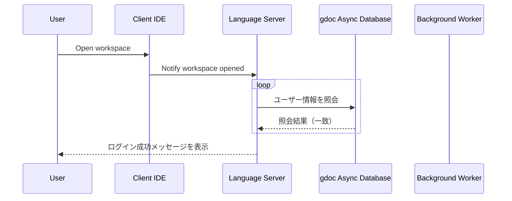

# gdoc Language Server Architecture

## Upstream Requirements

### gdoc Server Overview

### gdoc Language Server

It has three main components:

1. gdoc Language Server
   - Provides Language Server Protocol (LSP) APIs to support various language features for gdoc documents.

2. Background Worker
   - A background worker that performs various tasks related to gdoc documents, such as parsing, analyzing, and generating gdoc Objects.

3. gdoc Async Database
   - A database-like class to manage gdoc Objects and their relationships.

## Use Cases

### File editing

1. Language Server receives file editing events from the client
2. Language Server requests the Background Worker to parse the edited file
3. Background Worker parses the file and generates gdoc Objects
4. Background Worker updates gdoc Objects in the gdoc Async Database
5. Language Server receives notifications from the gdoc Async Database about changes in gdoc Objects
6. Language Server sends semantic tokens, diagnostics, and error messeges

### Parsing all documents in the workspace

1. Language Server receives a request from the client to open a workspace
2. Language Server requests the Background Worker to open the workspace
3. Background Worker opens the workspace and reads configurations (e.g., which documents to load, etc.)
4. Background Worker parses all documents in the workspace
5. Background Worker generates gdoc Objects and add them to the gdoc Async Database
6. Language Server receives notifications from the gdoc Async Database about changes in gdoc Objects
7. If there are any errors during parsing, Language Server sends diagnostics and error messeges to the client

### Edit workspace configuration file

1. Language Server receives file editing events for the workspace configuration file from the client
2. Language Server requests the Background Worker to update the workspace configuration
3. Background Worker updates the workspace configuration and re-parses the documents if necessary

## Role and Responsibilities

### Language Server

- Role:
  - Provides LSP APIs
  - Maintains workspace information
  - Submits requirements to the Background Worker
  - Gets information about gdoc Objects from the gdoc Async Database and sends appropriate responses to the client
  - Receives notifications from the gdoc Async Database and sends appropriate responses to the client

- Charactoristics:
  - Receives notification of file changes, workspace configuration changes.
    - It means that files list containd in the workspace will be maintained by the Language Server.

- Responsibilities:
  - Manage the workspace information, such as file list, workspace configuration, etc.
  - Organize the requirements, notifications, and responses between the client, Background Worker, and gdoc Async Database.
    - It's like a event and data dispatcher.

### Background Worker

- Role:
  - Background Worker should perform tasks such as compiling and linking gdoc objects.
  - Manages the server requirements in a queue and processes them simply one by one.
  - Override the previous requirements if there are multiple requirements of the same type
    - e.g., if there are multiple file editing events for the same file, only the latest one should be processed.

- Charactoristics:
  - Performs various tasks related to gdoc documents.
  - Requirements from the Language Server are sent asynchronous depending on user actions.

- Responsibilities:
  - Manage the server requirements queue and async tasks corresponding to the requirements.
  - Mutual exclusion / synchronization of the tasks so that they don't violates database consistency.
    - Locking mechanism for the database is responsibility of Async Database, but task scheduling and synchronization is responsibility of the Background Worker.

### gdoc Async Database

- Role:
  - Concurrency control for accessing gdoc Objects to prevent race conditions.
  - Provide APIs to manage gdoc Objects and their relationships.
  - Provide APIs to notify about changes in gdoc Objects to the client.

- Charactoristics:
  - Concurrency control is for asyncio tasks in other components, not for multi-threading.
  - Realized as a thin wrapper around in-memory data structures.

- Responsibilities:
  - Manage gdoc Objects and their relationships.
  - Provide APIs to notify about changes using callback functions or event emitters.

## Detailed Sequences

1. Open workspace
2. Open a file
3. Edit a file
4. Hover a symbol
5. Go to definition
6. Find references
7. Edit workspace configuration file

### Open workspace

