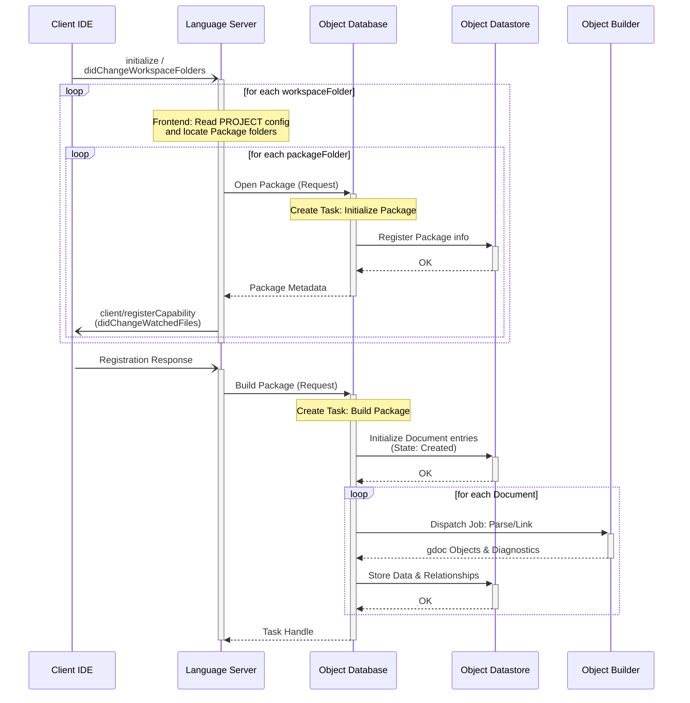

# 1. Open workspace

## Triggering events

1. [`initialize`](https://microsoft.github.io/language-server-protocol/specifications/lsp/3.17/specification/#initialize) request:
   - This is the first request sent from the client to the server.
   - The [`InitializeParams`](https://microsoft.github.io/language-server-protocol/specifications/lsp/3.17/specification/#initializeParams) contains:
     - `workspaceFolders`: A list of workspace folders currently open in the IDE. This is the primary source for defining gdoc **Projects**.
     - `rootUri` (Deprecated): The URI of the root workspace folder. Used as a fallback if `workspaceFolders` is not provided.
   - The server uses these URIs to locate `gdoc.project.json` and identify the **Project** scope.

2. [`initialized`](https://microsoft.github.io/language-server-protocol/specifications/lsp/3.17/specification/#initialized) notification:
   - Sent by the client after receiving the `initialize` response.
   - This signal indicates that the client is ready to receive requests and notifications (e.g., capability registration or diagnostics) from the server.

3. [`workspace/didChangeWorkspaceFolders`](https://microsoft.github.io/language-server-protocol/specifications/lsp/3.17/specification/#workspace_didChangeWorkspaceFolders) notification:
   - Sent when the user adds or removes folders from the workspace dynamically.
   - The server must update its internal **Project** structure and add/remove **Packages** accordingly.

## Sequence

## Notes

- Registering `DidChangeWatchedFiles` is necessary to receive notifications about file changes in the workspace, which is essential for keeping the gdoc Objects up-to-date. And it should be send before requesting to build the Package, because file changes can happen during the setup process.
  - However, as of LSP 3.17, there is no way for the client to notify the server that it has finished configuring `DidChangeWatchedFiles`. Therefore, the Worker starts building the package only after receiving a response to the registration request.
