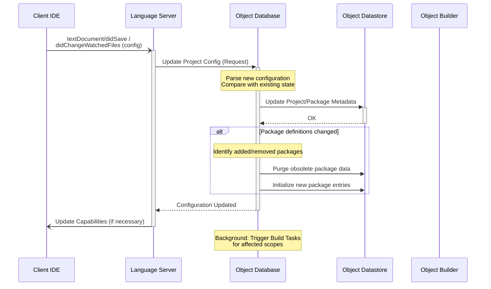

# 2. Edit Workspace Configuration File

Modifying the workspace configuration file (e.g., `gdoc.project.json`) allows for dynamic updates to the project scope, package definitions, and build settings without requiring a server restart.

## Triggering events

1. [`textDocument/didSave`](https://microsoft.github.io/language-server-protocol/specifications/lsp/3.17/specification/#textDocument_didSave) notification:
   - Triggered when the user saves changes to the configuration file within the IDE.
2. [`workspace/didChangeWatchedFiles`](https://microsoft.github.io/language-server-protocol/specifications/lsp/3.17/specification/#workspace_didChangeWatchedFiles) notification:
   - Triggered when the configuration file is modified externally (e.g., via a version control system or manual file move).

## Sequence

- [ ] ToDo: check this sequence
  - [ ] ファイル変更通知設定の更新
  - [ ] ビルドオプション変更のチェック
    - [ ] プロジェクト設定ファイルと、パッケージ設定ファイルは分離するか？
    - [ ] オブジェクトdiff？（gitのコミット間で変更点を探りたい場合）

## Notes

- **Incremental Updates**: The Object Database compares the new configuration with the current state to determine if a full re-scan is necessary or if only specific packages need to be updated.
- **Resource Cleanup**: When a package or folder is removed from the configuration, the Object Database orchestrates the cancellation of pending tasks and the removal of associated objects from the Object Datastore to free system resources.
- **Build Trigger**: Significant changes to build options (e.g., changing search paths or plugin versions) will invalidate existing objects, prompting the Object Database to issue new Jobs to the Object Builder.
