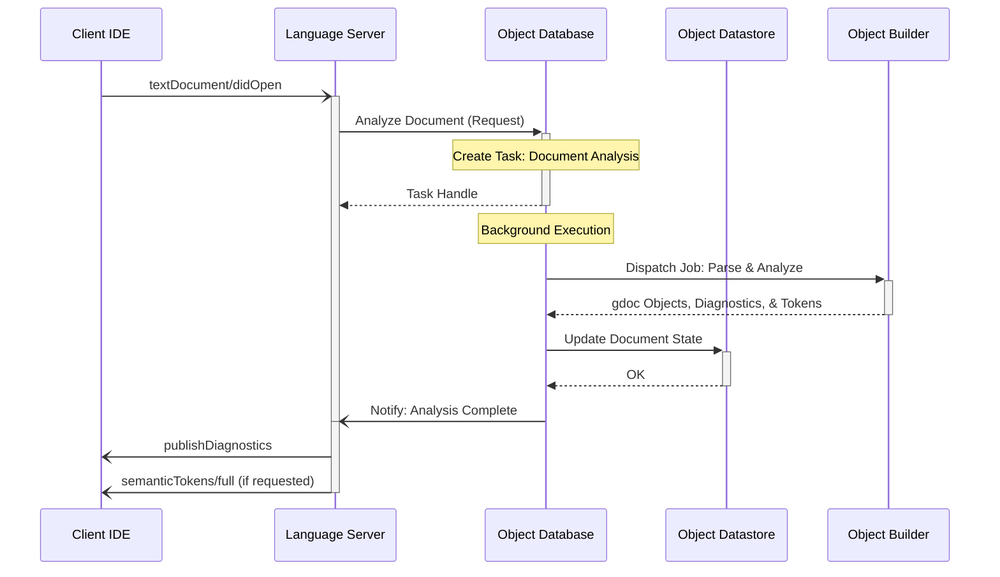
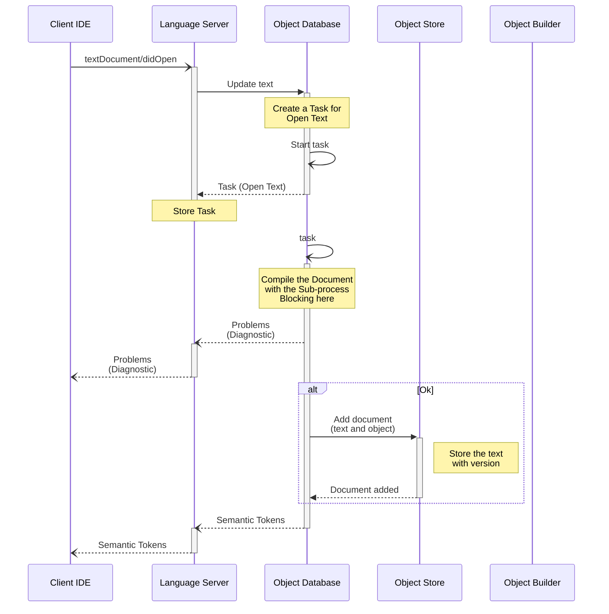

# 3. Open Text

- [ ] ToDo: Review this section

When a text document is opened, the Language Server initializes the document's internal state and triggers an analysis workflow. This process ensures that the IDE is immediately populated with diagnostics and semantic information.

## Triggering events

- The Client IDE sends a [`textDocument/didOpen`](https://microsoft.github.io/language-server-protocol/specifications/lsp/3.17/specification/#textDocument_didOpen) notification to the Language Server.

## Sequence

## Sequence (Original)

## Notes

- **Buffer Synchronization**: The Language Server passes the initial content of the document to the Object Database to ensure the Object Builder works with the latest editor buffer rather than the version on disk.
- **Priority**: Documents opened by the user are assigned high-priority Tasks to ensure low-latency feedback for diagnostics and syntax highlighting.
- **Incremental State**: The Object Datastore tracks the document version to ensure that late-arriving results from background Jobs do not overwrite newer edits.
  - [ ] Version number は、フォーマットの規定がないのでは？ どちらがより新しいか、サーバーは比較方法を知らないのでは。
