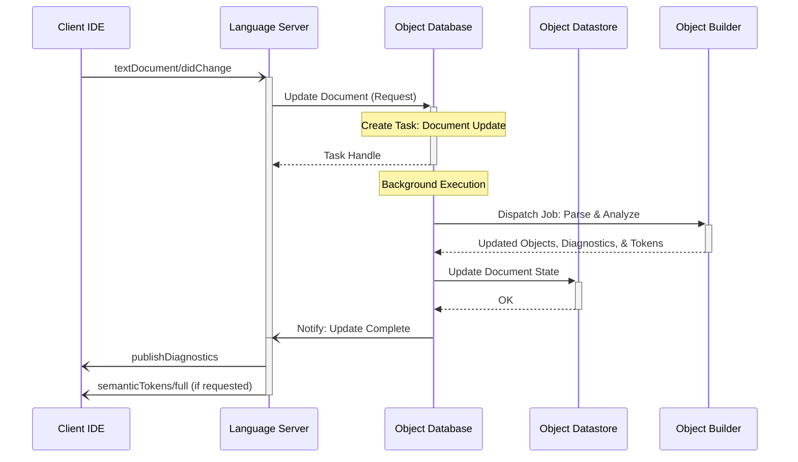
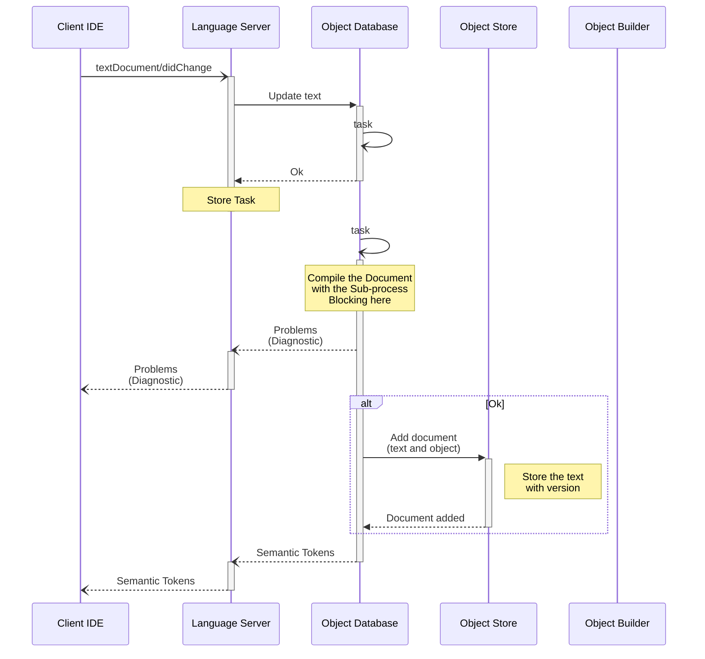

# 4. Edit Text

When a user modifies a document in the IDE, the Language Server processes the changes to ensure that the internal object model, diagnostics, and semantic information are synchronized with the latest buffer state.

## Triggering events

- The Client IDE sends a [`textDocument/didChange`](https://microsoft.github.io/language-server-protocol/specifications/lsp/3.17/specification/#textDocument_didChange) notification to the Language Server.

## Sequence

## Notes

- **Incremental Updates**: The Language Server handles both full text synchronization and incremental changes provided by the IDE, passing the updated content to the Object Database.
- **Task Preemption**: When multiple `didChange` notifications arrive in rapid succession, the Object Database may cancel stale Tasks and Jobs to prioritize the most recent version of the document.
- **Priority**: Similar to the "Open Text" scenario, edits on active documents are assigned high priority to provide near real-time feedback for diagnostics and syntax highlighting.

# 4. Edit Text (Original)

## Triggering events

- Client IDE sends [`textDocument/didChange`](https://microsoft.github.io/language-server-protocol/specifications/lsp/3.17/specification/#textDocument_didChange) notification to the Language Server.

## Sequence

