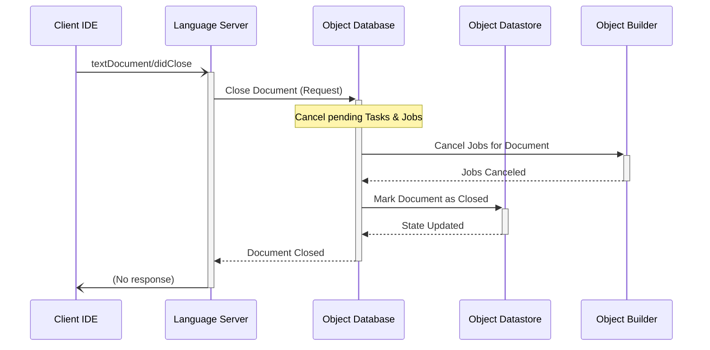
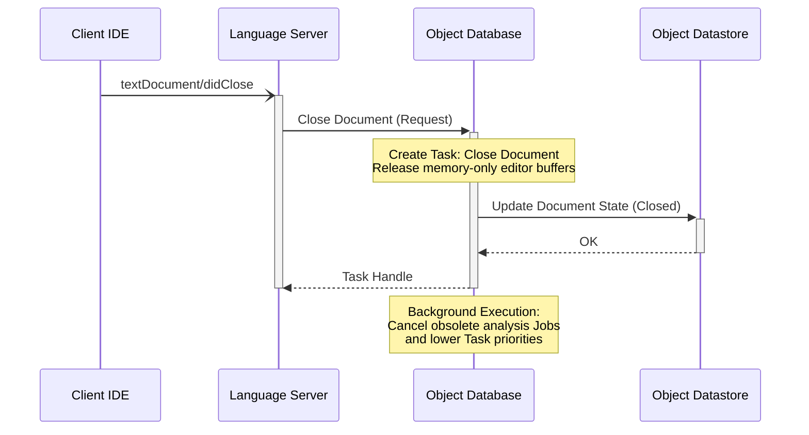
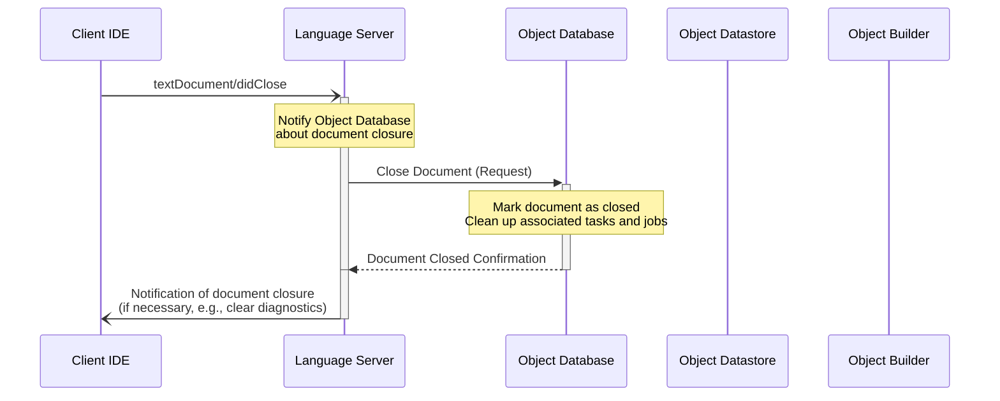

# 5. Close Text

# 5. Close Text - Qwen 3 30b

## Triggering events

- The Client IDE sends a [`textDocument/didClose`](https://microsoft.github.io/language-server-protocol/specifications/lsp/3.17/specification/#textDocument_didClose) notification to the Language Server.

## Sequence



## Notes

- **Task Cancellation**: When a document is closed, the Object Database immediately cancels all pending Tasks and Jobs related to that document to free up system resources. This is a hard cancellation that cannot be undone.
- **State Management**: The Object Datastore does not immediately delete the document's state. Instead, it marks the document as "closed" in its state, allowing for efficient re-opening without requiring a full re-parse.
- **Dependency Handling**: If other open documents reference the closed document, the Object Database does not immediately trigger re-analysis. Instead, this is handled during the next "Edit Text" or "Update Document" operation for the referencing documents.
- **Resource Optimization**: The cancellation of Tasks and Jobs for closed documents is critical for maintaining system performance, especially in large workspaces with many open files.
- **Version Tracking**: The Object Datastore maintains version information for closed documents, allowing for efficient re-opening and re-analysis when the document is later reopened. This version tracking ensures that late-arriving results from background Jobs do not overwrite newer edits.
- **Priority Adjustment**: Closing a document may cause a priority adjustment for other documents that depended on it, but this adjustment is handled during subsequent document updates rather than as an immediate consequence of closing.

# 5. Close Text - Gemma4:31b

When a user closes a document in the IDE, the Language Server ensures that the internal state is updated and that any resources dedicated to that specific document are released or downgraded in priority.

## Triggering events

The Client IDE sends a textDocument/didClose notification to the Language Server.

## Sequence

```marmaid
sequenceDiagram
  participant IDE as Client IDE
  participant LS as Language Server
  participant ODB as Object Database
  participant OBJ as Object Datastore

  IDE -) +LS: textDocument/didClose
    LS ->> +ODB: Close Document (Request)
      Note over ODB: Identify active Tasks/Jobs<br/>associated with the document
      ODB ->> ODB: Cancel pending Analysis Tasks
      ODB ->> +OBJ: Mark document as closed/inactive
      OBJ -->> -ODB: OK
      ODB -->> -LS: Close Confirmed
    deactivate LS
```

## Notes

- **Task Cancellation**: Any pending high-priority Tasks specifically triggered by the user's interaction with the open editor (e.g., a pending "Analyze Document" task for a file that is no longer visible) are canceled to free up worker threads.
- **State Transition**: The document is not necessarily purged from the Object Datastore immediately. Instead, its priority is downgraded from "Open" (State 2) to "Package Member" (State 3) or "Workspace File," ensuring that the server does not waste resources on active analysis while still allowing for fast re-opening.
- **Resource Management**: If the Project configuration indicates that the document is no longer part of any active package, the Object Database may trigger a full cleanup of the associated gdoc Objects from the Datastore.

# 5. Close Text - Gemini flash latest

When a text document is closed in the IDE, the Language Server updates its synchronization state and triggers cleanup actions to free up system resources and adjust analysis priorities.

## Triggering events

- The Client IDE sends a [`textDocument/didClose`](https://microsoft.github.io/language-server-protocol/specifications/lsp/3.17/specification/#textDocument_didClose) notification to the Language Server.

## Sequence



## Notes

- **Buffer Release**: The document's memory-buffered state (representing unsaved editor content) is released. The server falls back to monitoring the on-disk file representation.
- **Priority Re-evaluation**: Because the document is no longer open, any active analysis Tasks or Jobs for this document are either cancelled or downgraded to low priority (unless the document is still transitively referenced by another open file).
- **Diagnostics Lifecycle**: Diagnostics for documents belonging to an internal package are preserved when closed, whereas diagnostics for temporary or external files outside the workspace project scope are cleared.

# 5. Close Text - Qwen 2.5 Coder 14b

## Triggering events

- The Client IDE sends a [`textDocument/didClose`](https://microsoft.github.io/language-server-protocol/specifications/lsp/3.17/specification/#textDocument_didClose) notification to the Language Server.

## Sequence



## Notes

- **Cleanup**: When a text document is closed, the Language Server informs the Object Database to mark it as closed and clean up any associated tasks or jobs.
- **Notifications**: The Language Server can notify the client IDE of the closure if necessary (e.g., clearing diagnostics related to the closed file).

