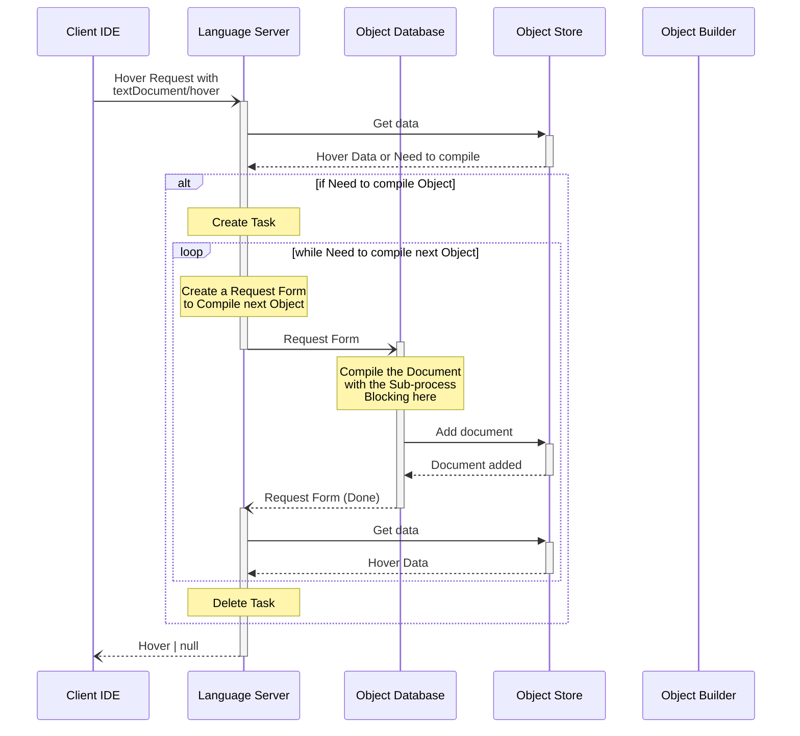

# 8. Hover Request

## Triggering events

> The [`Hover Request`](https://microsoft.github.io/language-server-protocol/specifications/lsp/3.17/specification/#textDocument_hover) is sent from the client to the server to request hover information at a given text document position.

## Sequence

