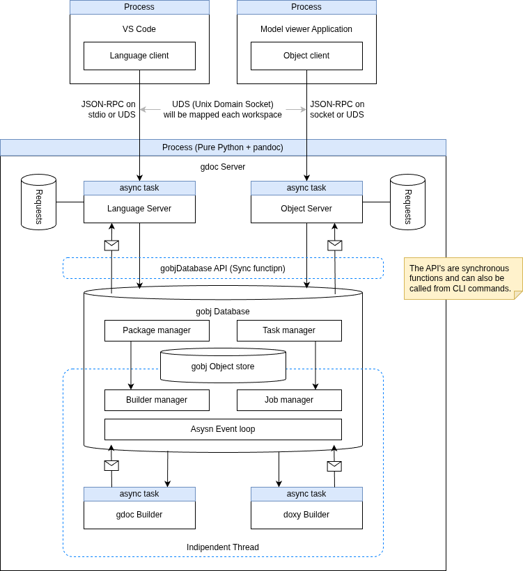

# gdoc Server Architecture

gdoc Server provides two types of servers: a language server and an object server.

1. Language Server
   - Provides server features compatible with LSP 3.17.0
2. Object Server
   - Provides APIs for accessing and manipulating gdoc objects.

In the current version of gdoc Server, changes to objects can only be made from the language server.

This document describes the architecture of gdoc Server, specifically its structure as a language server, the roles of each component, and how they work together. While an Object Server is planned for the future, it is intended to be implemented in a way that replaces the front-end of the language server.

## Overview

### Structure

#### Language Server

It has four main components:

1. gdoc Language Server
   - Provides Language Server Protocol (LSP) APIs as a frontend component.
   - This component will be implemented using Python's async.

2. gdoc Object Database
   - Provides Object Database APIs that performs various task management related to gdoc documents, such as parsing, analyzing, and generating gdoc Objects.

3. gdoc Object Datastore
   - A database-like class to manage gdoc Objects and their relationships.
   - This component is an internal component of the gdoc Object Database and cannot be accessed from outside.

4. gdoc Object Builder(s)
   - Provide APIs that parses target files, resolve links and building packages.
   - Different Builders are provided as plugins for each type of target package.

#### Object server

It replaces the gdoc Language Server component, which is the frontend of the language server, with a gdoc Object Server frontend component.

The rest of the configuration is the same as the Language Server.

### Behavior

When the language‑server client sends a text‑edit notification, the gdoc server behaves as follows.

1. gdoc Language Server receives text editing events from the client.
2. gdoc Language Server requests gdoc Object Database to parse the edited text.
3. gdoc Object Database create a plan and return the task ticket to Language Server.
4. gdoc Object Database isuse a job ticket to parses the text for gdoc Object Builder.
5. gdoc Object Builder parses the text and return to gdoc Object Database.
6. gdoc Object Database updates gdoc Objects in gdoc Object Datastore.
7. gdoc Language Server receives notifications from the gdoc Object Database about changes in gdoc Objects
8. gdoc Language Server gets semantic tokens, diagnostics, and error messages from gdoc Object Database and sends them to the client.

## Key Abstractions

### Logical Hierarchy: Workspace, Project, and Package

The gdoc server organizes resources into a hierarchical structure to manage scopes and dependencies effectively:

- **Project**: Represents the root organizational unit, mapping 1:1 to a VSCode **Workspace**. It serves as the top-level container for configuration and resource management.
- **Package**: The fundamental unit of content and distribution. A Project can contain multiple internal packages (e.g., a `gdoc` documentation package and a `doxml` source code package).
- **External References**: Projects can import and reference external packages, allowing for cross-project linking and resource sharing.

### Execution Model: Request, Task, and Job

To ensure high responsiveness and efficient resource utilization, gdoc utilizes a tiered execution abstraction:

- **Request**: An external interaction initiated by a client (e.g., an LSP command or an Object API call). Frontends are responsible for translating these protocol-specific messages into internal representations.
- **Task**: The primary unit of internal orchestration. Tasks are protocol-agnostic and represent a logical operation (e.g., "Analyze Document"). The Object Database manages the lifecycle, priority, and cancellation of Tasks.
- **Job**: The atomic unit of execution. A Task is decomposed into one or more Jobs (e.g., *Parse*, *Link*, *Compile*). Jobs are dispatched to Object Builders and executed based on available system resources and dependency constraints.

## Structure: Role and Responsibilities

### Overview

### 1. gdoc Language Server

- Role:
  - Acts as the LSP-compliant **Frontend**, providing the primary interface for IDE clients.
  - Translates protocol-specific messages (LSP) into internal **Requests** for orchestration by the gdoc Object Database.
  - Manages the lifecycle of the LSP session (Initialize, Shutdown, etc.).

- Characteristics:
  - **High Responsiveness**: Leverages Python's `asyncio` to handle concurrent client I/O without blocking internal processing.
  - **Stateful Protocol Handler**: Maintains the mapping between client-side URIs and internal document/package identifiers.
  - **Event-Driven**: Reacts to file system changes and workspace configuration updates to maintain **Project** integrity.

- Responsibilities:
  - **Project & Package Scoping**:
    - Monitors the workspace root to define the **Project** scope using configuration files (e.g., `gdoc.project.json`).
    - Identifies and tracks internal **Packages** and their dependencies within the Project.
  - **Request Translation**:
    - Converts LSP-specific calls (e.g., `textDocument/hover`) into unified internal **Requests**.
    - Initiates corresponding **Tasks** in the Object Database to trigger necessary analysis or data retrieval.
  - **Asynchronous Feedback**:
    - Dispatches diagnostics, semantic tokens, and error messages generated during **Job** execution back to the client as LSP notifications.
  - **Document Synchronization**:
    - Synchronizes IDE editor buffers via `didOpen`, `didChange`, and `didClose`, triggering background **Tasks** to ensure the Project state remains consistent with user edits.

### 2. gdoc Object Database

- Role:
  - Acts as the central orchestrator for document analysis workflows (Parse -> Link -> Analyze).
  - Provides a stable interface for **Frontends** to submit **Requests** and monitor their progress.
  - Manages the decomposition of **Requests** into protocol-agnostic **Tasks** and atomic **Jobs**.
  - Saved and managed the generated object data in the Object Datastore.

- Characteristics:
  - **Threaded Execution**: Operates in a dedicated background worker thread to ensure that computationally intensive analysis does not block the Frontend's high-responsiveness I/O loop.
  - **Internal Async Orchestration**: Uses an internal `asyncio` event loop within its worker thread to manage concurrent **Tasks** and **Jobs** efficiently.
  - **Plugin Host**: Provides the execution environment and lifecycle management for **gdoc Object Builders**, which are integrated as plugins.
  - **Synchronous API for Frontends**: Exposes thread-safe synchronous methods to Frontends, abstracting the internal asynchronous and multi-threaded complexity.

- Responsibilities:
  - **Task Scheduling & Prioritization**: Dynamically manages the execution order of **Tasks** based on user focus (e.g., open documents) and dependency requirements.
  - **Cancellation**: Aborts obsolete **Tasks** and their associated **Jobs** when newer document versions or conflicting **Requests** arrive.
  - **Dependency Graph Management**: Tracks relationships between documents within **Packages** to identify affected scopes when a dependency changes, ensuring the **Project** state remains consistent.

### 3. gdoc Object Datastore

- Role:
  - Acts as the internal storage engine for the **Object Database**, managing the state of **Packages** and **Documents**.
  - Serves as the primary repository for generated object data and their cross-document relationships within a **Project**.

- Characteristics:
  - **Synchronous Implementation**: Composed entirely of synchronous functions to ensure predictable, low-latency data operations.
  - **Encapsulated Component**: Completely hidden from **Frontends** and external components; it is accessible only via the **Object Database**.
  - **No Internal Concurrency Control**: Does not implement its own locking or thread-safety mechanisms. Exclusive access and synchronization are managed externally by the **Object Database**.
  - **In-Memory Storage**: Realized as a collection of optimized in-memory data structures.

- Responsibilities:
  - **Data Persistence**: Stores and manages the lifecycle of gdoc objects and metadata produced by **Jobs**.
  - **Relationship Mapping**: Maintains the physical integrity of links and dependencies between objects.
  - **State Retrieval**: Provides fast lookup capabilities for the **Object Database** to resolve symbols and project structures.

### 4. gdoc Object Builder

- Role:
  - Acts as the execution engine for atomic **Jobs** (Parse, Link, Compile), managing their lifecycle and execution state.
  - Coordinates Job execution when requested by multiple **Tasks** (e.g., from both the Language Server and Object Server).
  - Provides domain-specific logic for different package types and document formats as a plugin.

- Characteristics:
  - **Job Deduplication & Multi-tasking**: If multiple Tasks request the same Job (e.g., parsing the same file), the Builder manages it as a single unit of work shared by those Tasks.
  - **Priority Inheritance**: A Job dynamically inherits the highest priority among all the Tasks currently requesting it.
  - **Reference-based Cancellation**: A Job remains active as long as at least one requesting Task is still alive. It is only canceled when all associated Tasks have been canceled or removed.
  - **Plugin-Based Architecture**: Different builders are implemented for specific content types (e.g., `gdoc`, `doxml`).

- Responsibilities:
  - **Execution Management**: Maintains a registry of active Jobs, tracking which Tasks are waiting for which results.
  - **Content Parsing & Transformation**: Converts raw source content into structured **gdoc Objects** and generates metadata (Semantic Tokens, Symbols).
  - **Diagnostic Generation**: Identifies syntax and semantic errors during the build process to be reported as LSP diagnostics.
  - **Resource Optimization**: Prevents redundant processing by identifying overlapping Job requirements across different Frontends.

## Behaviour: LSP Detailed Sequences

### Scenario Categories

#### Lifecycle Management

- Open Workspace
- Edit Workspace Configuration File

#### Document Synchronization & Updates

- Open Text
- Edit Text
- Close Text
- Update Document
- Bulk File Changes (e.g., Git branch switch)

#### Information Retrieval (Read-only)

- Hover Request
- Go to Definition
- Find References
- Document / Workspace Symbols

#### Dynamic Assistance

- Code Completion

#### Refactoring

- Rename (textDocument/rename)

## Detailed Design Guidelines

### Workspace, Project And Package

### Task Management

#### Priority

1. LSP messages from the client IDE
   - Messages from the client must be handled with the highest priority
   - However, avoid implementing complex processing to keep execution time to a minimum
2. Tasks to resolve LSP requests from the client IDE
   - If responding to an LSP request requires more complex processing, these tasks should be executed after the initial handling of the LSP messages to ensure that the server remains responsive to the client.
3. Tasks to update gdoc Objects in the Object Database
   - These tasks can be executed with lower priority as they are not directly related to responding to the client IDE's requests.
   - However, they should still be executed in a timely manner to ensure that the gdoc Objects are up-to-date for any subsequent LSP requests that may require information from the Object Database.
   - The priority is as follows:
     1. Compile and link documents referenced by open text files
     2. Compile and link documents referenced by the unopened referenced documents mentioned above
     3. Following the above, compile and link the referenced documents in the order of their reference levels from the open text
     4. Documents that are neither open nor referenced are compiled and linked last.

#### Task Scheduling

##### Overview

- Tasks managed by gdoc Object Database are those of priority 2 and later in the list above.
- The priority changes every time an LSP message is received (i.e., every time the user interacts with the client IDE). Priority adjustment is performed while processing item 1 above.
- For example, a definition lookup task requested for hover display decreases in priority when the user performs actions such as editing a different file.

##### Scheduling Method

###### Dependency States

1. Active client requests (not cancelled)
   - Documents required by the requests increase in priority, regardless of whether they are open or not.

2. Open text documents
   - If a text document is closed, requests that assume the text document is open are cancelled (e.g., hover information for a closed file is no longer used).
   - Documents referenced by an open text document increase in priority, regardless of whether they are open or not.

3. Part of a package
   - Documents included in a package have higher priority than those that are in the workspace but not part of any package.
   - Changes to the package settings in the workspace (project) root configuration file can alter this state.
     - Changes to configuration files are not affected by changes to open text documents and are only reflected upon saving.

###### State-based Scheduling

- Every document in the workspace has state variables corresponding to the conditions above.
  - When a request is received from the client, the involved document enters state 1.
  - When state 1 is cleared, the task is rescheduled based on the priority determined by state 2 or 3.

- Note(1):
  - If multiple requests require a single document, the document remains in state 1 until all requests are cancelled.

- Memo:
  - A single request may require multiple referenced documents:
    - In many cases, it is not possible to determine if there are subsequent referenced documents without compiling and linking the first referenced document.
    - In other words, the referenced documents required by the request become sequentially apparent during request processing.
  - As an exception, when all references to a certain object are requested, it is necessary to complete all compilations and links of 2.
  - Task scheduling is managed per client.
    - There is one LSP client, but there may be multiple object database clients.

#### Task and Subtask

- A single request always corresponds to a single task. Processing tasks such as compilation and linking required within a task are managed as subtasks.
  - A single task can contain multiple subtasks.

- Tasks correspond to requests from clients, including both requests from the LSP client and requests from the Object Database client.
  - Therefore, task management is divided into parts that differ by client type and parts that are common to all clients.
  - The common part is priority management. The gdoc server provides an abstract class implementing only this common part and concrete classes implementing the parts that differ by client type.
