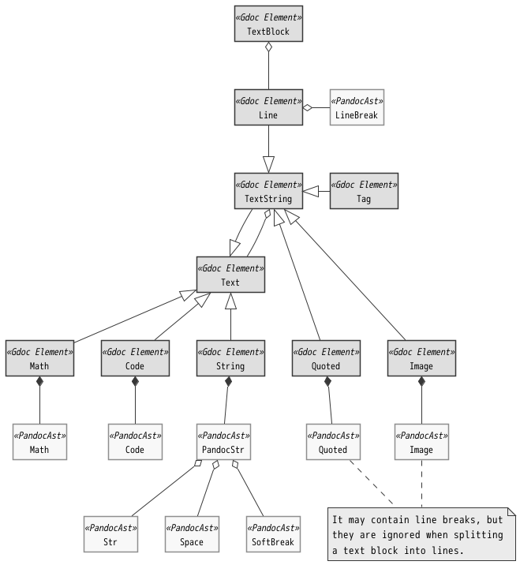

*<div align=right><small>
[@^ doctype="gdoc 0.3" class="specification:"]
</small></div>*

# \[@ gdml\] Gdoc Markup Language

***@Summary:***  \
gdocは、gdoc markup Languageでタグ付けされた文書から情報を収集し、構造化オブジェクトを生成する。
gdocサブコマンドはその構造化オブジェクトを参照してユーザーアプリケーションを提供する。
この構造化オブジェクトをGdoc Objectと呼ぶ。  \
本書はGdoc Objectの基本構造とgdoc markup languageの定義を行う。
そしてPandocASTの構文解析を行う際のルールを定義する。

<br>

## TABLE OF CONTENTS <!-- omit in toc -->

- [1. INTRODUCTION](#1-introduction)
- [2. [@ o] GDOC OBJECT](#2--o-gdoc-object)
  - [2.1. GdObject Classes](#21-gdobject-classes)
    - [2.1.1. Parent-Child Relationship](#211-parent-child-relationship)
    - [2.1.2. Id And Namespace](#212-id-and-namespace)
    - [2.1.3. Name Resolution And Long Id](#213-name-resolution-and-long-id)
    - [2.1.4. Properties](#214-properties)
    - [2.1.5. Class](#215-class)
    - [2.1.6. Object Link](#216-object-link)
  - [2.2. GdObject Json File](#22-gdobject-json-file)
- [3. [@ p] PRELIMINARIES](#3--p-preliminaries)
  - [3.1. [@ f] Input File Format](#31--f-input-file-format)
    - [3.1.1. Version](#311-version)
    - [3.1.2. Generating PandocAST](#312-generating-pandocast)
  - [3.2. PandocAST From GDML's View](#32-pandocast-from-gdmls-view)
    - [3.2.1. PandocAST Element Types](#321-pandocast-element-types)
    - [3.2.2. Document Structure](#322-document-structure)
      - [3.2.2.1. Section](#3221-section)
      - [3.2.2.2. ListBlock](#3222-listblock)
      - [3.2.2.3. Object Section](#3223-object-section)
  - [3.3. Gdoc Tag Types](#33-gdoc-tag-types)
    - [3.3.1. Block tag](#331-block-tag)
      - [3.3.1.1. Object Tag](#3311-object-tag)
      - [3.3.1.2. Caption Tag](#3312-caption-tag)
      - [3.3.1.3. Section Tag](#3313-section-tag)
      - [3.3.1.4. Shortcut Tag](#3314-shortcut-tag)
    - [3.3.2. Table tag](#332-table-tag)
      - [3.3.2.1. Range And Top Cell](#3321-range-and-top-cell)
    - [3.3.3. Inline tag](#333-inline-tag)
  - [3.4. [@ i] Id](#34--i-id)
    - [3.4.1. Id / Short Id](#341-id--short-id)
    - [3.4.2. Long Id](#342-long-id)
    - [3.4.3. Name Resolution](#343-name-resolution)
    - [3.4.4. Id Tag](#344-id-tag)
    - [3.4.5. 仮： Reference](#345-仮-reference)
- [4. [@ r] PARSING RULE DETAILES](#4--r-parsing-rule-detailes)
  - [4.1. Retrieving Blocks](#41-retrieving-blocks)
    - [4.1.1. Div Block](#411-div-block)
    - [4.1.2. BulletList/OrderedList](#412-bulletlistorderedlist)
    - [4.1.3. Block Types And Tag Types](#413-block-types-and-tag-types)
  - [4.2. Parsing A Text Block](#42-parsing-a-text-block)
    - [4.2.1. Data Structure](#421-data-structure)
      - [4.2.1.1. PandocAST Inline Elements](#4211-pandocast-inline-elements)
      - [4.2.1.2. Data Structure From GDML Parspective](#4212-data-structure-from-gdml-parspective)
    - [4.2.2. Split to lines](#422-split-to-lines)
    - [4.2.3. Detecting tags](#423-detecting-tags)
      - [4.2.3.1. Range Tags Will Be Detected In](#4231-range-tags-will-be-detected-in)
      - [4.2.3.2. Detecting tags](#4232-detecting-tags)
    - [4.2.4. Collecting Tag Info](#424-collecting-tag-info)
      - [4.2.4.1. Class And Params](#4241-class-and-params)
      - [4.2.4.2. Additional Params](#4242-additional-params)
      - [4.2.4.3. Opt Strings](#4243-opt-strings)
    - [4.2.5. Creating Objects](#425-creating-objects)
  - [4.3. Parsing A Table](#43-parsing-a-table)
    - [4.3.1. Getting A Cell](#431-getting-a-cell)
    - [4.3.2. Detecting Top Tag](#432-detecting-top-tag)
    - [4.3.3. Collecting Tag Info](#433-collecting-tag-info)
      - [4.3.3.1. Class And Params](#4331-class-and-params)
      - [4.3.3.2. Opt Strings](#4332-opt-strings)
    - [4.3.4. Parsing The Table Structure](#434-parsing-the-table-structure)
  - [4.4. Parsing A Tag](#44-parsing-a-tag)
    - [4.4.1. Classes](#441-classes)
    - [4.4.2. Parameters](#442-parameters)
- [5. CREATING OBJECTS](#5-creating-objects)
  - [5.1. Specify The Class](#51-specify-the-class)
    - [5.1.1. Fully Qualified Class Name](#511-fully-qualified-class-name)
    - [5.1.2. Omitted Class Name](#512-omitted-class-name)
      - [5.1.2.1. Omitted Category](#5121-omitted-category)
      - [5.1.2.2. Omitted Type](#5122-omitted-type)
      - [5.1.2.3. Omitted Caegory and Type](#5123-omitted-caegory-and-type)
  - [5.2. Calling The Constructor](#52-calling-the-constructor)
  - [5.3. Registering Objects](#53-registering-objects)
- [6. PACKAGE](#6-package)
  - [6.1. File](#61-file)
  - [6.2. Folder](#62-folder)
  - [6.3. Name Resolution](#63-name-resolution)
    - [6.3.1. Relative Path](#631-relative-path)
    - [6.3.2. Package Search Paths](#632-package-search-paths)
- [7. BASIC CLASSES](#7-basic-classes)
  - [7.1. Gdoc](#71-gdoc)
    - [7.1.1. Types](#711-types)
      - [7.1.1.1. Package](#7111-package)
      - [7.1.1.2. Document](#7112-document)
      - [7.1.1.3. Section](#7113-section)
      - [7.1.1.4. TextBlock → SimpleObject](#7114-textblock--simpleobject)
      - [7.1.1.5. Property(Inline tag)](#7115-propertyinline-tag)
      - [7.1.1.6. Table → \[SimpleObject\]](#7116-table--simpleobject)
      - [7.1.1.7. SimpleObject](#7117-simpleobject)
      - [7.1.1.8. Import / Access → Shortcut](#7118-import--access--shortcut)
      - [7.1.1.9. Link / Ln / `&` → Shortcut](#7119-link--ln----shortcut)
      - [7.1.1.10. ^ → Parent](#71110---parent)
      - [7.1.1.11. Caption / List / Table](#71111-caption--list--table)
      - [7.1.1.12. Fig](#71112-fig)
      - [7.1.1.13. Ignore / `#`](#71113-ignore--)
      - [7.1.1.14. (Common Properties)](#71114-common-properties)
    - [7.1.2. Example](#712-example)
  - [7.2. Sys](#72-sys)
    - [7.2.1. Types](#721-types)
      - [7.2.1.1. Requirement](#7211-requirement)
      - [7.2.1.2. Test](#7212-test)
      - [7.2.1.3. Block](#7213-block)
  - [7.3. GSN](#73-gsn)
    - [7.3.1. Types](#731-types)
      - [7.3.1.1. Goal / G](#7311-goal--g)
      - [7.3.1.2. Strategy / St](#7312-strategy--st)
      - [7.3.1.3. Context / C](#7313-context--c)
      - [7.3.1.4. Solution / Sn](#7314-solution--sn)

<br>

## 1. INTRODUCTION

## 2. [@ o] GDOC OBJECT

***@Summary:***  \
文書から抽出される情報はすべてオブジェクトであり、そのオブジェクトは相互の親子関係とプロパティを持つ。
Objectはそれぞれ短いidを持つが、自分自身のidと先祖のidを'.'で連結した長いidを用いて他名前空間のオブジェクトへアクセスすることができる。
Gdoc Objectの基本コンセプトは、この親子関係とidによる名前解決、プロパティである。  \
またアプリケーションのニーズに基づいてGdObjectを継承した個別のクラスが導出される。
Classは、カテゴリとそのカテゴリに属するオブジェクトタイプにより特定される。

本パートでは、gdoc markup Languageを定義する前提となる、この３つのコンセプトとクラスについて定義する。
Gdoc OBjectの詳細や実装については言及しない。

### 2.1. GdObject Classes

GdObjectの概念説明用クラス図を以下に示す。

<br>

<div align=center>

[](./GdocMarkupLanguage.puml)  \
[@fig 1.1] GdObject Class

</div>

<br>

Gdoc Objectの全てのオブジェクトはGdObject Classから派生する。
たとえば要件定義書のそれぞれの要件はGdObjectであり、文書階層構造の要素であるセクションもGdObjectである。
そしてセクションもまたGSNのGoalやStrategyなどのように、その役割・位置づけによる特性・Propertyを持つクラスとして派生される。

#### 2.1.1. Parent-Child Relationship

オブジェクトは、１つの親への参照と０個以上の子への参照を持ち、これによりツリー構造を形成する。

#### 2.1.2. Id And Namespace

GdObjectはidを持つ。
あるGdObjectを親に持つ複数の子オブジェクトは、それぞれ固有のidを持つ。
つまり、全てのオブジェクトは名前空間として機能する。

子のidは明示的な操作をしない限り子は登録順に並ぶ。

登録に際し、idに対して Public / Private の属性を付与できる。
Private Idは、名前空間の外（親）からは参照することができない。
子オブジェクトからは参照できる。

id文字列に、`.`は使用できない。

- idに使用可能な文字は、Python識別子に使用可能な文字と同じ。
  - [『 大文字と小文字の A から Z、アンダースコア _、先頭の文字を除く数字 0 から 9  』](https://docs.python.org/3/reference/lexical_analysis.html#identifiers)

  - > [文字列が識別子として有効か確認: `isidentifier()`](https://note.nkmk.me/python-identifier-naming-rule/)

  - ただし、先頭が数字であってもよい。数字のみのidも許可される。

このidを、名前解決の観点からShort Idと呼ぶことがある。

#### 2.1.3. Name Resolution And Long Id

ある名前空間においてオブジェクトをidで検索するとき、名前空間内にオブジェクトが見つからなかった場合は親の名前空間からオブジェクトを検索する。
これは、文書の最上位名前空間に到達するまで繰り返される。

名前空間の階層を含めてオブジェクトを指定する場合には、上位オブジェクトから下位オブジェクトまでのidを'.'で連結して `GrandParentId.ParentId.ChildId` のように表す。
これをLong Idと呼ぶ。

Long Idは必ずしもルートオブジェクトから始まる必要はなく、名前解決可能な長さがあればよい。  \
*@eng:* The Long Id does not necessarily have to start with the root object, but only has to be long enough to allow name resolution.

- 明示的にルートオブジェクトからのLong Idを指定したい場合、ファイルそのものを示すIdとして `_.gdmn.as.3.1` のように `_` を使用することができる。
- [ ] _によるルートオブジェクト指定ではなく、単に `.` を付与してルート始まりを示すアイデアもあるが、mdでは.始まりが視認しづらいため、どちらにするか決める。'@copy: .gdmn.as.3.1'

#### 2.1.4. Properties

オブジェクトは、固有のプロパティを保持することができる。
プロパティは、key-value形式でデータを保持する辞書として構成される。
プロパティ名も文字列だが、オブジェクトidとは異なる独立した名前空間で管理される。

- keyに使用可能な文字列は、idと同じ（空文字列は使用できない）。
- 値として配列をもつことができる。
- 値は、json としてエクスポート可能なもののみ。
  プロパティは常に、json形式でエクスポート可能。
- あるKeyは、Subkeyで指定される子プロパティを持つことができる。
- Keyは、自身の値をもち、且つ同時に子を持つことができる。

  以下は理解のための概念Code.

  ```js
  prop.key = 1
  prop.key.subkey = 2
  prop.key.array = [3, 4]

  prop --> {
    "key": {
      "": 1,          // 空文字列の名前は、Key自身の値を示す。
      "subkey": 2
      "array": [3, 4]
    }
  }
  ```

プロパティの値は、タグの付与された文書要素、タグに付与されたパラメータによって決まる。

#### 2.1.5. Class

Classは、CategoryとTypeで特定される。

アプリケーションごとのニーズに応じてカテゴリは追加され、実装上はプラグインとしてgdco本体とは別に管理される場合がある。

このため GdObject は、クラス情報として Category と Type に加え、プラグインの Version を保持する。

#### 2.1.6. Object Link

参照のみ可能なリンクと、子・属性を追加可能なリンクとがある。

1. 参照のみ

   import/access

   - import したオブジェクトを参照すると、下記の通り子の追加が可能になる？ それも禁止する？ 理解できるか？

2. 子・属性追加可能

   クラス指定への`&`付与

   - 子の追加は可能だが、プロパティの追加は不許可にしたい。

   - 参照宣言時のプロパティ指定はあくまで引用であって、オリジナルと異なる、
   あるいはオリジナルに存在しないプロパティはエラーとする。という考え方でどうか。

### 2.2. GdObject Json File

GdObjectは、json形式でエクスポートできる。

- Children に、参照ではなくオブジェクトそのものが展開される。
- Property の全ての要素が、Dict / Array で展開される。
- Class に、カテゴリ、タイプ、バージョン情報が出力される。
- PandocAST オブジェクトとのリンクは切れ、ソースマッピング情報も失われる。
- ただし、ソースファイル名は保持される。

GdObjectは、エクスポートされたjsonをインポートして再現することができる。

## 3. [@ p] PRELIMINARIES

### 3.1. [@ f] Input File Format

gdocは、PandocASTフォーマットのjsonデータを入力とする。

#### 3.1.1. Version

```
"pandoc-api-version": [1, 22]
```

- https://hackage.haskell.org/package/pandoc-types-1.22/docs/Text-Pandoc-Definition.html

- version 1.22 でない場合、gdocは警告を出力して処理を続行する。

#### 3.1.2. Generating PandocAST

- gfmをメインターゲットとする。

- `pandoc -f gfm+sourcepos -t html | pandoc -f html -t json`

  `+sourcepos` オプションによる、ソースマッピング情報に対応する。

  一旦htmlを経由することで、`<br>` をLineBreakとして解釈するなど埋め込まれたhtmlによる記述をPandocAst要素として取り込む。

  - 現在 `+sourcepos` に対応しているのは gfm と commonmark のみであり、commonmark はテーブルに対応しない。
  - 他のタイプでも動作するが、完全なテスト（特にgfmに存在しない要素タイプのテスト）は行っていない。

- [ ] +sourcepos による振る舞いの違い（todoリストなど）、どこかに記述できる場所をつくる。

### 3.2. PandocAST From GDML's View

#### 3.2.1. PandocAST Element Types

Pandoc AST は、以下のような要素タイプを持ち、DOMに近いものになっている。

1. Block Element Types

   PandocASTにおいて、文書全体はブロックのリストである。

   ブロックは種別をもち、そのブロック自身がブロックのリストを構成するものもある。

   Para, plane, Table, OrderedList, BulletList, Headerなど。

2. Inline Element Types

   Paragraph, Planeのコンテンツは、Inline要素のリストである。

   Inline要素は種別をもち、Inlineのリストを構成するものがある。
   デコレーターも、このインライン要素のリストを構成するインライン要素である。

   Str, Space, LineBreak, Strong, Emphasis, Codeなど。

#### 3.2.2. Document Structure

Pandoc AST is a great data structure for format conversion, but it is a bare data structure that is not necessarily intuitive for human reading and writing.

Therefore, GDML covers Pandoc AST with a thin abstract concept and considers a document as the following structure.

This is called the Gdoc data structure, and a document that follows this structure is called a Gdoc.

GDML is a markup language for Gdoc documents.

<br>
<div align=center>

[](./GdocMarkupLanguage.puml) \
\
[@fig 1.1] Gdoc Data Structure

</div>
<br>

Gdoc Markup Notation では便宜上、Header, Para, Plane, LineBlock の４タイプを、テキストブロックと呼ぶ。

- 装飾が無視されること、Strikeout は無視されること、などを例示する。

##### 3.2.2.1. Section

Headerで区切られ階層化した論理的なブロックリストを Sectionと呼ぶ。

Pandoc ASTのデータ構造に Section の概念はない。
ブロックリストは階層化しない一次配列であり、Headerブロックもまたその要素の１つである。

gdocはHeaderブロックをセクションの開始とみなして、階層化したブロックリスト構造として扱う。

##### 3.2.2.2. ListBlock

ListBlockには、Pandoc ASTのBulletListとOrderedListとがある。
リストの各項目は、それぞれブロックのリストで構成される。

gdocは、ListBlockに対するタグ（キャプションタグ）が付与されていない限り単に階層化したBlockListとみなし、解析中にはこの階層を再帰的に解析対象とみなす。

つまり、Section も ListBlock も、Gdoc にとっては階層化したBlockListである。

*@eng:*  \
In other words, "Sections" and "ListBlock" are both hierarchical BlockLists for Gdoc.

##### 3.2.2.3. Object Section

Sectionあるいはリストアイテムのうち、先頭ブロックにタグを付与されたものは GdObject が生成され、名前空間を提供するなどオブジェクトのコンテクストとして機能する。

Gdoc では、このコンテクスト空間を Object Section とよび、空間を構成する GdObject を Section Object と呼ぶ。

- [ ] 以下、適切な場所へ移動する

> Object Section は、以下の機能をもつ。
>
> 1. 名前空間の提供
>
>    文書中に付与されたtagによりGdObjectが生成されるとき、そのタグが所属する Object Section が親となる。
>    生成されるオブジェクトの id は、この親オブジェクトのなかで一意になる。
>
> 2. デフォルトカテゴリの指定
>
>    tag で指定する Class について、デフォルトのカテゴリ情報を保持する。
>    Class にタイプだけが指定された場合、以下のように特定される。
>
>    1. Object セクションが保持するデフォルトカテゴリから探す。
>    2. 見つからない場合、上位のObject Sectionが保持するデフォルトカテゴリから探す。
>    3. 繰り返し

### 3.3. Gdoc Tag Types

Tagは、文書中の特定範囲に対して属性を付与し、文書中の情報を収集し、Gdoc Objectへ情報を保存する。
Tagは、Classとパラメータを指定することができる。

#### 3.3.1. Block tag

ブロックをターゲットにしたタグで、Text Block(Header, Para or Plane)に付与される。
当該ブロックと０個以上の後続ブロックに影響する。<small>*[@def 1]*</small>

ex.

> ***[@import gdml.p.st3 from=gdml.md as=st3]***
>
> - ***[@Sys:Reqt er2]*** Application plugin system  \
>   Application should be addaptable.

タグの機能として以下の4種がある。

##### 3.3.1.1. Object Tag

オブジェクトを生成する。

##### 3.3.1.2. Caption Tag

対象ブロックに対して、タグを付与する。
ほとんどの場合で後続の１つのブロックだが、一部例外として（`[@fig]`）当該ブロック自身に影響を与える。

キャプションタグは、オプションで対象ブロック用のパーサーを指定することができる。
（初期バージョンでは実装なし）

##### 3.3.1.3. Section Tag

オブジェクトセクションを構成する。
実際には Object を生成するのでその意味では Object Tag と同じだが、同時に Object Section を構成する。

##### 3.3.1.4. Shortcut Tag

別の名前空間にあるオブジェクトへのショートカットを生成する。
import/accessに使用する。

#### 3.3.2. Table tag

テーブル内のRange（セルの集合・範囲）をターゲットにしたタグ。
Rangeの左上角のセルに記述する。

テーブルの先頭セルにタグを記述すると、テーブル全体に影響する。

ex.

> | ***@Reqt*** | Name | Description |
> | ----- | ---- | ----------- |
> | er2 | Application plugin system | Application should be addaptable.

##### 3.3.2.1. Range And Top Cell

Range is two-dimensional array of cells in the table.

The biggest range in a table is the table itself.

Top cell is the topmost and leftmost cell.

#### 3.3.3. Inline tag

Inline文字列をターゲットにしたタグ。

ex.

> ***@Note(1):***  \
> Some note to read.

*@definition(1):*  \
Plane もしくは Paragraph 中にタグを付与すると、タグの次からブロック末まで、もしくは次のタグまで or 行末までの文字列に影響する。一般にプロパティをセットする。

Paragraph, Plane（セル内部など含む）に付与できる。

- [ ] Block末までと行末まで、どう区別される？ 見分ける？

### 3.4. [@ i] Id

#### 3.4.1. Id / Short Id

大文字・小文字を区別しない。

ex.

> cd1  \
> er3

名前文字列として有効なもの。
`.`は含まない。

#### 3.4.2. Long Id

名前空間の階層がもつidを`.`で連結したもの。

ex.

> gdml.r.st3

#### 3.4.3. Name Resolution

#### 3.4.4. Id Tag

idには、その登録時に`()`でタグを付与することができる。

ex.

i ***(S, #123)***  \
gdml.p.i ***(S, #123)***

- 想定用途例：
  - 安全要求に、識別用のフラグ（上記では "S"）を付与する
  - 要件項目などの個別バージョン管理用に、チケットリンク（上記では "#123"）を付与する

#### 3.4.5. 仮： Reference

親子関係ではなく、関連関係をたどる指定方法。

A->B

A-(trace)->B

ニーズがあるのかどうか、観察してみる。

<br>

## 4. [@ r] PARSING RULE DETAILES

PandocAST形式の入力文書をパースするルールを定義する。

### 4.1. Retrieving Blocks

PandocASTの文書全体は、連続するブロックのリストである。
この時点ではヘッダーによるセクション分割・階層化は行われておらず、ヘッダーは単なる１つのブロックである。
<small>*@trace.inContextOf:* gdon.p.h.s</small>

Gdocはこのリスト内のブロックを先頭から順に取り出し、解析する。
そのブロック取り出しの際、以下のルールに従う。

<br>
<div align=center>

[](./GdocMarkupLanguage.puml) \
\
[@fig 1.1] Section Data Structure

</div>
<br>

#### 4.1.1. Div Block

- BlockListから取り出したBlockがDiv Blockであった場合、これによる階層構造は無視し、Div Blockの子要素をDiv自身の位置に展開する。
- Divが階層化している場合も、再帰的にこれを展開する。

#### 4.1.2. BulletList/OrderedList

BulletList/OrderedListの各リストアイテムは、文書全体と同様にブロックのリストである。

Gdockはこのとき、各アイテムのブロックリストに対し再帰的に構文解析を行う。

#### 4.1.3. Block Types And Tag Types

取得したブロックのタイプごとに、対応するタグの解析を行う。

以下の表に示すとおり、Code, Quoted, Rowなど、その他のタイプのブロックはそれ自身にタグ付けを行う方法はない。
Caption tagで間接的にタグ情報を付与する。

結果的に、構文解析の対象となるのはテキストブロックとテーブルブロックのどちらかである。

| Type | Description | Tagging | Tag Type |
| ---- | ----------- | -------- | :-------: |
| Plain | Plain [Inline]<br><small>Plain text, not a paragraph</small> | Direct | Block tag
| Para | Para [Inline]<br><small>Paragraph</small> | Direct | Block tag
| LineBlock | LineBlock [[Inline]]<br><small>Multiple non-breaking lines</small> | Direct | Block tag
| CodeBlock | CodeBlock Attr Text<br><small>Code block (literal) with attributes</small> | Indirect | Caption tag
| RawBlock | RawBlock Format Text<br><small>Raw block</small> | Indirect | Caption tag
| BlockQuote | BlockQuote [Block]<br><small>Block quote (list of blocks)</small> | Indirect | Caption tag
| OrderedList | OrderedList ListAttributes [[Block]]<br><small>Ordered list (attributes and a list of items, each a list of blocks)</small> | Indirect(\*1) | Caption tag(\*1)
| BulletList | BulletList [[Block]]<br><small>Bullet list (list of items, each a list of blocks)</small> | Indirect(\*1) | Caption tag(\*1)
| ListItem | ListItem [Block]<br><small>This is NOT a term of PandocAST, but a term Gdoc defined for convenience. It's each member of OL/BL.</small> | Direct(\*2) | Block tag(\*2)
| DefinitionList | DefinitionList [([Inline], [[Block]])]<br><small>Definition list. Each list item is a pair consisting of a term (a list of inlines) and one or more definitions (each a list of blocks)</small> | Not supported yet | -
| Header | Header Int Attr [Inline]<br><small>Header - level (integer) and text (inlines)</small> | Direct | Block tag
| HorizontalRule | Horizontal rule | Ignore | -
| Table | Table Attr Caption [ColSpec] TableHead [TableBody] TableFoot<br><small>Table, with attributes, caption, optional short caption, column alignments and widths (required), table head, table bodies, and table foot</small> | Direct | Table tag
| Div | Div Attr [Block]<br><small>Generic block container with attributes | Expand | -

1. OL/BLのリスト全体に対してIndirect taggingする場合。Caption tagによって、そのリスト全体に型付けを行う。
2. OL/BLのリスト全体ではなく、その個別の項目に対して型付けを行う場合。先頭ブロックがテキストブロックである場合に、Block tagを付与できる。

### 4.2. Parsing A Text Block

Text block means para, plane, LineBlock, and header.

ex.

> ***[@import gdml.p.st3 from=gdml.md as=st3]***
>
> - ***[@Sys:Reqt er2]*** Application plugin system  \
>   Application should be addaptable.

#### 4.2.1. Data Structure

##### 4.2.1.1. PandocAST Inline Elements

To parse tags and params, PandocAST Inline Elements are categorized as follows.

###### 4.2.1.1.1. Basic Text

基本的な文字列。

タグとして解釈可能な文字列は、この基本文字列の連続のみで構成される。

途中に（例えばImageやCodeなど）基本文字列以外の要素が挿入されていると、タグとして扱われない。
SoftBreakは許容されるが、ソースドキュメントの可読性が低下することから推奨しない。

| Type | Description | Handling | TokenType |
| ---- | ----------- | -------- | :-------: |
| Str | Str Text<br><small>Text (string)</small> | tag: Valid string<br>param: Valid string<br>quoted: Valid string | Str
| Space | Space<br><small>Inter-word space</small> | Space | Space
| SoftBreak | SoftBreak<br><small>Soft line break</small> | Space | Space
| LineBreak | LineBreak<br><small>Hard line break</small> | LineBreake<br>(Removed when split to line) | -

###### 4.2.1.1.2. Special Text

1. Code/Mathは、タグ記述に使用できないが、プロパティテキストとして使用可能。
2. RawInlineはGDML文法上の全てのケースで無視される。

| Type | Description | Handling | TokenType |
| ---- | ----------- | -------- | :-------: |
| Code | Code Attr Text<br><small>Inline code (literal)</small> | when parsing tag: **Delimiter**<br>when parsing param: **Error**<br>quoted: ` quoted string | Delim
| Math | Math MathType Text<br><small>TeX math (literal)</small> | when parsing tag: **Delimiter**<br>when parsing param: **Error**<br>quoted: `$` quoted string | Delim
| RawInline | RawInline Format Text<br><small>Raw inline</small> | Ignore | -

###### 4.2.1.1.3. Decorator

プロパティ文字列の属性として情報が保持されるが、同一性比較の際には無視される。

| Type | Description | Handling | TokenType |
| ---- | ----------- | -------- | :-------: |
| Emph | Emph [Inline]<br><small>Emphasized text (list of inlines)</small> | Expand | -
| Underline | Underline [Inline]<br><small>Underlined text (list of inlines)</small> | Expand | -
| Strong | Strong [Inline]<br><small>Strongly emphasized text (list of inlines)</small> | Expand | -
| Superscript | Superscript [Inline]<br><small>Superscripted text (list of inlines)</small> | when parsing tag: **Delimiter**<br>when parsing param: **Error**<br>quoted: Valid string | Delim
| Subscript | Subscript [Inline]<br><small>Subscripted text (list of inlines)</small> | when parsing tag: **Delimiter**<br>when parsing param: **Error**<br>quoted: Valid string | Delim
| SmallCaps | SmallCaps [Inline]<br><small>Small caps text (list of inlines)</small> | Expand | -
| Link | Link Attr [Inline] Target<br><small>Hyperlink: alt text (list of inlines), target</small> | Expand | -

###### 4.2.1.1.4. Special Conteiner

プロパティテキストに以下の要素が含まれる場合、その扱いはタグの仕様による。

ただし、StrikeoutはGDML文法上の全てのケースで無視される。

| Type | Description | Handling | TokenType |
| ---- | ----------- | -------- | :-------: |
| Image | Image Attr [Inline] Target<br><small>Image: alt text (list of inlines), target</small> | Expand | -
| Quoted | Quoted QuoteType [Inline]<br><small>Quoted text (list of inlines)</small> | when parsing tag: **Delimiter**<br>when parsing param: **Quoted**<br>quoted: Expand with `\"` | Quoted
| Cite | Cite [Citation] [Inline]<br><small>Citation (list of inlines)</small> | when parsing tag: **Delimiter**<br>when parsing param: **Error**<br>quoted: Valid string | Delim
| Note | Note [Block]<br><small>Footnote or endnote</small> | Ignore | -
| Strikeout | Strikeout [Inline]<br><small>Strikeout text (list of inlines)</small> | Ignore | -

###### 4.2.1.1.5. Generic Container

GDML文法上の全てのケースで無視される。

- この階層がなかったように扱われ、この要素があった場所に子要素が配置される。

| Type | Description | Handling | TokenType |
| ---- | ----------- | -------- | :-------: |
| Span | Span Attr [Inline]<br><small>Generic inline container with attributes</small> | Expand | -

##### 4.2.1.2. Data Structure From GDML Parspective

入力情報の形式について。

<br>
<div align=center>

[](./GdocMarkupLanguage.puml)  \
\
[@fig 1.1] TextBlock Data Structure

</div>
<br>

Memo:

- Imageの代替テキストは、LineBreakもImageも含まない。
- Codeも解除され、単にStringとして扱われる。
- 太字も効かない。

#### 4.2.2. Split to lines

Split Text block with a `LineBreak` element and get lines.

- GDMLの仕様では、`<br>`などのhtmlタグを解釈しない。

- Markdownの表のなかで`<br>`を使用して改行している場合など、htmlタグを解釈させたい場合には：

  ```sh
  pandoc -f gfm -t html | pandoc -f html -t json
  ```

  を実行して、htmlタグ解釈済みのPandocASTファイルを取得することで実現する。

#### 4.2.3. Detecting tags

##### 4.2.3.1. Range Tags Will Be Detected In

連続するStringエレメントのみを対象とする。

- Codeなどが挟まると、検出しない。

  > [@ `Code` ] これはタグとして認識されない。

##### 4.2.3.2. Detecting tags

- Block tag

  RE = `\[@.*?(".*?(\\".*?)*?".*?)*?\]`

  ```py
  r"""
  \[@             # 1. Tag starts with '[@'.
    .*?           #    2. Tag may include chars.
    (             #    3. Tag may include Quoted strings and following chars.
      \"          #       4. Quoted str starts with '"'.
        .*?       #          5. Quoted str may include chars.
        (         #
          \\\"    #          6. Quoted str may include escaped '"'s
          .*?     #             and following chars.
        )*?       #
      \"          #       7. Quoted str ends with '"'
      .*?         #          and following chars.
    )*?           #
  \]`             # 8. Tag ends with ']'
  """
  ```

  - L_BLOCK_TAG = `r"\[@"`
  - R_BLOCK_TAG = `r"\]"`

- Inline tag

  RE = `(?:^|\s)@(\w|#)*?(\(.*?(".*?(\\".*?)*?".*?)*?\))?:(?=\s|$)`

  ```py
  r"""
  (?:^|\s)@         # 1. Tag starts with (^ or space) and '@'.
    (\w|[#])*?      #    2. Tag name may follow tag header without space char.
    (\(.*?          #    3. Tag may have args in '()'.
      (             #    4. Args may include Quoted strings and following chars.
        \"          #       5. Quoted str starts with '"'.
          .*?       #          6. Quoted str may include chars.
          (         #
            \\\"    #          7. Quoted str may include escaped '"'s
            .*?     #             and following chars.
          )*?       #
        \"          #       8. Quoted str ends with '"'
        .*?         #          and following chars.
      )*?           #
    \))?            #    9. Tag name(or Args) trail NO chars.
  :(?=\s|$)         # 10. Tag ends with ':' and have no trailing chars.
  """
  ```

  - L_INLINE_TAG = `r"(^|\s)@"`
  - R_INLINE_TAG = `r":(?=\s|$)"`

[@]

- @tag(key=" \" "):  @tag( "" ): id id

1. 行頭もしくはスペース直後

2. 無視タグを開始文字直前に置くことができる

   > `<!-- gdml-ignore -->[@`

<br>

#### 4.2.4. Collecting Tag Info

tag文字列（gdString）から、パラメータ情報を取得する。

ex.

> ***[@gdoc:import gdml.p.st3 from=gdml.md as=st3]***

##### 4.2.4.1. Class And Params

See 3.4.

##### 4.2.4.2. Additional Params

Block tagが付与された行の直後に連続する０以上の行が `[]` で括られていた場合、これをタグの続きとみなす。

ex.

> AAA  \
> BBB  \
> CCC [@class:type param]  \
> <small>[key=param key=param]</small>  \
> <small>[key=param key=param]</small>  \
> EEE
>
> FFF [@class param] GGG [key=param key=param]

##### 4.2.4.3. Opt Strings

```js
optStrings = {         // Para, Plane, Header
  "Preceding lines": {

  },
  "Preceding text": {

  },
  "Block tag": {

  },
  "Following text": {

  },
  "Following lines": {

  }
}
```

Opt Strings 使用には一般ルールがある。

1. ブロックタグにより生成される多くのオブジェクトは、Following string からオブジェクト名を取得する。
   その際、`[@class param] Name String: additional string` のように `:` を含む場合には最初のコロンより前を名前として採用する。


#### 4.2.5. Creating Objects

See 5. Creating Objects

<br>

### 4.3. Parsing A Table

#### 4.3.1. Getting A Cell

現在のところ、gdocは Git Flavored Markdown にのみ対応しているため、以下の制限をおく。

1. Cellは、ヘッダセルとボディセルを区別しない。
   Topmost and leftmost cellとはBodyセルのそれではなく、ヘッダも含めたテーブルのそれである。  \
   The Topmost and leftmost cell is not that of Body cells but table cells, including the header.

2. CellのContentは、単一のplaneもしくはparagraphのみを前提する。  \
   それ以外の場合、gdocは警告を出力し当該セルを無視して、処理を続行する。

   - セル内に複数ブロックが存在する → ２つ目以降を無視する
   - 先頭ブロックが Plane / Para でない → そのセルを空とみなす。

3. Cell内容のPara/planeは、複数行の場合を想定する。
   GFM前提であるが`<br>`による改行が含まれる可能性があるため。

上記に基づき、テーブル全体の左上セルからテキストブロックを取り出す。

#### 4.3.2. Detecting Top Tag

Check if the topmost and leftmost cell of the table is tagged.
If not, ignore the table.

tag notation ruleはここに隠蔽

セルを Block tag の `[]` とみなし、その内容をブロックタグと同じフォーマットで解析する。

1. セル内テキストが、'@任意文字列' で始まっていれば、タグとみなす。
2. 無視タグを開始文字直前に置くことができる

   ex.

   > `<!-- gdoc-ignore-tag -->@gmail.com`

#### 4.3.3. Collecting Tag Info

tag文字列（gdString）から、パラメータ情報を取得する。

ex.

> ***[@gdoc:import gdml.p.st3 from=gdml.md as=st3]***

##### 4.3.3.1. Class And Params

See 3.4.

##### 4.3.3.2. Opt Strings

No Opt Strings for table tag.

But get Strings from table cells specified by the table type.

#### 4.3.4. Parsing The Table Structure

The data structure of the table depends on the class specified in the table's top tag.

For example, a simple list, a hierarchical object, or a cross-reference chart.

Every parser of class parse table and create object

See Classes Guide

### 4.4. Parsing A Tag

tag文字列（gdString）から、パラメータ情報を取得する。

ex.

> ***[@gdoc:import gdml.p.st3 from=gdml.md as=st3]***

1. class
2. positional param
3. keyword param
4. opt strings

を得る。

- [ ] 状態マシンを定義する

#### 4.4.1. Classes

ex.

> [@**CLASS** param, param, key=parama]
>
> CLASS = Category:ObjType


<br>

#### 4.4.2. Parameters

The basic concept of parameters comes from Python's positional args and keyword args.

1. パラメーターは、Classに続くSpaceのあと、終結文字の前に配置される。  \
   Inline tagの場合は、()で括る。`()`は空でもよい。

   > @CLASS(param param key=param):

2. パラメーター間の区切りは、Space もしくは `,`。  \
   `,` の前後に、Space が配置されてもよい。

3. `=`の前後にSpaceがあってもよい。

4. パラメーターは空白を含まない文字列である。  \
   空白を含む文字列を与える場合は、`"`で括る。

5. タグの終結文字を含める場合も、`"`で括る。

## 5. CREATING OBJECTS

Constructor provided by Category creates Objects as a child of current section object.

### 5.1. Specify The Class

クラスはカテゴリとタイプで特定されるが、tagの記述に際してはカテゴリやタイプあるいは両方を省略することもできる。

その際の、クラス特定のルールについて説明する。

#### 5.1.1. Fully Qualified Class Name

Class nameは、CategoryとTypeを`:`でつないで表す。

ex.

- @Sys:Requirement
- @GSN:Goal
- @:Import

#### 5.1.2. Omitted Class Name

##### 5.1.2.1. Omitted Category

ex.

- @Requirement
- @Goal
- @Import

Just as resolving ids by searching section object upward, categories are also resolved by searching section object upward.

When a tag is found in a object Section, the type will be searched in the class of section object.

If it's not found, the class information will be retrieved from parent object.

- 使用可能なオブジェクトタイプは、セクションオブジェクトのクラスが提供するタイプであり、見つからなけれな親を探す。
- 使用可能なプロパティは、セクションオブジェクトのためのプロパティと、`@note:`などの汎用プロパティ。

Type Search Path

 1. 親オブジェクトのカテゴリを使って、検索パスから探す。
 2. 見つからない場合は、その親・祖先のカテゴリを使う
 3. 文書（ファイル）の最上位オブジェクトは、`gdoc`カテゴリが自動的に割り付けられている。
 4. 最上位までたどって見つからない場合は、エラーとなる。
    - 文書に情報のないカテゴリを、検索パスから探すことはしない（最上位の`gdoc`を除く）。

##### 5.1.2.2. Omitted Type

`GSN:` is an abbreviated representation of `Section` in `GSN:Section`(`Section` is the default type specified by GSN Category).

タグ付与された対象ブロックのタイプごとに、デフォルトのタイプがカテゴリによって定義されている。
そのタイプが採用される。

主に、セクションへのタイプ付与、階層化オブジェクトでの子オブジェクトの型指定省略に使用することを想定している。

ex.1: Omitted types in Header

- `## 3.2. [@Sys: P1] package1`
- `## 3.3. [@GSN: G1] xxxxxx`

- TypeもPropertyも、Typeが制約する。  \
  カテゴリだけを指定した場合、デフォルトタイプが選択され、多くの場合カテゴリの持つ全てのタイプが公開される。

  カテゴリだけ指定した場合、必ず `Section` typeが指定される、というのはどうか。
  デフォルトタイプの指定は冗長では。

  [@ id] なら `gdoc:Section` となり、[@GSN: id] なら `GSN:Section` となる。

- 同様のルールで、以下のタイプ名を予約するというのはどうか。
  それぞれデフォルトタイプとして使用される。

  1. Document
  2. Section
  3. TextBlock
  4. Inline
  5. Table

  名前空間を消費しないために、先頭に `_` を付加するか？

  上記は、実装しなくても良い。なければ上位から探されるだけ・・・・？  \
  いや、その際の使用可能タイプは？ なにも使用可能にならないなら、カテゴリを指定した意味もない。  \
  指定できない、が正しいか。

##### 5.1.2.3. Omitted Caegory and Type

ex.2: Omitted type and category at a Child object

- `[@reqt R1] xxxxx`
  - `[@ R2] xxxX`

### 5.2. Calling The Constructor

タグのパラメーターを引数に、コンストラクタを呼び出す。
次の情報もわたす。

1. タグ情報
2. ブロック情報
3. 親オブジェクト → オブジェクトの登録は gdoc 側で隠蔽する必要があるか？ プラグインの不具合に引きずられないように。

### 5.3. Registering Objects

- 単一オブジェクトの登録
- 複数オブジェクトの登録
- ショートカットオブジェクトの登録

## 6. PACKAGE

ファイル、もしくはファイル群をパッケージと呼ぶ。

### 6.1. File

パッケージが単一ファイルの場合、ファイル名から拡張子を取り除いた名前で指定する。

`doc/GdocMarkupLanguage`

拡張子を指定することも可能だが、特別な理由がない限り推奨しない。

拡張子は、md を探す。
他の拡張子は現在のVersionのgdocでは対応しない。

### 6.2. Folder

フォルダーに１つ以上の文書ファイルをまとめ、これをパッケージとすることができる。
この場合は、フォルダ名で指定する。

フォルダ内の、index.md もしくは main.md を読み込む。

読み込みファイル名は、.gdocconfig で変更することができる。
（たとえば README.md に変更するなど）

### 6.3. Name Resolution

絶対パス指定は不可。
相対、もしくはパッケージ検索パスから探す。

#### 6.3.1. Relative Path

#### 6.3.2. Package Search Paths

## 7. BASIC CLASSES

基本的なカテゴリと、それぞれが提供するタイプを示す。

### 7.1. Gdoc

デフォルトの名前無しプラグイン。
明示的に指定する場合には、':type' と記述する

#### 7.1.1. Types

##### 7.1.1.1. Package

意味的に一まとまりの１つ以上の文書。

##### 7.1.1.2. Document

File単位の文書。ファイル・文書の情報を保持する

- Properties
  - Author
  - Version
- Objects
  - All types except Document

##### 7.1.1.3. Section

Headerで区切られたセクションを構成する。

- Properties
  - Summary
  - Stability
- Objects
  - All types except Document

##### 7.1.1.4. TextBlock → SimpleObject

SimpleObjectを構成する。

##### 7.1.1.5. Property(Inline tag)

プロパティをセットする。

> @(propname): value

##### 7.1.1.6. Table → \[SimpleObject\]

SimpleList（SimpleObjectの配列）を構成する。

##### 7.1.1.7. SimpleObject

SimpleObject(short name=Obj, Object) base class, No constructor

##### 7.1.1.8. Import / Access → Shortcut

Shortcut を構成する。  \
Import = Public, Access = Private
オブジェクトへのショートカット。

##### 7.1.1.9. Link / Ln / `&` → Shortcut

- [ ] TODO: リンク型ではなく、& による型への参照修飾とする。本章、適切な箇所へ移動する。

Shortcut Header を構成する。
フォルダーへのショートカットと同様に振る舞う。

- [ ] 【課題】リンクする前、セクションの型がわからない。
  デフォルトカテゴリ・タイプが判断できないことになる。
  SimpleObjectとして扱うか、あるいは記法を変えるか。

  - > [@blk& GDOC]  \
  - > ~~[@blk& GDOC=./SoftwareRequirementsSpecification#TS.DD.1]~~

  これで C++ 言語の仕様と同じく、型=blkであるGDOCへの参照として定義できる。
  ただしこの場合、&システムの導入であって、デフォルトタイプの追加ではない。
  Link/Lnタイプは使用できない。
  タイプへリンク情報を追加付与する、という位置づけになる。→ クラスコンストラクタ側での対応不要となる

  タグはどうする？  \
  → タグも名前と同じ扱いで、オリジナル側がマスター。
  追加は可能だが置き換えはできない。

  名前解決の際、親はあくまで文書内の親を辿りたい。
  読者にとってそれが自然だから。

  -> & による参照は：

  1. 同一ファイル内のオブジェクトのみを対象とすることができる。
  2. & の対象を import/access とすることはできない。
  3. 子を持つことができるが、プロパティを追加することはできない。

  こととする。

１つのオリジナルセクションと0個以上のLinkセクションは実態として別々のセクションでありそれぞれ別の名前管理を行うが、相互リンクにより1つの名前空間として機能する。← 本当にそれでよいか？

- 子を配置する名前空間として機能する。
- プロパティは、オブジェクトに付与されるものであって名前空間に配置されるものではない。

- ~~別ファイル（もしくは名前空間）にいる兄弟の名前と祖先（親・祖父など）の名前が同じとき、名前解決で別ファイルの兄弟を優先することは正しいことか？~~

  1. 別世帯に属する兄弟への参照は、世帯名経由で行う。
  2. 別世帯の兄弟を、直接参照することはできない。

- ファイル内部（リンク前の名前ツリー）を優先し、~~見つからなかった場合にリンクをたどる~~、というのはどうか。
  親と同名を持つ兄弟にアクセスしたい場合、（いずれもPとすると）P.P と明示することでアクセス可能。
- 上記の仕様にした場合、相互リンクされたオブジェクトを外からみると内部は1つに見えるが、中の人にとっては少し事情が複雑、ということになる？ → 別居の兄弟を名前で呼べない。親.兄弟名 としないと探せない。
- 親についても、名前を文書内に記述（置き換えはできないのでオリジナルと同じであることが必要）していない場合は、名前でのアクセスもできない。

リンクされ１つの名前空間が構成されたとき、別の実態名前空間に属する同名のオブジェクトは、多重定義としてエラーになる。
同様にそれぞれのプロパティも合成される。

オリジナルオブジェクトに対し、プロパティ、子供の追加が可能だが、置き換えはできない。

【仮】ショットカットの循環参照は、エラーにならない。アプリケーションがそれぞれのニーズに応じてエラーとして扱う。  \
→ フォルダのショートカットと同じ扱い

【仮】同一名前空間内にリンクを生成する記述があった場合多重定義エラーにはならず、またショートカットオブジェクトの生成も行われない。  \
--> 定義表の直後に各定義オブジェクトのセクションが並ぶ場合が、これに該当する。

##### 7.1.1.10. ^ → Parent

親タグにパラメータを追加するための疑似タイプ。

- コンストラクタがオブジェクトを生成せずに、親オブジェクトへパラメータの付与処理を行う。
- コンストラクタ呼び出し前に、先読みされることが必要。

##### 7.1.1.11. Caption / List / Table

次のブロックにパラメータを追加するためのタイプ。  \
Parent typeと異なり、自身もオブジェクトを生成する。
- 図表番号リストの自動生成に使うことを想定したもの。
- List, Table などを導出する基本クラス。

##### 7.1.1.12. Fig

文書中に挿入されたイメージに対し、プロパティとキャプションを付与するためのタイプ。

##### 7.1.1.13. Ignore / `#`

Section と Caption で使用できる。
対象にタグが含まれていてもこれを無視する。

自動生成された目次に、タグ文字列が含まれるなどのケースに使用する。

Inlineタグでも使用可能にする？ @#: ← このタグ以降の文字列はコメントアウトされる

##### 7.1.1.14. (Common Properties)

- Note
- Trace
  - '' (No Name)
  - copy
  - derive
  - refine
- todo

#### 7.1.2. Example

[@quote *] Example

> #### [@ A] AAA
>
> [@ B] BBB  \
> Bbbbb Bbbbb. Bbbbb bbbb.  \
> @(CCC): Cccc Ccccc
>
> | @ | Name | Text |
> | - | ---- | ---- |
> | 1 | DDD  | Ddddd Ddddd |
> |   | EEE  | Eeeee Eeeee |
>
> - [@ F] FFF
>
>   Ffffff Ffffff
>
>   @(GGG): Gggggg Gggggg
>
>   - [@ H] HHH  \
>     Hhhhh
>
>     [@ I] III  \
>     Iiiii
>
>     - [@ J] JJJ  \
>       Jjjjj Jjjjj
>

---

```json
{
   "A": {
      "Class": "gdoc:Section",
      "Properties": {
         "Name": "AAA"
      },
      "Children": {
         "B": {
            "Class": "gdoc:SimpleObject",
            "Properties": {
               "Name": "BBB",
               "Text": "Bbbbb Bbbbb. Bbbbb bbbb.",
               "CCC": "Ccccc Ccccc"
            },
            "Children": {}
         },
         "1": {
            "Class": "gdoc:SimpleObject",
            "Properties": {
               "Name": "DDD",
               "Text": "Ddddd Ddddd",
               "EEE": "Eeeee Eeeee"
            },
            "Children": {}
         }
      }
   }
}
```

### 7.2. Sys

#### 7.2.1. Types

##### 7.2.1.1. Requirement

要件

- USDM をエイリアスとして使える。（初期設定値）

##### 7.2.1.2. Test

Test Items and Test Cases.

https://github.com/byrnison-llc/adx_process/blob/master/SoftwareArchitectureLayer/document/SITS-SWI0005-0001_FAIL_OP_sample_portrait_sample.md

* 参照表

| 参照ID | 要件 |
| ------ | ---- |
| XSDS-SWA0203-00001 | 各アプリケーションは、異常発生時、またはログを残したい場合に異常レベルの定義に合わせてログをRAM上に残すこと


* テスト項目

| Test ID | SITS-SWI0005-0001 |
| ------- | ----------------- |
| テスト概要 | 異常発生時、発生した異常レベルに応じたログが残ることを確認
| 開始前条件 | ADX-ECU SoCソフトウェアが起動している
| 開始方法 | 「SCALEXIO(HILS用GUI)」から「パネル版ADX-ECU」の xxxコネクタへ異常情報を投入する
| 合否判定基準 | 異常レベルに応じたログ出力が行われること
| テストケース展開方法 | 以下条件の総組合せテストを行う{br}・発生させる異常 (5種) ：　当該SRS「table1.2 異常レベル」で取り上げられている全レベル{br}・車速 (2種) ：　停止時、走行時{br}
| Note |  ・異常レべルごとに「table2.1 異常レベル」で示された出力になるかを確認する{br}・ログ出力内容は「table3.2 ADX-ECUへの出力」を基に確認する
| 変更履歴 | -

##### 7.2.1.3. Block

ブロック定義

### 7.3. GSN

#### 7.3.1. Types

##### 7.3.1.1. Goal / G

##### 7.3.1.2. Strategy / St

##### 7.3.1.3. Context / C

##### 7.3.1.4. Solution / Sn

