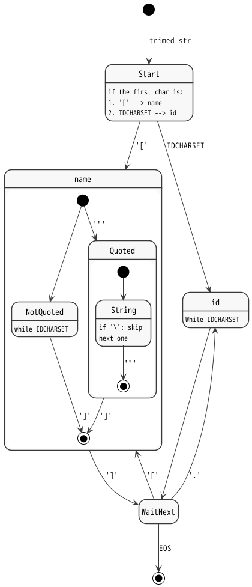
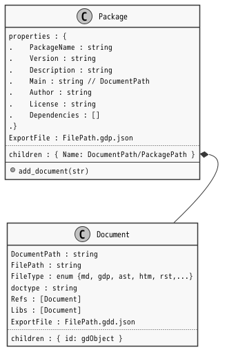

# Gdoc Object Format

***@Summary:***  \
文書から抽出される情報はすべてオブジェクトであり、そのオブジェクトは相互の親子関係とプロパティを持つ。
Objectはそれぞれ短いidを持つが、自分自身のidと先祖のidを'.'で連結した長いidを用いて他名前空間のオブジェクトへアクセスすることができる。
Gdoc Objectの基本コンセプトは、この親子関係とidによる名前解決、プロパティである。  \
またアプリケーションのニーズに基づいてGdObjectを継承した個別のクラスが導出される。
Classは、カテゴリとそのカテゴリに属するオブジェクトタイプにより特定される。

## \[@#\] TABLE OF CONTENTS<!-- omit in toc -->

- [1. Symbol](#1-symbol)
- [2. Types](#2-types)
  - [2.1. Object](#21-object)
  - [2.2. Document](#22-document)
    - [2.2.1. フォルダ・拡張子解決順序](#221-フォルダ拡張子解決順序)
    - [2.2.2. `__gdcache__`](#222-__gdcache__)
  - [2.3. Package](#23-package)
    - [2.3.1. Packageとは](#231-packageとは)
    - [2.3.2. ターゲットDocumentの指定について](#232-ターゲットdocumentの指定について)
      - [2.3.2.1. ターゲットとしてのDocumentを指定する](#2321-ターゲットとしてのdocumentを指定する)
      - [2.3.2.2. コンテキストとしてのDocument集合](#2322-コンテキストとしてのdocument集合)
    - [2.3.3. 言い方としては](#233-言い方としては)
    - [2.3.4. 相対参照と外部ライブラリ](#234-相対参照と外部ライブラリ)
- [3. Link](#3-link)
  - [3.1. リンクとは](#31-リンクとは)
  - [3.2. リンク手順](#32-リンク手順)
    - [3.2.2. Linking References (Internal Link)](#322-linking-references-internal-link)
    - [3.2.3. Linking Import/Access (Internal and External Link)](#323-linking-importaccess-internal-and-external-link)

## 1. Symbol

  \
  \
[@fig 4.1\] Symbol string structure

 

## 2. Types

- object

- document

- package

### 2.1. Object

  \
  \
[@fig 4.1\] pandocAstObject Internal Blocks

 

### 2.2. Document

GDML形式で記述された文書ファイル。

ファイルとして存在する場合と、index.mdを含むフォルダとして存在する場合とがある。

#### 2.2.1. フォルダ・拡張子解決順序

#### 2.2.2. `__gdcache__`

### 2.3. Package

#### 2.3.1. Packageとは

Packageには２つの意味がある。

1. Target package
   - アプリケーションの対象となるDocumentの集合
   - Application subcommandへ渡されるDocumentの集合をパッケージと呼ぶ。
   - コマンドラインから支持されたターゲットが含まれる。
   - カレントディレクトリからの相対パスでDocumentを特定する。

2. Library package
   - 検索対象パス上に現れるフォルダのうち、gdpackage.json を含むもの。
   - あるDocument集合に、単に情報を付与するものであってgdoc動作上に違いはない。
   - ~~preCompiledPackageとして提供される場合がある。~~
     - 外部パッケージへの依存関係でリンク結果が変わる場合があり、これを固定することが危険なため。

  \
  \
[@fig 4.1\] pandocAstObject Internal Blocks

 

#### 2.3.2. ターゲットDocumentの指定について

##### 2.3.2.1. ターゲットとしてのDocumentを指定する

1. １つ以上のDocumentを指定して、Lintなどの対象にしたい場合
2. ディレクトリを指定して、そこに含まれるDocumentをLintなどの対象にしたい場合

- LinkCheckは、範囲を指定する必要があるのでここでは対象ケースとならない。

##### 2.3.2.2. コンテキストとしてのDocument集合

1. trace実行時に、ターゲットidを探す範囲
2. listサブコマンドで明示したパッケージ名からidを検索する \
   → ライブラリから探す場合など。指定する。
3. あるブロックに割り当てられている要件を全て列挙したい \
   - 範囲指定を省略したい。
     あるブロックに割り当てられる要件は必ずdocsフォルダにあることがわかっているのでそこだけ検索したい

- 範囲は明示的に指定することを基本とする。
- 省略可能な場合は：
  1. ターゲットディレクトリから順に上位へたどって、.gdconfig が存在するディレクトリを探す。
     みつかれば、そこに指定された範囲を採用する。
  2. userのホームフォルダあるいはルートディレクトリに到達してなお見つからなかった場合には、エラーとする。
     カレントディレクトリを採用する案もあるが、.gdconfig を見つけたかどうかが曖昧になるのではないか。

#### 2.3.3. 言い方としては

1. 対象文書/範囲文書はオプションで指定してください。
2. .gdocconfig が存在する場合は省略可能です。
3. そうでない場合の扱いは、サブコマンドに依存します。

- [ ] ターゲットとなるDocumentは全数コンパイルされるが、ライブラリ（相対パスではない指定がなされたDocuemnt）はimportにより必要になった場合にのみコンパイルされる。

#### 2.3.4. 相対参照と外部ライブラリ

- サーチパスから探す自プロジェクト外部のパッケージは、`from="path/to/package"`とし、
- 自プロジェクトのパッケージは、`from="./path/to/package`と相対パス記法を使うプラクティスとする。\
  → 相対パスの場合には（先頭が`.`もしくは`/`(=.gdconfigディレクトリ)で始まる場合には）サーチパスを探しに行かない。
- ~~ルールとしては、相対でないパスはサーチパス-->カレントディレクトリの順で探すことにする。~~
  - 相対でないときはサーチパスしかみないことにする。

## 3. Link

### 3.1. リンクとは

Gdocの参照には、型指定に＆を付記した参照と、Import/Accessによる参照とがある。

オブジェクトツリー上に配置されたオブジェクトへのアクセスを提供するために、上記2種類の参照先を探索・特定することをリンクと呼ぶ。

別の言い方をすると、Resolve()によりオブジェクトを取得可能にするための事前処理をリンクと呼ぶ。

ある要件のトレーサビリティリンク先を確認するなどのリンク作業もあるが、これはResolveを使用して行うアプリケーションレベルの作業である。

### 3.2. リンク手順

#### 3.2.2. Linking References (Internal Link)

1. List up all references.

2. Find the top element of all references.

   - 自身の親の直下の兄弟から探す。
   - 親の親直下の兄弟から探す。
   - 文書ルートにたどり着くまで繰り返す。

   直下の兄弟とは、＆参照により文書上別の場所に定義されリンクされる兄弟を含まないことをいう。
   文書上に読者から見える範囲で探す。他文書から Inject されたオブジェクトは読者に認識不要であるため。

   - 見えない兄弟を指定したい場合、親の名前から指定することでアクセス可能。

   1. if not found, then link error(target not exist).

   2. もし Import/Accessオブジェクトに到達した場合、エラー（それ以上上位を探さない）

      TypeError?

3. Trace the descendants as far back as possible.

   if target found:

   - Set link

   else:

   - store the latest descendant in references list

   - もし Import/Accessオブジェクトに到達した場合、エラー。Import先のオブジェクトおよびその子孫に子を追加することは禁止のため。

4. While not done:

   1. Trace the descendants as far back as possible.  \
      Import/Access element not allowed on the path.

      if target found:

      - Set link

      else:

      - store the latest descendant.

      - もし Import/Accessオブジェクトに到達した場合、エラー。Import先のオブジェクトおよびその子孫に子を追加することは禁止のため。

   2. if no progress in #1

      If not found new descendant in todo, link error(can not find)

   3. if duplicate id found in the target object and original object

      raise Link error(duplicated id)

5. Check circular referencing

   ex.

   1. ROOT -> &A(ROOT.A.A.A) -> A

   2. ROOT  
      -> &A(ROOT.A.B.A) -> B  
      -> &B(ROOT.B.A.B) -> A

#### 3.2.3. Linking Import/Access (Internal and External Link)

> [@import Core.FR]
> [@import SWAD.Core]
> [@import SWAD from=../SoftwareArchitectualDesign]
> [@import SWAD.Core.FR2 from=../SoftwareArchitectualDesign]

Linking Import/Access will e executed after linking references.

- SysMLでいうところのパッケージインポートはない。要素インポートのみ。
- 単位系の定義などを考えると、パッケージインポートも欲しくなるのか？ 13 km@id:
- 多段import可能。importだけを含んだ index.md からの import を可能にするため。
- 多重importはどう扱う？
  - 追えるところまで追って、ドキュメント名＋フルパスidの形式にして保存する、でどうか。

外部文書探索をどこかで打ち切るオプションが欲しい。
ファイル単体の検査の際など、他ファイルとのリンクは無視したいため。

- 外部文書が見つからない場合にあきらめるかどうかだけ指定できればよいのではないか。
- どちらにせよ内部リンクは検査するのだから。

Basically, same method as linking references.

1. List up all references.

2. Find the top element of all references.

   if link target is outside document

   - Store target document

   if not found, then link error(target not exist).

3. Trace the descendants as far back as possible.

   if target found:

   - Set link

   else:

   - store the latest descendant in references list
   - importオブジェクトにたどり着き、外部参照で停止する場合もある。その情報も保持する。

4. While not done:

   1. Trace the descendants as far back as possible.  \
      **Import/Access element are also allowed on the path.**

      if target found:

      - Set link

      else:

      - and store the latest descendant.

   2. if no progress in #1

      If not found new descendant in todo, link error(can not find)

   3. if duplicate id found

      raise Link error(duplicated id)

5. Check circular referencing

   ex.

   1. ROOT -> &A(ROOT.A.A.A) -> A

   2. ROOT  
      -> &A(ROOT.A.B.A) -> B  
      -> &B(ROOT.B.A.B) -> A

