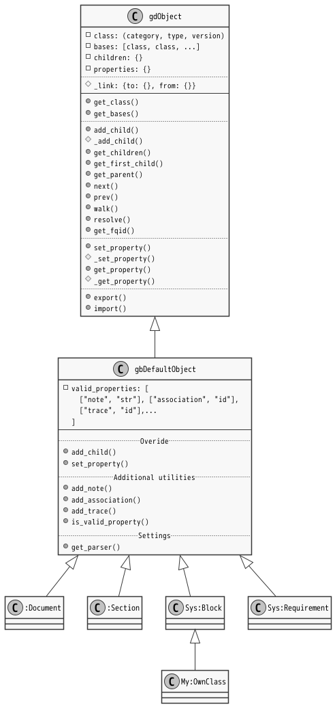

# Gdoc Object Format

***@Summary:***  \
文書から抽出される情報はすべてオブジェクトであり、そのオブジェクトは相互の親子関係とプロパティを持つ。
Objectはそれぞれ短いidを持つが、自分自身のidと先祖のidを'.'で連結した長いidを用いて他名前空間のオブジェクトへアクセスすることができる。
Gdoc Objectの基本コンセプトは、この親子関係とidによる名前解決、プロパティである。  \
またアプリケーションのニーズに基づいてGdObjectを継承した個別のクラスが導出される。
Classは、カテゴリとそのカテゴリに属するオブジェクトタイプにより特定される。

## \[@#\] TABLE OF CONTENTS<!-- omit in toc -->

- 
- [1. Types](#1-types)
  - [Object](#object)
  - [1.1. Document](#11-document)
    - [1.1.1. フォルダ・拡張子解決順序](#111-フォルダ拡張子解決順序)
    - [1.1.2. `__gdcache__`](#112-__gdcache__)
  - [1.2. Package](#12-package)
    - [1.2.1. Packageとは](#121-packageとは)
    - [1.2.2. ターゲットDocumentの指定について](#122-ターゲットdocumentの指定について)
      - [1.2.2.1. ターゲットとしてのDocumentを指定する](#1221-ターゲットとしてのdocumentを指定する)
      - [1.2.2.2. コンテキストとしてのDocument集合](#1222-コンテキストとしてのdocument集合)
    - [1.2.3. 言い方としては](#123-言い方としては)
- [2. Link](#2-link)
  - [2.1. リンクとは](#21-リンクとは)
  - [2.2. リンク手順](#22-リンク手順)
  - [2.3. 相対参照と外部ライブラリ](#23-相対参照と外部ライブラリ)

## 1. Symbol

  \
  \
[@fig 4.1\] Symbol string structure

 

## 2. Types

- object

- document

- package

### 2.1. Object

  \
  \
[@fig 4.1\] pandocAstObject Internal Blocks

 

### 2.2. Document

GDML形式で記述された文書ファイル。

ファイルとして存在する場合と、index.mdを含むフォルダとして存在する場合とがある。

#### 2.2.1. フォルダ・拡張子解決順序

#### 2.2.2. `__gdcache__`

### 2.3. Package

#### 2.3.1. Packageとは

Packageには２つの意味がある。

1. Target package
   - アプリケーションの対象となるDocumentの集合
   - Application subcommandへ渡されるDocumentの集合をパッケージと呼ぶ。
   - コマンドラインから支持されたターゲットが含まれる。
   - カレントディレクトリからの相対パスでDocumentを特定する。

2. Library package
   - 検索対象パス上に現れるフォルダのうち、gdpackage.json を含むもの。
   - あるDocument集合に、単に情報を付与するものであってgdoc動作上に違いはない。
   - ~~preCompiledPackageとして提供される場合がある。~~
     - 外部パッケージへの依存関係でリンク結果が変わる場合があり、これを固定することが危険なため。

  \
  \
[@fig 4.1\] pandocAstObject Internal Blocks

 

#### 2.3.2. ターゲットDocumentの指定について

##### 2.3.2.1. ターゲットとしてのDocumentを指定する

1. １つ以上のDocumentを指定して、Lintなどの対象にしたい場合
2. ディレクトリを指定して、そこに含まれるDocumentをLintなどの対象にしたい場合

- LinkCheckは、範囲を指定する必要があるのでここでは対象ケースとならない。

##### 2.3.2.2. コンテキストとしてのDocument集合

1. trace実行時に、ターゲットidを探す範囲
2. listサブコマンドで明示したパッケージ名からidを検索する \
   → ライブラリから探す場合など。指定する。
3. あるブロックに割り当てられている要件を全て列挙したい \
   - 範囲指定を省略したい。
     あるブロックに割り当てられる要件は必ずdocsフォルダにあることがわかっているのでそこだけ検索したい

- 範囲は明示的に指定することを基本とする。
- 省略可能な場合は：
  1. ターゲットディレクトリから順に上位へたどって、.gdconfig が存在するディレクトリを探す。
     みつかれば、そこに指定された範囲を採用する。
  2. userのホームフォルダあるいはルートディレクトリに到達してなお見つからなかった場合には、エラーとする。
     カレントディレクトリを採用する案もあるが、.gdconfig を見つけたかどうかが曖昧になるのではないか。

#### 2.3.3. 言い方としては

1. 対象文書/範囲文書はオプションで指定してください。
2. .gdocconfig が存在する場合は省略可能です。
3. そうでない場合の扱いは、サブコマンドに依存します。

- [ ] ターゲットとなるDocumentは全数コンパイルされるが、ライブラリ（相対パスではない指定がなされたDocuemnt）はimportにより必要になった場合にのみコンパイルされる。

## 3. Link

### 3.1. リンクとは

- Link command establishes inter namespace connection.
- Linkとは、import/accessによるinter namespace connectionを確立すること。

### 3.2. リンク手順

1. Establishing Inter Document Link
   - Document内部絶対パスで参照するため、対象オブジェクトは一意に決まる。
   - i/a objectに、参照先Document Objectをセットする。
   - **参照先Document内部でのオブジェクト検索は実施しない。**\
     参照先Document内の外部i/aにより、このタイミングでは解決不能である可能性があるため。

2. Establishing Object Link
   - 外部i/a確立後に解決する。 \
     相対参照のため他パッケージにリンク先があるかどうかによって結果が変わる場合があるため。
   - i/a objectに、参照先Objectをセットする。

- パッケージ構成時に、上記のリンクが全て解決可能であることを確認する。
- ターゲット外部へのリンクはどうする？ オプションで対応を指定可能にするか。
- エクスポート時はリンクが失われる。

### 3.3. 相対参照と外部ライブラリ

- サーチパスから探す自プロジェクト外部のパッケージは、`from="path/to/package"`とし、
- 自プロジェクトのパッケージは、`from="./path/to/package`と相対パス記法を使うプラクティスとする。\
  → 相対パスの場合には（先頭が`.`もしくは`/`(=.gdconfigディレクトリ)で始まる場合には）サーチパスを探しに行かない。
- ~~ルールとしては、相対でないパスはサーチパス-->カレントディレクトリの順で探すことにする。~~
  - 相対でないときはサーチパスしかみないことにする。
