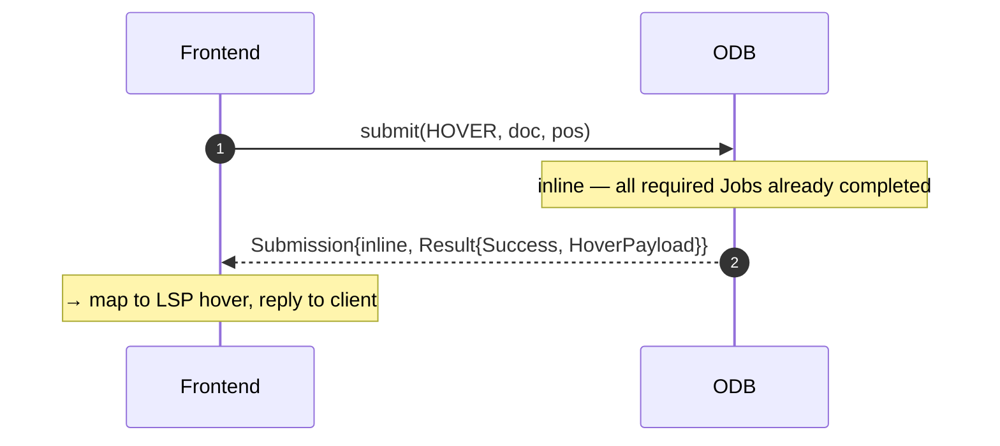
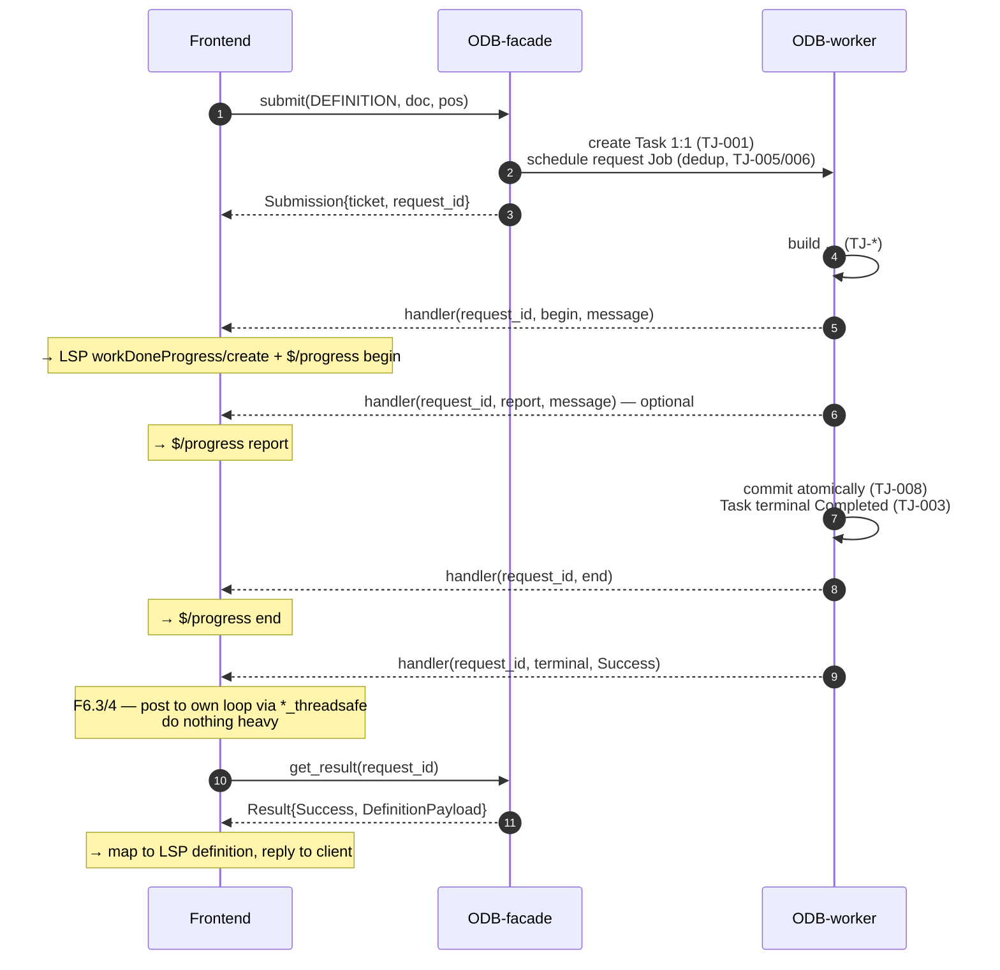
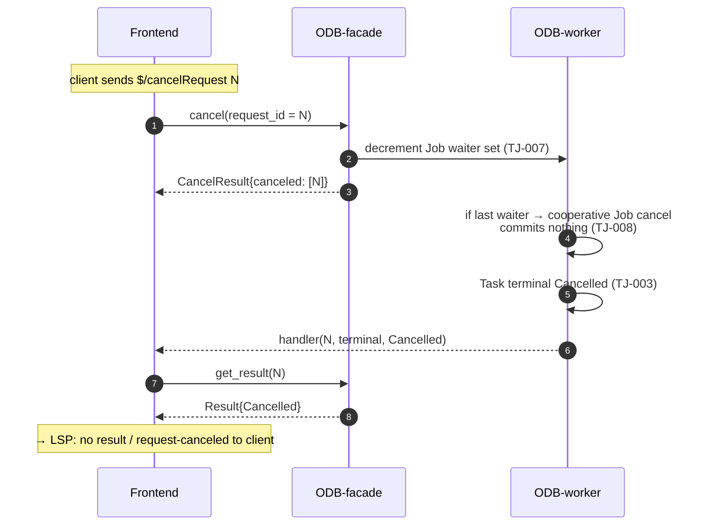

# gdoc Server — Frontend↔Object Database API Contract

> **Deliverable of:** Phase 1b (Frontend↔ODB API, goal #2) of the gdoc Server design-documentation effort.
> **Position:** `docs/architecture/gdocServer/contracts/frontend-odb-api.md`
> **Status:** ✅ **Approved (Phase 1b CLOSED, 2026-09-13).** All §11 review items signed off; decisions logged in `../README.md` §7 (D-011 / D-012 / D-013).
> **Companion files:** `./task-job-management.md` (Phase 1a) · `../usecases/UC_*.md` (Phase 2) · `../subcomponents/*.md` (Phase 3) · `../traceability.md` (Phase 4).
> **Role in the set:** a **Rank-5 contract** (an executable specification **derived** from ranks 1–4, per `../README.md` §2/§3). This is **the only public API** the gdoc Server exposes (**D-002**): the surface a Frontend uses to run the Object Database's internals. All Phase 1a `TJ-` rules sit *behind* this surface; every Phase 3 component requirement that touches the Frontend↔ODB boundary must cite the applicable `API-` operation / model here.
>
> **Derived From (document-level):**
> `../requirements/requirements.md` (FR-1.1, FR-1.2, FR-1.3, FR-3.1, FR-3.2, NFR-1.1, NFR-1.4, NFR-2.2) ·
> `../adr/002-request-task-job-model.md` · `../adr/003-threading-and-async-facade.md` · `../adr/008-frontend-odb-scheduling-boundary.md` (primary) ·
> `../adr/001-protocol-agnostic-core.md` · `../adr/004-datastore-synchronization.md` · `../adr/006-job-sharing-semantics.md` · `../adr/009-configuration-lifecycle.md` (supporting) ·
> `../adr/README.md` (risk register `R-NNN-M`) ·
> `./task-job-management.md` (TJ-001, TJ-003, TJ-007, TJ-010, TJ-011, TJ-012, TJ-016, TJ-017, TJ-018) ·
> `../architecture.md` (Structure/Behaviour; the only public API) ·
> `../subcomponents/README.md` §4 (single-owner matrix) + §6 (glossary) ·
> `../README.md` §4 (conventions), §7 (D-001…D-010), §8 (Phase 1b procedure).

---

## 1. Purpose & Position

This contract fixes **the only public API** of the gdoc Server — the surface between a protocol **Frontend** (C1; the LSP frontend in v1, and the future Object Server frontend, ADR-001) and the **Object Database** (C2). The ODB's Task/Job internals (the Phase 1a `TJ-` rules) are **not** exposed directly; the Frontend drives and observes them only through the four operations in §3, the shared **Request**/**Result** models in §4/§5, and the **push-back completion channel** in §6.

Two properties fix how to read it:

- **One API, many frontends.** Per ADR-001 the Request/Result model is a **superset** of what any frontend needs and is **protocol-agnostic**. The LSP frontend *maps* LSP messages to this API; a future Object Server maps its own protocol to the *same* API. The ODB **does not branch** on which frontend called (ADR-008, R-008-2).
- **Terms are referenced, not redefined.** Request / Task / Subtask / Job / Document / `version_id` / dedup key / priority have a single definition in `../subcomponents/README.md` §6 and `./task-job-management.md`. This file uses them with exactly that meaning.

> **Not in scope here:** the concrete gdoc object data model and Datastore access (internal to the ODB — **no** public API, D-002 / ADR-004); the Builder SDK and Job execution (TJ-019/020, ADR-005); the wire encoding of LSP messages (that is the LSP frontend's own mapping, allocated to `LSP-*` in Phase 3); and liveness thresholds (D-007 / D-010).

## 2. Reading the operations

Each operation is a **shall** (a testable obligation) and carries:

- an ID `API-nnn` (`../README.md` §4.1);
- a **one-line Derived-From** chain (`../README.md` §4.2) up to its FR/NFR origin;
- a **single owner** (one component, per `../subcomponents/README.md` §4); and
- the **risk(s)** it rules, so the Phase 4 closure table can verify "every `R-00x` reached a rule and a test."

**Direction and owner.** `F→O` = the Frontend (C1) invokes it on the ODB (C2). `O→F` = the ODB pushes it to the Frontend (the completion callback). Ownership is by the component that **implements the obligation**:

- `API-001…004` (`submit` / `get_result` / `cancel` / `register_completion`) are **ODB obligations** — the ODB must provide and honor them; the Frontend *uses* them.
- the **completion callback** (§6) is a **Frontend obligation** — the Frontend must supply a lightweight, thread-safe callback; the ODB *invokes* it.
- the **`Request`** and **`Result`** models (§4/§5) are **shared** — both sides must agree on the shape; the ODB owns the canonical interpretation.

| ID | Operation | Direction | Owner | One-line purpose |
| --- | --------- | --------- | ----- | ----------------- |
| API-001 | `submit(request)` | F→O | ODB | Accept a Request, map it 1:1 to a Task, answer inline **or** return a request id. |
| API-002 | `get_result(request_id)` | F→O | ODB | Synchronously read a Task's terminal Result (or report *pending*); never blocks. |
| API-003 | `cancel(request_id \| request_ids \| all)` | F→O | ODB | Cancel own live Task(s): **one** id, a **set** of ids, or **all** of this Frontend's; the ODB decrements shared-Job refs. |
| API-004 | `register_completion(handler)` | F→O | ODB (host) / Frontend (handler) | Pre-register the push-back channel; the handler receives the request event stream (progress `begin`/`report`/`end` + terminal). |

## 3. Operations

### API-001 — `submit(request: Request) → Submission`

`F→O`. The Frontend submits a single `Request` (a protocol-agnostic unit, §4) to the ODB.

- **1:1 mapping.** The ODB **shall** map the accepted Request to **exactly one Task** (TJ-001). One `submit` call never creates two Tasks; one Task never arises from two `submit` calls.
- **Inline or ticket.** The ODB **shall** return a `Submission` that is **either**:
  - `{ kind: "inline", result: Result }` — a **light** request the ODB can answer immediately (no Jobs required, or all required Jobs already `Completed`); **or**
  - `{ kind: "ticket", request_id: RequestId }` — a **heavy** request; the ODB has created and scheduled the Task and will **push back** completion (API-004 / §6). The Frontend then reads the Result via `get_result` (API-002).
  - Which of the two the ODB chooses is the **ODB's** decision (it knows the Task/Job state); the Frontend **must** handle **both** shapes.
- **Non-blocking.** `submit` **shall** return promptly. It **shall not** block waiting for analysis to finish (ADR-004 R-004-2; ADR-003). Heavy work is deferred to the ODB worker thread.
- **Rejection.** If the Request is malformed or the ODB cannot accept it (e.g. unknown `operation`), the ODB **may** return an inline `Result` with `status: Error`; it **shall not** leave a half-created Task.

- **Owner:** ODB. **Risk(s):** R-004-2 (non-blocking), R-003-3 (worker not stalled by a submit).
- **Derived From:** FR-3.1 → ADR-002 (1:1 Request↔Task) → ADR-008 (inline-vs-ticket hand-off) → ADR-003 (non-blocking) → TJ-001.
- **Test:** one `submit` yields exactly one Task; a heavy `submit` returns a ticket and returns before the underlying Job completes; a light `submit` returns an inline Result; the Frontend handles both.

### API-002 — `get_result(request_id: RequestId) → Result | Pending`

`F→O`. The Frontend reads the Result for a Task it submitted.

- **Synchronous, non-blocking.** `get_result` **shall** return immediately. If the Task is **terminal** (`Completed`/`Cancelled`/failed, TJ-003) it returns the `Result`; otherwise it returns `Pending`.
- **No polling.** Returning `Pending` is **not** a "wait for me" signal. The Frontend **shall not** spin on `get_result` to wait for completion — completion is **pushed** via the registered callback (API-004 / §6). `get_result` is the **fetch** half of push-back: the callback tells the Frontend *that* it is ready (and with what status); `get_result` retrieves the payload. This is the ADR-003 "pushed, not polled" contract made explicit.
- **Stable while the window is open.** While the retention window (below) is open, repeated `get_result(request_id)` **shall** return the same Result.
- **Retention window (fetch-once; D-011).** Every terminal Result (`Success`/`Error`/`Cancelled`) is retained only for a **window** that **opens** when the terminal push has been delivered and **closes** at the earlier of (a) a **successful** `get_result`, or (b) **TTL** expiry. A successful fetch **closes the window and discards** the Result; a later `get_result` then returns `Error{ E_EXPIRED }` (§5). A `get_result` that returned `Pending` (non-terminal) **does not** close the window and may be repeated. **Inline** Results (carried in the `Submission`, API-001) are **not** retained and are out of scope. Eviction **never** precedes delivery of the terminal push (**at-least-one** fetch opportunity). Consumption is **atomic**: exactly one caller receives the payload (single worker, ADR-003).
- **TTL threshold deferred.** The eviction **mechanism** is fixed here; the **TTL value** is deferred to detailed design under the D-007 / R-007-2 umbrella (mechanism fixed, threshold later).
- **Unknown id vs. window-closed.** A `request_id` the ODB has **never** recognized returns `Error{ E_NOT_FOUND }`; a recognized id whose **window has closed** (fetched or TTL-expired) returns `Error{ E_EXPIRED }` (§5). Neither crashes nor blocks.

- **Owner:** ODB. **Risk(s):** R-003-1 (lightweight, no stall), R-004-2 (non-blocking), R-003-2 (thread-safe hand-off), unbounded-resource use (availability) — bounded by the window.
- **Derived From:** FR-3.1 → ADR-003 (push-back / fetch; not polling) → ADR-004 (in-memory ⇒ bounded retention; non-blocking read) → **D-011** (retention window; *provisional — to be logged in `../README.md` §7 at approval*; TTL threshold deferred under D-007 / R-007-2) → TJ-003 (Task terminal states).
- **Test:** `get_result` on a non-terminal Task returns `Pending` (repeatable, non-consuming) without blocking; after the completion push the **first** successful fetch returns the payload and a **second** returns `E_EXPIRED`; a never-submitted id returns `E_NOT_FOUND`; a TTL-expired id returns `E_EXPIRED`; the terminal push is never preceded by eviction; a detached handler still allows eviction to proceed.

### API-003 — `cancel(request_id: RequestId | request_ids: RequestId[] | all: true) → CancelResult`

`F→O`. The Frontend cancels work **it owns**.

- **Own Task(s) only.** The Frontend **shall** cancel only Task(s) it submitted. It **shall not** address a Job directly, nor another Frontend's Task (TJ-007; ADR-008). Cancellation of a shared Job is **derived**: the ODB decrements the Job's waiter set, and the Job is canceled **only when the last waiter departs** (TJ-007).
- **Three forms (all own-only, R-008-1):** (1) `cancel(request_id)` — one specific Task; (2) `cancel(request_ids)` — a **set** of Tasks (e.g. the ODB ids a Frontend associated with one of its protocol messages — 1 or N, §7); (3) `cancel(all)` — **all** of this Frontend's live Tasks (disconnect / teardown). `owner` is **implicit** = the calling Frontend (its API object); a Frontend can only target **itself** (R-008-1). *The ODB never infers which ids are "moot" (e.g. for a document that closed) — the Frontend supplies the exact ids, owning the protocol→id mapping and the intent.*
- **Protocol-agnostic.** The ODB's cancellation API takes a `request_id` / `request_ids` / `all`, **not** a protocol event. Each Frontend **translates** its protocol's cancellation into one of these (R-008-1); see the example table in §7.
- **Result.** `CancelResult` reports which ids were actually canceled vs. already-terminal (no-op). Canceling an already-terminal Task is a safe no-op.
- **Effect on shared work.** Canceling one waiter **does not** cancel a shared Job that other live Tasks still await (TJ-007). A canceled Task's Result is `status: Cancelled` (§5), **not** `Error`.

- **Owner:** ODB (count + cancel decision); Frontend (cancels own only). **Risk(s):** R-008-1 (cancellation translation), R-006-3 (reference-count errors), R-002-1 (accounting).
- **Derived From:** FR-3.2 (reference-based cancellation) → ADR-008 (own-Task only) → ADR-006 (reference-counted) → TJ-007.
- **Test:** two Tasks await one shared Job — canceling one keeps the Job running; canceling the last cancels it; `cancel(request_ids)` cancels exactly the supplied own ids (others untouched); `cancel(all)` cancels all of this Frontend's live Tasks and **never** another Frontend's; canceling a terminal Task is a no-op.

### API-004 — `register_completion(handler: RequestEventHandler) → handle`

`F→O`. The Frontend pre-registers the **push-back channel** the ODB uses to report the lifecycle of its Tasks — **progress** *and* completion. *(The name is retained for continuity with the ADR-003 push-back façade; with the WDP extension the registered handler receives the full **request event stream**, §5.2, not only the terminal.)*

- **Event stream.** For any lifecycle event of a Task it owns, the ODB **shall invoke** the registered handler **on the ODB's own worker thread** with `(request_id, event)`. `event` is a `RequestEvent` (§5.2): a `ProgressEvent` (`begin`/`report`/`end`) or a `TerminalEvent` (`status`). The ODB has **no knowledge** of the Frontend's threading/async model (ADR-003).
- **Progress obligation (ODB).** For every request the ODB returns as a **ticket** (API-001), the ODB **shall emit** a `begin`, then zero or more `report`, then exactly one `end` immediately before the `TerminalEvent`. For **inline** requests the ODB **may omit** progress. In **v1 (D-005)** the operations expected to be ticketed — and therefore progressed — are `REFERENCES` (unbounded) and `CONFIG_SAVE` (rebuild); any other operation may also be ticketed and progressed if a build is needed.
- **Honest progress (ODB).** The ODB **may** include a `percentage` **only when the denominator of work is known**; for **unbounded discovery** (TJ-006) it **shall not fabricate** a percentage — progress is **message-based only**. Progress is **request-level**: the ODB computes it from its own Job state and exposes **no** Job/Task identity (ADR-008 boundary preserved).
- **Lightweight handler (Frontend obligation).** The handler **shall** do nothing heavy: it **shall only** hand the event onto the Frontend's own event loop (e.g. `asyncio` `loop.call_soon_threadsafe(handler, event)` or, for a coroutine, `asyncio.run_coroutine_threadsafe(handler(event), loop)`) and then **return**. It **shall not** block, synchronously wait for its loop, or do CPU work (R-003-1).
- **Thread-safe hand-off only (Frontend obligation).** All cross-thread scheduling **shall** use `loop.call_soon_threadsafe` / `asyncio.run_coroutine_threadsafe`; a plain `loop.call_soon` from the ODB worker thread is **not** permitted (R-003-2).
- **Identity (implicit; via the API object).** The ODB is a library a Frontend links against; it obtains its **API object** once (e.g. `odb = odb_lib.api_obj()`) and that object **is** the Frontend's identity — a stable, ODB-minted token that is **not** a protocol/client-type concept (ADR-008). Every call on it (`submit`, `get_result`, `cancel`, `register_completion`) is attributed to that identity **automatically**; the Frontend **never passes an id**. **One API object per Frontend** for its lifetime — creating a second is a **distinct** Frontend (and splits its state).
- **Per-Frontend.** Each Frontend (API object) registers its **own** handler; multiple frontends (LSP + future Object Server) each receive their own events (ADR-001). The ODB never routes one frontend's event to another's.
- **One live handler; re-register replaces.** A Frontend has **at most one** live handler. Registering again (without unregistering) **replaces** the previous handler (last-write-wins) and the superseded `handle` is **invalidated** — never invoked again.
- **Unregister.** `unregister(handle)` detaches a handler; the ODB **shall not** invoke a detached or invalidated handler.
- **Cross-Frontend isolation.** A `request_id`, Result, or handler belonging to **another** API object is **never recognized** by this one → `E_NOT_FOUND` (§5). This enforces ADR-001 by construction.
- **LSP mapping (Frontend concern).** The LSP frontend maps `begin`→`window/workDoneProgress/create` + `$/progress{kind:begin}`, `report`→`$/progress{kind:report}`, `end`→`$/progress{kind:end}`, and the terminal to the LSP response. The ODB does not know or care that the consumer is LSP (ADR-008 / R-008-2).

- **Owner:** ODB (invocation + progress) + Frontend (handler body + LSP mapping). **Risk(s):** R-003-1 (stall/deadlock), R-003-2 (thread-safe API), R-003-3 (single-worker SPOF).
- **Derived From:** FR-3.1 + NFR-1.4 (WDP progress) → ADR-003 (push-back; callback on worker thread) → NFR-1.1 (async frontend) → NFR-2.2 (thread-safe facade) → **ADR-008** (identity is a neutral token, not a client type) → **ADR-001** (per-Frontend / isolation).
- **Test:** a ticketed request yields `begin … end` then the terminal; an inline request may yield none; a slow/misbehaving handler does not stall other Tasks; scheduling from a non-loop thread uses only the `*_threadsafe` APIs; a detached handler is never invoked; an unbounded progress has a message but **no** fabricated percentage; a **second** `register_completion` **replaces** the first (only the latest is invoked; the invalidated `handle` is never invoked); addressing **another** Frontend's `request_id` returns `E_NOT_FOUND`.

## 4. The `Request` model (protocol-agnostic)

The `Request` is the **single** input to `submit` and the **only** context the Frontend passes to the ODB. Per ADR-008 (consequences 2–3) and **R-008-2**, it **must** carry **all** the context the ODB needs to build, scope, order, and cancel its Tasks — the ODB **shall not** need to know the Frontend's protocol. **If the ODB needs context this model lacks, the model is extended** (a legitimate API extension point, `../README.md` §6.3); the ODB **shall not** special-case a client type.

**Canonical shape** (names are stable identifiers; wire encoding is the Frontend's concern):

```
Request {
  operation       : Operation        // what the Frontend wants (enum, §4.1)
  documents       : [DocumentRef]    // documents involved (§4.3)
  payload         : OperationPayload // operation-specific context (positions, new name, scope, open-buffer content…)
  priority_hint   : PriorityHint     // Frontend-domain only; ODB SHALL NOT branch on it (TJ-010, R-008-2)
  source          : FrontendIdentity // identity only; **ODB-populated** from the calling API object (implicit, not frontend-set); ownership/cancellation attribution (R-008-2)
}
```

- **Frontend (C1) obligation:** construct a `Request` that fully expresses the intent, including `documents`/`version_id` and any open-buffer content the ODB/Builder must read.
- **ODB (C2) obligation:** interpret the `Request` without inspecting which protocol produced it; use `operation`, `documents`, `payload` to scope, build and order Tasks (TJ-011/012; reference-depth ordering is ODB-derived from the operation — §4.1); use `source` **only** for ownership/cancellation attribution; treat `priority_hint` as Frontend-domain (TJ-010). (`source` is **set by the ODB from the calling API object** — implicit, the Frontend does not fill it; §4.2.)
- **Superset.** The model is a superset of every frontend's needs (ADR-001); fields a given frontend does not use are optional/empty, never a client-type branch.

> **`priority_hint` vs. ODB priority.** Do not conflate. The Frontend orders *its own* requests (`priority_hint`) in its own domain. The ODB orders *shared work* by **document state and the operation's reference depth** (TJ-011/012) — a protocol-agnostic fact. The ODB **shall not** derive scheduling from `priority_hint`'s client-type semantics (TJ-010, R-008-2).

> **On knowing Operations (boundary discipline, R-008-2).** The ODB is *expected* to understand the operations it can receive (`HOVER`, `DEFINITION`, …): they are the **shared FE↔ODB API vocabulary**, and understanding an issued Operation is **normal contract knowledge — not an intrusion** into the Frontend's internal responsibilities. What the ODB must **not** do is interpret the Frontend's *client-type-specific intent* — **why** it issued the operation, IDE focus, per-client scheduling rules — which the ODB neither sees nor acts on (R-008-2). In one line: **the Operation is shared vocabulary the ODB knows by contract; the Frontend's rationale and client-type semantics are private.** A payload such as `HoverPayload` is *data* (the declaration's signature + doc), not a UI action — the "popup" is the IDE's job.

### 4.1 `Operation` codes

Each maps to a FR-1.2 feature (or a synchronization/config action). v1 vs v2 is fixed by **D-005** (Q-001).

| Operation | Feature | v1 (D-005) | Result payload (§5) |
| --------- | ------- | ---------- | ------------------- |
| `HOVER` | FR-1.2 Hover | **v1** | `HoverPayload` |
| `DEFINITION` | FR-1.2 Go to Definition | **v1** | `DefinitionPayload` |
| `REFERENCES` | FR-1.2 Find References | **v1** | `ReferencesPayload` |
| `DIAGNOSTICS` | FR-1.2 Diagnostics (server→client) | **v1** | `DiagnosticsPayload` |
| `DOCUMENT_SYNC` | FR-1.1 didOpen/didChange/didClose | **v1** | `SyncPayload` (ack) |
| `WATCHED_FILES` | FR-1.1 didChangeWatchedFiles | **v1** | `SyncPayload` (ack) |
| `CONFIG_SAVE` | FR-1.1 save (config rebuild) | **v1** | `SyncPayload` (ack) |
| `COMPLETION` | FR-1.2 Completion | v2 (provisional) | `CompletionPayload` |
| `RENAME` | FR-1.2 Rename | v2 (provisional) | `RenamePayload` |
| `DOCUMENT_SYMBOLS` | FR-1.2 Document Symbols | v2 (provisional) | `SymbolsPayload` |
| `WORKSPACE_SYMBOLS` | FR-1.2 Workspace Symbols | v2 (provisional) | `SymbolsPayload` |
| `SEMANTIC_TOKENS` | FR-1.2 Semantic Tokens | v2 (provisional) | `SemanticTokensPayload` |

> The v2 rows exist so the model is a **superset** (ADR-001) and so "every FR-1.2 feature is expressible" holds (Phase 1b DoD); their **activation** is a v2 scope decision (D-005).

- **Owner:** ODB (canonical interpretation); Frontend (populates). **Risk(s):** R-008-2 (missing context), R-008-1 (per-operation cancellation).
- **Derived From:** FR-1.2 (feature set) + FR-1.1 (sync/config) → ADR-001 (superset) → ADR-008 (protocol-agnostic context) → R-008-2 → D-005 (v1/v2 split).
- **Test:** a `Request` for each v1 operation carries exactly the context its Task needs (documents, positions); adding a new operation extends the enum, it does not special-case a client.

### 4.2 `PriorityHint`, `FrontendIdentity`

- **Reference-depth ordering (ODB-internal, derived from the `operation`).** The ODB orders shared work by reference depth (TJ-011) and applies the unbounded-work defer/cancel policy (TJ-014). This depth is **derived by the ODB from the `operation`** (a shared-vocabulary fact, §4.1) — e.g. `HOVER`/`DEFINITION` are immediate navigation targets; `REFERENCES` is the unbounded "long tail" (ADR-007). It is **not** a `Request` field the Frontend sets (removed as redundant with `operation`; it was not a Frontend choice).
- **`PriorityHint`** = the Frontend's own ordering signal (client-type specific). Carried for completeness; **never** a scheduling input to the ODB (TJ-010). *Deferred:* if a frontend needs ordering context the ODB cannot infer, this field is the extension point — not a client-type branch.
- **`FrontendIdentity`** = a stable, **ODB-minted** opaque handle identifying *which* Frontend (API object) submitted the Request. It is **derived by the ODB from the calling API object** — the Frontend **never supplies it** (§3, API-004). Used **only** to attribute ownership, resolve the cancel forms (API-003: one / set / all), and enforce cross-Frontend isolation (§5 `E_NOT_FOUND`); **not** a scheduling input and **not** a protocol/client-type concept (ADR-008, R-008-2).

- **Owner:** shared. **Risk(s):** R-008-2. **Derived From:** FR-3.2 → ADR-007 (reference-depth ordering, ODB-derived) → ADR-008 (identity, no semantics) → R-008-2.

### 4.3 `DocumentRef` & `version_id`

```
DocumentRef { uri : Uri, version_id : (last_save_mtime, open_revision) }
```

- `version_id` is the **document identity/freshness key** (TJ-018 / D-004, Q-002): `(last_save_timestamp, open_revision)`.
- `open_revision > 0` ⇒ **open** (buffer is the source of truth); `open_revision == 0` ⇒ **non-open** (disk is the source of truth).
- **Frontend (C1) obligation:** include the **current** `version_id` for every involved document, and — when the document is **open** — the **buffer content** in `payload` (or via the sync operation), since the Builder must build from the *latest open buffer* (TJ-018).
- **ODB (C2) obligation:** use `version_id` as the **dedup key version component** (TJ-005) and the freshness trigger (open edit ⇒ `open_revision↑`; non-open disk change ⇒ `last_save_mtime↑`); invalidate/rebuild accordingly.
- **Builder (C4) obligation:** build from the content the ODB supplies (buffer when open, disk when non-open) — never from a stale copy.

- **Owner:** shared (C1 supplies, C2 uses, C4 consumes). **Risk(s):** R-006-2 (dedup key), R-006-4 (stale buffer → wrong result).
- **Derived From:** NFR-2.1 (always latest) → ADR-006 (dedup) → TJ-018 / D-004 → R-006-2.
- **Test:** an open-buffer edit (revision↑) and a non-open disk change (mtime↑) each invalidate/rebuild the affected (file, version, inputs); a Builder never builds from a buffer older than the Request's `version_id`.

### 4.4 The three cancel forms (API-003)

```
cancel(request_id  : RequestId)       // (1) one own Task
cancel(request_ids : RequestId[])     // (2) a set of own Tasks
cancel(all         : true)            // (3) ALL of this Frontend's live Tasks
```

- **Own-only (R-008-1).** All three forms are **always** bounded by `owner` — the calling Frontend (its API object, implicit). A Frontend can only cancel **its own** Tasks; it never reaches another Frontend's (TJ-007; ADR-008; a cross-Frontend id → `E_NOT_FOUND`, §5).
- **Explicit targeting.** The Frontend supplies the **exact** `request_id`(s) it owns. The ODB does **not** infer "which ids are moot" (e.g. for a document that closed) — that is the Frontend's decision, from its protocol→id mapping and intent. The ODB's only role is to cancel exactly the ids it is given (own-only) and apply reference-counted cancellation (TJ-007) to the shared Jobs those Tasks await.
- **`all` form.** `cancel(all)` = every live Task of this Frontend (disconnect / teardown). It is the Frontend's explicit teardown, not an ODB-side heuristic.
- **1:N is the Frontend's business (ADR-001 superset).** One Frontend protocol message (e.g. an LSP request) may map to **0, 1, or N** ODB `Request`s; the **set** form exists for the N case. One `submit` = exactly one `request_id` (ADR-002, P-5) is unchanged; the 1:N is at the *protocol-message* level, owned by the Frontend. The ODB is protocol-agnostic about it.

- **Owner:** ODB (resolve + ref-counted cancel); Frontend (supplies ids). **Risk(s):** R-008-1, R-006-3.
- **Derived From:** FR-3.2 → ADR-008 (own-Task only) → ADR-006 (ref-count) → TJ-007.
- **Test:** `cancel(request_ids)` for Frontend A never cancels a Task owned by Frontend B; `cancel(all)` cancels all of A's live Tasks and only those; a document's close does **not** itself cancel anything — the Frontend cancels the ids it deems moot; canceling a terminal Task is a no-op.

## 5. The `Result` model & payload types

Every `submit`/`get_result` answer, and every object a completion refers to, is a `Result`. The **envelope** is uniform; the **payload** is operation-specific. This is the "result types (from FR-1.2)" requirement made concrete.

```
Result {
  status     : Success | Error | Cancelled
  request_id : RequestId
  payload    : <OperationPayload>   // present iff status == Success (§5.1)
  error      : ErrorInfo            // present iff status == Error
}
ErrorInfo { code : ErrorCode, message : string, retryable : bool }
Pending   // returned by get_result for a non-terminal Task (§3 API-002) — not a Result status
```

- **Uniformity (both sides):** the Frontend **shall** dispatch on `status` first; the ODB **shall** populate exactly one of `payload` / `error` as dictated by `status`.
- **Cancelled ≠ Error.** A Task canceled via `cancel` (API-003) yields `status: Cancelled` — a **normal** outcome, not a failure (R-008-1). A failed Task yields `status: Error`.
- **Atomicity.** A `Success` payload reflects a **committed** result only; a mid-run canceled Job commits nothing, so no partial `payload` is ever observed (TJ-008).

### 5.1 Payload types (FR-1.2)

| Payload | For | Contents (logical) | v1 (D-005) |
| ------- | --- | ------------------ | ---------- |
| `HoverPayload` | `HOVER` | the declaration's signature + doc for the symbol under the cursor (data, not UI markup) | **v1** |
| `DefinitionPayload` | `DEFINITION` | list of (target `DocumentRef` + position) for the definition(s) | **v1** |
| `ReferencesPayload` | `REFERENCES` | list of `DocumentRef` + positions of all (transitive) references | **v1** |
| `DiagnosticsPayload` | `DIAGNOSTICS` | diagnostics list for the document (server→client) | **v1** |
| `SyncPayload` | `DOCUMENT_SYNC`/`WATCHED_FILES`/`CONFIG_SAVE` | ack: new `version_id`, affected documents; for `CONFIG_SAVE` also the post-save rebuild/invalidation notice (TJ-016/017; ADR-009) | **v1** |
| `CompletionPayload` | `COMPLETION` | completion items | v2 |
| `RenamePayload` | `RENAME` | workspace edit set for the rename | v2 |
| `SymbolsPayload` | `DOCUMENT_SYMBOLS`/`WORKSPACE_SYMBOLS` | symbol outline | v2 |
| `SemanticTokensPayload` | `SEMANTIC_TOKENS` | semantic token stream | v2 |

- **Expressibility (DoD):** for **every** FR-1.2 feature there is a reachable `Operation` (§4.1) and a `payload` type — v1 now, v2 provisionally. The Frontend needs no out-of-band channel to express any of them.
- **Owner:** shared (ODB canonical). **Risk(s):** R-006-1 (no partial state in `Success`), R-006-4 (no stale buffer result).
- **Derived From:** FR-1.2 (feature set) → ADR-002 (Task result) → ADR-006 (atomic commit) → TJ-008 → D-005 (v1/v2).
- **Test:** each v1 operation returns its named payload on `Success`; a canceled request returns `Cancelled` (no `payload`); no partial payload is observed after a mid-run cancel.

- **`ErrorCode`** (stable, protocol-agnostic): `E_INVALID_REQUEST` · `E_NOT_FOUND` (`request_id`/document **never** recognized, incl. **another Frontend's** id — cross-Frontend isolation, §3 API-004 / §4.2) · `E_EXPIRED` (window closed: fetched or TTL-expired; API-002 / D-011) · `E_NOT_BUILT` (document not yet built) · `E_BUILD_FAILED` (Builder error) · `E_TIMEOUT` (run bound exceeded, TJ-019) · `E_INTERNAL`. Mapping to a frontend's protocol errors (e.g. LSP codes) is the Frontend's job, not the ODB's (R-008-1).

- **Owner:** shared. **Risk(s):** R-008-1, R-005-1 (timeout), R-006-1.
- **Derived From:** FR-4.1 (robustness/timeout) + ADR-008 (protocol-agnostic codes) → R-008-1 / R-005-1 → TJ-019; `E_EXPIRED` ← **D-011** (retention window, API-002).

### 5.2 Request event stream (progress / Work Done Progress / expiry)

Completion is **one** event in a per-request stream; an optional **expiry** event may follow. The stream is:

```
RequestEvent {
  request_id : RequestId
  event      : ProgressEvent | TerminalEvent | ExpiryEvent | DiagnosticsEvent
}
ProgressEvent {
  stage      : Begin | Report | End
  percentage : int?     // optional; the ODB SHALL NOT fabricate (API-004)
  message    : string?  // human-readable progress
}
TerminalEvent {
  status     : Success | Error | Cancelled   // Result fetched via get_result (API-002)
  reason?    : "user_canceled" | "policy_deferred" | "system_cancelled"  // (D-018) set when status=Cancelled
}
ExpiryEvent {
  operation  : Operation        // which result was discarded (lets the Frontend build a meaningful message)
  document   : DocumentRef      // which document (ditto)
  code       : E_EXPIRED        // always E_EXPIRED — the window closed by TTL
}
DiagnosticsEvent {                                    // (D-015) ODB pushes after build
  document   : DocumentRef      // which document
  diagnostics: Diagnostic[]     // updated diagnostics (LSP-compatible shape)
}
```

- **Ordering (ODB):** for a ticketed request — exactly one `Begin`, then zero or more `Report`, then exactly one `End`, then the `TerminalEvent`, then **at most one** `ExpiryEvent`. No event follows a successful fetch or an `ExpiryEvent`.
- **Expiry (D-011).** The `ExpiryEvent` is emitted **only** when the retention window (API-002) closes by **TTL** without a successful fetch; a successful fetch **suppresses** it (nothing to report). It carries **metadata only** (`operation`, `document`) — **no** result payload (already discarded).
- **Notification is best-effort; eviction is unconditional.** The ODB **shall** evict the retained Result (free memory) whether or not the handler is reachable; the `ExpiryEvent` is delivered **if** the owning Frontend's handler is still registered (per-Frontend, API-004). A detached handler is never invoked (existing rule) — eviction proceeds regardless.
- **Inline requests:** the ODB **may** skip progress entirely and emit only the `TerminalEvent` (or answer inline via API-001). Inline Results are **never** retained, so no expiry.
- **Honesty (ODB):** `percentage` only when the denominator of work is known; **unbounded** work (TJ-006) is message-only, never a fabricated %.
- **Request-level only:** progress exposes **no** Job/Task/Subtask identity (ADR-008); the ODB derives %/message from its own Job state.
- **No payload in progress or expiry:** the payload is fetched via `get_result` on the terminal (API-002); progress and expiry events carry **no** result payload.
- **Frontend mapping (protocol-agnostic):** progress is per ODB `request_id`. A Frontend **may** map one or more ODB requests' progress into its own protocol's notion of progress (e.g. an LSP frontend maps each to **Work Done Progress**, `window/workDoneProgress/create` + `$/progress`) and **may** map `ExpiryEvent` to a diagnostic or a server log (its choice, ADR-008). The ODB does **not** assume 1:1 and is protocol-agnostic (R-008-2).
- **DiagnosticsEvent (D-015).** The ODB **shall** push a `DiagnosticsEvent` via the registered handler after processing `DOCUMENT_SYNC`, `WATCHED_FILES`, or `CONFIG_SAVE` **when** the document's diagnostics have changed as a result. The Frontend maps it to `textDocument/publishDiagnostics` (LSP) or the equivalent in its protocol. The `DIAGNOSTICS` operation (pull, §4.1) coexists for explicit re-request; the push is the **primary** delivery path (matching LSP's server→client model). `DiagnosticsEvent` is **document-scoped** (carries `document`, not `request_id`); it may arrive **outside** any specific request's progress stream.
- **TerminalEvent.reason (D-018).** When `status = Cancelled`, the ODB **shall** set `reason` to indicate the cancellation origin: `"user_canceled"` (Frontend called `cancel()`), `"policy_deferred"` (TJ-014 unbounded-work defer), or `"system_cancelled"` (System Task lifecycle, TJ-021 / D-014). The Frontend uses `reason` to build meaningful logs/diagnostics. `Cancelled` remains a **normal outcome** (not an `ErrorCode`).

- **Owner:** shared (ODB emits, Frontend consumes/maps). **Risk(s):** R-003-1/2/3 (same push-back channel), R-008-2 (no protocol leak), unbounded-resource (availability) — bounded by eviction.
- **Derived From:** NFR-1.4 (WDP progress) + **D-011** (expiry notification) + **D-015** (diagnostics push) + **D-018** (cancel reason) → ADR-003 (push-back / thread-safe) → ADR-008 (protocol-agnostic) → TJ-006 (incremental progress source).
- **Test:** the event ordering holds (begin…end, terminal, then an optional single expiry); a fetched result emits **no** expiry; a TTL-expired result emits exactly one expiry carrying `operation`+`document` and **no** payload; unbounded progress carries a message but no fabricated %; the Frontend may map the stream to its protocol's progress (e.g. LSP WDP); a detached handler still allows eviction to proceed; a `DiagnosticsEvent` arrives after `DOCUMENT_SYNC` processing and carries the updated diagnostics; a policy-cancelled task's `TerminalEvent` has `reason: "policy_deferred"`.

## 6. Synchronous facade & threading semantics (ADR-003/004)

This is the **facade** obligation set — how the two sides may safely call each other across threads.

- **F6.1 Synchronous, non-blocking calls (ODB).** Every public ODB method (`submit`, `get_result`, `cancel`, `register_completion`) **shall** return promptly. None **shall** block waiting for analysis to complete; heavy work runs on the ODB's **worker thread** (ADR-004 R-004-2; ADR-003).
- **F6.2 Push, don't poll (both).** Lifecycle events (progress + terminal) are **pushed** to the Frontend via the registered handler (API-004); the Frontend **shall not** poll `get_result` to wait. `get_result` is a non-blocking **fetch** of an already-terminal Result (API-002).
- **F6.3 Lightweight callback (Frontend).** A completion callback **shall** only hand the event onto its own event loop and return; it **shall not** block or do CPU work (ADR-003 R-003-1).
- **F6.4 Thread-safe hand-off only (Frontend).** Cross-thread scheduling **shall** use `loop.call_soon_threadsafe` / `asyncio.run_coroutine_threadsafe`; a plain `loop.call_soon` from the ODB worker thread **shall not** be used (ADR-003 R-003-2).
- **F6.5 Single-worker discipline (ODB).** A misbehaving Job or callback **shall not** stall the ODB worker thread or other Tasks: a non-cooperative Builder is **timed out** (run bound, TJ-019), and Jobs that exceed it are isolated (ADR-003 R-003-3; ADR-005/008 may run them in a `run_in_executor`/subprocess — an internal detail, not a facade obligation).
- **F6.6 Thread-safe facade (both).** The facade is safe to call from any Frontend thread (NFR-2.2); the ODB abstracts its internal threading away from the Frontend.
- **F6.7 Progress on the same channel (both).** Progress events flow on the **same** registered push-back channel as the terminal event (API-004 / §5.2); the ODB **shall not** open a separate channel for progress, and the Frontend **shall** treat progress events with the same lightweight / thread-safe discipline as the terminal (F6.3 / F6.4).

- **Owner:** ODB (F6.1/5/6/7) + Frontend (F6.2/3/4/7). **Risk(s):** R-003-1 (stall/deadlock), R-003-2 (thread-safe API), R-003-3 (SPOF), R-004-2 (non-blocking).
- **Derived From:** NFR-1.1 (async frontend) + NFR-2.2 (thread-safe) + FR-3.1 + NFR-1.4 (WDP) → ADR-003 (R-003-1/2/3) → ADR-004 (R-004-2) → TJ-019 (run bound).
- **Test:** a slow/throwing callback and a non-cooperative Builder each fail without stalling other Tasks; no Frontend call blocks on analysis; all cross-thread posts use the `*_threadsafe` APIs.

## 7. Error & cancellation model (R-008-1)

The ODB's API is **protocol-agnostic**; each Frontend translates its own protocol's lifecycle into the API calls. The translation is a small, **unit-testable** mapping (R-008-1 mitigation) and lives in the Frontend (C1), not the ODB.

**Cancellation translation (Frontend → API)** — *example*: how the v1 **LSP** frontend maps its events (any frontend supplies its own equivalent; the ODB is protocol-agnostic and never sees these):

| Frontend protocol event | Frontend decides (it owns the mapping) | API call |
| ----------------------- | --------------- | -------- |
| LSP `$/cancelRequest` for request N | which ODB id(s) N mapped to (1 or N) | `cancel(request_id)` or `cancel(request_ids)` |
| `textDocument/didClose` for document D | which of its ids are now moot; **plus** the state transition | `submit(DOCUMENT_SYNC{action:close, document:D})` **and** `cancel(request_ids)` for those ids |
| `workspace/didChangeWatchedFiles` (type=deleted) | file removed; ODB must clean up Datastore + dependency graph | `submit(WATCHED_FILES{events:[{uri, type:"deleted"}]})` **and** `cancel(request_ids)` for affected docs |
| Client disconnect / shutdown | tear down everything | `cancel(all)` |
| Timeout / "give up" on request N | which ODB id(s) N mapped to | `cancel(request_id)` or `cancel(request_ids)` |

- **The ODB's role (TJ-007):** on any cancel, decrement the shared-Job waiter set; cancel the Job **only when its last waiter departs**; return a `CancelResult` (canceled vs. no-op). The ODB never sees a protocol event.
- **Cancelled vs. Error** is fixed by §5: a cancellation is `status: Cancelled`; a failure is `status: Error` with an `ErrorCode` (§5).
- **Idempotence.** Canceling an already-terminal Task is a safe no-op (API-003); the Frontend may re-issue cancels safely (e.g. on both `didClose` and disconnect).
- **Progress + cancellation.** A cancel of a running request (LSP `$/cancelRequest` or `window/workDoneProgress/cancel`) maps to the same `cancel(request_id)`; the ODB then emits the terminal `Cancelled` (a trailing `end` progress event is optional), and the Frontend decides how to surface it under its own protocol.
- **Expiry (window-closed; D-011).** A `get_result` whose retention window has closed (fetched or TTL-expired) returns `Error{ E_EXPIRED }`, distinct from `E_NOT_FOUND` (never recognized). On a TTL expiry the ODB **notifies the owning Frontend** via an `ExpiryEvent` on the registered handler (§5.2); eviction itself is unconditional (memory safety) while the notification is best-effort. How the Frontend surfaces an expired result (e.g. an LSP diagnostic vs. a server log) is the Frontend's choice — the ODB does not decide it (R-008-2).

- **Owner:** Frontend (translation, C1) + ODB (reference-counted effect, C2). **Risk(s):** R-008-1 (translation), R-006-3 (ref-count), R-002-1 (accounting).
- **Derived From:** FR-3.2 → ADR-008 (protocol-agnostic API; per-frontend translation) → ADR-006 (ref-count) → TJ-007 → R-008-1.
- **Test:** each protocol event maps to the correct API call; two waiters on one Job — cancel one keeps it running, cancel the last cancels it; cancel is idempotent; a canceled Task's Result is `Cancelled`, a failed one is `Error`.

## 8. Interaction sequences (the ADR-008 hand-off, made concrete)

These are **normative** illustrations of §3–§7. The invariant in all three: the Frontend never sees a Task/Job, and the ODB never sees a protocol event.

**S1 — Light request (inline).** e.g. `HOVER` on a built document.



**S2 — Heavy request (ticket + push-back).** e.g. `DEFINITION` / `REFERENCES` needing a build.



**S3 — Cancellation mid-run (own Task only; shared Job stays if others await it).**



> In each sequence the ODB's Task→Job→Subtask decomposition, dedup, priority (TJ-011/012) and commit are **opaque**; the Frontend only exchanges `Request`/`Result`/`Submission` and the request event stream (progress + terminal, §5.2). This is ADR-008's "separation of concerns" enforced at the API surface.

## 9. Traceability (this file → upstream)

Every `API-` operation, model, facade clause, and error/cancel rule traces to a FR/NFR, an ADR, a Phase 1a `TJ-` rule, and a risk. This is the reverse of §9 in `./task-job-management.md` (which goes requirement→rule).

| This file | Item | FR/NFR | ADR | TJ- | Risk |
| --------- | ---- | ------ | --- | --- | ---- |
| §3 | API-001 `submit` | FR-3.1 | ADR-002, ADR-008, ADR-003 | TJ-001 | R-004-2, R-003-3 |
| §3 | API-002 `get_result` | FR-3.1 | ADR-003, ADR-004 | TJ-003 | R-003-1/2, R-004-2 |
| §3/§5/§5.2/§7 | Retention window (fetch-once + TTL) · `E_EXPIRED` · `ExpiryEvent` | FR-3.1 | ADR-004 (in-memory ⇒ bounded), ADR-003 (atomic), ADR-008 (protocol-agnostic notify) | — (D-011) | unbounded-resource (availability) |
| §3 | API-003 `cancel` | FR-3.2 | ADR-008, ADR-006 | TJ-007 | R-008-1, R-006-3, R-002-1 |
| §3 | API-004 `register_completion` | FR-3.1, NFR-1.1, NFR-2.2, NFR-1.4 | ADR-003 | — (facade) | R-003-1/2/3 |
| §3/§4.2/§4.4/§5 | Frontend identity (implicit via API object) · one live handler (replace) · cross-Frontend isolation | FR-3.1, FR-3.2 | ADR-001 (isolation), ADR-003 (library facade), ADR-008 (neutral token) | — (P-8) | R-008-2, R-006-2 (no orphan handler) |
| §4 | `Request` model + `Operation` | FR-1.2, FR-1.1 | ADR-001, ADR-008 | — | R-008-2 |
| §4.3 | `DocumentRef` / `version_id` | NFR-2.1 | ADR-006 | TJ-018 (D-004) | R-006-2, R-006-4 |
| §4.4 | The three cancel forms (one / set / all) | FR-3.2 | ADR-008, ADR-006 | TJ-007 | R-008-1, R-006-3 |
| §5 | `Result` envelope + payloads | FR-1.2, FR-1.1 | ADR-002, ADR-006, ADR-009 | TJ-008, TJ-016/017 | R-006-1, R-006-4 |
| §5 | `ErrorCode` | FR-4.1 | ADR-008 | TJ-019 | R-008-1, R-005-1 |
| §5.2 | Request event stream (progress) | NFR-1.4 | ADR-003, ADR-008 | TJ-006 | R-003-1/2/3, R-008-2 |
| §6 | Facade F6.1–F6.7 | NFR-1.1, NFR-2.2, FR-3.1 | ADR-003, ADR-004 | TJ-019 | R-003-1/2/3, R-004-2 |
| §7 | Error & cancellation model | FR-3.2 | ADR-008, ADR-006 | TJ-007 | R-008-1, R-006-3 |
| §8 | Sequences S1–S3 | FR-3.1/3.2 | ADR-008 | TJ-001/003/005/006/007/008 | R-008-1, R-006-3 |

**Coverage vs. Phase 1b self-check (`../README.md` §8):**

| Self-check item | Where closed here |
| --------------- | ----------------- |
| Every API op traceable to TJ-/ADR | §9 table (API-001…004 all have ADR + TJ/ADR origin) |
| Request model expresses all needed context (R-008-2) | §4 (incl. extension-point rule; §4.3 `version_id`) |
| Callback constraints explicit (R-003-1/2/3) | §3 API-004 + §6 F6.3/F6.4/F6.5 |
| Every FR-1.2 feature expressible as result type / API op | §4.1 + §5.1 (v1 + v2-provisional superset, D-005) |
| WDP / long-running progress expressible (NFR-1.4) | §3 API-004, §5.2, §6 F6.7, §7 |
| Cancel converts to "own Task only" (R-006-3 / R-008-1) | §3 API-003, §4.4, §7 |
| Result retention bounded (no unbounded memory) | API-002 (window), §5 (`E_EXPIRED`), §5.2 (`ExpiryEvent`), §7 |
| Frontend identity implicit; one live handler; cross-Frontend isolated | §3 API-004, §4.2/§4.4, §5 (`E_NOT_FOUND`) |

## 10. Self-check (per `../README.md` §4.3)

### 10.1 Mechanical / structural (grep / aggregation on the rule index)

| # | Check | Result | Evidence |
| --- | ----- | ------ | -------- |
| M1 | Every operation has an `API-nnn` ID; IDs unique | ✅ | API-001…API-004 each defined once in §3 and once in the §2/§9 tables; no duplicates. |
| M2 | No orphan: every rule's Derived-From ends at an FR/NFR (or a D-decision grounded on one) | ✅ | §9 table: every row terminates in FR-1.x/3.x/4.x or NFR-1.1/2.1/2.2. **Exception:** the WDP rows (API-004, §5.2, F6.7) now reference **NFR-1.4** (formalized in `requirements.md`); the retention-window row (API-002, §5, §5.2, §7) is grounded in **D-011** (*provisional — to be logged in `../README.md` §7 at approval*), itself grounded on ADR-004 (in-memory ⇒ bounded) + ADR-003 (atomic). |
| M3 | Every Phase-1b-relevant risk is reached by ≥ 1 rule | ✅ | R-003-1/2/3, R-004-2, R-005-1, R-006-1/2/3/4, R-008-1/2 all appear in §3–§9; see §9 coverage. |
| M4 | Tables machine-readable (stable IDs in leading cells) | ✅ | §2 op table, §4.1/§5.1 tables, §9/§10 tables all lead with an ID/stable-name column. |
| M5 | Terms not redefined (single-source kept in Phase 0) | ✅ | §1 states terms are referenced, not redefined; no re-definition of Request/Task/Subtask/Job/Document/`version_id`/dedup key/priority. |

### 10.2 Semantic (LLM review, per `.agents/checklists/Traceability Check Strategy.md`)

Adequacy · semantic containment · consistency · granularity · verifiability, against the ADR *Verify* items and the Phase 1b self-check:

| Upstream item (ADR Verify / risk) | Status | Covered by | Missing element / reason | Suggested action |
| --- | --- | --- | --- | --- |
| ADR-002 · R-002-1 (1:1 Request↔Task; own-cancel) | OK | API-001, API-003 | — | — |
| ADR-003 · R-003-1/2/3 (stall, thread-safe, SPOF) | OK | API-004, F6.3/4/5 | executor/subprocess isolation is internal — noted, not a facade obligation | carry to Phase 3 (ODB) |
| ADR-004 · R-004-2 (non-blocking facade) | OK | API-001/002, F6.1 | — | — |
| ADR-006 · R-006-1/2/3 (commit, dedup key, ref-count) | OK | §5 (atomicity), §4.3 (version_id), API-003/§7 (ref-count) | — | — |
| ADR-008 · R-008-1 (cancellation translation) | OK | API-003, §4.4, §7 | Object-Server translation is future work | note for ADR-001 follow-on |
| ADR-008 · R-008-2 (Request carries all context) | OK | §4 + §4.1 + §4.3 (extension-point rule) | **P-1 resolved: carry-but-ignore** (field carried; ODB never branches on it; extension = model extension) | confirmed |
| ADR-001 · superset / many frontends | OK | §1, §4 (superset), §4.2 | Object Server not yet specified (D-006) | revisit when Object Server enters scope |
| FR-1.2 · every feature expressible | OK | §4.1 + §5.1 | v2 rows provisional (D-005) | confirm v1 scope (P-2) |
| NFR-1.4 · WDP progress | OK | API-004, §5.2, F6.7 | formalized in `requirements.md` (NFR-1.4) | done (P-6 approved) |
| D-011 · retention window (fetch-once + TTL + expiry notify) | OK (provisional) | API-002, §5, §5.2, §7 | TTL threshold deferred (D-007 / R-007-2) | D-011 logged in `README.md` §7 (P-7, 2026-09-13) |
| P-8 · Frontend identity (implicit via API object) + one-live-handler replace + cross-Frontend isolation | OK (resolved) | API-003, API-004, §4.2/§4.4, §5 (`E_NOT_FOUND`) | no new ADR needed (grounded in ADR-001/003/008); no `README.md` entry required | recorded at Phase 1b approval (P-8, 2026-09-13) |

## 11. Items for user review (Phase 1b DoD gate)

Per `../README.md` §8 (Phase 1b) and the §6 reporting format, the following need sign-off before this contract is frozen. **I have not decided these unilaterally.**

- [x] **P-1 — `priority_hint` & the extension policy (R-008-2).** **Resolved (user-confirmed):** "carry but ignore at the ODB" is the v1 treatment. `priority_hint` stays as a *Frontend-domain-only* field the ODB **never** branches on (TJ-010); the `Request` model's extension rule is explicit (extend the model, never special-case a client). No new ADR/decision required (grounded in ADR-008 / R-008-2). Reflected in §4.2.
- [x] **P-2 — v1 result-type scope (D-005/Q-001).** I marked Hover/Definition/References/Diagnostics + sync/config as **v1**, and Completion/Rename/Symbols/Semantic-Tokens as **v2-provisional** (present in the model for the superset DoD, not activated). **Question:** confirm this split is the intended v1 boundary. *(Strategic: scope.)*
- [x] **P-3 — Inline-vs-ticket boundary.** **Resolved (user-confirmed):** the ODB decides inline vs. ticket (it owns the Task/Job state); the Frontend **must** handle both outcomes. **No** frontend-facing `expect: inline|async` hint — a hint would be advisory at best and adds surface without clarity. Reflected in API-001 / §4.1.
- [x] **P-4 — cancel granularity (3 forms).** **Resolved (user-confirmed, 2026-09-13; recorded as D-012):** cancel has **3 forms** — (1) `cancel(request_id)` one; (2) `cancel(request_ids)` a **set** (the N case); (3) `cancel(all)` all of this Frontend's. **`where = DocumentRef` dropped** — the ODB never infers "which ids are moot"; the Frontend supplies exact ids (it owns the protocol→id mapping + intent). **Assumes 1 protocol message → 0/1/N ODB Requests (N kept, safe side); the Frontend is not only LSP, so the possibility stays.** §7 is an *example* (LSP); §5.2 progress is per-`request_id` (no 1:1 assumption). **Detailed per-message analysis deferred to a later phase (per phase design).**
- [x] **P-5 — `request_id` is 1:1 with a Request.** Confirmed by API-001 (TJ-001). **Question:** no open issue — flagged to match the Phase 1b user-review checklist. *(Expect approval.)*
- [x] **P-6 — WDP / progress channel (NFR-1.4).** **Resolved (user-approved C).** Per your decision I have **added** the request progress / event-stream channel (**A**, done): API-004's callback is generalized to a `RequestEvent` stream (§5.2); progress is **required** for ticketed requests, **honest** (unbounded ⇒ no fabricated %), and rides the **same** thread-safe push-back channel (F6.7); S2 now shows the events. **Formalized as NFR-1.4** in `requirements.md` (under "Performance and Responsiveness," with rationale, the honesty constraint, the NFR-2.2 channel, and a D-005 v1-scope note); all contract references now cite **NFR-1.4**. *(Note: WDP is **NFR-1.4**, not NFR-1.2 — the latter is already "Background Processing.")*
- [x] **P-7 — Result retention window (fetch-once + TTL + expiry).** **Resolved (user-confirmed).** Every terminal Result is retained only for a **window** that opens at terminal-push delivery and closes at the earlier of a successful `get_result` or a TTL expiry (recorded as **D-011**). (1) A **single** code `E_EXPIRED` covers **both** window-closing triggers (fetched, or TTL-expired); `E_NOT_FOUND` stays reserved for ids never recognized. (2) On a TTL expiry the ODB **notifies the owning Frontend** via an `ExpiryEvent` on the registered handler (§5.2) carrying `operation` + `DocumentRef` (metadata only, **no** payload) so it can build a meaningful diagnostic/log; eviction is **unconditional** (memory safety), the notification **best-effort**. (3) The **TTL threshold** is deferred to detailed design (D-007 / R-007-2 umbrella: mechanism fixed, threshold later). Reflected in API-002, §5 (`E_EXPIRED`), §5.2 (`ExpiryEvent`), §7. **Action:** log **D-011** in `README.md` §7 at Phase 1b approval (a new decision, per the change guidelines).
- [x] **P-8 — Frontend identity & handler multiplicity (implicit, via the API object).** **Resolved (user-confirmed).** The ODB is a **library**; a Frontend obtains its **API object** once (e.g. `odb = odb_lib.api_obj()`) and that object **is** its identity — a stable ODB-minted token (not a protocol/client-type concept; ADR-008). The Frontend **never passes an id**; `Request.source` (§4.1) and the cancel forms' owner (§4.4) are therefore **implicit-self**. **One API object per Frontend**; **one live handler per Frontend** (a second `register_completion` **replaces** the first and invalidates the old `handle`, last-write-wins); **cross-Frontend access → `E_NOT_FOUND`** (isolation, ADR-001). Reflected in API-003, API-004, §4.1/§4.2/§4.4, §5 (`E_NOT_FOUND`). **Grounding:** ADR-001 / ADR-003 / ADR-008 — **no new ADR needed** (a design choice, not a mechanism). **Action:** record alongside the other decisions at Phase 1b approval; no separate `README.md` entry required.

> **DoD (Phase 1b):** "Operations, types, facade, and errors are complete, all traceable to ADR/TJ-, and every FR-1.2 feature is expressible." — addressed in §3 (operations), §4/§5 (types), §6 (facade), §5/§7 (errors), §9 (traceability), §10.1/10.2 (self-check). See the §6 three-point report in the reply.

*End of contract. Status: ✅ Approved (Phase 1b CLOSED, 2026-09-13).*
