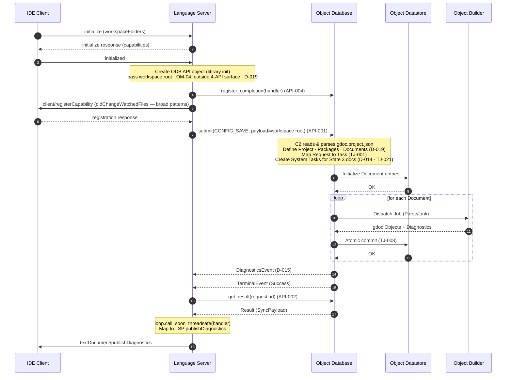

# UC-001: Open Workspace

> **Tailored template for:** gdocServer Phase 2
> **Usage:** `usecases/UC-001_OpenWorkspace.md`
> **ID rule:** Derived-requirement IDs are **namespaced per UC**: `IF/ST/DR/EH-<UC>-<NNN>` and `SCR-<COMP>-<UC>-<NNN>` (e.g. `IF-001-001`, `SCR-C1-001-001`) — numbering is **append-only within a UC**; no cross-file coordination needed
> **Terminology:** Use glossary terms from `../subcomponents/README.md` §6 exclusively

## Use Case

### ID

UC-001

### Name

Open Workspace

### Purpose

Initialize the gdoc Server workspace upon the LSP `initialize`/`initialized` handshake: the ODB identifies the
Project scope from configuration (D-019), the Frontend registers file-system watchers, and the initial build of all
Package documents is triggered so that the Datastore is populated and ready to serve subsequent language-service
requests (Hover, Go to Definition, Find References, Diagnostics).

### Actors

| Actor | Role |
| ----- | ---- |
| IDE Client | LSP protocol peer (user-initiated) |
| C1 Language Server | LSP frontend; translates protocol to ODB API |
| C2 Object Database | Orchestrates Tasks/Jobs; owns scheduling, dedup, cancellation |
| C3 Object Datastore | Internal storage; single-writer (ODB only) |
| C4 Object Builder | Plugin; executes Jobs (Parse/Link/Compile) |

### Derived From

FR-1.1 → ADR-001 → ADR-003 · NFR-1.1 → ADR-003 · FR-2.2 → ADR-009 → D-014 · D-015

### Scope Decisions Applied

- D-005 (v1 scope: sync + config + Hover + GoToDefinition + FindReferences + Diagnostics)
- D-006 (Object Server excluded from v1)
- D-014 (System Task for State 2/3 background builds)
- D-015 (Diagnostics delivery = event push)
- D-017 (Operation payload schema formalized alongside Phase 2)
- D-019 (ODB configuration ownership: the ODB reads/parses `gdoc.project.json`, not the Frontend)
- OM-04 (ODB library initialization is outside the 4-API surface)

### Preconditions

- The LSP server process is started and listening on the transport (stdio/TCP).
- The ODB library is loaded in the server process (in-memory, no persistent state).
- The workspace root directory is accessible on the file system.
- `gdoc.project.json` (or equivalent configuration) **may or may not** exist in the workspace root — its absence is a handled condition (Alt "No Project Configuration Found", EH-001-001).

### Postconditions

> Main-flow postconditions; on an Alternative Scenario's path, that scenario's terminal states hold
> instead (e.g., a cancelled Task with `reason: "system_cancelled"` per D-018; per-document commit
> state per TJ-008).

- C1: LSP session is initialized; file watchers registered; initial diagnostics published to the IDE.
- C2: All State 3 (Package member) documents have completed their initial build; System Tasks are in
  `Completed` state; no pending Jobs remain.
- C3: Document entries, gdoc Objects, and cross-document relationships are stored; dependency graph
  is populated.
- C4: All initial Parse/Link Jobs completed; diagnostics generated for each document.

---

## Analysis Focus

- LSP `initialize`/`initialized` handshake and capability registration (FR-1.1).
- Project/Package discovery by the ODB from the workspace configuration (D-019, ADR-009) and State 3
  System Task creation (D-014).
- Initial build: Job dispatch, execution, atomic commit, diagnostics push (TJ-001…TJ-021, D-015).
- Asynchronous frontend: asyncio-based handler registration and event reception (NFR-1.1, ADR-003, API-004).
- OM-04 resolution: ODB library initialization is outside the 4-API surface; the initial build is
  triggered by a `CONFIG_SAVE` submit through the 4-API.

---

## Main Scenario

1. **IDE Client** sends LSP `initialize` request with `workspaceFolders` and client capabilities.
2. **C1** matches the client's capabilities against what it will offer (hover, definition, references,
   publishDiagnostics). (Protocol-side only — D-019: C1 does **not** read or parse the workspace
   configuration; that is the ODB's.)
3. **C1** responds to the `initialize` request with server capabilities (hover, definition,
   references, publishDiagnostics).
4. **IDE Client** sends `initialized` notification, signaling readiness to receive server requests.
5. **C1** creates the **ODB API object** (library initialization, outside the 4-API surface per
   OM-04), passing the **workspace root** (and the configuration-file location, if known) (D-019).
   The ODB sets up its internal Datastore and scheduler.
6. **C1** registers its **completion handler** via `register_completion(handler)` (API-004). The
   handler posts events to C1's `asyncio` event loop via `loop.call_soon_threadsafe` (F6.3/F6.4).
7. **C1** sends `client/registerCapability` to the **IDE Client**, requesting
   `workspace/didChangeWatchedFiles` registration for the workspace's broad file patterns
   (protocol-level; the ODB owns the config-driven project/package structure, D-019).
8. **IDE Client** confirms the registration (response).
9. **C1** submits `CONFIG_SAVE` (operation, payload = workspace root + config location) to **C2** via
   `submit(request)` (API-001, D-019), conveying the initial workspace state and triggering the
   initial build. The ODB (re-)scopes from the configuration (no-op if unchanged) and dispatches.
10. **C2** reads `gdoc.project.json` in the workspace root (D-019; ADR-009) and identifies the
    **Project** scope, internal **Packages**, their document files, and content types. **C2** then
    maps the Request 1:1 to a **Task** (TJ-001). Because the Request touches State 3 documents
    (Package members), C2 creates **System Tasks** (D-014, TJ-021, `s-*` namespace) for each document
    that requires a build. System Tasks participate in the Job waiter set like any Task but are not
    cancellable by the Frontend.
11. **C2** schedules the initial-build **Jobs** in priority order (TJ-011/012) and dispatches each to
    the appropriate **C4 Object Builder** (Parse/Link), respecting dependency constraints (a document's
    references are built before the document itself if the references are not yet in the Datastore).
12. **C4** parses each document's source content, resolves links, and generates gdoc Objects plus
    diagnostics. C4 returns the results to **C2**.
13. **C2** atomically commits each successful Job's results to **C3** (TJ-008): gdoc Objects,
    cross-document relationships, and the dependency graph.
14. **C2** pushes a `DiagnosticsEvent` (D-015) for each document whose diagnostics changed (for
    the initial build, each document newly diagnosed) to **C1** via the registered handler,
    carrying the document URI and the diagnostic list.
15. **C2** pushes a `TerminalEvent` (status: `Success`) to **C1** for the initial-build Task.
16. **C1** fetches the initial-build Task's Result via `get_result(request_id)` (API-002 —
    `SyncPayload` ack: new `version_id`, affected documents; the terminal push signals readiness,
    the fetch retrieves the payload).
17. **C1** maps the received `DiagnosticsEvent` to LSP `textDocument/publishDiagnostics` and sends
    it to the **IDE Client**.
18. **IDE Client** displays diagnostics for each document.

---

## Alternative Scenarios

### No Project Configuration Found

**Condition:** `gdoc.project.json` does not exist in the workspace root.

1. (Replaces steps 10–18.) **C2** detects the missing configuration while processing `CONFIG_SAVE`
   (step 10; D-019: config reading is the ODB's) and enters **degraded mode**: no **Packages** are
   identified, no **System Tasks** are created.
2. **C1** still registers the completion handler and the broad file watchers (steps 6–8 still
   execute), so that a later `CONFIG_SAVE` (when the user creates the config) can trigger the build.
3. **C2** emits `TerminalEvent{status:Success}` for the `CONFIG_SAVE` ticket (no build triggered);
   **C1** fetches the result via `get_result` (API-002) — the `SyncPayload` carries an empty packages list.
4. **C1** relays the degraded-mode result to the IDE Client (e.g., `window/logMessage`) that no gdoc
   project was detected.

### File Watcher Registration Rejected

**Condition:** The IDE Client rejects or fails the `client/registerCapability` request.

1. (Replaces step 8.) **C1** logs the failure and retries the registration once.
2. If the retry also fails, **C1** proceeds with the initial build (step 9) but operates without live
   file-watcher updates. The user can still trigger rebuilds via `didOpen`/`didChange`/`didSave`.
3. **C1** displays a warning to the IDE Client (e.g., `window/showMessage`).

### Partial Build Failure

**Condition:** A C4 Object Builder fails to parse or link one or more documents (syntax errors,
missing references, Builder crash).

1. (Modifies steps 12–15.) **C2** marks the failed document's Task as `Completed` with diagnostics
   reflecting the errors (not `Cancelled` — the build was attempted and produced partial diagnostics).
2. **C2** continues building the remaining documents (per-document isolation).
3. **C2** pushes a `DiagnosticsEvent` for each document (successful or failed) with appropriate
   diagnostics.
4. If the failure is a Builder crash (non-cooperative), **C2** applies the run-bound timeout (TJ-019)
   and marks the Job as `Cancelled` (TJ-004); the Datastore is left in its pre-Job state (TJ-008).
   The `TerminalEvent` of the Task awaiting that Job carries `status: Cancelled` and
   `reason: "system_cancelled"` (D-018).

### Workspace Folder Change (didChangeWorkspaceFolders)

**Condition:** The user adds or removes a workspace folder after initialization.

1. **IDE Client** sends `workspace/didChangeWorkspaceFolders` notification.
2. **C1** forwards the changed workspace roots (and config location, if known) to **C2** via
   `CONFIG_SAVE` (API-001, D-019).
3. **C2** re-reads the project configuration for the changed folders (D-019) and identifies
   new/removed Packages.
4. **C2** cancels System Tasks for removed documents (D-014: cancel on config change) and creates
   new System Tasks for added documents.
5. The remaining steps follow the main scenario from step 11.

---

## Sequence Diagram

---

## Derived Requirements

### Interface (IF-)

#### IF-001-001

C1 shall process the LSP `initialize` request per LSP 3.17 and respond with server capabilities
(hover, definition, references, publishDiagnostics) before accepting the `initialized` notification.

**Owner:** C1
**Derived From:** UC-001 Main #1–3, FR-1.1

#### IF-001-002

C1 shall register `workspace/didChangeWatchedFiles` capability with the IDE Client (via
`client/registerCapability`) for the workspace's broad file patterns, before submitting the initial
build request, so that file changes during the build are captured. The config-driven project/package
structure is the ODB's (D-019); C1 registers protocol-level watchers only.

**Owner:** C1
**Derived From:** UC-001 Main #7–8, FR-1.3, D-019

#### IF-001-003

C1 shall register its completion handler via `register_completion(handler)` (API-004) before
submitting any request to C2, so that all ODB events (progress, terminal, diagnostics) are received.

**Owner:** C1
**Derived From:** UC-001 Main #6, API-004, NFR-1.1

#### IF-001-004

C1 shall submit the initial workspace state to C2 via `submit(request)` (API-001) using the
`CONFIG_SAVE` operation, conveying the workspace root and the configuration-file location (if
known); C1 shall not read or parse the configuration or pre-derive Packages/Documents/content
types — that is the ODB's (D-019, ADR-009).

**Owner:** C1
**Derived From:** UC-001 Main #9, API-001, D-019, ADR-009

### State (ST-)

#### ST-001-001

C2 shall create a System Task (D-014, `s-*` ID namespace) for each document that is a State 3
(Package member) upon receiving the initial workspace state, so that the initial build proceeds
without a client Request. System Tasks participate in the Job waiter set like any Task but are not
cancellable by the Frontend.

**Owner:** C2
**Derived From:** UC-001 Main #10, D-014, TJ-021

#### ST-001-002

C2 shall transition each initial-build Task through the lifecycle `Pending → Active → Completed`
(TJ-003) and each Job through `Queued → Running → Completed` (TJ-004) before the workspace is
considered ready.

**Owner:** C2
**Derived From:** UC-001 Main #10–13, TJ-003, TJ-004

#### ST-001-003

C2 shall ensure that all initial-build Jobs reach a terminal state (`Completed` or `Cancelled`)
before the workspace is considered ready for subsequent requests; no Job may remain in `Queued` or
`Running` indefinitely (TJ-019 run bound).

**Owner:** C2
**Derived From:** UC-001 Main #11–13, TJ-004, TJ-019

### Data (DR-)

#### DR-001-001

C3 shall store Package entries and their document memberships (which documents belong to which
Package) as part of the initial workspace state.

**Owner:** C3 (internal invariant)
**Derived From:** UC-001 Main #13, ADR-004, FR-2.2

#### DR-001-002

C3 shall store gdoc Objects and their cross-document relationships (links, dependencies) produced by
the initial build, forming the dependency graph used for subsequent change-impact analysis.

**Owner:** C3 (internal invariant)
**Derived From:** UC-001 Main #13, NFR-2.1

#### DR-001-003

C3 shall maintain the dependency graph in a state that allows C2 to identify affected scopes when a
dependency changes (NFR-2.1), supporting the State 2/3 priority model (TJ-011/012).

**Owner:** C3 (internal invariant)
**Derived From:** UC-001 Main #13, NFR-2.1, TJ-011

### Error Handling (EH-)

#### EH-001-001

C2 shall **detect** the absence of the workspace configuration while processing `CONFIG_SAVE` (D-019:
reading the config is ODB-owned) and enter **degraded mode**: no Packages identified, no System Tasks,
no initial build. C2 shall emit `TerminalEvent{status:Success}` for the `CONFIG_SAVE` ticket (no build
triggered); C1 shall fetch the result via `get_result` (API-002) and **relay** the degraded-mode outcome
to the IDE Client (e.g. via `window/logMessage`). A later `CONFIG_SAVE` (when the user creates the config)
shall then trigger the normal build.

**Owner:** C2 (detection + degraded mode) · C1 (notification)
**Derived From:** UC-001 Alt "No Project Configuration Found" · D-019

#### EH-001-002

C2 shall continue building remaining documents when a single document's build fails; a per-document
failure shall not prevent other documents from completing. Failed documents shall produce diagnostics
reflecting the errors.

**Owner:** C2
**Derived From:** UC-001 Alt "Partial Build Failure", TJ-008

#### EH-001-003

C1 shall handle file-watcher registration failure by retrying once and, if the retry fails, proceeding
without live file-watcher updates while notifying the IDE Client.

**Owner:** C1
**Derived From:** UC-001 Alt "File Watcher Registration Rejected"

#### EH-001-004

C2 shall apply the run-bound timeout (TJ-019) to any non-cooperative Builder during the initial build
and mark the Job as `Cancelled` (TJ-004) without stalling other Jobs; the Datastore remains in its
pre-Job state (TJ-008). The `TerminalEvent` of the Task awaiting the cancelled Job carries
`status: Cancelled` and `reason: "system_cancelled"` (D-018).

**Owner:** C2
**Derived From:** UC-001 Alt "Partial Build Failure", TJ-019, TJ-004, TJ-008, D-018

### Component (SCR-)

#### SCR-C1-001-001 (Language Server)

C1 shall implement the LSP `initialize`/`initialized` handshake per LSP 3.17, responding with server
capabilities (hover, definition, references, publishDiagnostics) and processing the `initialized`
notification before initiating any server-to-client requests.

**Derived From:** UC-001 Main #1–4, FR-1.1

#### SCR-C1-001-002 (Language Server)

C1 shall **forward the workspace root** (and the configuration-file location, if known) to the ODB when
creating the ODB API object (Main #5) and in the initial `CONFIG_SAVE` submission (Main #9); C1
**shall not** read or parse the workspace configuration and shall not pre-derive Packages / documents /
content types — scoping is ODB-owned (D-019; see SCR-C2-001-005).

**Derived From:** UC-001 Main #5, #9 · D-019 · ADR-009 · API-001

#### SCR-C1-001-003 (Language Server)

C1 shall register `workspace/didChangeWatchedFiles` capability with the IDE Client for all document
file patterns in the Project, and handle the registration response before submitting the initial
build.

**Derived From:** UC-001 Main #7–8, FR-1.3

#### SCR-C1-001-004 (Language Server)

C1 shall, upon the `TerminalEvent` for the initial-build Task, fetch the Task's Result via
`get_result(request_id)` (API-002), and shall publish the initial diagnostics to the IDE Client via
`textDocument/publishDiagnostics` upon receiving the `DiagnosticsEvent` (D-015) from the ODB,
mapping each document's diagnostic list to the LSP `Diagnostic` type.

**Derived From:** UC-001 Main #14–17, D-015, API-002, FR-1.2

#### SCR-C1-001-005 (Language Server)

C1 shall use `asyncio` for all I/O handling and shall register a completion handler that posts ODB
events to its event loop via `loop.call_soon_threadsafe` (or `asyncio.run_coroutine_threadsafe`),
performing no CPU work inside the handler (F6.3, F6.4).

**Derived From:** UC-001 Main #6, NFR-1.1, ADR-003, API-004

#### SCR-C2-001-001 (Object Database)

C2 shall create System Tasks (D-014, `s-*` namespace) for each State 3 (Package member) document
upon receiving the initial workspace state, so that the initial build proceeds without a client
Request. System Tasks participate in the Job waiter set like any Task but are not cancellable by the
Frontend.

**Derived From:** UC-001 Main #10, D-014, TJ-021

#### SCR-C2-001-002 (Object Database)

C2 shall schedule initial-build Jobs in priority order (TJ-011/012) and dispatch each to the
appropriate Object Builder, respecting dependency constraints (a document's references must be built
before the document itself if the references are not yet in the Datastore).

**Derived From:** UC-001 Main #11, TJ-011, TJ-012

#### SCR-C2-001-003 (Object Database)

C2 shall atomically commit each successful Job's results (gdoc Objects, relationships, diagnostics)
to the Datastore (TJ-008); a failed or cancelled Job shall commit nothing.

**Derived From:** UC-001 Main #13, TJ-008

#### SCR-C2-001-004 (Object Database)

C2 shall push a `DiagnosticsEvent` (D-015) to the Frontend via the registered handler after the
initial build produces updated diagnostics for each document (when diagnostics changed, D-015), and
shall push a `TerminalEvent` (status: `Success`) for the initial-build Task.

**Derived From:** UC-001 Main #14–15, D-015, API-004

#### SCR-C2-001-005 (Object Database)

C2 shall read and parse the workspace configuration (e.g. `gdoc.project.json`) in the workspace root,
define the **Project** scope, internal **Packages**, their document files, and content types (INV-06),
and keep the scope current on `CONFIG_SAVE` (ADR-009); on a missing or unparseable configuration it
shall enter degraded mode (EH-001-001) rather than fail the session.

**Derived From:** UC-001 Main #10 · D-019 · ADR-009 · INV-06

#### SCR-C3-001-001 (Object Datastore)

C3 shall store Package entries, document memberships, gdoc Objects, and cross-document relationships
as in-memory data structures (ADR-004, NFR-1.3), accessible only through C2 (single-writer
invariant).

**Derived From:** UC-001 Main #13, ADR-004, NFR-1.3

#### SCR-C3-001-002 (Object Datastore)

C3 shall maintain the dependency graph (cross-document links and relationships) in a form that
supports C2's change-impact analysis and State 2/3 priority derivation (TJ-011/012).

**Derived From:** UC-001 Main #13, NFR-2.1, TJ-011

#### SCR-C3-001-003 (Object Datastore)

C3 shall enforce single-context sequential access: all writes occur through C2's worker thread; C3
provides no locking, no async API, and no concurrent access (ADR-004, R-004-1).

**Derived From:** UC-001 Main #13, ADR-004, NFR-1.3

#### SCR-C4-001-001 (Object Builder)

C4 shall parse each document's source content into structured gdoc Objects, resolving internal links
and cross-document references, and return the results to C2.

**Derived From:** UC-001 Main #12, FR-2.1

#### SCR-C4-001-002 (Object Builder)

C4 shall generate diagnostics (syntax errors, semantic errors, unresolved references) during the
build and include them in the Job result returned to C2.

**Derived From:** UC-001 Main #12, FR-1.2 (Diagnostics)

#### SCR-C4-001-003 (Object Builder)

C4 shall support cooperative cancellation (TJ-019): a running initial-build Job shall observe a
cancel request promptly and commit nothing (TJ-008), so C2 can abort it if the last referencing Task
departs.

**Derived From:** UC-001 Main #12, TJ-019, TJ-008
---

## Reverse-check (Contract Cross-Reference)

| UC Requirement | Contract Rule | Status | Note |
| -------------- | ------------- | ------ | ---- |
| IF-001-001 | FR-1.1 (LSP 3.17) | ✅ | C1-internal; no TJ/API rule needed |
| IF-001-002 | FR-1.3 (sync) | ✅ | C1-internal; LSP capability registration |
| IF-001-003 | API-004 (register_completion) | ✅ | Handler registration before submit |
| IF-001-004 | API-001 (submit), D-019, ADR-009 (config) | ✅ | CONFIG_SAVE as initial-state trigger (workspace root + config location; no config parsing) |
| ST-001-001 | D-014, TJ-021 (System Task) | ✅ | State 3 → System Task |
| ST-001-002 | TJ-003 (Task states), TJ-004 (Job states) | ✅ | Lifecycle transitions |
| ST-001-003 | TJ-004, TJ-019 (run bound) | ✅ | Terminal state guarantee |
| DR-001-001 | ADR-004 (Datastore internal) | ✅ | Package/Document storage |
| DR-001-002 | NFR-2.1 (dependency tracking) | ✅ | Relationship storage |
| DR-001-003 | NFR-2.1, TJ-011 | ✅ | Dependency graph for priority |
| EH-001-001 | D-019, ADR-009 | ⚠️ | C2 detects missing config (D-019); C1 notifies the client (LSP-*/ODB-* in Phase 3) |
| EH-001-002 | TJ-008 (atomic commit) | ✅ | Per-document isolation |
| EH-001-003 | — | ⚠️ | C1-internal; allocated to LSP-* in Phase 3 |
| EH-001-004 | TJ-019, TJ-004, TJ-008, D-018 | ✅ | Run bound + cancel + no-commit + reason |
| SCR-C1-001-001 | FR-1.1 | ✅ | LSP compliance |
| SCR-C1-001-002 | D-019, API-001 | ✅ | Forwards workspace root + config location to ODB (no config parsing) |
| SCR-C1-001-003 | FR-1.3 | ✅ | File watcher registration |
| SCR-C1-001-004 | D-015, FR-1.2 | ✅ | DiagnosticsEvent → publishDiagnostics |
| SCR-C1-001-005 | NFR-1.1, ADR-003, F6.3/F6.4 | ✅ | asyncio + thread-safe handler |
| SCR-C2-001-001 | D-014, TJ-021 | ✅ | System Task creation |
| SCR-C2-001-002 | TJ-011, TJ-012 | ✅ | Priority-ordered dispatch |
| SCR-C2-001-003 | TJ-008 | ✅ | Atomic commit |
| SCR-C2-001-004 | D-015, API-004 | ✅ | DiagnosticsEvent + TerminalEvent push |
| SCR-C2-001-005 | D-019, ADR-009, INV-06 | ✅ | ODB reads/parses config; defines Project scope, Packages, content types |
| SCR-C3-001-001 | ADR-004, NFR-1.3 | ✅ | In-memory storage, single-writer |
| SCR-C3-001-002 | NFR-2.1, TJ-011 | ✅ | Dependency graph |
| SCR-C3-001-003 | ADR-004, R-004-1 | ✅ | Single-context sequential access |
| SCR-C4-001-001 | FR-2.1 | ✅ | Parse + link |
| SCR-C4-001-002 | FR-1.2 (Diagnostics) | ✅ | Diagnostic generation |
| SCR-C4-001-003 | TJ-019, TJ-008 | ✅ | Cooperative cancellation |

> **Status:** ✅ = satisfied · ⚠️ = partial / needs contract extension · ❌ = contract gap
>
> **Gap analysis:** EH-001-001 (missing config) is now **detected by C2** (D-019: the ODB reads the config and detects its absence); the LSP-side notification is C1's. EH-001-003 (watcher registration failure) is C1-internal. Neither requires a Phase-1 contract extension; both will be allocated to `LSP-*` / `ODB-*` in Phase 3.
---

## Traceability Matrix

| ID | Type | Description | Scenario Step | Owner |
| -- | ---- | ----------- | ------------- | ----- |
| IF-001-001 | Interface | LSP initialize/initialized handshake | Main #1–3 | C1 |
| IF-001-002 | Interface | Broad file-watcher registration (protocol-level; D-019) | Main #7–8 | C1 |
| IF-001-003 | Interface | Completion handler registration (API-004) | Main #6 | C1 |
| IF-001-004 | Interface | Initial workspace state submit (API-001, CONFIG_SAVE) | Main #9 | C1 |
| ST-001-001 | State | System Task creation for State 3 docs (D-014) | Main #10 | C2 |
| ST-001-002 | State | Task/Job lifecycle transitions (TJ-003/004) | Main #10–13 | C2 |
| ST-001-003 | State | All Jobs reach terminal state (TJ-019) | Main #11–13 | C2 |
| DR-001-001 | Data | Package/Document entry storage | Main #13 | C3 |
| DR-001-002 | Data | gdoc Objects + relationship storage | Main #13 | C3 |
| DR-001-003 | Data | Dependency graph maintenance | Main #13 | C3 |
| EH-001-001 | Error | Missing project config handling (detected by C2, D-019) | Alt "No Project Config" | C2 (detection) · C1 (notification) |
| EH-001-002 | Error | Per-document build failure isolation | Alt "Partial Build" | C2 |
| EH-001-003 | Error | File watcher registration failure | Alt "Watcher Rejected" | C1 |
| EH-001-004 | Error | Non-cooperative Builder timeout (TJ-019, D-018) | Alt "Partial Build" | C2 |
| SCR-C1-001-001 | Component | LSP initialize/initialized implementation | Main #1–4 | C1 |
| SCR-C1-001-002 | Component | Forwards workspace root + config location to ODB at API creation and CONFIG_SAVE (D-019) | Main #5, #9 | C1 |
| SCR-C1-001-003 | Component | File watcher registration + response handling | Main #7–8 | C1 |
| SCR-C1-001-004 | Component | Result fetch (API-002) + DiagnosticsEvent → publishDiagnostics mapping | Main #14–17 | C1 |
| SCR-C1-001-005 | Component | asyncio handler + thread-safe event posting | Main #6 | C1 |
| SCR-C2-001-001 | Component | System Task creation (D-014, TJ-021) | Main #10 | C2 |
| SCR-C2-001-002 | Component | Priority-ordered Job dispatch | Main #11 | C2 |
| SCR-C2-001-003 | Component | Atomic commit (TJ-008) | Main #13 | C2 |
| SCR-C2-001-004 | Component | DiagnosticsEvent + TerminalEvent push (D-015) | Main #14–15 | C2 |
| SCR-C2-001-005 | Component | Read/parse config; define Project scope, Packages, content types (D-019, ADR-009) | Main #10 | C2 |
| SCR-C3-001-001 | Component | In-memory storage, single-writer (ADR-004) | Main #13 | C3 |
| SCR-C3-001-002 | Component | Dependency graph for priority (TJ-011) | Main #13 | C3 |
| SCR-C3-001-003 | Component | Single-context sequential access (R-004-1) | Main #13 | C3 |
| SCR-C4-001-001 | Component | Parse + link + return gdoc Objects | Main #12 | C4 |
| SCR-C4-001-002 | Component | Diagnostic generation during build | Main #12 | C4 |
| SCR-C4-001-003 | Component | Cooperative cancellation (TJ-019) | Main #12 | C4 |

---
