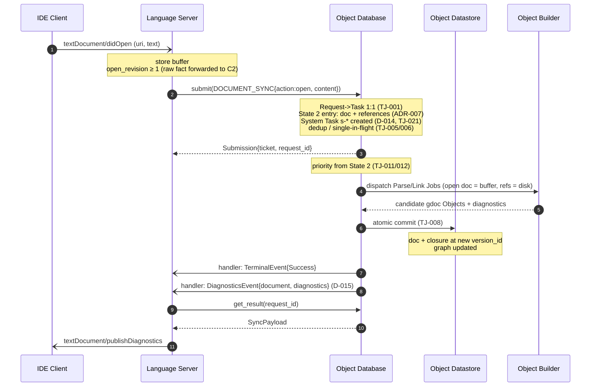

# UC-002: Open Text

> **Tailored template for:** gdocServer Phase 2
> **Usage:** `usecases/UC-002_OpenText.md`
> **ID rule:** Derived-requirement IDs are **namespaced per UC**: `IF/ST/DR/EH-<UC>-<NNN>` and `SCR-<COMP>-<UC>-<NNN>` (e.g. `IF-002-001`, `SCR-C1-002-001`) — numbering is **append-only within a UC**; no cross-file coordination needed
> **Terminology:** Use glossary terms from `../subcomponents/README.md` §6 exclusively

## Use Case

### ID

UC-002

### Name

Open Text

### Purpose

When the user opens a text document in the IDE, the gdoc Server synchronizes the document (buffer
content from `textDocument/didOpen`), brings the document and the documents it references into
**State 2**, triggers the background build of that reference closure through a **System Task**
(D-014), and delivers fresh diagnostics to the IDE — so that subsequent language-service requests
(Hover, Go to Definition, Find References) are immediately answerable and the Datastore reflects the
latest editor buffer rather than a stale disk version.

### Actors

| Actor | Role |
| ----- | ---- |
| IDE Client | LSP protocol peer (user-initiated) |
| C1 Language Server | LSP frontend; translates protocol to ODB API |
| C2 Object Database | Orchestrates Tasks/Jobs; owns scheduling, dedup, cancellation |
| C3 Object Datastore | Internal storage; single-writer (ODB only) |
| C4 Object Builder | Plugin; executes Jobs (Parse/Link/Compile) |

### Derived From

FR-1.3 → ADR-002 → ADR-006 → D-014 → TJ-021 · NFR-2.3 → ADR-007 → TJ-011/012 · D-004 (version_id) →
TJ-005/018 · D-015 (diagnostics push) → §5.2 · D-016 (payload discriminator) · NFR-1.3 → ADR-004

### Scope Decisions Applied

- D-005 (v1 scope: sync + config + Hover + GoToDefinition + FindReferences + Diagnostics)
- D-014 (System Task on State 2 entry — trigger: open file **and** the documents it references, per ADR-007 / FU-07)
- D-015 (Diagnostics delivery = `DiagnosticsEvent` push)
- D-016 (`DOCUMENT_SYNC` payload discriminator `action:"open"`)
- D-004 (`version_id` = (last_save_timestamp, open_revision); open file → buffer content)
- D-017 (payload schema formalization: `DOCUMENT_SYNC` requires `action`, `content?`)
- NFR-1.4 (progress only applies if C2 tickets the sync; inline ack is permitted for light sync)

### Preconditions

- Workspace initialized (UC-001 complete): ODB API object obtained, completion handler registered
  (API-004), Project/Package scope known, file watchers active.
- The document is readable: buffer content is provided in the `didOpen` notification (LSP always
  sends full text on open).
- The document may or may not already have a Datastore entry (e.g., already built during UC-001 for
  package members).

### Postconditions

- C1: document tracked as **open** (buffer = source of truth for its content); `open_revision`
  initialized (≥1) and ready to advance on `didChange`; the latest `DiagnosticsEvent` for the
  document has been published via `textDocument/publishDiagnostics`.
- C2: the State-2 **System Task** for the document (and its reference closure) is terminal
  (`Completed`); no Job for the document's dedup key is in flight; the System Task is **not**
  cancellable by the Frontend (D-014).
- C3: Datastore holds the document entry at the new `version_id` with the latest committed gdoc
  Objects, diagnostics, and reference-closure relationships; freshness invariant holds (TJ-018).
- C4: the Parse/Link Jobs for the reference closure completed (or committed nothing, if failed);
  diagnostics were produced during the build.

---

## Analysis Focus

- `didOpen` → `DOCUMENT_SYNC{action:"open", content}` translation (D-016, D-017; API-001).
- State 2 entry (open file **and** its references, ADR-007) → System Task creation (D-014, TJ-021).
- `version_id` for an **open** file (D-004): `open_revision` ≥ 1, content = **buffer**, not disk.
- Dedup & single-in-flight for the reference closure (TJ-005/006), priority from State 2 (TJ-011/012).
- Diagnostics delivery as server→client push (`DiagnosticsEvent`, D-015) — not a client pull.
- Buffer-vs-disk freshness: late-arriving results must not overwrite a newer revision (TJ-018).

---

## Main Scenario

1. **IDE Client** sends `textDocument/didOpen` with the document uri and full buffer text.
2. **C1** stores the buffer, maps the uri to an internal `DocumentRef`, and forwards the raw sync
   fact `open_revision` ≥ 1 for the **open** file (D-004) — the `version_id` key is owned & composed by C2.
3. **C1** submits a `Request{ operation: DOCUMENT_SYNC, documents: [doc], payload:
   {action:"open", content:<buffer>}, priority_hint }` to the ODB (API-001, D-016/D-017).
4. **C2** maps the Request 1:1 to a Task (TJ-001), moves the document into **State 2** (open file
   **and** its reference closure, ADR-007), and creates (or reuses) the **System Task** (D-014,
   TJ-021) whose Job set builds the reference closure depth-ordered (TJ-011).
5. **C2** registers the closure's Jobs under their dedup keys (TJ-005/006); any Job already in
   flight for the same key is **not** duplicated — the Task joins its waiter set.
6. **C2** dispatches the Parse/Link Jobs to the appropriate **C4** Builder(s) (per content type,
   ADR-005/TJ-020); the Builder reads the open document's content from the **buffer** supplied in
   the payload and non-open referenced documents from **disk** (D-004).
7. **C4** returns the candidate gdoc Objects plus diagnostics for the closure.
8. **C2** atomically commits the candidate results into **C3** (TJ-008) — Datastore entries for the
   document + closure at their new `version_id`s, relationships and dependency graph updated — and
   marks the Task/System Task `Completed` (TJ-003).
9. **C2** pushes a `TerminalEvent{status:Success}` for the sync Task (API-004) and, because
   diagnostics changed, a `DiagnosticsEvent{document:doc, diagnostics}` (D-015, §5.2).
10. **C1** receives the events on its handler thread; it hands them onto its asyncio loop
    (`call_soon_threadsafe`, F6.3/F6.4), fetches the `SyncPayload` via `get_result` (API-002), and
    publishes the diagnostics to the IDE.
11. **IDE Client** receives `textDocument/publishDiagnostics` for the open document and shows the
    current error/warning state.

---

## Alternative Scenarios

### A — Already built (fresh in Datastore)

**Condition:** Step 4 — the document and its closure were already built and committed (e.g., during
UC-001, and no newer `version_id` exists).

1. C2 finds all required Jobs `Completed` for the closure's dedup keys; no new Job is scheduled.
2. C2 completes the Task inline and returns `Submission{kind:"inline", result:Success{SyncPayload}}`
   (API-001) — no ticket, no progress stream.
3. If the document's diagnostics changed (e.g., a referenced document changed on disk), C2 still
   pushes a `DiagnosticsEvent` (D-015).
4. C1 publishes diagnostics (if pushed) and continues; the state effect of "open" (State 2 entry,
   System Task lifecycle) still applies even though no build ran.

### B — Shared Job already awaited by another Task

**Condition:** Step 5 — another Task (e.g., a pending Hover from UC-008) already awaits a Job with
the same dedup key as part of this closure.

1. C2 joins the existing Job's **waiter set** instead of starting a new Job (TJ-006); the 1:1
   Request↔Task invariant still holds (TJ-001).
2. The Job inherits the **highest priority** of all waiters (TJ-009); if this Task is lower
   priority, it simply waits.
3. On completion, every waiter completes (TJ-008 commit, TJ-003).
4. If a waiter's own Frontend cancels its Task, the Job is canceled **only** when the last waiter
   departs (TJ-007); the other waiters are unaffected.

### C — Parse error in the document or a reference

**Condition:** Step 7 — C4 detects syntax errors while parsing the open document or a referenced
document.

1. C4 returns the candidate result with the syntax-error diagnostics embedded (a document with
   syntax errors still yields a committable parse result with diagnostics).
2. C2 commits the candidate atomically (TJ-008) and completes the Task with `Success`.
3. C2 pushes a `DiagnosticsEvent` carrying the errors; C1 publishes them to the IDE
   (`publishDiagnostics`).
4. If instead the Builder job **fails** (no usable candidate), C2 marks the Task `Error`
   (`E_BUILD_FAILED`, §5.1), commits **nothing** (Datastore left in its pre-Job state, TJ-008), and
   pushes `TerminalEvent{status:Error}`; C1 surfaces an appropriate LSP notification.

### D — Document not part of any Package

**Condition:** Step 4 — the opened document is not a member of any Package (workspace-only).

1. C2 still creates the State-2 System Task for the open document and its reference closure
   (D-014 — State 2 does not require package membership).
2. Priority of the closure's Jobs follows ADR-007: referenced-by-open still outranks workspace-only
   non-referenced documents (TJ-011); the document itself carries no State-3 package bonus.
3. The flow is otherwise identical to the main scenario.

### E — Reference changed on disk after `didOpen` accepted

**Condition:** Between steps 4 and 8, a referenced (non-open) document is changed on disk.

1. C4 reads non-open references from **disk** at build time (D-004), so the closure is built from
   the on-disk content that existed when the Job ran.
2. The subsequent `WATCHED_FILES{changed}` (UC-005) submits a newer `version_id` for that document;
   its dedup key (TJ-005) differs, so a fresh Job is scheduled — the stale Job's committed state is
   superseded, never mixed.
3. The Datastore freshness invariant (TJ-018) is checked per `version_id`; a late-arriving result
   for an older revision never overwrites the newer committed state.

---

## Sequence Diagram

---

## Derived Requirements

### Interface (IF-)

#### IF-002-001

C1 **shall** translate `textDocument/didOpen` (uri, text) into a `Request` with
`operation: DOCUMENT_SYNC`, `payload.action: "open"`, and the buffer text in `payload.content`,
then submit it via API-001; the ODB never sees LSP-specific fields.

**Owner:** C1
**Derived From:** UC-002 Main #1–3 · D-016 (payload discriminator) · D-017 (payload schema) · API-001/§4

#### IF-002-002

C1 **shall** consume the ODB handler events for a sync Task (`TerminalEvent`) and the document-
scoped `DiagnosticsEvent` (D-015) on the registered completion channel, hand them onto its asyncio
loop using `call_soon_threadsafe` / `run_coroutine_threadsafe` only, and publish the diagnostics to
the IDE via `textDocument/publishDiagnostics`.

**Owner:** C1
**Derived From:** UC-002 Main #9–11 · API-004 · F6.3/F6.4 · D-015

#### IF-002-003

C1 **shall** forward the raw sync fact `open_revision` ≥ 1 for the open
document, with content sourced from the **buffer**; C2 (ODB) owns & composes the
`version_id` key and uses it as the dedup-key version and the Datastore freshness key.

**Owner:** C1
**Derived From:** UC-002 Main #2 · D-004 · TJ-005/018 · §4.3 (DocumentRef)

### State (ST-)

#### ST-002-001

C2 **shall** move the document — **and the documents it references** (reference closure, per
ADR-007) — into **State 2** upon processing `DOCUMENT_SYNC{action:"open"}`, and **shall** create
(or reuse) a **System Task** (`s-*` namespace) for the closure build (D-014, TJ-021); the System
Task participates in the Job waiter set like any Task but is **not** cancellable by the Frontend.

**Owner:** C2
**Derived From:** UC-002 Main #4 · D-014 · TJ-021 · ADR-007

#### ST-002-002

C2 **shall** map the sync Request 1:1 to a Task (TJ-001) and drive it to a terminal state
(`Completed` on success, `Error` on Builder failure) before the corresponding `TerminalEvent` is
pushed; a `Success` result reflects a **committed** state only.

**Owner:** C2
**Derived From:** UC-002 Main #3–8 · TJ-001/003/008 · API-001 · §5

### Data (DR-)

#### DR-002-001

C3 **shall** store the open document's committed gdoc Objects, diagnostics, and reference-closure
relationships at the new `version_id`, keeping the Datastore in the pre-Job state when a Job is
canceled or fails (no partial results exposed); the document's "open" flag (buffer vs disk
source) **shall** be tracked so reads for that document use buffer content.

**Owner:** C3 (internal invariant)
**Derived From:** UC-002 Main #8, Alt C · TJ-008 · ADR-004 · D-004

#### DR-002-002

C3 **shall** maintain the dependency graph entry for the opened document and its references so
that (a) State-2 priority derivation (TJ-011) and (b) the freshness invariant (TJ-018) can be
evaluated without a public API (single-writer: C2 only).

**Owner:** C3 (internal invariant)
**Derived From:** UC-002 Main #8 · NFR-2.1 · TJ-011/018 · ADR-004

### Error Handling (EH-)

#### EH-002-001

On a parse error, C2 **shall** still commit the candidate (partial parse + diagnostics) on
Builder success and push a `DiagnosticsEvent` so the IDE shows the errors; the open remains
functional (subsequent UCs may still query the built parts).

**Owner:** C2
**Derived From:** UC-002 Alt C · D-015 · TJ-008 · §5.1

#### EH-002-002

On a Builder **failure** (no usable candidate) or run-bound timeout, C2 **shall** commit nothing,
terminal the Task with `Error` (`E_BUILD_FAILED` / `E_TIMEOUT`), and push
`TerminalEvent{status:Error}`; the Datastore remains in its pre-Job state.

**Owner:** C2
**Derived From:** UC-002 Alt C · TJ-008/019 · §5.1 (ErrorCode)

### Component (SCR-)

#### SCR-C1-002-001 (Language Server)

C1 **shall** implement `textDocument/didOpen` handling: buffer storage, `DocumentRef`/`open_revision`
raw-fact forwarding (open_revision ≥ 1), and translation to `DOCUMENT_SYNC{action:"open", content}` per
D-016/D-017, submitted through the ODB API (asyncio-based, non-blocking).

**Derived From:** UC-002 Main #1–3 · FR-1.3 · NFR-1.1 · API-001 · D-016/D-017

#### SCR-C1-002-002 (Language Server)

C1 **shall** map a `DiagnosticsEvent` for a known open document to `textDocument/publishDiagnostics`
(uri + diagnostics list), replacing the previous published set for that document; unknown/foreign
events are ignored (cross-Frontend isolation, API-004).

**Derived From:** UC-002 Main #11 · D-015 · §5.2

#### SCR-C2-002-001 (Object Database)

C2 **shall** process `DOCUMENT_SYNC{action:"open"}` by: State-2 transition (doc + references),
System Task creation (D-014/TJ-021), dedup-aware Job scheduling of the closure (TJ-005/006/011/012),
atomic commit (TJ-008), and pushing `TerminalEvent` + `DiagnosticsEvent` (D-015) — all without
branching on the originating protocol (TJ-010 / R-008-2).

**Derived From:** UC-002 Main #4–9 · TJ-001…TJ-012, TJ-021 · D-014 · D-015 · API-001/002/004

#### SCR-C2-002-002 (Object Database)

C2 **shall** keep the Datastore in the pre-Job state on any canceled/failed Job for the closure and
never expose partial results (TJ-008); a stale-revision result **shall not** overwrite a newer
committed state (TJ-018).

**Derived From:** UC-002 Main #8, Alt C/E · TJ-008/018 · R-006-1

#### SCR-C3-002-001 (Object Datastore)

C3 **shall** expose (to C2 only) synchronous, in-memory operations for: upsert of a document entry
(objects + diagnostics + version_id + open flag), upsert of closure relationships, and graph lookup
for State-2 priority — with single-writer discipline (writes issued by C2 sequentially; no internal
locking, ADR-004).

**Derived From:** UC-002 Main #8 · ADR-004 · NFR-1.3 · TJ-018

#### SCR-C4-002-001 (Object Builder)

C4 **shall** parse and link the open document (content from the buffer supplied in the payload)
and its referenced documents (content from disk, per D-004), producing the candidate gdoc Objects
plus diagnostics; it **shall** support cooperative cancellation and expose its dedup-key derivation
for the content type (TJ-019/020).

**Derived From:** UC-002 Main #6–7 · FR-2.1 · FR-4.1 · ADR-005 · D-004 · TJ-019/020

---

## Reverse-check (Contract Cross-Reference)

| UC Requirement | Contract Rule | Status | Note |
| -------------- | ------------- | ------ | ---- |
| IF-002-001 | API-001, §4 (Request model), D-016/D-017 | ✅ | `DOCUMENT_SYNC{action:"open", content}` is a named v1 operation with a defined payload |
| IF-002-002 | API-004, §5.2, F6.3/F6.4, D-015 | ✅ | `request_id` optional for `DiagnosticsEvent` — NC-06 / P2-003 resolved 2026-09-15 (user-approved), applied to §5.2 |
| IF-002-003 | TJ-005/018, D-004, §4.3 | ✅ | `version_id` tuple + buffer-vs-disk source is fixed by D-004 |
| ST-002-001 | TJ-021, TJ-001 (extended trigger), ADR-007 | ✅ | System Task trigger + s-* namespace + not Frontend-cancellable |
| ST-002-002 | TJ-001/003/008, API-001, §5 | ✅ | 1:1 mapping, terminal-before-push, committed-only Success |
| DR-002-001 | TJ-008, ADR-004, D-004 | ✅ | Atomic commit; pre-Job state on cancel; open flag = buffer source |
| DR-002-002 | NFR-2.1, TJ-011/018, ADR-004 | ✅ | Graph + freshness invariant, C2-only access |
| EH-002-001 | D-015, TJ-008, §5.1 | ✅ | Diagnostics push on build with errors |
| EH-002-002 | TJ-008/019, §5.1 (E_BUILD_FAILED/E_TIMEOUT) | ✅ | No commit on failure; terminal Error |
| SCR-C1-002-001 | API-001, D-016/D-017 | ✅ | Frontend translation is C1's (R-008-1) |
| SCR-C1-002-002 | D-015, §5.2 | ✅ | NC-06 / P2-003 resolved 2026-09-15 — handler may be invoked without `request_id` for document-scoped pushes |
| SCR-C2-002-001 | TJ-001…012/021, D-014, D-015, API-001/002/004 | ✅ | ODB processing pipeline fully ruled |
| SCR-C2-002-002 | TJ-008/018, R-006-1 | ✅ | Pre-Job state on failure; no stale overwrite |
| SCR-C3-002-001 | ADR-004, NFR-1.3, TJ-018 | ✅ | Single-writer, synchronous, in-memory |
| SCR-C4-002-001 | FR-2.1/4.1, ADR-005, D-004, TJ-019/020 | ✅ | Parse/link/diagnostics + cancel + dedup-key derivation |

> **Status:** ✅ = satisfied · ⚠️ = partial / needs contract extension · ❌ = contract gap
>
> **Resolved (IF-002-002 / SCR-C1-002-002 — NC-06 / P2-003):** this UC establishes the **"YES" branch** — the System-Task reference-closure build (D-014) produces diagnostics for *referenced* documents with **no** triggering client request, so a request-less push **exists**. **Resolution (Option A, user-approved 2026-09-15, applied to `frontend-odb-api.md` §5.2):** `request_id` is **optional** for `DiagnosticsEvent`/`ExpiryEvent` (document-/operation-scoped); the handler may be invoked without a `request_id`, and the Frontend routes by `document`. `ProgressEvent`/`TerminalEvent` keep `request_id` **required**. No API operation changed; the two ⚠️ above are now ✅.

---

## Traceability Matrix

| ID | Type | Description | Scenario Step | Owner |
| -- | ---- | ----------- | ------------- | ----- |
| IF-002-001 | Interface | didOpen → DOCUMENT_SYNC{open} translation | Main #1–3 | C1 |
| IF-002-002 | Interface | Handler event consumption + publishDiagnostics | Main #9–11 | C1 |
| IF-002-003 | Interface | raw sync fact forwarding (open_revision ≥ 1, open file); version_id owned & composed by C2 | Main #2 | C1 |
| ST-002-001 | State | State 2 entry + System Task creation (D-014) | Main #4 | C2 |
| ST-002-002 | State | Task lifecycle → terminal before push | Main #3–8 | C2 |
| DR-002-001 | Data | Document entry at new version_id, open flag | Main #8 | C3 |
| DR-002-002 | Data | Dependency graph + freshness invariant | Main #8 | C3 |
| EH-002-001 | Error | Parse error → diagnostics push, open still functional | Alt C | C2 |
| EH-002-002 | Error | Builder failure → no commit, terminal Error | Alt C | C2 |
| SCR-C1-002-001 | Component | didOpen handler + translation (asyncio) | Main #1–3 | C1 |
| SCR-C1-002-002 | Component | DiagnosticsEvent → publishDiagnostics | Main #11 | C1 |
| SCR-C2-002-001 | Component | DOCUMENT_SYNC processing pipeline | Main #4–9 | C2 |
| SCR-C2-002-002 | Component | No-commit on failure; no stale overwrite | Main #8, Alt C/E | C2 |
| SCR-C3-002-001 | Component | In-memory upsert + graph, single-writer | Main #8 | C3 |
| SCR-C4-002-001 | Component | Parse/link + diagnostics + cancel + dedup key | Main #6–7 | C4 |

---
