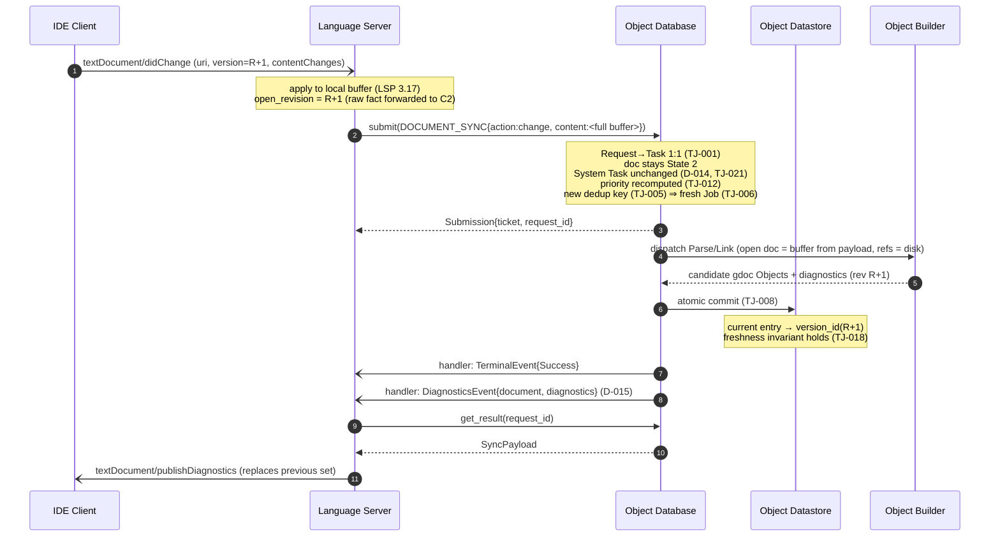

# UC-003: Edit Text

> **Tailored template for:** gdocServer Phase 2
> **Usage:** `usecases/UC-003_EditText.md`
> **ID rule:** Derived-requirement IDs are **namespaced per UC**: `IF/ST/DR/EH-<UC>-<NNN>` and `SCR-<COMP>-<UC>-<NNN>` (e.g. `IF-003-001`, `SCR-C1-003-001`) — numbering is **append-only within a UC**; no cross-file coordination needed
> **Terminology:** Use glossary terms from `../subcomponents/README.md` §6 exclusively

## Use Case

### ID

UC-003

### Name

Edit Text

### Purpose

When the user edits an **already-open** document in the IDE, the gdoc Server must (a) absorb the new
buffer state, (b) invalidate the previous revision and rebuild the affected document (and any part of
its reference closure whose inputs changed) through the ODB/Builder pipeline, and (c) re-emit the
document's diagnostics — so that the IDE's feedback loop (diagnostics, and subsequent Hover/Go to
Definition/Find References requests) answers from the **latest buffer** at the correct `version_id`
rather than from a stale revision or a stale disk version. Unlike `Open Text` (UC-002), this is **not**
a state transition: the document is already in **State 2** with a live **System Task** (D-014); the
edit only advances the `open_revision` (D-004), which changes the dedup key (TJ-005) and triggers
priority recomputation (TJ-012).

### Actors

| Actor | Role |
| ----- | ---- |
| IDE Client | LSP protocol peer (user-initiated) |
| C1 Language Server | LSP frontend; translates protocol to ODB API |
| C2 Object Database | Orchestrates Tasks/Jobs; owns scheduling, dedup, cancellation |
| C3 Object Datastore | Internal storage; single-writer (ODB only) |
| C4 Object Builder | Plugin; executes Jobs (Parse/Link/Compile) |

### Derived From

FR-1.3 → ADR-002 → TJ-001 · D-004 (`version_id` / buffer source) → TJ-005/018 · NFR-2.3 →
ADR-007 → TJ-011/012 · D-014 (System Task persists; no re-creation) → TJ-021 · D-015 (diagnostics
push) → §5.2 · D-016 (`action:"change"`) + D-017 (payload `action` + `content`) · NFR-1.3 → ADR-004

### Scope Decisions Applied

- D-005 (v1 scope: sync + config + Hover + GoToDefinition + FindReferences + Diagnostics)
- D-014 (System Task from UC-002 **stays alive** — a `change` is an interaction, not a state
  transition; the System Task is never recreated, cancelled, or Frontend-cancellable)
- D-015 (diagnostics delivery = `DiagnosticsEvent` push; `request_id` optional for
  `DiagnosticsEvent` per NC-06 / P2-003)
- D-016 (`DOCUMENT_SYNC` payload discriminator `action:"change"`)
- D-017 (payload schema: `DOCUMENT_SYNC` requires `action`, `content?`)
- D-004 (`version_id` = (last-save mtime, `open_revision`); open file → content from **buffer**)
- D-010 (v1 is single-executor / non-preemptive — a running Job for an older revision is **not**
  preempted by a newer edit; liveness via dispatch order + run bound, TJ-015/019)
- NFR-1.4 (progress only applies if C2 tickets the sync; inline ack is permitted for light sync)

### Preconditions

- Workspace initialized (UC-001 complete): ODB API object obtained, completion handler registered
  (API-004).
- Document **open** (UC-002 complete): C1 tracks the buffer; `open_revision` ≥ 1; the document is in
  **State 2** with a live System Task (`s-*`, D-014); the Datastore holds the document at some
  `version_id` (or the last build failed, leaving the pre-Job state).
- The `didChange` notification carries a monotonically increasing `version` (LSP 3.17) that is
  strictly greater than the revision last submitted for this document.
- **Content availability note (contract-driven):** the ODB and Builder have **no** direct access to
  C1's buffer (§4.3 C1 obligation), so every `action:"change"` Request **must** carry the full updated
  buffer content in `payload.content` — the ODB cannot reconstruct it from previous submissions.

### Postconditions

- C1: local buffer reflects the edit; `open_revision` = latest `didChange` version; the latest
  `DiagnosticsEvent` for the document has been published via `textDocument/publishDiagnostics`
  (replacing the previously published set).
- C2: the sync Task for this revision is terminal (`Completed` or `Error`); no Job for the
  **new** dedup key is in flight; the document **remains** in State 2; the pre-existing System Task
  is **not** recreated or cancelled (TJ-021).
- C3: Datastore holds the document's "current" entry at the new `version_id` **iff** the build
  succeeded (atomic, TJ-008); otherwise the pre-Job state is preserved (TJ-008); a stale-revision
  result can never become the "current" entry once a newer revision has committed (TJ-018).
- C4: the Parse/Link Jobs for the new revision completed (or committed nothing, if failed/cancelled);
  diagnostics for the new revision were produced during the build.

---

## Analysis Focus

- `didChange` → `DOCUMENT_SYNC{action:"change", content:<full updated buffer>}` translation
  (D-016, D-017, §4.3 C1 obligation; API-001) — including LSP incremental vs full sync handling in C1.
- `open_revision` advance ⇒ new `version_id` ⇒ **new dedup key** ⇒ a **fresh Job** is scheduled even
  if the previous revision's Job is still in flight (TJ-005/006, D-004, TJ-018).
- **No state transition** and **no System Task churn**: the document stays State 2 and the existing
  `s-*` System Task keeps its waiter-set membership (D-014, TJ-021); the edit only triggers
  **priority recomputation** (TJ-012) — distinct from State-1 pinning.
- Rapid successive edits (debounce-free, server-side coalescing via dedup/single-in-flight): the
  latest revision must always win (TJ-006, TJ-018), without preemption (D-010, TJ-015).
- **Stale queued Job** for a superseded revision: dispatching it would waste Builder work (TJ-019) —
  the ODB **should** skip it at dispatch time (analysis finding, see ST-003-002).
- Diagnostics for the new revision delivered as `DiagnosticsEvent` push (D-015), replacing the
  previously published set for the document.
- Buffer-vs-disk freshness: a late-arriving result for an older revision must never overwrite the
  committed state of the newer revision (TJ-018, R-006-1/2).

---

## Main Scenario

1. **IDE Client** sends `textDocument/didChange` (uri, `version` = previous revision + 1, full or
   incremental `TextDocumentContentChangeEvent[]`) for an open document.
2. **C1** applies the change to its local buffer (LSP 3.17 full/incremental semantics — C1's own
   responsibility), sets `open_revision` = the new `version`, and submits a `Request{ operation:
   DOCUMENT_SYNC, documents: [doc], payload: {action:"change", content:<full updated buffer>},
   priority_hint }` to the ODB (API-001, D-016/D-017, §4.3), forwarding the raw `open_revision`
   fact — the `version_id` key is owned & composed by C2.
3. **C2** maps the Request 1:1 to a Task (TJ-001). The document **stays** in State 2; the edit is an
   **interaction**, so C2 recomputes scheduling priorities (TJ-012) — no System Task creation or
   cancellation (D-014, TJ-021).
4. **C2** computes the Job dedup key `(file, version=new revision, inputs)` (TJ-005) — it differs
   from the previous revision's key, so no existing in-flight Job satisfies it: C2 schedules a
   **fresh** Parse/Link Job (TJ-006 guarantees at most one in flight per key).
5. **C2** dispatches the Job to the appropriate **C4** Builder (per content type, ADR-005/TJ-020);
   the Builder builds the open document from the **buffer content supplied in the payload** (not from
   disk, D-004/§4.3) and its referenced (non-open) dependencies from disk.
6. **C4** returns the candidate gdoc Objects plus diagnostics for the new revision.
7. **C2** atomically commits the candidate into **C3** (TJ-008) — the document entry's "current"
   pointer moves to the new `version_id` — and marks the Task `Completed` (TJ-003).
8. **C2** pushes `TerminalEvent{status:Success}` for the sync Task (API-004) and a
   `DiagnosticsEvent{document:doc, diagnostics}` for the new revision (D-015, §5.2).
9. **C1** receives the events on its handler thread, hands them onto its asyncio loop
   (`call_soon_threadsafe`, F6.3/F6.4), fetches the `SyncPayload` via `get_result` (API-002), and
   publishes the diagnostics.
10. **IDE Client** receives `textDocument/publishDiagnostics` for the document, replacing the
    previously published set; the user sees the updated error/warning state.

---

## Alternative Scenarios

### A — Rapid successive edits (two `didChange`s before the first build commits)

**Condition:** Steps 2–5 — the user keeps typing; `didChange` for revision R+1 arrives while the Job
for revision R is still queued or running.

1. C1 applies the second edit to its buffer (`open_revision` = R+1) and submits a second
   `DOCUMENT_SYNC{action:"change"}` with the same document at the new `version_id`.
2. C2's dedup key for R+1 differs from R's (TJ-005) → a **second, fresh** Job is scheduled (TJ-006:
   each key has at most one in-flight Job; the keys are distinct, so no conflict).
3. v1 does not preempt: if R's Job is **running**, it runs to its (bounded) completion (D-010,
   TJ-015/019); if R's Job is merely **queued**, C2 **should** skip its dispatch — its
   `version_id` is no longer the document's current one (ST-003-002).
4. Whichever commits, C3's freshness invariant (TJ-018) guarantees R's result can never become the
   "current" entry after R+1 has committed; the **latest** revision's committed state is what
   queries and diagnostics use.
5. Each revision's Task terminates independently (`Completed`/`Error`) and pushes its own events
   (TJ-001/003) — C1 may receive out-of-order `DiagnosticsEvent`s and **shall** publish only the
   latest revision's set as current (SCR-C1-003-002).

### B — Parse error in the new revision

**Condition:** Step 6 — the new revision does not parse cleanly.

1. C4 returns a partial candidate with diagnostics describing the errors (Builder success, per TJ-020).
2. C2 commits the candidate atomically (TJ-008) and completes the Task with `Success`.
3. C2 pushes a `DiagnosticsEvent` carrying the errors for the new revision; C1 publishes them
   (`publishDiagnostics`), replacing the previous set.
4. If instead the Builder **fails** (no usable candidate), C2 marks the Task `Error`
   (`E_BUILD_FAILED` / `E_TIMEOUT`, §5.1), commits **nothing** (Datastore left in its pre-Job state,
   TJ-008), and pushes `TerminalEvent{status:Error}`; the document's last good revision remains the
   "current" entry, and C1 may surface an appropriate LSP notification.

### C — `didChange` for a document C1 does not track as open

**Condition:** Step 1 — the notification references a document with no open buffer in C1
(protocol violation — LSP 3.17 requires `didOpen` before `didChange`; or a stale/foreign notification).

1. C1 **shall not** submit a `DOCUMENT_SYNC{action:"change"}` for it (it cannot supply the buffer
   content, §4.3, and has no `open_revision` to advance).
2. C1 logs/ignores the notification (or answers with an appropriate LSP error if it arrived as a
   request context); no ODB state changes.
3. Any legitimate later `didOpen` for that document starts from UC-002.

---

## Sequence Diagram

---

## Derived Requirements

### Interface (IF-)

#### IF-003-001

C1 **shall** translate `textDocument/didChange` (uri, version, contentChanges) for a tracked open
document into a `Request` with `operation: DOCUMENT_SYNC`, `payload.action: "change"`, and the
**full updated buffer** in `payload.content`, then submit it via API-001; the ODB never sees
LSP-specific fields. (Incremental vs full sync is C1's internal concern — §4.3 C1 obligation: the
payload content is what the Builder builds from.)

**Owner:** C1
**Derived From:** UC-003 Main #1–2 · D-016 (payload discriminator) · D-017 (payload schema) · API-001/§4 · §4.3

#### IF-003-002

C1 **shall** consume the ODB handler events for a change Task (`TerminalEvent`) and the
document-scoped `DiagnosticsEvent` (D-015) on the registered completion channel, hand them onto its
asyncio loop using `call_soon_threadsafe` / `run_coroutine_threadsafe` only, and publish the
diagnostics to the IDE via `textDocument/publishDiagnostics`, **replacing** the previously
published set for that document (latest revision wins, Alt A).

**Owner:** C1
**Derived From:** UC-003 Main #8–10, Alt A · API-004 · F6.3/F6.4 · D-015

#### IF-003-003

C1 **shall** advance `open_revision` to the `didChange` `version` on every accepted edit and
forward the raw `open_revision` fact for the document; content is sourced from the **buffer**;
C2 (ODB) owns & composes the `version_id` key and uses it as the dedup-key version (TJ-005) and
the Datastore freshness key (TJ-018). C1 **shall not** submit a `change` for a document it does not track as
open (Alt C).

**Owner:** C1
**Derived From:** UC-003 Main #2, Alt C · D-004 · TJ-005/018 · §4.3 (DocumentRef)

### State (ST-)

#### ST-003-001

C2 **shall** process `DOCUMENT_SYNC{action:"change"}` **without** a state transition or System
Task churn: the document stays in **State 2**, the existing `s-*` System Task (D-014) keeps its
waiter-set membership unchanged, and the edit **shall** be treated as a client interaction for
**priority recomputation** (TJ-012) — no new Task of System origin is created or cancelled.

**Owner:** C2
**Derived From:** UC-003 Main #3 · D-014 · TJ-021 · TJ-012 · ADR-007

#### ST-003-002

C2 **shall** schedule a **fresh** Job when the new revision's dedup key differs from any in-flight
Job's key (TJ-005/006), and — **at dispatch time** — **should** skip (cancel without dispatching)
a **queued** Job whose document `version_id` is no longer the document's current one
(stale-revision avoidance; saves Builder work under the run-bound regime, TJ-019). Running Jobs
are never preempted (D-010, TJ-015).

**Owner:** C2
**Derived From:** UC-003 Main #4, Alt A · TJ-005/006 · TJ-015/019 · D-010 · **analysis finding — see Reverse-check (proposed contract addition)**

### Data (DR-)

#### DR-003-001

C3 **shall** update the document entry's "current" pointer to the new `version_id` **only** as part
of an atomic commit of a **successful** build (TJ-008); on cancel/failure the pre-Job state is
preserved. **Invariant:** once a newer revision has committed, a result for an older revision can
never become the "current" entry (TJ-018); older revisions remain queryable by explicit
`version_id` but are never served as current.

**Owner:** C3 (internal invariant)
**Derived From:** UC-003 Main #7, Alt A/B · TJ-008 · TJ-018 · ADR-004 · D-004

#### DR-003-002

C3 **shall** retain the committed diagnostics for each revision so that the ODB can push a
`DiagnosticsEvent` (D-015) reflecting the **latest committed** revision — and, for the in-flight
latest revision only, may push diagnostics produced during its build even before commit (Alt B:
parse-error visibility precedes commit).

**Owner:** C3 (internal invariant)
**Derived From:** UC-003 Main #8, Alt B · D-015 · §5.2 · NFR-2.1

### Error Handling (EH-)

#### EH-003-001

On a parse error (Builder success with error diagnostics) for the new revision, C2 **shall** commit
the candidate (partial parse + diagnostics) and complete the Task with `Success`, pushing a
`DiagnosticsEvent` for the new revision so the IDE immediately shows the errors (Alt B.1–B.3); the
document remains open and functional for the parts that did build.

**Owner:** C2
**Derived From:** UC-003 Alt B · D-015 · TJ-008 · §5.1

#### EH-003-002

On a Builder **failure** (no usable candidate) or run-bound timeout for the new revision, C2
**shall** commit **nothing** (Datastore left in its pre-Job state, TJ-008), terminal the Task with
`Error` (`E_BUILD_FAILED` / `E_TIMEOUT`), push `TerminalEvent{status:Error}`, and leave the last
good revision as the "current" entry; C1 surfaces an appropriate LSP notification (Alt B.4).

**Owner:** C2
**Derived From:** UC-003 Alt B · TJ-008/019 · §5.1 (ErrorCode)

### Component (SCR-)

#### SCR-C1-003-001 (Language Server)

C1 **shall** implement `textDocument/didChange` handling: apply full/incremental content changes to
its local buffer (LSP 3.17), advance `open_revision`, and translate to
`DOCUMENT_SYNC{action:"change", content:<full updated buffer>}` per D-016/D-017/§4.3, submitted
through the ODB API (asyncio-based, non-blocking, NFR-1.1); it **shall not** submit `change` for
documents it does not track as open (Alt C).

**Derived From:** UC-003 Main #1–2, Alt C · FR-1.3 · NFR-1.1 · API-001 · D-016/D-017 · §4.3

#### SCR-C1-003-002 (Language Server)

C1 **shall** map a `DiagnosticsEvent` for a known open document to `textDocument/publishDiagnostics`
(uri + diagnostics list), **replacing** the previously published set for that document, and
**shall** tolerate out-of-order arrival (rapid edits, Alt A) by publishing only the latest
revision's set as current; unknown/foreign events are ignored (cross-Frontend isolation, API-004).

**Derived From:** UC-003 Main #10, Alt A · D-015 · §5.2

#### SCR-C2-003-001 (Object Database)

C2 **shall** process `DOCUMENT_SYNC{action:"change"}` by: keeping the document in State 2 with the
existing System Task unchanged (D-014/TJ-021), recomputing priority (TJ-012), scheduling a fresh
Job under the new dedup key (TJ-005/006), atomic commit (TJ-008), and pushing `TerminalEvent` +
`DiagnosticsEvent` (D-015) — all without branching on the originating protocol (TJ-010 / R-008-2).

**Derived From:** UC-003 Main #3–8 · TJ-001…TJ-012, TJ-021 · D-014 · D-015 · API-001/002/004

#### SCR-C2-003-002 (Object Database)

C2 **shall** keep the Datastore in the pre-Job state on any cancelled/failed Job for the new
revision (TJ-008), **should** skip dispatch of a queued Job for a superseded (stale) revision
(ST-003-002), and **shall** guarantee that a stale-revision result never overwrites the committed
state of a newer revision (TJ-018; R-006-1/2).

**Derived From:** UC-003 Main #4, Alt A/B · TJ-008/018 · D-010 · R-006-1/2

#### SCR-C3-003-001 (Object Datastore)

C3 **shall** store revision-keyed committed results and expose a single "current" pointer per
document (internal, no public API — ADR-004), updated **only** on atomic ODB commit of the
document's then-current revision (TJ-008/TJ-018); single-writer (C2 only), synchronous/in-memory
(NFR-1.3).

**Derived From:** UC-003 Main #7, Alt A · ADR-004 · NFR-1.3 · TJ-008/018

#### SCR-C4-003-001 (Object Builder)

C4 **shall** build an open document **from the buffer content supplied in the Request payload**
(§4.3) — never from disk for open documents — derive its dedup-key inputs per the SDK (TJ-020),
produce gdoc Objects + diagnostics for the exact requested revision, and support cooperative
cancellation so a superseded (stale) Job's dispatch-skip or late cancel is honoured promptly
(TJ-019).

**Derived From:** UC-003 Main #5–6 · §4.3 · D-004 · TJ-019/020 · FR-2.1/4.1

---

## Reverse-check (Contract Cross-Reference)

| UC Requirement | Contract Rule | Status | Note |
| -------------- | ------------- | ------ | ---- |
| IF-003-001 | API-001, D-016/D-017, §4.1/§4 | ✅ | `action:"change"` is in the D-016 discriminator; full-buffer `content` is the §4.3 C1 obligation |
| IF-003-002 | API-004, §5.2, D-015, F6.3/F6.4 | ✅ | `request_id` optional for `DiagnosticsEvent` — NC-06 / P2-003 (UC-002); latest-wins replacement is C1's protocol-side duty |
| IF-003-003 | TJ-005/018, D-004, §4.3 | ✅ | `version_id` tuple + buffer-vs-disk source fixed by D-004; `didChange`-for-closed rejection is C1's own protocol conformance |
| ST-003-001 | TJ-021, D-014, TJ-012 | ✅ | System Task lifetime ends only at close/deletion/config-change — a change leaves it untouched; TJ-012 covers "recomputed on every client interaction" |
| ST-003-002 | TJ-005/006/015/019, D-010 | ⚠️ | Fresh-key scheduling is ruled (TJ-005/006); **stale queued-Job dispatch-skip is a UC-derived obligation not yet stated in the Phase 1a contract** — proposed addition to `task-job-management.md` (see note below); liveness itself remains closed by TJ-012/015/019 |
| DR-003-001 | TJ-008, TJ-018, ADR-004, D-004 | ✅ | Atomic commit + freshness invariant fully ruled |
| DR-003-002 | D-015, §5.2, NFR-2.1 | ✅ | Diagnostics push on `DOCUMENT_SYNC` processing is the stated trigger (D-015) |
| EH-003-001 | D-015, TJ-008, §5.1 | ✅ | Mirrors UC-002 EH-002-001 |
| EH-003-002 | TJ-008/019, §5.1 (E_BUILD_FAILED/E_TIMEOUT) | ✅ | No commit on failure; terminal Error |
| SCR-C1-003-001 | API-001, D-016/D-017, §4.3 | ✅ | Frontend translation is C1's (R-008-1) |
| SCR-C1-003-002 | D-015, §5.2 | ✅ | NC-06 / P2-003 resolved 2026-09-15 |
| SCR-C2-003-001 | TJ-001…012/021, D-014, D-015, API-001/002/004 | ✅ | ODB processing pipeline fully ruled |
| SCR-C2-003-002 | TJ-008/018, D-010, R-006-1/2 | ✅ (⚠️ on dispatch-skip clause — see ST-003-002) | No-commit on failure ruled; stale-overwrite ruled by TJ-018 |
| SCR-C3-003-001 | ADR-004, NFR-1.3, TJ-008/018 | ✅ | Single-writer, synchronous, in-memory |
| SCR-C4-003-001 | §4.3, D-004, TJ-019/020 | ✅ | Buffer-sourced build + cooperative cancel + SDK key derivation |

> **Status:** ✅ = satisfied · ⚠️ = partial / needs contract extension · ❌ = contract gap
>
> **Finding (ST-003-002 / SCR-C2-003-002 — dispatch-skip of stale queued Jobs):** the Phase 1a
> contract rules the *scheduling consequences* of a stale revision (its key is no longer requested,
> so no Task awaits it — TJ-007/018 keep it from harming correctness) but is silent on whether the
> ODB **may skip dispatching** a still-queued Job for a superseded revision. This UC establishes the
> obligation as **should** (efficiency, not liveness). **Proposed contract addition** (for the
> Step 3 gap analysis / a `task-job-management.md` revision, e.g. a note on TJ-012 or a new rule):
>
> *"A queued Job for a `(file, version, inputs)` whose document `version_id` is no longer current
> **should** not be dispatched; dispatching it is permitted but its result must not become the
> Datastore's 'current' entry (TJ-018)."*
>
> — **not applied unilaterally; awaiting user approval** (gate, §4.5).
>
> **Minor observation (no action taken):** the D-017 minimum-fields entry for `DOCUMENT_SYNC`
> (`action` + `content?`) is consistent with §4.3, but a reader may miss that `content` is in fact
> **mandatory for `action:"change"`** (and for `action:"open"`) whenever an open document is
> involved. Suggested wording clarification for `frontend-odb-api.md` §4 when the normative D-017
> table is written: "content: required for `open`/`change` (open document), optional for `close`".

---

## Traceability Matrix

| ID | Type | Description | Scenario Step | Owner |
| -- | ---- | ----------- | ------------- | ----- |
| IF-003-001 | Interface | didChange → DOCUMENT_SYNC{change, content} translation | Main #1–2 | C1 |
| IF-003-002 | Interface | Handler event consumption + publishDiagnostics (latest-wins) | Main #8–10, Alt A | C1 |
| IF-003-003 | Interface | open_revision advance + raw fact forwarding; version_id owned & composed by C2; no-submit for untracked | Main #2, Alt C | C1 |
| ST-003-001 | State | No state transition; System Task persists; priority recomputed | Main #3 | C2 |
| ST-003-002 | State | Fresh Job per new dedup key; stale queued Job dispatch-skip | Main #4, Alt A | C2 |
| DR-003-001 | Data | Current-pointer moves on atomic commit; stale never overwrites | Main #7, Alt A/B | C3 |
| DR-003-002 | Data | Per-revision diagnostics retained for D-015 push | Main #8, Alt B | C3/C2 |
| EH-003-001 | Error | Parse error → diagnostics push, doc still functional | Alt B | C2 |
| EH-003-002 | Error | Builder failure → no commit, terminal Error | Alt B | C2 |
| SCR-C1-003-001 | Component | didChange handler + buffer application + translation (asyncio) | Main #1–2, Alt C | C1 |
| SCR-C1-003-002 | Component | DiagnosticsEvent → publishDiagnostics, replaces previous set | Main #10, Alt A | C1 |
| SCR-C2-003-001 | Component | DOCUMENT_SYNC{change} processing pipeline | Main #3–8 | C2 |
| SCR-C2-003-002 | Component | No-commit on failure; no stale overwrite; dispatch-skip | Main #4, Alt A/B | C2 |
| SCR-C3-003-001 | Component | Revision-keyed store + current pointer, single-writer | Main #7, Alt A | C3 |
| SCR-C4-003-001 | Component | Buffer-sourced parse/link + diagnostics + cooperative cancel | Main #5–6 | C4 |

---
