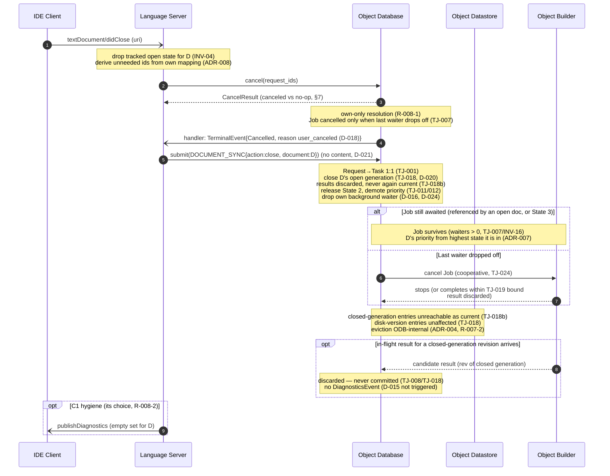

# UC-004: Close Text

> **Tailored template for:** gdocServer Phase 2
> **Use at:** `usecases/UC-004_CloseText.md`
> **ID rule:** `<TYPE>-<UC-ID 00x>-<NNN>` — unique within the use case, sequential.
> **Terminology:** Frontend = LSP language server + IDE client; ODB = C2 (Object Database); Object Store = C3 (Datastore); ODB worker = C4 (Builder) — per ADR-001/ADR-003.

---

## Use Case

### ID

UC-004

### Name

Close Text

### Purpose

When the user closes an **open** document in the IDE, the gdoc Server must
(a) let the Frontend (C1) terminate its own in-flight work for that document — the Frontend cancels the request ids **it judges unneeded**, because only it owns protocol→id mapping and intent (ADR-008, §4.4) —
(b) close the document's **open generation**: the buffer is discarded and its generation's results can **never** again become "current" (D-020, TJ-018) —
(c) release the document from **State 2** and demote its priority (ADR-007, TJ-011/012; D-016) — and
(d) let the ODB's own background build work for that document drop off, so work that is no longer needed is cancelled at zero waiters (TJ-007), while work still needed by other open documents (references) or by the package (State 3) **survives** (D-014 guarantee → D-024 rail, TJ-021; INV-16).
Unlike UC-006 (file deletion), a close **does not** remove Datastore entries: non-open (disk) version results stay valid and reusable on re-open; only the buffer (generation) results are discarded (D-016: `deleted` — not `close` — removes entries).

### Actors

| Actor | Description |
| ---------------- | ------------------------------------------------------ |
| IDE Client (User) | Closes the document's editor tab; may also cancel pending requests. |
| Language Server (C1) | Receives `textDocument/didClose`; translates into ODB API calls per ADR-008; owns client-side diagnostic hygiene. |
| Object Database (C2) | Closes the open generation, releases State 2, demotes priority, drops its background waiter, applies reference-counted cancellation; sole committer (TJ-008). |
| Object Datastore (C3) | Holds generation-scoped results; enforces the never-again-current invariant passively (TJ-018(b)). |
| Object Builder (C4) | Runs the affected Jobs; cooperatively cancels if its Job is cancelled, else finishes (TJ-024, TJ-019). |

### Derived From

FR-1.3 (didClose) → **D-016** (`action:"close"`; ODB releases State 2, cancels background work, demotes priority; Frontend sends close + cancel) · **D-020** → **TJ-018** (generation close; buffer results discarded; never again current) · **ADR-007** → TJ-011/012 (State-2 release, priority demotion) · **D-014 → D-024** → TJ-021 (background-build rail) + **TJ-007** (reference-counted cancellation) · **D-018** (`TerminalEvent.reason`) · **D-012** (cancel form, own-only) · **ADR-004** (single writer) · NFR-1.1 (C1 lightweight) · NFR-1.3 (C3 in-memory, passive) · R-008-1/2 (boundary)

### Scope Decisions Applied

- **D-005** (v1 scope: sync + config + query + diagnostics; no watch, no cross-DB sync)
- **D-012** (cancel form — own-only; Frontend supplies exact ids; ODB never infers unneeded ids)
- **D-014 → D-024** (background build work: guarantee ① a needed build is not dropped; rail ② an in-flight Job is kept alive while its waiter set is non-empty, cancelled at zero (TJ-007); ③ mechanism ODB-internal)
- **D-015** (diagnostics push — close is **not** a build trigger, so no `DiagnosticsEvent` is produced by a close)
- **D-016** (`DOCUMENT_SYNC` `action:"close"`; "on `close`: ODB releases State 2, cancels background build work, demotes priority"; Frontend sends **both** `DOCUMENT_SYNC{close}` **and** `cancel(request_ids)`)
- **D-017 / D-021** (payload: `content` is **absent** for `close` — the transition carries no content)
- **D-018** (`TerminalEvent.reason` — `user_canceled` vs `system_cancelled`)
- **D-020** (open span closes on `didClose`; buffer is discarded; generation results "discarded wholesale"; a re-open starts a fresh generation at revision 1; no cross-generation comparison)
- **D-010 / TJ-015** (v1 single-executor, non-preemptive — a Job running at close time is **not** preempted)
- **NFR-1.1** (C1: lightweight handling, fast to build)

### Preconditions

- Workspace initialized (UC-001 done): ODB API object acquired, completion handler registered (API-004).
- Document **open** (UC-002 done): C1 tracks its buffer (INV-04); `open_revision` ≥ 1; the document is **State 2** (with the references that close it); the Datastore holds results for that generation's buffer `version_id`(s) (or the last build failed).
- The document **may** have live work: in-flight Tasks (e.g. a pending Hover / Go-to-Definition / Find References), queued Jobs for its latest revision, and/or ODB-internal background build work (D-014/D-024).
- The document **may** be a package member (State 3, config-derived — ADR-009) and **may** be referenced by other open documents (part of their State-2 closure — ADR-007).

### Postconditions

- **C1:** no tracked open state for D (INV-04); no live Frontend Task for D that C1 judges unneeded (cancelled or already terminal); IDE diagnostics for D cleared if C1 chose to (its own hygiene, IF-004-003).
- **C2:** D's open **generation is closed** — its buffer `open_revision`s are stale and their results can never again become "current" (TJ-018/D-020); D is released from State 2 with priority demoted (TJ-011/012); State 3 retained if package member (config-derived, unaffected by close — ADR-007); the ODB's own background waiter for D's own State-2 build work has dropped off (D-016/D-024); Jobs whose last waiter left are cancelled (TJ-007); Jobs still needed (referenced by open documents, or State-3 work) survive (TJ-021 rail, INV-16).
- **C3:** entries of D's closed generation are no longer reachable as "current"; non-open (disk) version entries are unaffected (TJ-018(b)); any eviction performed by the single writer only (ADR-004).
- **C4:** any cancelled Job cooperatively cancelled at a checkpoint, or completed within its run bound (TJ-019) with its result discarded (TJ-008/TJ-018(b)).
- **Global:** re-opening D (UC-002) starts a **fresh** generation at revision 1 — no cross-generation contamination (D-020); all other open documents, their generations, and the config state are unaffected (INV-14/INV-25).

## Analysis Focus

- **Two independent close channels:** explicit cancellation (C1's own ids — intent is Frontend-owned, ADR-008/D-012/§4.4) vs the state transition (`DOCUMENT_SYNC{close}` — ODB-owned bookkeeping). The ODB never infers which ids are "unneeded" from the close (R-008-2; §4.4 test: "the close of the document does **not** by itself cancel anything").
- **Generation close vs deletion:** D-020/TJ-018 — the buffer generation is discarded (results can never again be current), but Datastore entries are **not** deleted by close (that is UC-006's `WATCHED_FILES{deleted}`, D-016); non-open (disk) version results remain valid.
- **Reference-counted survival:** close drops D's *own* waiter; whether work actually stops is decided by the Job's waiter set (TJ-007) — work still needed by another open document's closure (references) or by State-3 (package) work survives (TJ-021 rail, INV-16).
- **No preemption, late results:** a Job running at close time completes or is cooperatively cancelled (D-010/TJ-015, TJ-024, TJ-019); a result arriving for the closed generation is discarded, never committed, and never pushed (TJ-008, TJ-018 test, D-015).
- **Idempotency:** double `didClose`, duplicate close syncs, cancelling already-terminal Tasks — all safe no-ops (API-003, §7).
- **Diagnostics hygiene:** close is not a build trigger — the ODB pushes no `DiagnosticsEvent` for a close (D-015); clearing the IDE's diagnostics for the closed document is C1's own protocol hygiene (R-008-2).

## Main Scenario

1. The user closes the editor tab for D in the IDE; the IDE sends `textDocument/didClose` for D.
2. C1 drops its tracked open state for D (INV-04) and, from its own protocol→id mapping and intent (ADR-001 superset, ADR-008), determines which of its live request ids are now **unneeded** for D.
3. C1 calls `cancel(request_ids)` for those ids (API-003). C2 resolves each Task own-only (R-008-1), decrements the affected Jobs' waiter sets, and cancels a Job **only if** its last waiter drops off (TJ-007); for each cancelled Task it returns the `CancelResult` (canceled vs no-op) and pushes `TerminalEvent{status:Cancelled, reason:"user_canceled"}` (D-018). Cancelling an already-terminal Task is a no-op (§7).
4. C1 then submits `DOCUMENT_SYNC{action:"close", document:D}` (API-001) — **without content** (D-016; §4.1/D-021: the transition carries no content).
5. C2 **closes D's open generation** (TJ-018/D-020): its buffer `open_revision`s become stale — their stored results are "discarded wholesale", can never again become D's "current" (TJ-018(b)) — and no further Jobs are dispatched for those versions (TJ-012 note: dispatch is permitted but the result can never be committed as current).
6. C2 releases D from **State 2** and recomputes priority (TJ-011/012, ADR-007): D retains **State 3** if it is a package member (config-derived — a close never re-scopes packages; that is the config-save path, TJ-016/TJ-017), otherwise D becomes a not-open workspace file.
7. C2 drops the ODB-internal background waiter for D's **own** State-2 build work (D-016 "cancels background build work"; guarantee D-014 → rail D-024/TJ-021). For each affected Job, reference-counted cancellation (TJ-007) decides: a Job whose last waiter left is cancelled; a Job still awaited by another open document's closure (which references D — ADR-007 State 2 "and the documents it references", INV-16) or by State-3 (package) work **survives**.
8. For a cancelled Job still **running**, C2 requests cooperative cancellation (INV-24/TJ-024): C4 finishes its current step, observes the cancellation flag, and stops without committing — the closed generation's result could not be committed anyway (TJ-008: commit on success only; TJ-018(b): the current pointer advances only for the then-current generation).
9. C2, as **sole writer** (ADR-004), drops D's closed-generation Datastore entries from reachability: they must never again be returned as "current" (TJ-018(b)); physical eviction is ODB-internal memory management (boundedness — R-007-2; threshold deferred per D-007). Non-open (disk) version entries for D are unaffected.
10. C1 optionally clears the IDE's diagnostics for D (e.g. an empty `publishDiagnostics`) — its own protocol hygiene; the ODB neither pushes nor requires it (D-015 not triggered by close; R-008-2: the ODB does not interpret client-side UI intent).
11. **(concurrency)** If a result for a revision of the closed generation reaches C2 **after** the close, it is discarded — never committed, and no `DiagnosticsEvent` is emitted for it (TJ-008/TJ-018; D-015).

## Alternative Scenarios

### A — D is referenced by another open document (work survives)

**Condition:** Step 7 — another open document E's State-2 closure includes D (E references D), or D's State-3 (package) work is still needed.

1. C2's own waiter for D's *own* State-2 build work drops off (steps 5–7) — D loses its open-document priority (TJ-011/012).
2. The shared Job is **not** cancelled: E's closure (and/or State-3 work) still awaits it (TJ-007; TJ-021 rail "an in-flight Job is kept alive by its waiter set").
3. D's priority is now derived from the **highest state it is in** (ADR-007): State 3 if a package member, or referenced-by-open via E's closure — never State 2 (it is not open anymore).
4. When E is closed (UC-004 for E) and no other waiters remain, the Job is cancelled then (TJ-007) — or its result simply remains in the Datastore for later reuse (TJ-018).

### B — A Job for D's latest revision is running at close time

**Condition:** Step 8 — C4 is mid-Job when the close is processed.

1. The Job is **not preempted** (D-010/TJ-015: v1 single-executor, non-preemptive).
2. If the Job is cancelled (last waiter left), C4 cancels cooperatively at the next checkpoint (INV-24/TJ-024) and produces no commit.
3. If the Job is not cancelled (other waiters), or C4 finishes its current step first, the Job completes within its run bound (TJ-019) and returns a candidate; C2 **discards** it because its generation is closed (TJ-018(b)) — no commit, no `DiagnosticsEvent` (EH-004-001).

### C — Duplicate or unknown close (idempotency)

**Condition:** The IDE sends `didClose` twice for D (client replay), or a close for a document not open in the current generation.

1. C1's second pass is a no-op: its ids were already cancelled (cancelling a terminal is a no-op, §7) and its open state is already dropped (INV-04).
2. C2's Task for the duplicate close (TJ-001 1:1 still holds — one Task per accepted Request) finds no open generation to close and processes as a no-op; the State-2 release / priority demotion is idempotent (TJ-012 recomputes to the same result).
3. No error is raised and no partial state is created (API-001: the ODB shall not leave a half-created Task; §7: cancel idempotency).

### D — A pending client request is cancelled separately

**Condition:** The IDE also sends `$/cancelRequest` for a pending request (e.g. Hover for D), before or after the `didClose`.

1. C1 maps `$/cancelRequest` to `cancel(request_id)` / `cancel(request_ids)` from its own mapping (§7) — the **same** API path as Main #3.
2. Order does not matter: cancel-then-close and close-then-cancel end in the same state — the Task is terminal `Cancelled`, its Job's waiters are decremented (TJ-007), and the generation is closed (TJ-018). Cancelling an already-terminal Task is a no-op (§7).
3. The `TerminalEvent.reason` is `user_canceled` (the Frontend drove the cancellation) regardless of which of the two messages arrived first (D-018).

## Sequence Diagram

---

## Derived Requirements

### Interface (IF-)

#### IF-004-001

On `textDocument/didClose` for D, C1 **shall** translate this into exactly two ODB calls: (1) `cancel(request_ids)` for the ids **it judges unneeded** for D (its own protocol→id mapping + intent), and (2) `submit(DOCUMENT_SYNC{action:"close", document:D})` **without content**. C2 **shall not** infer which ids are unneeded from the close — the close is a state transition only (R-008-2; §4.4).
**Owner:** C1
**Derived From:** UC-004 Main #2–4 · D-016 · §7 mapping (didClose row) · API-001/003 · D-012

#### IF-004-002

For each Task cancelled as part of the close, C2 **shall** return `CancelResult` (canceled vs no-op) and push `TerminalEvent{status:Cancelled, reason:...}` — `reason:"user_canceled"` when the Frontend drove the cancellation, `reason:"system_cancelled"` when the ODB's close processing cancelled a Job the Task was awaiting. Cancelling an already-terminal Task **shall** be a safe no-op.
**Owner:** C2
**Derived From:** UC-004 Main #3, Alt D · D-018 · API-003 · §7 (idempotency)

#### IF-004-003

A close produces **no** ODB→Frontend event requiring C1 action beyond the standard terminal: the ODB **shall not** push a `DiagnosticsEvent` for the close (close is not a build trigger, D-015). C1 **may** clear the IDE's diagnostics for D as its own protocol hygiene (e.g. an empty `publishDiagnostics`); that choice is C1's (R-008-2).
**Owner:** C1 (constraint on C2's behavior)
**Derived From:** UC-004 Main #10 · D-015 · R-008-2

### State (ST-)

#### ST-004-001

C2 **shall** close D's open generation on `DOCUMENT_SYNC{close}`: the open span ends; that generation's buffer `open_revision`s become stale and their stored results are "discarded wholesale" — they can never again become D's "current" (TJ-018(b)). A subsequent re-open (UC-002) starts a fresh generation at `open_revision` 1 without colliding with or comparing against this one (D-020).
**Owner:** C2
**Derived From:** UC-004 Main #5 · TJ-018 (generation) · D-020 · §4.3 (test: "a buffer result arriving after didClose is discarded")

#### ST-004-002

C2 **shall** release D from State 2 and recompute priority (TJ-011/012): D retains State 3 if it is a package member (config-derived — a close never re-scopes packages; that is the config-save path, TJ-016/TJ-017 scope; ADR-007), otherwise D becomes a not-open workspace file. Priority derives from the highest state D is in (ADR-007); the demotion is idempotent under a duplicate close.
**Owner:** C2
**Derived From:** UC-004 Main #6 · ADR-007 · TJ-011/012 · D-016 ("releases State 2 … demotes priority")

#### ST-004-003

C2 **shall** drop the ODB-internal background waiter for D's own State-2 build work (D-016 "cancels background build work"; guarantee ① D-014 → rail D-024/TJ-021), and shall decide Job cancellation **only** by the waiter set: a Job whose last waiter left is cancelled (TJ-007); a Job still awaited by another open document's closure (referencing D, INV-16) or by State-3 work survives. C2 **shall not** cancel work it still needs (rail ②).
**Owner:** C2
**Derived From:** UC-004 Main #7, Alt A · D-016 · D-014 → D-024 (TJ-021) · TJ-007 · ADR-007 (State 2 "and the documents it references")

### Data (DR-)

#### DR-004-001

The Datastore **shall** never again return an entry of D's closed open generation as D's "current" — the current pointer advances only on atomic commit for the **then-current** generation (TJ-018(b)). Entries keyed on D's non-open (disk mtime) versions are **unaffected** by the close and remain usable (e.g. on a re-open where the disk is unchanged, TJ-018).
**Owner:** C3 (internal invariant)
**Derived From:** UC-004 Main #9 · TJ-018(b) · D-020 · ADR-004

#### DR-004-002

Physical eviction of D's closed-generation entries is performed **only** by the single writer (C2/ODB) as memory management (boundedness — R-007-2; threshold deferred per D-007). The Datastore itself is passive: no public API, no self-eviction, single-context sequential access (ADR-004, NFR-1.3).
**Owner:** C3 (via C2)
**Derived From:** UC-004 Main #9 · ADR-004 · D-007/R-007-2 · NFR-1.3

### Error Handling (EH-)

#### EH-004-001

A result (Builder candidate) for a revision of the closed generation that reaches C2 **after** the close is **discarded**: never committed (TJ-008 — commit on success only; TJ-018(b) — current pointer advances only for the then-current generation), no `DiagnosticsEvent` emitted for it (D-015 not triggered), and it must not disturb the Datastore or scheduling state.
**Owner:** C2
**Derived From:** UC-004 Main #11, Alt B · TJ-018 (test) · TJ-008 · D-015

#### EH-004-002

A duplicate `didClose` / `DOCUMENT_SYNC{close}` for D, or a close for a document not open in the current generation, **shall** be handled as a no-op: no error, no double cancellation, no partial state. C2's Task for the duplicate close (TJ-001 1:1 still holds) simply finds no open generation to close.
**Owner:** C2 (C1 side idempotent by construction)
**Derived From:** UC-004 Alt C · TJ-018 (generation bookkeeping) · §7 (cancelling a terminal is a no-op) · API-001 (no half-created state)

#### EH-004-003

A Job running at close time is **not** preempted (D-010/TJ-015): it either cancels cooperatively at a checkpoint if its Job was cancelled (INV-24/TJ-024), or completes within its run bound (TJ-019) with the result discarded (EH-004-001). C4 **shall not** commit directly — the commit decision is C2's (TJ-008, ADR-004 single writer).
**Owner:** C4 (C2 decides)
**Derived From:** UC-004 Alt B · D-010/TJ-015 · INV-24/TJ-024 · TJ-019 · TJ-008

### Component (SCR-)

#### SCR-C1-004-001 (Language Server)

On `textDocument/didClose`, C1 (lightweight, asyncio — NFR-1.1) shall: drop its tracked open state for D (INV-04); derive the unneeded ids from its own protocol→id mapping (ADR-001 superset; intent is C1's, ADR-008); emit `cancel(request_ids)` (API-003) and `submit(DOCUMENT_SYNC{action:"close", document:D})` without content (API-001, D-016/D-021); handle both inline and ticketed `Submission` shapes plus `CancelResult` (API-001/003). Re-issuing the same close (client replay) is safe by idempotency (§7; EH-004-002).
**Derived From:** UC-004 Main #2–4, Alt C/D · D-016 · §7 mapping · API-001/003 · NFR-1.1

#### SCR-C1-004-002 (Language Server)

C1 owns the client-side diagnostic hygiene for a closed document (INV-07): it **may** clear the IDE's diagnostics for D (e.g. an empty `publishDiagnostics`) and **shall not** rely on any ODB push for that (the ODB does not push on close — D-015, R-008-2). The buffer itself is the client's data — the ODB never holds a copy of it; C1 must not pass stale buffer content after close (content is absent on close, D-021).
**Derived From:** UC-004 Main #10 · D-015 · D-021 · R-008-2 · INV-07

#### SCR-C2-004-001 (Object Database)

C2 shall process `DOCUMENT_SYNC{close}` as: (1) close D's open generation (TJ-018/D-020) — buffer results discarded, never again current (TJ-018(b)); (2) release State 2 and demote priority, retaining State 3 if package member (TJ-011/012, ADR-007); (3) drop the ODB's own background waiter for D's own work (D-016, D-024/TJ-021) and apply reference-counted cancellation (TJ-007) — surviving what is still needed (INV-16); (4) dispatch no further Jobs for the closed generation (TJ-012 note); (5) emit `Cancelled` terminals with `reason` (D-018) and return `CancelResult` for explicit cancels (API-003); (6) commit nothing from the closed generation (TJ-008); (7) maintain the Datastore invariants under single-writer coordination (ADR-004; DR-004-001/002).
**Derived From:** UC-004 Main #5–9, Alt A/B/C · D-016 · TJ-007/011/012/018/021 · D-018 · ADR-004

#### SCR-C3-004-001 (Object Datastore)

The Datastore **shall** enforce the post-close freshness invariant passively: an entry of D's closed open generation is never returned as "current" for D (TJ-018(b)); entries of D's non-open (disk) versions are unaffected by the close; all mutation (including eviction of closed-generation entries) happens via the single writer (ODB) in its single context (ADR-004, NFR-1.3) — the Datastore provides no API and performs no self-eviction.
**Derived From:** UC-004 Main #9 · TJ-018(b) · ADR-004 · NFR-1.3

#### SCR-C4-004-001 (Object Builder)

On close-driven Job cancellation, C4 **shall** cancel cooperatively at a checkpoint (INV-24/TJ-024) and produce no commit for the closed generation; if not cancelled (other waiters), it completes within its run bound (TJ-019) and returns a candidate that C2 discards (TJ-008/TJ-018(b)). C4 builds only from the content C2 supplied for the Job at dispatch time — it never reads a buffer copy after the generation is closed (D-020; §4.3).
**Derived From:** UC-004 Main #8, Alt B · INV-24/TJ-024 · TJ-019 · TJ-008 · D-020

---

## Reverse-check (Contract Cross-reference)

| UC Requirement | Contract Rule | Status | Note |
| -------------- | ------------- | ------ | ---- |
| IF-004-001 | API-001 (§4.1 `close`, D-021) · API-003/§4.4 · §7 mapping (didClose row) · D-012/016 | ✅ | two-channel close is normative in §7 |
| IF-004-002 | D-018 (§5.2 `reason`) · API-003 (`CancelResult`) · §7 (idempotency) | ✅ | |
| IF-004-003 | D-015 (push trigger) · R-008-2 (§4.4 boundary) | ✅ | close is not a D-015 trigger |
| ST-004-001 | TJ-018 (generation; "discarded wholesale") · D-020 · §4.3 test | ✅ | |
| ST-004-002 | TJ-011/012 · ADR-007 (states; "recomputed on every client interaction") · D-016 | ✅ | State-3 retention via ADR-007 + TJ-016 scope (config path only) |
| ST-004-003 | D-016 · D-014 → D-024 (TJ-021 rail) · TJ-007 · INV-16 | ✅ | |
| DR-004-001 | TJ-018(b) (Datastore freshness invariant) | ✅ | |
| DR-004-002 | ADR-004 (single writer) · D-007/R-007-2 (deferred) | ✅ | eviction policy deferred by design — mechanism (ODB-only) fixed |
| EH-004-001 | TJ-018 (test: buffer result after didClose discarded) · TJ-008 · D-015 | ✅ | |
| EH-004-002 | §7 (cancel idempotency) · TJ-018 (generation bookkeeping) · API-001 | ✅ | duplicate close as no-op is a natural consequence of C2's generation bookkeeping — no contract change required |
| EH-004-003 | D-010/TJ-015 · INV-24/TJ-024 · TJ-019 · TJ-008 | ✅ | |
| SCR-C1-004-001 | §7 mapping · API-001/003 · D-016/D-021 | ✅ | |
| SCR-C1-004-002 | D-015 · D-021 · R-008-2 · INV-07 | ✅ | |
| SCR-C2-004-001 | D-016 · TJ-007/011/012/018/021 · D-018 · ADR-004 | ✅ | |
| SCR-C3-004-001 | TJ-018(b) · ADR-004 · NFR-1.3 | ✅ | |
| SCR-C4-004-001 | TJ-024 · TJ-019 · TJ-008 · D-020 | ✅ | |

> **Status:** ✅ = satisfied · ⚠️ = partially satisfied / requires contract extension · ❌ = contract gap
>
> **Finding (zero gaps):** every UC-004 requirement is satisfied by the Phase 1a/1b contracts (TJ-007/011/012/018/021, API-001/003, §7, D-012/015/016/018/020/021, ADR-004/007). No contract change is required.
>
> **Minor observation (recorded; no action required):** `process/phase2/plan.md` Step 1 checklist reads "UC-004 (Close) demonstrates cancellation (**TJ-016**) + Datastore cleanup" — but TJ-016 is the **config-save** rule (UC-007's domain). The close cancellation duties are D-016 + TJ-007 + TJ-021 (rail), and the Datastore effect is the TJ-018(b) discard/eviction. This UC covers the checklist's intent; the checklist reference is likely a typo (editorial fix, pending user approval).

## Traceability Matrix

| ID | Type | Description | Scenario Step | Owner |
| --- | ---- | ----------- | ------------- | ----- |
| IF-004-001 | Interface | didClose → {`cancel(request_ids)`; `DOCUMENT_SYNC{close, no content}`} translation | Main #2–4, Alt D | C1 |
| IF-004-002 | Interface | `CancelResult` + `TerminalEvent{Cancelled, reason}`; cancelling a terminal is a no-op | Main #3, Alt D | C2 |
| IF-004-003 | Interface | No ODB push on close; C1 optional diagnostic clear | Main #10 | C1 |
| ST-004-001 | State | Generation close; buffer results discarded, never again current | Main #5 | C2 |
| ST-004-002 | State | State-2 release + priority demotion; State-3 retained if package member | Main #6 | C2 |
| ST-004-003 | State | Background-waiter drop; reference-counted survival | Main #7, Alt A | C2 |
| DR-004-001 | Data | Closed generation never current; disk versions unaffected | Main #9 | C3 |
| DR-004-002 | Data | Eviction by single writer only; Datastore passive | Main #9 | C3 |
| EH-004-001 | Error | Late result for closed generation discarded, never committed/pushed | Main #11, Alt B | C2 |
| EH-004-002 | Error | Duplicate / unknown close = no-op | Alt C | C2 |
| EH-004-003 | Error | No preemption; cooperative cancel or bounded completion | Alt B | C4 |
| SCR-C1-004-001 | Component | didClose handler + the two API calls + idempotent replay | Main #2–4, Alt C/D | C1 |
| SCR-C1-004-002 | Component | Client-side diagnostic hygiene (optional clear; no reliance on ODB) | Main #10 | C1 |
| SCR-C2-004-001 | Component | `DOCUMENT_SYNC{close}` processing pipeline | Main #5–9, Alt A/C | C2 |
| SCR-C3-004-001 | Component | Post-close freshness invariant; passive single-writer store | Main #9 | C3 |
| SCR-C4-004-001 | Component | Cooperative cancel / bounded completion; no direct commit | Main #8, Alt B | C4 |
