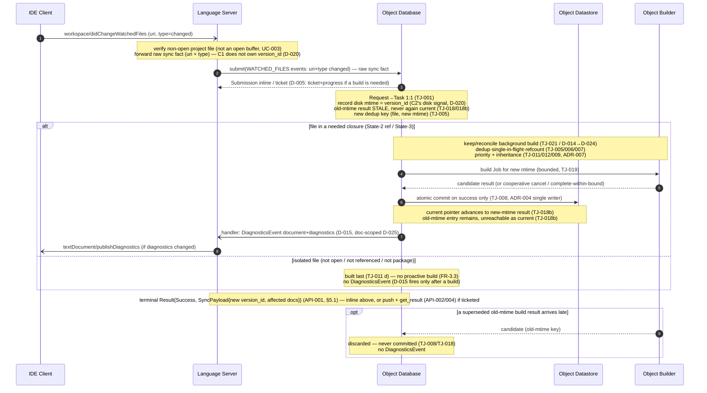

# UC-005: Watched File Change

> **Tailored template for** `docs/architecture/gdocServer/process/phase2/` (Phase 2 Use Case analysis).
> **Use at** — Phase 2, when refining a *specific* use case into testable component requirements.
> **ID rule** — the UC id is `UC-<NNN>`; its derived requirements are `IF-<NNN>-<MMM>`, `ST-<NNN>-<MMM>`, `DR-<NNN>-<MMM>`, `EH-<NNN>-<MMM>`, and (Phase 3) `SCR-C<#>-<NNN>-<MMM>` / `C<#>-IF-<NNN>-<MMM>` (see `template.md` + `plan.md`).
> **Terminology** — **C1** = Language Server (Frontend) · **C2** = Object Database (ODB) · **C3** = Object Datastore · **C4** = Object Builder. **TJ** = Phase 1a task/job rules · **API** = Phase 1b Frontend↔ODB API.

---

## Use Case

### ID

`UC-005` — Phase 2 use case (gdoc Server — *Language Server ↔ ODB* boundary set; `plan.md` line 29).

### Name

**Watched File Change** — refresh a **non-open** document's on-disk version (`workspace/didChangeWatchedFiles`, `type = changed`/`created`), invalidate its stale stored result, reconcile background build work, and push updated diagnostics — **without** touching any open buffer generation.

### Purpose

The IDE's file watcher detects that a **non-open** project file's on-disk content changed (or a new file appeared). The gdoc Server must keep its knowledge of that document's **disk version** current and its diagnostics consistent, **without** disturbing the open (buffer) generations of any open documents. This use case turns the **non-open half** of the version-freshness rule (TJ-018) into testable component obligations:

a. **C1 forwards the raw sync fact** — the changed file's path/uri + type — to the ODB; it does **not** decide how much to rebuild, and the ODB never needs to learn which documents were open (D-020/C2-owns; ADR-008 protocol-agnostic).
b. **C2 applies the staleness rule:** a non-open document is identified by its **disk mtime** (last-change), observed **only** via `didChangeWatchedFiles` (the server does **not** poll the disk); a newer mtime makes the old stored result **stale** — it can never again become "current" (TJ-018/TJ-018b) — and the new mtime becomes the new **version component of the dedup key** (TJ-005).
c. **C2 reconciles background work** under the new dedup key if the file is in a needed closure (a State-2 reference of an open document, or a State-3 package member) — dedup (TJ-005), single in-flight (TJ-006), refcount (TJ-007), atomic commit (TJ-008), priority + inheritance (TJ-011/012/009, ADR-007) — and **pushes a `DiagnosticsEvent`** iff diagnostics changed (D-015), which C1 maps to `publishDiagnostics`.
d. **Contrast with the siblings:** open documents are versioned by `open_revision` (`didChange`, UC-003) and **never** compared to disk mtime; the open generation is **closed** on `didClose` (UC-004); a **deleted** file triggers Datastore cleanup + graph invalidation (UC-006); a **config** file change is a rebuild event (UC-007, TJ-016/017). UC-005 is the **non-open disk-change** path only.

### Actors

| Actor | Description |
| --- | --- |
| **IDE Client** (user) | Detects the on-disk change with its own file watcher and sends `workspace/didChangeWatchedFiles { changes:[{uri, type}] }` (`type = changed`, or `created`). Receives updated diagnostics via `textDocument/publishDiagnostics` (through C1). |
| **C1 — Language Server (Frontend)** | Translates `didChangeWatchedFiles` to `submit(WATCHED_FILES{events:[{uri, type}]})`, forwarding the **raw sync fact** only (it owns only the translation + diagnostics routing — **NFR-1.1** lightweight; it does **not** compute/own the `version_id` (C2's disk signal, D-020)); registers the watch for non-open project files (TJ-018/D-020 C1 obligation); maps the ODB's `DiagnosticsEvent` to `publishDiagnostics` (D-015). |
| **C2 — Object Database (ODB)** | Maps the accepted `WATCHED_FILES` Request to a Task (TJ-001); **records the disk mtime (its disk signal, observed server-side — D-020) as the new non-open version** (TJ-018); marks the file's stored non-open result **stale** (TJ-018/TJ-018b); derives the **new dedup key** (TJ-005); reconciles background build work under the new key (TJ-021/TJ-006/007/009/011/012); commits **atomically on success** (TJ-008/ADR-004); pushes `DiagnosticsEvent` iff diagnostics changed (D-015). |
| **C3 — Object Datastore** | Holds the (now-stale) old-mtime entry; the "current" pointer advances **only** on the atomic commit of the new-mtime result (TJ-018b freshness invariant; single writer ADR-004); **does not delete** entries on `changed` (that is `deleted`/UC-006, D-016). Passive store, zero orchestration (NFR-1.3). |
| **C4 — Object Builder** | Executes the (re)build Job for the new mtime under the execution bound (TJ-019), producing a candidate result; cooperatively cancels if superseded; is safe to abandon mid-flight without partial state (TJ-008); SDK key derivation so the new mtime ≠ the old key (TJ-020). |

### Derived From

`plan.md` (line 29 UC-005) → `README.md` (FR-1.1/1.2/1.3, FR-3.3, NFR-1.1/1.3/2.1, D-014/015/016/020/024/025, ADR-004/007/008/009) → `contracts/task-job-management.md` (TJ-001, TJ-005/006/007/008/009, TJ-011/012, TJ-018, TJ-019/020, TJ-021, INV-16/24) → `contracts/frontend-odb-api.md` (API-001/004, §4.1 `WATCHED_FILES`, §5.2 `DiagnosticsEvent` (D-015) + D-025, §7 mapping, §5.1 `SyncPayload`) → `usecases/UC-003_EditText.md`, `UC-004_CloseText.md` (boundary contrast; `UC-006_DeleteText.md` / `UC-007` are planned siblings for `deleted` / config).

### Scope Decisions Applied

- **TJ-018 (non-open half)** — non-open documents are identified by their **disk mtime** (last-change), observed **only** via `workspace/didChangeWatchedFiles` (the server does **not** poll the disk); a stored (non-open) result is **fresh iff** its mtime still equals the current mtime; a newer mtime ⇒ the old stored result is **stale** and can never again become "current" (TJ-018b).
- **D-020 / C2-owns** — the Frontend sends the **raw sync fact** (the changed file's path/uri + type); **C2 applies** the staleness rule and decides what to rebuild. C1 does not decide rebuild scope.
- **D-016** — `WATCHED_FILES` payload is `events:[{uri, type: "created" | "changed" | "deleted"}]`; UC-005 covers `created`/`changed` (the non-open version appeared/changed), UC-006 covers `deleted` (Datastore removal + dependency-graph invalidation + Job cancel). *Note: `created` is folded into UC-005 because the code handler treats it identically to `changed` (reload + bump version); drop it if a separate UC is preferred.* **`created` with no prior stored result:** when the file has **no** prior stored result (first time C2 sees it), there is nothing to stale — the stale-mark step (TJ-018b) is a **no-op**, and the first successful build **establishes** the current version (insert) rather than replacing one. If a prior result exists (e.g. *deleted* then re-created), the normal stale/rebuild path applies.
- **TJ-005** — the file's mtime is the **version component of the dedup key**; a new mtime ⇒ a new dedup key ⇒ old in-flight/queued Jobs (old mtime) are stale and their results must not commit (TJ-018b/TJ-008).
- **TJ-011/012 + ADR-007** — the file's priority derives from its state in the closure; a change to a State-2 (referenced) or State-3 (package) file keeps/reconciles the background build (TJ-021); an isolated non-open file is built **last** (TJ-011(d)) and, if truly unreferenced, no proactive build is required (demand-driven, FR-3.3).
- **D-015 / D-025** — the ODB **pushes a `DiagnosticsEvent`** after processing `WATCHED_FILES` **when** diagnostics changed; it is document-scoped (routed by `document`, `request_id` optional) and may arrive outside any request's progress stream; C1 maps it to `publishDiagnostics`.
- **ADR-008** — protocol-agnostic: the ODB never learns whether the change was triggered by a save, a git operation, or another external process.
- **TJ-019 / TJ-008** — no preemption; a superseded build cooperatively cancels or completes within its bound; only successful builds commit **atomically**; a discarded result is never pushed.
- **ADR-004** — single writer: only C2 commits to C3; C3 is passive (NFR-1.3).
- **Boundary (out of scope):** `didChange` for an **open** document (UC-003); `didClose` (UC-004); `type=deleted` (UC-006); the **config** file (UC-007, TJ-016/017).

### Preconditions

- Workspace initialized (UC-001 done): ODB API object acquired, completion handler registered (API-004).
- C1 has **registered `workspace/didChangeWatchedFiles`** for non-open project files (TJ-018/D-020 — the C1 obligation that makes non-open mtime changes visible to the ODB).
- The watched file is a **non-open** project document (not currently open in an editor — if it were open, content changes arrive via `didChange`/UC-003 and the authoritative source is the buffer). It **may** have a prior stored result in C3 (a previous build succeeded or failed), or none at all.
- The changed file **may** be in the reference closure of an open (State-2) document or a State-3 (package) member — in which case background build work is required (TJ-021/D-014); or it may be **isolated** (not open, not referenced) — in which case no proactive build is required.
- The changed file is **not** the build configuration (config → UC-007) and the event `type` is **not** `deleted` (→ UC-006).

### Postconditions

- **C1:** the file's disk version advanced to the new mtime (recorded); IDE diagnostics for the file updated if the ODB pushed a `DiagnosticsEvent` (D-015).
- **C2:** the file's stored non-open result (old mtime) is **stale** and can never again become "current" (TJ-018/TJ-018b); a new dedup key derived (TJ-005); background work reconciled under the new key if the file is in a needed closure (TJ-021/TJ-005/006/007/009/011/012); priority recomputed (TJ-011/012); a `DiagnosticsEvent` pushed iff diagnostics changed (D-015); the `WATCHED_FILES` Request is acknowledged via `Submission` and completed with the terminal `Result{Success, SyncPayload{new version_id, affected documents}}` (API-001, §5.1).
- **C3:** the old-mtime entry is no longer reachable as "current"; the new-mtime entry (if a build succeeded) is committed **atomically** by the single writer (TJ-008/ADR-004); **no entry is deleted** (that is `deleted`/UC-006, D-016).
- **C4:** any (re)build for the new mtime completed, or was cooperatively cancelled within its bound (TJ-019); a discarded/superseded result produced no commit (TJ-008); no partial state (TJ-008/TJ-019).
- **Global:** the **open (buffer) generations** of any open documents are **unaffected** — a non-open disk change never supersedes an open generation (TJ-018 scope: open → `open_revision`, non-open → mtime, never cross-compared); the config state and all other non-open documents are unaffected (INV-14/INV-25).

## Analysis Focus

- **Non-open versioning is mtime-based and watch-delivered:** the ODB never polls the disk (TJ-018 scope note / D-020) — it learns a disk change only when C1 forwards `WATCHED_FILES{events:[{uri, type}]}`; the new mtime is the version component of the dedup key (TJ-005).
- **Staleness, not deletion:** `changed` makes the old-mtime result *stale* (never again current, TJ-018b) but does **not** delete it (that is `deleted`/UC-006, D-016); the "current" pointer advances only on the atomic commit of the new-mtime result (ADR-004 single writer, TJ-018b).
- **C1 forwards, C2 decides:** the raw sync fact crosses the boundary (D-020/C2-owns); the ODB — not the Frontend — applies the staleness rule and scopes the rebuild (ADR-008 protocol-agnostic).
- **Background work survival (FR-3.3):** if the changed file is in a needed closure (State-2 reference / State-3 package), the ODB keeps/reconciles the build under the new key — dedup (TJ-005), single in-flight (TJ-006), refcount (TJ-007), atomic commit (TJ-008), priority + inheritance (TJ-011/012/009, ADR-007), never dropped (TJ-021/D-014→D-024); an isolated file is built last (TJ-011(d)) and need not be proactively built.
- **Diagnostics are pushed, not polled:** the ODB pushes a `DiagnosticsEvent` after `WATCHED_FILES` **when** diagnostics changed (D-015), document-scoped (D-025); C1 maps it to `publishDiagnostics`; the `DIAGNOSTICS` pull coexists for explicit re-request.
- **No preemption, late results:** a running build for the old mtime completes or is cooperatively cancelled (TJ-019); a result arriving for the superseded (old-mtime) generation is discarded, never committed, and never pushed (TJ-008/TJ-018b).
- **Idempotency & errors:** a duplicate `changed` event for an already-current mtime is a safe no-op; an unknown file returns an error result without leaving a half-created Task (API-001, §4.1; §7).

## Main Scenario

*Assumes the changed non-open file is in a needed closure (a State-2 reference of an open document, or a State-3 package member), so a (re)build is required; the **isolated** file path is Alternative B.*

1. The IDE's file watcher detects the on-disk change and sends `workspace/didChangeWatchedFiles { changes: [{uri, type: "changed"}] }` to C1.
2. C1 validates the `uri` is a **non-open** project file (if it were open, this would be `didChange`/UC-003) and resolves it to its workspace folder path. C1 forwards the **raw sync fact only** — uri + type — and does **not** compute/own the `version_id` or forward a disk mtime (D-020: that is C2's disk signal, observed server-side).
3. C1 translates to `submit(WATCHED_FILES{events:[{uri, type:"changed"}]})` (C1→ODB API, §7 mapping), forwarding the **raw sync fact** — the changed file's path/uri + type; C1 does **not** decide rebuild scope (D-020/C2-owns).
4. C2 accepts the Request and maps it to exactly one Task (TJ-001), returning an immediate `Submission` — **`{inline, Result{Success, SyncPayload}}`** if it can answer without a build, or **`{ticket, request_id}`** if a build is needed — the `ticket` is only the **job-acceptance acknowledgment** — the terminal `Result`/`SyncPayload` is delivered **inline** (no build) or via the **push channel + `get_result`** (build ran; API-002/004), not a second return of `submit` — so the ODB **may** ticket + progress it (D-005: "any other operation may also be ticketed … if a build is needed").
5. C2 **records the disk mtime (its disk signal, server-side — D-020) as the file's new non-open version** (TJ-018), marks the stored old-mtime result **stale** (a **no-op** if no prior result exists — i.e. first-time `created`; see Scope Decisions) — it can no longer become "current" (TJ-018/TJ-018b) — and derives the **new dedup key** `(file, new mtime, inputs)` (TJ-005); a queued/running Job under the old key is now stale (TJ-012 note; its result must not commit — TJ-008/TJ-018b).
6. C2 determines the file's state in the closure (TJ-011; ADR-007) and, since it is in a needed closure, **keeps/reconciles the background build** under the new key — dedup (TJ-005), single in-flight (TJ-006), refcount (TJ-007), priority + inheritance (TJ-011/012/009); the needed build is **not** dropped (TJ-021 / D-014→D-024).
7. C2 schedules the (re)build Job (if not already in flight) and hands it to a Builder (C4).
8. C4 executes the build for the new mtime under the execution bound (TJ-019), producing a candidate result; if superseded it cooperatively cancels (TJ-019), leaving no partial state (TJ-008).
9. C2 commits the candidate result to C3 **atomically, on success only** (TJ-008, ADR-004 single writer); the Datastore "current" pointer advances to the new-mtime result (TJ-018b).
10. If the build changed the file's diagnostics, C2 **pushes a `DiagnosticsEvent{document, diagnostics}`** to C1's registered handler (D-015, document-scoped per D-025); C1 maps it to `textDocument/publishDiagnostics` for the IDE.
11. C2 delivers the **terminal** `Result{Success, SyncPayload{new version_id, affected documents}}` for the `WATCHED_FILES` operation (API-001, §5.1) — **inline** in the `Submission` when no build was needed, or via the **push channel** (`DiagnosticsEvent`/`TerminalEvent`) + `get_result` (API-002/004) when a build ran — the use case is complete.

## Alternative Scenarios

### A — The file is currently open (not non-open)

**Condition:** The watched `uri` is actually an open document (in an editor tab).

1. This is **not** a non-open disk change: for an open document the authoritative source is the **client buffer**, and content changes arrive via `textDocument/didChange` (UC-003), whose `open_revision` is the version component (TJ-018 open half).
2. C1 routes it through the `didChange` path (`DOCUMENT_SYNC{action:"change"}`), **not** `WATCHED_FILES{changed}`; a `didChangeWatchedFiles{changed}` for an open document does **not** supersede the open generation's buffer.
3. No non-open (mtime) staleness rule is applied to the open generation — the two are never compared (TJ-018 scope: open → `open_revision`, non-open → mtime).

### B — The file is isolated (not in any needed closure)

**Condition:** The changed file is neither open nor referenced and not a State-3 package member (no open document's closure, no package).

1. C2 still records the new mtime (its disk signal, D-020) as the file's current non-open version (TJ-018) and returns `SyncPayload{new version_id, affected documents}` (API-001, §5.1).
2. No (re)build is proactively scheduled — an isolated file is built **last** (TJ-011(d)) and, with no client request and no State 2/3, no background work is required (demand-driven; FR-3.3/TJ-021). It becomes State 4 (built-on-demand, discarded) only when/only if a future operation actually needs it.
3. Because no build ran, no `DiagnosticsEvent` is pushed (D-015 fires only after a build that changed diagnostics) — the file's prior diagnostics (if any) stand until it is next built.

### C — A build for the file's previous mtime is in flight when the change arrives

**Condition:** A Job under the **old** mtime dedup key is `Queued` or `Running`.

1. The new mtime yields a **new** dedup key (TJ-005) — the old-key Job is stale for this document (TJ-018); a queued stale Job should not be dispatched (TJ-012 note) and, if it completes, its result must not commit (TJ-008/TJ-018b).
2. The new-key build is reconciled under the same single-in-flight (TJ-006) and refcount (TJ-007) disciplines; correctness holds because only the **current** mtime's result may become "current" (TJ-018b), even if both Jobs briefly coexist (they are independent per-key, TJ-006).
3. C2 centralizes the refcount (TJ-007) — no double-counting — and discards the superseded result (EH-005-001).

### D — The watched file is the build configuration

**Condition:** The changed file is the build configuration (ADR-009).

1. This is **UC-007's** domain: a config change is a **rebuild event** — the ODB re-scopes affected work under the changed build options (TJ-016) with the override rules (TJ-017).
2. UC-005 does **not** treat config specially: C1 forwards the raw change (`WATCHED_FILES`); the ODB's config-specific handling (TJ-016/017, ADR-009) takes precedence, and C2 routes the file to the `CONFIG_SAVE` path (UC-007). (ADR-008: protocol-agnostic — the ODB acts on the operation, not the client's intent.)

### E — Duplicate, already-current, or unknown file (idempotency / error)

**Condition:** A duplicate `changed` event for an mtime that is already current, or an event for a file not tracked in the workspace.

1. If the reported mtime equals the file's current non-open mtime, C2 treats it as a **no-op** — no new dedup key, no new build (TJ-018 bookkeeping; §7 idempotency); it returns `Result{Success, SyncPayload}`.
2. If the file is unknown (not a tracked project document), the ODB **may** return an inline `Result{status: Error}` (e.g. `E_NOT_FOUND`) and **shall not** leave a half-created Task (API-001, §4.1 rejection); C1 surfaces it per its own policy (its choice, R-008-2).

## Sequence Diagram

---

## Derived Requirements

### Interface (IF-)

#### IF-005-001

On `workspace/didChangeWatchedFiles` with `type ∈ {changed, created}` for a **non-open** project file, C1 **shall** translate this into `submit(WATCHED_FILES{events:[{uri, type}]})`, forwarding the **raw sync fact** (the changed file's path/uri + type) and **not** deciding how much to rebuild and **not** computing/owning the `version_id` (C1 does not forward a disk mtime; the ODB applies the staleness rule and scopes the work — D-020/C2-owns; ADR-008).
**Owner:** C1
**Derived From:** UC-005 Main #1–3 · D-016 (payload discriminator) · §7 mapping (didChangeWatchedFiles row) · API-001/004 · ADR-008

#### IF-005-002

For each changed/created non-open file, C2 **shall** record the new disk mtime (its disk signal, server-side — D-020) as the file's current non-open version (TJ-018), mark its stored (old-mtime) result **stale** (a **no-op** if no prior result exists — i.e. first-time `created`) so it can never again become "current" (TJ-018b), and derive the **new dedup key** `(file, new mtime, inputs)` (TJ-005).
**Owner:** C2
**Derived From:** UC-005 Main #5 · TJ-018/018b · TJ-005 · D-020

#### IF-005-003

If the file's diagnostics changed as a result of processing the `WATCHED_FILES` change, C2 **shall** push a `DiagnosticsEvent{document, diagnostics}` to C1's registered handler (document-scoped, `request_id` optional — D-015/D-025); C1 **shall** map it to `textDocument/publishDiagnostics`. C2 **shall not** push if diagnostics did not change.
**Owner:** C2 (+C1 for the mapping)
**Derived From:** UC-005 Main #10 · D-015 · D-025 · §5.2 · README D-015

#### IF-005-004

C1 **shall** register `workspace/didChangeWatchedFiles` for **non-open** project files (the C1 obligation that makes disk changes visible to the ODB — TJ-018/D-020) and **shall** handle `created` and `changed` identically (reload + bump the disk version), distinct from `deleted` (UC-006).
**Owner:** C1
**Derived From:** UC-005 Main #2 · TJ-018 (C1 registers) · D-016 (created|changed|deleted) · UC-006 boundary

#### IF-005-005

On success, the **terminal** Result for the `WATCHED_FILES` operation is `Result{Success, SyncPayload{new version_id, affected documents}}` (API-001, §5.1). It is delivered **inline** within the `Submission` when no build is needed, or via the **push channel** + `get_result` (API-002/004) when the ODB ticketed a build (D-005). The `Submission` itself is only the immediate acknowledgment (inline result **or** `request_id` ticket) — it is **not** the terminal `Result`.
**Owner:** C2
**Derived From:** UC-005 Main #11 · API-001 · §5.1 (SyncPayload) · D-005

### State (ST-)

#### ST-005-001

C2 **shall** advance the file's non-open version to the new mtime and recompute its priority from its state in the closure (TJ-011/012, ADR-007); the State-1/2/3 classification is unchanged by a mere disk change unless the changed content is one the closure depends on.
**Owner:** C2
**Derived From:** UC-005 Main #6 · TJ-011/012 · ADR-007

#### ST-005-002

If the file is in a needed closure (State-2 reference of an open document, or a State-3 package member), C2 **shall** keep/reconcile the background build under the new dedup key — dedup (TJ-005), single in-flight (TJ-006), refcount (TJ-007), atomic commit (TJ-008), priority + inheritance (TJ-011/012/009) — never dropping it (TJ-021 / D-014→D-024, FR-3.3).
**Owner:** C2
**Derived From:** UC-005 Main #6 · TJ-021 · TJ-005/006/007/008/009/011/012 · D-014/D-024 · FR-3.3

#### ST-005-003

If the file is **isolated** (not open, not referenced, not package), C2 **shall not** proactively schedule a build — it is built **last** (TJ-011(d)) and becomes State 4 only when/only if a future operation needs it (demand-driven, FR-3.3); no `DiagnosticsEvent` is pushed in that case (D-015 fires only after a build that changed diagnostics).
**Owner:** C2
**Derived From:** UC-005 Alt B · TJ-011(d) · FR-3.3 · D-015

#### ST-005-004

A `WATCHED_FILES{changed}` (or `created`) **shall not** close any open generation and **shall not** delete any Datastore entry (that is `deleted`/UC-006, D-016); it only invalidates (stales) the non-open (mtime) result of the named file (TJ-018/018b).
**Owner:** C2
**Derived From:** UC-005 Alt A/E · D-016 · TJ-018/018b · UC-004/UC-006 boundary

### Data (DR-)

#### DR-005-001

The Datastore's "current" pointer for a non-open file **shall** advance only on the **atomic commit** of the then-current mtime's result, by the **single writer** (ADR-004); a stale (old-mtime) entry **shall not** become reachable as "current" once superseded (TJ-018b freshness invariant).
**Owner:** C3 (+C2 commits)
**Derived From:** UC-005 Main #9 · TJ-018/018b · ADR-004 · NFR-1.3

#### DR-005-002

The Datastore **shall** retain the superseded (old-mtime) entry until explicit eviction (it is **not** deleted on `changed`); eviction is ODB-internal (ADR-004) and the Datastore **shall** be a passive store with no orchestration (NFR-1.3).
**Owner:** C3
**Derived From:** UC-005 ST-005-004 / Alt E · ADR-004 · NFR-1.3 · D-016

#### DR-005-003

The (re)build result **shall** be keyed so the **new mtime** produces a **different** SDK/dedup key than the old mtime (TJ-020/TJ-005) — a superseded key's result must be independently discardable without affecting the current one.
**Owner:** C4 (+C2)
**Derived From:** UC-005 Alt C · TJ-020 · TJ-005/006

### Error Handling (EH-)

#### EH-005-001

A candidate result arriving for a **superseded** (old-mtime) generation **shall** be discarded — never committed to the Datastore and never pushed as diagnostics (TJ-008/TJ-018b); a queued stale Job **should not** be dispatched (TJ-012 note).
**Owner:** C2
**Derived From:** UC-005 Alt C · TJ-008 · TJ-018/018b · TJ-012

#### EH-005-002

A **duplicate** `changed` event for an mtime that is already current **shall** be a safe **no-op** (no new dedup key, no new build); an event for an **unknown** file **may** return an inline `Result{status: Error}` (e.g. `E_NOT_FOUND`) and **shall not** leave a half-created Task (API-001, §4.1).
**Owner:** C2
**Derived From:** UC-005 Alt E · API-001 · §4.1 rejection · TJ-018 bookkeeping · §7

#### EH-005-003

If a (re)build for the new mtime is superseded or non-cooperative, the ODB **shall** cancel it cooperatively at the next checkpoint or let it complete within its execution bound (TJ-019), leaving **no partial state** and discarding any result (TJ-008).
**Owner:** C4 (+C2)
**Derived From:** UC-005 Main #8 · TJ-019 · TJ-008 · INV-24

### Service Component Requirements (SCR-)

#### SCR-C1-005-001

Implement the `workspace/didChangeWatchedFiles` handler for **non-open** project files: on `type ∈ {created, changed}`, resolve the uri to the workspace folder path, reload the content, bump the disk version (`file_version`), and forward `WATCHED_FILES{events:[{uri, type}]}` to the ODB; `type = deleted` is routed to the UC-006 path. Repeated events for the same state are idempotent no-ops.
**Traces to:** IF-005-001/004 · UC-005 Main #2–3 · Alt A/E · TJ-018 · D-016/D-020 · §7
**Source:** Phase 2 · C1
**Acceptance criteria:**

1. On a `changed` event for a non-open file, C1 forwards `WATCHED_FILES{events:[{uri, type:"changed"}]}` (raw sync fact: uri + type); the **ODB** records the new disk mtime as the advanced `version_id` (C2's disk signal, D-020 — C1 does not compute/own it), confirmed by the ODB's `SyncPayload.new version_id`.
2. A `created` event is handled identically to `changed` (reload + version bump).
3. A `didChangeWatchedFiles` for an **open** document does **not** override the buffer (`didChange`/UC-003 remains authoritative — TJ-018).
4. A duplicate `changed` event for an already-current mtime is a no-op (no spurious rebuild).
5. `deleted` events are routed to the UC-006 handler, not treated as a non-open version bump.

#### SCR-C1-005-002

Register `workspace/didChangeWatchedFiles` for non-open project files (the TJ-018/D-020 C1 obligation) and map the ODB's `DiagnosticsEvent` to `textDocument/publishDiagnostics`; keep C1 lightweight (no builds/orchestration — NFR-1.1).
**Traces to:** IF-005-003/004 · UC-005 Main #10 · D-015/D-025 · NFR-1.1 · R-008-2
**Source:** Phase 2 · C1
**Acceptance criteria:**

1. C1 registers the watch for non-open project files (a disk change is visible to the ODB — TJ-018/D-020).
2. On a `DiagnosticsEvent`, C1 issues `publishDiagnostics` for that document (D-015).
3. C1 does not run builds or orchestration itself (lightweight, NFR-1.1) — it only forwards + tracks the disk version + routes diagnostics.

#### SCR-C2-005-001

Process `WATCHED_FILES{changed/created}` end-to-end: record the new disk mtime as the current non-open version (TJ-018); mark the old-mtime result stale (TJ-018/018b); derive the new dedup key (TJ-005); reconcile background work under the new key if the file is in a needed closure (TJ-021/005/006/007/009/011/012, ADR-007); commit atomically on success (TJ-008/ADR-004); push `DiagnosticsEvent` iff diagnostics changed (D-015/D-025); return `SyncPayload` (API-001/§5.1).
**Traces to:** IF-005-002/003/005 · ST-005-001..004 · EH-005-001/002 · UC-005 Main + Alt A–E · TJ-001/005/006/007/008/009/011/012/018/021 · D-014/015/016/020/024 · ADR-004/007/008/009
**Source:** Phase 2 · C2
**Acceptance criteria:**

1. After a `changed` event, the file's old-mtime stored result is marked stale and can never become "current" again (TJ-018b); the new mtime is the dedup key (TJ-005).
2. If the file is in a needed closure, the background build is reconciled (not dropped) and a candidate result is committed atomically (TJ-021/TJ-008); the Datastore "current" pointer advances (TJ-018b).
3. If the file is isolated, no proactive build is scheduled (TJ-011(d)) and no `DiagnosticsEvent` is pushed (D-015).
4. A superseded (old-mtime) result is discarded — never committed or pushed (EH-005-001).
5. A duplicate/already-current event is a no-op; an unknown file returns `E_NOT_FOUND` without a half-created Task (EH-005-002).
6. A config-file change is routed to the UC-007 (`CONFIG_SAVE`) path, not treated as a plain non-open change (D-016 boundary; TJ-016/017).

#### SCR-C3-005-001

Maintain the non-open **freshness invariant**: the "current" pointer for a file advances only on the atomic commit of the then-current mtime's result; a stale entry is never again reachable as current; the Datastore is passive (no orchestration) and does not delete entries on `changed`.
**Traces to:** DR-005-001/002 · UC-005 Main #9 · TJ-018b · ADR-004 · NFR-1.3 · D-016
**Source:** Phase 2 · C3
**Acceptance criteria:**

1. A committed new-mtime result becomes "current"; the old-mtime entry is retained but no longer reachable as current (TJ-018b).
2. No entry is deleted in response to a `changed` event (that is `deleted`/UC-006 — D-016).
3. Writes occur only from the single writer (C2, ADR-004); the Datastore performs no build/queue/scheduling (NFR-1.3).

#### SCR-C4-005-001

Execute the (re)build Job for the new mtime under the execution bound (TJ-019), producing a candidate result; cooperatively cancel if superseded; be safe to abandon mid-flight with no partial state (TJ-008); derive the SDK key so the new mtime ≠ the old key (TJ-020).
**Traces to:** DR-005-003 · EH-005-003 · UC-005 Main #8 · Alt C · TJ-019/020/008 · INV-24
**Source:** Phase 2 · C4
**Acceptance criteria:**

1. A build for the new mtime produces a result keyed to the new mtime (TJ-020) that can be committed independently of the old-mtime key.
2. A superseded build is cancelled cooperatively or completes within its bound (TJ-019) and leaves no partial state (TJ-008).
3. Abandoning a mid-flight build (process restart) produces no partial commit in C3 (TJ-008; NFR-1.2 recovery).

## Reverse-check (Contract Cross-Reference)

> Rule set: Phase 1a `contracts/task-job-management.md` (`TJ-`) + Phase 1b `contracts/frontend-odb-api.md` (`API-`, `§7`) + `README.md` Decisions (`D-`) / ADRs. Status legend: **✅** contract rule fully covers the obligation · **⚠️** partial (needs an assumption) · **❌** no coverage (a gap → escalate).

| UC Requirement | Contract Rule | Status | Note |
| --- | --- | --- | --- |
| IF-005-001 (didChangeWatchedFiles → `WATCHED_FILES{changed}`) | §7 mapping · D-016 · API-001/004 | ✅ | §7 L330 (deleted row; `changed` shares the payload) |
| IF-005-002 (record mtime; stale old; new dedup key) | TJ-018/018b · TJ-005 | ✅ | mtime = version component of the key |
| IF-005-003 (push `DiagnosticsEvent`) | D-015 · D-025 · §5.2 | ✅ | document-scoped; `request_id` optional |
| IF-005-004 (C1 registers the watch) | TJ-018 · D-020 | ✅ | explicit C1 obligation |
| IF-005-005 (`SyncPayload` ack) | API-001 · §5.1 | ✅ | `{new version_id, affected documents}` |
| ST-005-001 (advance version; recompute priority) | TJ-011/012 · ADR-007 | ✅ | |
| ST-005-002 (reconcile background build) | TJ-021 · TJ-005/006/007/008/009 · D-014/024 | ✅ | FR-3.3 needed-closure build not dropped |
| ST-005-003 (isolated → no proactive build) | TJ-011(d) · FR-3.3 | ⚠️→✅ | by inference (demand-driven State-2/3 builds) — noted, not a gap |
| ST-005-004 (no open-close / no delete on `changed`) | D-016 · TJ-018/018b | ✅ | UC-004/UC-006 boundary |
| DR-005-001 ("current" advances atomically) | TJ-018b · ADR-004 | ✅ | single writer |
| DR-005-002 (retain stale entry; passive store) | ADR-004 · NFR-1.3 · D-016 | ✅ | deletion is `deleted`/UC-006 |
| DR-005-003 (new mtime ≠ old key) | TJ-020 · TJ-005/006 | ✅ | independently discardable |
| EH-005-001 (discard superseded result) | TJ-008 · TJ-018/018b · TJ-012 | ✅ | |
| EH-005-002 (dup no-op / unknown `E_NOT_FOUND`) | API-001 · §4.1 · §7 | ✅ | no half-created Task |
| EH-005-003 (cooperative cancel, no partial) | TJ-019 · TJ-008 · INV-24 | ✅ | |
| SCR-C1-005-001/002 (handler + registration + diagnostics map) | TJ-018 · D-015/016/020 · NFR-1.1 | ✅ | |
| SCR-C2-005-001 (full `WATCHED_FILES` pipeline) | TJ-001/005…018/021 · D-014…024 | ✅ | |
| SCR-C3-005-001 (freshness invariant; passive) | TJ-018b · ADR-004 · NFR-1.3 | ✅ | |
| SCR-C4-005-001 (bounded build; key isolation) | TJ-019/020 · TJ-008 | ✅ | |

**Finding (DoD — reverse-check zero ❌):** every UC-005 obligation traces to a Phase 1a `TJ-` rule, a Phase 1b `API-`/`§7` clause, or a documented `D-`/ADR. **Zero ❌.** The only judgment call — folding `created` into UC-005 rather than a separate UC — is a **scope** decision already covered by D-016's payload discriminator (`created|changed|deleted` share one `WATCHED_FILES` operation); it is flagged in *Scope Decisions Applied* and is **not** a contract gap. ST-005-003 is a documented inference (FR-3.3 + TJ-011(d)), not a gap.

## Traceability Matrix

| ID | Type | Description | Scenario Step | Owner |
| --- | --- | --- | --- | --- |
| IF-005-001 | Interface | C1 translates `didChangeWatchedFiles` → `WATCHED_FILES{changed}` (raw sync fact) | Main #1–3 | C1 |
| IF-005-002 | Interface | C2 records new mtime; stales old result; derives new dedup key | Main #5 | C2 |
| IF-005-003 | Interface | C2 pushes `DiagnosticsEvent` iff changed; C1 maps to `publishDiagnostics` | Main #10 | C2 (+C1) |
| IF-005-004 | Interface | C1 registers the watch for non-open files; `created`≡`changed`≠`deleted` | Main #2 | C1 |
| IF-005-005 | Interface | C2 returns `Result{Success, SyncPayload}` | Main #11 | C2 |
| ST-005-001 | State | Advance non-open version; recompute priority | Main #6 | C2 |
| ST-005-002 | State | Reconcile background build under new key (not dropped) | Main #6–7 | C2 |
| ST-005-003 | State | Isolated file: no proactive build; no diagnostics push | Alt B | C2 |
| ST-005-004 | State | `changed`/`created` neither closes an open generation nor deletes an entry | Alt A/E | C2 |
| DR-005-001 | Data | "Current" pointer advances only on atomic commit of the current mtime | Main #9 | C3 (+C2) |
| DR-005-002 | Data | Retain stale entry; passive store (no deletion on `changed`) | ST-005-004 / Alt E | C3 |
| DR-005-003 | Data | New mtime ⇒ different SDK/dedup key than old | Alt C | C4 (+C2) |
| EH-005-001 | Error | Discard superseded (old-mtime) result — never committed/pushed | Alt C | C2 |
| EH-005-002 | Error | Duplicate → no-op; unknown → `E_NOT_FOUND`, no half-created Task | Alt E | C2 |
| EH-005-003 | Error | Cooperative cancel / complete-within-bound; no partial state | Main #8 | C4 (+C2) |
| SCR-C1-005-001 | Service (C1) | `didChangeWatchedFiles` handler (non-open; created/changed; deleted→UC-006) | Main #2–3, Alt A/E | C1 |
| SCR-C1-005-002 | Service (C1) | Register watch; map `DiagnosticsEvent`→`publishDiagnostics`; lightweight | Main #10 | C1 |
| SCR-C2-005-001 | Service (C2) | Full `WATCHED_FILES{changed/created}` pipeline | Main + Alt A–E | C2 |
| SCR-C3-005-001 | Service (C3) | Non-open freshness invariant; passive store; no deletion on `changed` | Main #9 | C3 |
| SCR-C4-005-001 | Service (C4) | Bounded (re)build for new mtime; key isolation; no partial commit | Main #8, Alt C | C4 |
