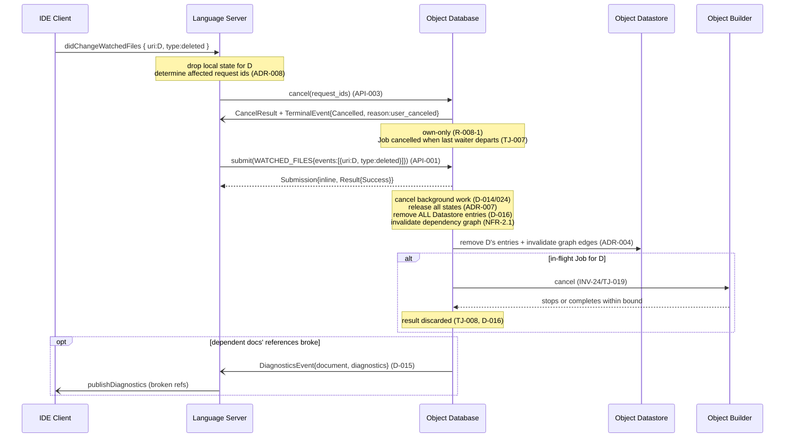

# UC-006: File Deletion

> **Tailored template for:** gdocServer Phase 2
> **Use at:** `usecases/UC-006_FileDeletion.md`
> **ID rule:** `<TYPE>-<UC-ID 00x>-<NNN>` — unique within the use case, sequential.
> **Terminology:** per `../../subcomponents/README.md` §6 (C1 = Language Server · C2 = Object Database · C3 = Object Datastore · C4 = Object Builder) and `../../README.md` §4.

---

## Use Case

### ID

UC-006

### Name

File Deletion

### Purpose

When a project file is **deleted from disk** (detected by the IDE's file watcher and reported via `workspace/didChangeWatchedFiles`, `type = deleted`), the gdoc Server must permanently **remove all traces of that document** from its internal state. This is the strongest lifecycle event — unlike a **close** (UC-004, which discards only the buffer generation and leaves disk-version results reusable) or a **disk change** (UC-005, which stales the old result and reconciles under a new mtime), a **deletion** means the data source no longer exists. Concretely:

a. **C1** sends two calls: (1) `cancel(request_ids)` for any live Frontend Tasks affected by the deletion, and (2) `submit(WATCHED_FILES{events:[{uri, type:"deleted"}]})` — the state-transition signal (D-016, §7 mapping, line 330).

b. **C2** (ODB) processes the deletion: cancels **all** its own background build work for the deleted document (D-014/D-024 — the guarantee NC-05 does not apply because the data source is gone); removes the document from **all** states (State 1/2/3 no longer apply — ADR-007); **removes** (not merely stales) **all Datastore entries** for this file (D-016: "ODB removes Datastore entry"); **invalidates dependency-graph edges** pointing to this document (NFR-2.1, FR-2.2); and ensures any dependent documents (that referenced the deleted file) have their references marked broken and, if needed, their diagnostics updated (D-015 push).

c. **C4** (Builder) cooperatively cancels any in-flight Job for the deleted file (INV-24/TJ-019); if it completes within its bound, the result is **discarded by C2** — it can never be committed because the file no longer exists (D-016; TJ-008 atomic-commit discipline).

d. **Contrast with UC-004 (close):** a close discards only the open **generation** (buffer results); disk-version entries survive and are reusable on re-open (D-020, TJ-018). A deletion removes **everything** — there is no re-open possible for a deleted file (a new file at the same path would be a `created` event, UC-005, and would start from scratch).

### Derived From

FR-1.3 (sync — `didChangeWatchedFiles`) · **D-016** (`WATCHED_FILES` `type:"deleted"`; "ODB removes Datastore entry, invalidates dependency graph, cancels all related Jobs"; Frontend sends **both** `WATCHED_FILES{deleted}` **and** `cancel(request_ids)`) · **D-014 → D-024** (background-build work cancelled on file deletion) · **TJ-007** (reference-counted cancellation) · **TJ-008** (atomic commit; no commit for a deleted file) · **TJ-011/012** (state/priority release) · **TJ-018** (freshness — all versions removed, not staled) · **NFR-2.1** (dependency tracking — graph invalidation) · **FR-2.2** (hierarchical organization — package-member removal) · **D-015** (diagnostics push for dependent documents) · **D-018** (`TerminalEvent.reason`) · **D-020** (version identity — all versions of a deleted file are removed) · **ADR-004** (single writer) · **ADR-007** (state release) · **R-008-1/2** (boundary) · **INV-24/TJ-019** (Builder cooperative cancel / run bound) · **§7** mapping (frontend-odb-api.md, didChangeWatchedFiles deleted row)

### Scope Decisions Applied

- **D-005** (v1 scope: sync + config + query + diagnostics)
- **D-012** (cancel form — own-only; Frontend supplies exact ids)
- **D-014 → D-024** (background build work: ODB cancels its own waiters on file deletion; NC-05 "not dropped" guarantee does **not** apply because the data source no longer exists)
- **D-015** (diagnostics push — deletion **is** a build/graph-invalidation trigger: dependent documents' references break → `DiagnosticsEvent` for affected documents)
- **D-016** (`WATCHED_FILES` `type:"deleted"`; "ODB removes Datastore entry, invalidates dependency graph, cancels all related Jobs"; Frontend sends **both** `WATCHED_FILES{deleted}` **and** `cancel(request_ids)`)
- **D-018** (`TerminalEvent.reason` — `user_canceled` for Frontend-initiated cancels; `system_cancelled` for ODB-internal cancellations during deletion processing)
- **D-020** (version identity — a deleted file has no future versions; all its stored versions are removed, not staled)
- **P2-002** (File Deletion is an independent UC — distinct from close (UC-004) and disk change (UC-005); D-016 gives it unique behavior: Datastore **removal** + dependency-graph **invalidation** + **all** related Job cancellation)

### Preconditions

- Workspace is initialized (UC-001 complete).
- The file existed in the workspace and **may** have stored Datastore entries (from prior builds — open-generation or disk-version, TJ-018).
- The file **may** be in any state: State 1 (referenced by an active client request), State 2 (open in the editor, or a reference thereof), State 3 (package member), or none (isolated workspace file).
- The file **may** be referenced by other documents (its object is part of other documents' dependency closures — ADR-007, NFR-2.1).
- The file **may** have live work: in-flight Tasks (e.g. a pending Hover / Find References), queued or running Jobs, and/or ODB-internal background build work (D-014/D-024).
- If the file was open in the editor, the IDE **may** have already sent `textDocument/didClose` (UC-004) before the `deleted` event; the ODB's close processing has then already closed the open generation. The `deleted` processing is still required to remove the Datastore entries and invalidate the dependency graph.

### Postconditions

- **C1:** no live Frontend Tasks for the deleted file (cancelled or already terminal); local state dropped; IDE diagnostics cleared (C1's choice, R-008-2).
- **C2:** all related Tasks cancelled (TJ-007) or already terminal; document released from **all** states (ADR-007); background waiters dropped (D-014/D-024); **all Datastore entries removed** (D-016); dependency-graph edges invalidated (NFR-2.1); dependent documents' references marked broken; in-flight Jobs cancelled or results discarded (TJ-008); no `DiagnosticsEvent` for D itself (no build), **but** dependent documents **may** receive `DiagnosticsEvent` (D-015).
- **C3:** all entries gone (all versions — D-016: "removes Datastore entry"); graph edges removed/invalidated; removal by ODB only (ADR-004).
- **C4:** cancelled Job cooperatively cancelled (INV-24/TJ-019) or completed with result **discarded** (TJ-008; D-016). No commit for a deleted file.
- **Global:** file is no longer known to the ODB; re-creating it is a `created` event (UC-005) starting from scratch; other documents unaffected except for broken-reference updates (NFR-2.1, D-015).

### Actors

| Actor | Description |
| ---------------- | ------------------------------------------------------ |
| IDE Client (User) | Deletes the file from disk. The IDE's file watcher sends `workspace/didChangeWatchedFiles { changes:[{uri, type:"deleted"}] }`. If the file was open, the IDE may also send `textDocument/didClose` (UC-004) before the `deleted` event. |
| C1 — Language Server (Frontend) | Translates `didChangeWatchedFiles{deleted}` to `cancel(request_ids)` (API-003) + `submit(WATCHED_FILES{events:[{uri, type:"deleted"}]})` (API-001). Drops local state. Optionally clears IDE diagnostics (R-008-2). |
| C2 — Object Database (ODB) | Cancels all related work (TJ-007, D-016), removes Datastore entries (D-016, ADR-004), invalidates dependency graph (NFR-2.1), releases from all states (ADR-007), drops background waiters (D-014/D-024), pushes `DiagnosticsEvent` for dependent docs (D-015). |
| C3 — Object Datastore | All entries removed (not stale). Graph edges invalidated. Removal by ODB only (ADR-004); Datastore is passive. |
| C4 — Object Builder | Cancels in-flight Job cooperatively (INV-24/TJ-019). Result discarded by C2 (TJ-008; D-016). Never commits for a deleted file. |

## Analysis Focus

- **Removal vs. staleness:** D-016 explicitly says "removes Datastore entry" — unlike close (UC-004, stale generation) or change (UC-005, stale mtime). A deletion removes **all** versions: buffer results, disk results, everything. There is no "re-open" path — a new file at the same path is a `created` event (UC-005) with no relation to the deleted file's former entries.
- **Cancel all related work:** D-016 says "cancels all related Jobs." Because the file no longer exists, no Job for it can produce a valid result. This differs from close (UC-004) where a Job may survive if another document's closure still needs it (TJ-007 reference count > 0). On deletion, the data source is gone — survival is impossible.
- **Dependency graph invalidation:** NFR-2.1 requires tracking dependencies between documents. When a referenced document is deleted, the referencing documents' dependency edges are broken. This is a **graph-level** effect, not just a per-document state change.
- **Background build work:** D-014/D-024 — the ODB's own background waiters for the deleted document are cancelled. The NC-05 guarantee ("a needed build is not dropped") does **not** apply: the file is gone.
- **Two-channel deletion:** the Frontend sends **both** `cancel(request_ids)` **and** `submit(WATCHED_FILES{deleted})` — same two-channel pattern as UC-004 close, but with `WATCHED_FILES{deleted}` instead of `DOCUMENT_SYNC{close}` (D-016, §7 mapping).
- **Diagnostics:** no `DiagnosticsEvent` for D itself (no build). Dependent documents (broken references) **may** receive a `DiagnosticsEvent` (D-015).
- **Idempotency:** a duplicate `deleted` event is a no-op.
- **No commit:** a Job running at deletion time either completes (result discarded, TJ-008) or is cancelled (INV-24/TJ-019). No result for a deleted file is ever committed.

## Main Scenario

1. The user deletes a project file D from disk. The IDE's file watcher detects the deletion.
2. C1 receives `workspace/didChangeWatchedFiles { changes:[{uri:D, type:"deleted"}] }`. C1 drops its local tracked state for D and determines which live request ids are affected.
3. C1 calls `cancel(request_ids)` for those affected ids (API-003). C2 resolves each Task own-only (R-008-1), decrements the affected Jobs' waiter sets, and cancels a Job if its last waiter departs (TJ-007). For each cancelled Task, C2 returns `CancelResult` and pushes `TerminalEvent{status:Cancelled, reason:"user_canceled"}` (D-018).
4. C1 then submits `submit(WATCHED_FILES{events:[{uri:D, type:"deleted"}]})` (API-001). The ODB maps this to a Task (TJ-001).
5. C2 processes the deletion: (a) cancels all its own background build work for D (D-014/D-024); (b) releases D from all states (ADR-007); (c) **removes all Datastore entries** for D (D-016); (d) **invalidates dependency-graph edges** pointing to D (NFR-2.1); (e) for each affected dependent document, if diagnostics change, pushes a `DiagnosticsEvent` (D-015).
6. For any in-flight Job for D: C2 signals cancellation. C4 cooperatively cancels (INV-24/TJ-019). If C4 completes within its bound, the result is **discarded by C2** (TJ-008; D-016).
7. C2 returns `Result{Success}` for the `WATCHED_FILES` Task (inline — bookkeeping only, no build).
8. C1 clears IDE diagnostics for D (its own hygiene, R-008-2).

## Alternative Scenarios

### A — Duplicate deletion

**Condition:** A second `deleted` event for D after the first was processed.

1. C1 sends `cancel(request_ids)` (no-op) and `submit(WATCHED_FILES{deleted})`.
2. C2 finds no entries, no Tasks, no background work → **no-op**. Returns `Result{Success}`.

### B — File referenced by other open documents

**Condition:** D is referenced by one or more other open documents.

1. Main Scenario steps proceed normally.
2. C2 marks references from those documents to D as **broken** (NFR-2.1).
3. If those dependent documents' diagnostics change, C2 pushes `DiagnosticsEvent` for each (D-015).
4. Other references (to files that still exist) are unaffected.

### C — File was a package member (State 3)

**Condition:** D is a member of a package.

1. Main Scenario steps proceed normally.
2. D's State-3 membership is released. Other members' references to D break (Alt B).
3. Package config unchanged; D's entry is inert. ODB background work for D cancelled.

### D — In-flight Job at time of deletion

**Condition:** A Job for D is actively running.

1. C2 signals cancellation. C4 cooperatively cancels (INV-24/TJ-019).
2. If C4 completes within its bound, C2 **discards** the result (TJ-008; D-016).
3. No `DiagnosticsEvent` for D.

### E — Deletion of an unknown file

**Condition:** URI does not correspond to any known document.

## Sequence Diagram

---

## Derived Requirements

### Interface (IF-)

#### IF-006-001

On `workspace/didChangeWatchedFiles` with `type:"deleted"` for D, C1 **shall** translate into exactly two ODB calls: (1) `cancel(request_ids)` for affected ids (ADR-008/D-012), and (2) `submit(WATCHED_FILES{events:[{uri:D, type:"deleted"}]})`. C2 **shall not** infer which ids are affected — the deletion is a state-transition + cleanup signal (R-008-2; §7 mapping).
**Owner:** C1
**Derived From:** UC-006 Main #2–4 · D-016 · §7 mapping · API-001/003 · D-012

#### IF-006-002

For each cancelled Task, C2 **shall** return `CancelResult` and push `TerminalEvent{status:Cancelled, reason}` (D-018): `user_canceled` for Frontend-driven, `system_cancelled` for ODB-internal. Cancelling a terminal Task is a no-op (§7).
**Owner:** C2
**Derived From:** UC-006 Main #3 · D-018 · API-003 · §7

#### IF-006-003

If dependent documents' diagnostics change (broken references to D), C2 **shall** push `DiagnosticsEvent` for each affected dependent document (D-015/D-025). C2 **shall not** push for D itself (no build — D-015).
**Owner:** C2 (+C1)
**Derived From:** UC-006 Main #5, Alt B · D-015 · D-025 · NFR-2.1

#### IF-006-004

C1 **may** clear IDE diagnostics for D (R-008-2). C1 **shall not** rely on ODB push for this (IF-006-003).
**Owner:** C1

### State (ST-)

#### ST-006-001

C2 **shall** release D from **all** states on `WATCHED_FILES{deleted}`: State 1 (cancelled or terminal), State 2 (supersedes close if not already sent), State 3 (membership vacuous). D's priority is no longer computed (ADR-007).
**Owner:** C2
**Derived From:** UC-006 Main #5 · D-016 · ADR-007 · TJ-011/012

#### ST-006-002

C2 **shall** cancel **all** ODB background build work for D (D-014/D-024). The NC-05 guarantee does **not** apply — the file no longer exists. Queued Jobs for D are cancelled.
**Owner:** C2
**Derived From:** UC-006 Main #5 · D-016 · D-014/D-024 · TJ-021

#### ST-006-003

C2 **shall** invalidate dependency-graph edges pointing to D (NFR-2.1): references from other documents to D are marked **broken**. Dependent documents' other references remain valid.
**Owner:** C2
**Derived From:** UC-006 Main #5, Alt B/C · D-016 · NFR-2.1 · FR-2.2

### Data (DR-)

#### DR-006-001

C2 **shall** **remove** (not merely stale) **all** Datastore entries for D: open-generation buffer results, disk-mtime results, all versions (D-016: "removes Datastore entry"; D-020). The removal is **irreversible** within the session (ADR-004 in-memory).
**Owner:** C3 (executed by C2)
**Derived From:** UC-006 Main #5 · D-016 · D-020 · TJ-018 · ADR-004

#### DR-006-002

Removal **shall** be performed exclusively by the ODB (ADR-004 single writer). No other component accesses the Datastore for this.
**Owner:** C3 (invariant)
**Derived From:** UC-006 Main #5 · ADR-004 · NFR-1.3

#### DR-006-003

Graph invalidation + entry removal **shall** be one atomic operation (ADR-004 total order; TJ-008 atomicity). Partial state **shall not** be observable.
**Owner:** C2 (+C3)
**Derived From:** UC-006 Main #5 · D-016 · NFR-2.1 · ADR-004 · TJ-008

### Error Handling (EH-)

#### EH-006-001

Duplicate `deleted` event **shall** be a safe no-op: no entries, no Tasks, no work → `Result{Success}` (§7; API-001/003).
**Owner:** C2
**Derived From:** UC-006 Alt A/E · §7 · API-001/003

#### EH-006-002

In-flight Job: C4 **shall** cancel cooperatively (INV-24/TJ-019) or complete within bound; C2 **shall** **discard** the result (TJ-008; D-016). C4 **shall not** write to Datastore (ADR-004).
**Owner:** C4 (+C2)
**Derived From:** UC-006 Alt D · INV-24/TJ-019 · TJ-008 · D-016

#### EH-006-003

Unknown URI **shall** be a no-op or inline `Result{Error}`; no half-created Task (API-001; §4.1).
**Owner:** C2

### Component (SCR-)

#### SCR-C1-006-001 (Language Server)

On `didChangeWatchedFiles{type:deleted}` for D, C1 **shall**: (1) drop local tracked state for D; (2) derive affected ids (ADR-008); (3) emit `cancel(request_ids)` (API-003) and `submit(WATCHED_FILES{events:[{uri:D, type:"deleted"}]})` (API-001, D-016); (4) handle inline/ticketed `Submission` + `CancelResult`; (5) map `DiagnosticsEvent` for dependent docs to `publishDiagnostics` (D-015). Re-issuing is safe (EH-006-001; §7).
**Derived From:** UC-006 Main #2–4 · D-016 · §7 · API-001/003 · NFR-1.1 · D-015

#### SCR-C1-006-002 (Language Server)

C1 **may** clear IDE diagnostics for D (R-008-2). C1 **shall not** rely on ODB push for this (IF-006-004). C1 **shall** handle `DiagnosticsEvent` for **dependent** documents (Alt B; D-015).
**Derived From:** UC-006 Main #8, Alt B · D-015 · R-008-2 · INV-07

#### SCR-C2-006-001 (Object Database)

C2 **shall** process `WATCHED_FILES{deleted}` as: (1) cancel live Tasks (TJ-007; D-016); (2) cancel background work (D-014/D-024); (3) release from all states (ADR-007; ST-006-001); (4) **remove** all Datastore entries (D-016; DR-006-001; ADR-004); (5) invalidate graph edges (NFR-2.1; ST-006-003); (6) push `DiagnosticsEvent` for affected dependent docs (D-015; IF-006-003); (7) discard in-flight Job results (TJ-008; D-016); (8) commit atomically (ADR-004; DR-006-003); (9) emit `Cancelled` terminals with `reason` (D-018; IF-006-002); (10) return `Result{Success}` (API-001).
**Derived From:** UC-006 Main #3–7, Alt A–E · D-016 · TJ-007/008/011/012 · D-014/D-024 · D-018 · NFR-2.1 · ADR-004/007

#### SCR-C3-006-001 (Object Datastore)

The Datastore **shall** support **removal** of all entries for a document (all versions) as a single-writer operation (ADR-004; D-016). Stronger than staleness (UC-004/UC-005): entries are **gone**. Graph edges invalidated in same atomic op (DR-006-003). Datastore is passive (NFR-1.3).
**Derived From:** UC-006 Main #5 · D-016 · ADR-004 · NFR-1.3

#### SCR-C4-006-001 (Object Builder)

On deletion-driven cancellation, C4 **shall** cancel cooperatively (INV-24/TJ-019); if it completes within bound, C2 **shall** discard the result (TJ-008; D-016). C4 **shall not** write to Datastore (ADR-004; TJ-008). C4 builds from content supplied at dispatch — never reads a deleted file.

---

## Reverse-check (Contract Cross-Reference)

| UC Requirement | Contract Rule | Status | Note |
| -------------- | ------------- | ------ | ---- |
| IF-006-001 | §7 mapping (L330) · D-016 · API-001/003 · D-012 | ✅ | two-channel deletion normative in §7 |
| IF-006-002 | D-018 · API-003 · §7 (idempotency) | ✅ | |
| IF-006-003 | D-015 · D-025 · §5.2 | ✅ | dependent-doc diagnostics |
| IF-006-004 | D-015 · R-008-2 | ✅ | C1 hygiene |
| ST-006-001 | TJ-011/012 · ADR-007 · D-016 | ✅ | all states released |
| ST-006-002 | D-016 · D-014/D-024 · TJ-021 | ✅ | NC-05 non-applicable |
| ST-006-003 | D-016 · NFR-2.1 · FR-2.2 | ✅ | graph invalidation |
| DR-006-001 | D-016 · D-020 · TJ-018 · ADR-004 | ✅ | removal not staleness |
| DR-006-002 | ADR-004 · NFR-1.3 | ✅ | |
| DR-006-003 | D-016 · NFR-2.1 · ADR-004 · TJ-008 | ✅ | atomic |
| EH-006-001 | §7 · API-001/003 | ✅ | duplicate = no-op |
| EH-006-002 | INV-24/TJ-019 · TJ-008 · D-016 | ✅ | |
| EH-006-003 | API-001 · §4.1 | ✅ | unknown URI |
| SCR-C1-006-001 | §7 · API-001/003 · D-016 · NFR-1.1 | ✅ | |
| SCR-C1-006-002 | D-015 · R-008-2 · INV-07 | ✅ | |
| SCR-C2-006-001 | D-016 · TJ-007/008/011/012 · D-014/D-024 · NFR-2.1 · ADR-004/007 | ✅ | |
| SCR-C3-006-001 | D-016 · ADR-004 · NFR-1.3 | ✅ | |
| SCR-C4-006-001 | INV-24/TJ-019 · TJ-008 · D-016 · ADR-004 | ✅ | |

> **Finding (zero gaps):** every UC-006 requirement is satisfied by Phase 1a/1b contracts. No contract change required.

---

## Traceability Matrix

| ID | Type | Description | Scenario Step | Owner |
| --- | ---- | ----------- | ------------- | ----- |
| IF-006-001 | Interface | `didChangeWatchedFiles{deleted}` → {`cancel`; `WATCHED_FILES{deleted}`} | Main #2–4 | C1 |
| IF-006-002 | Interface | `CancelResult` + `TerminalEvent{Cancelled, reason}` | Main #3 | C2 |
| IF-006-003 | Interface | `DiagnosticsEvent` for dependent docs; not for D | Main #5, Alt B | C2 (+C1) |
| IF-006-004 | Interface | C1 optional diagnostic clear for D | Main #8 | C1 |
| ST-006-001 | State | Release from all states (1/2/3) | Main #5 | C2 |
| ST-006-002 | State | Cancel all background build work | Main #5 | C2 |
| ST-006-003 | State | Invalidate dependency-graph edges | Main #5, Alt B/C | C2 |
| DR-006-001 | Data | Remove all Datastore entries (all versions) | Main #5 | C3 (by C2) |
| DR-006-002 | Data | Single-writer removal; Datastore passive | Main #5 | C3 |
| DR-006-003 | Data | Atomic removal + graph invalidation | Main #5 | C2 (+C3) |
| EH-006-001 | Error | Duplicate deletion = no-op | Alt A/E | C2 |
| EH-006-002 | Error | In-flight Job: cancel or discard result | Alt D | C4 (+C2) |
| EH-006-003 | Error | Unknown URI → no-op | Alt E | C2 |
| SCR-C1-006-001 | Component | `didChangeWatchedFiles{deleted}` handler | Main #2–4 | C1 |
| SCR-C1-006-002 | Component | Diagnostic hygiene + dependent-doc mapping | Main #8, Alt B | C1 |
| SCR-C2-006-001 | Component | Full `WATCHED_FILES{deleted}` pipeline | Main #3–7 | C2 |
| SCR-C3-006-001 | Component | Entry removal + graph invalidation | Main #5 | C3 |
| SCR-C4-006-001 | Component | Cooperative cancel; no commit for deleted file | Alt D | C4 |